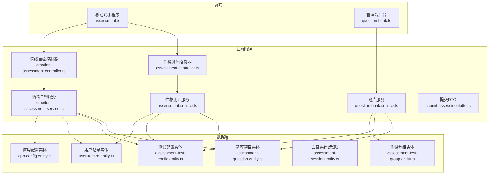
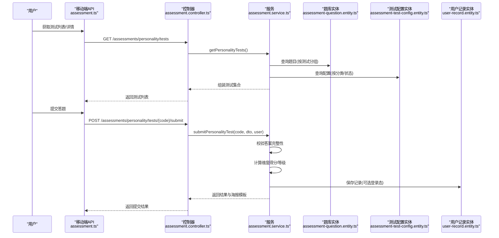
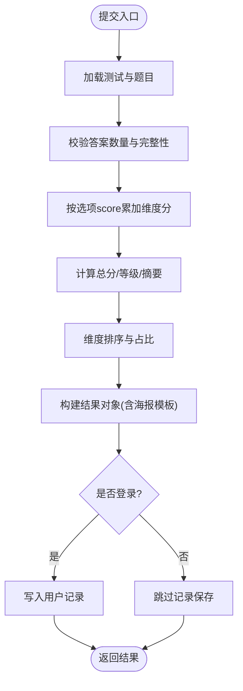
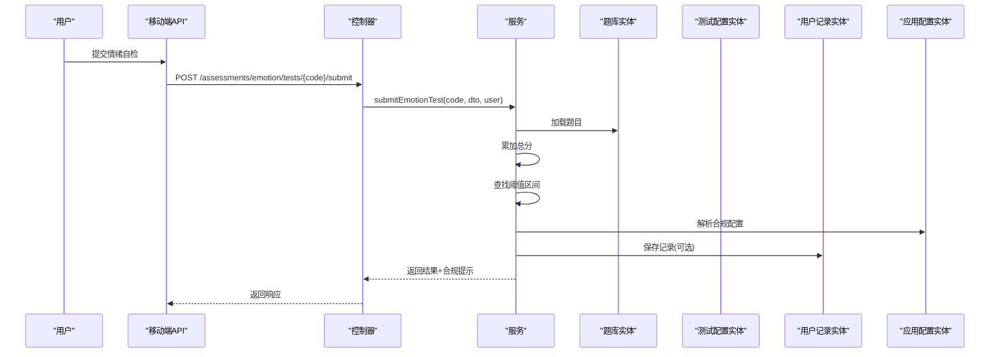
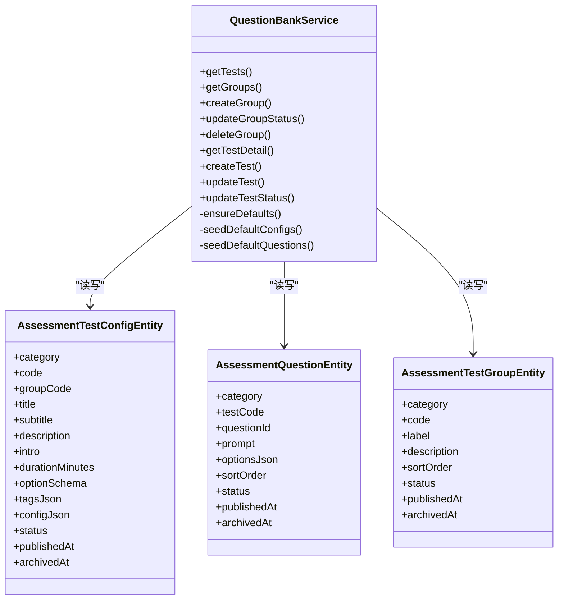
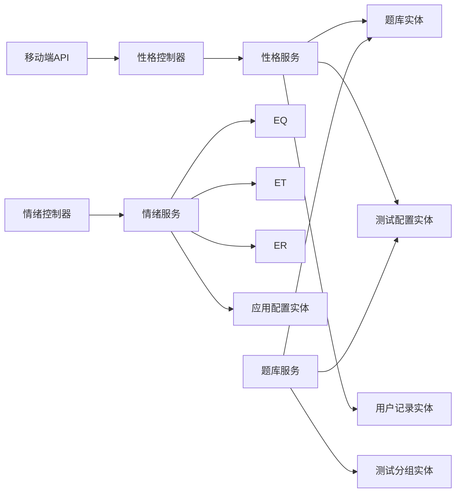

# 测评系统模块

<cite>
**本文引用的文件**   
- [services/api/src/assessment/assessment.controller.ts](file://services/api/src/assessment/assessment.controller.ts)
- [services/api/src/assessment/assessment.service.ts](file://services/api/src/assessment/assessment.service.ts)
- [services/api/src/assessment/emotion-assessment.controller.ts](file://services/api/src/assessment/emotion-assessment.controller.ts)
- [services/api/src/assessment/emotion-assessment.service.ts](file://services/api/src/assessment/emotion-assessment.service.ts)
- [services/api/src/assessment/question-bank.service.ts](file://services/api/src/assessment/question-bank.service.ts)
- [services/api/src/assessment/question-bank.defaults.ts](file://services/api/src/assessment/question-bank.defaults.ts)
- [services/api/src/assessment/dto/submit-assessment.dto.ts](file://services/api/src/assessment/dto/submit-assessment.dto.ts)
- [services/api/src/database/entities/assessment-question.entity.ts](file://services/api/src/database/entities/assessment-question.entity.ts)
- [services/api/src/database/entities/assessment-test-config.entity.ts](file://services/api/src/database/entities/assessment-test-config.entity.ts)
- [services/api/src/database/entities/assessment-test-group.entity.ts](file://services/api/src/database/entities/assessment-test-group.entity.ts)
- [services/api/src/database/entities/assessment-session.entity.ts](file://services/api/src/database/entities/assessment-session.entity.ts)
- [services/api/src/database/entities/user-record.entity.ts](file://services/api/src/database/entities/user-record.entity.ts)
- [services/api/src/database/entities/app-config.entity.ts](file://services/api/src/database/entities/app-config.entity.ts)
- [apps/mobile/src/api/assessment.ts](file://apps/mobile/src/api/assessment.ts)
- [apps/mobile/src/types/assessment.ts](file://apps/mobile/src/types/assessment.ts)
- [apps/admin/src/api/question-bank.ts](file://apps/admin/src/api/question-bank.ts)
- [docs/数据库设计文档.md](file://docs/数据库设计文档.md)
</cite>

## 目录
1. [简介](#简介)
2. [项目结构](#项目结构)
3. [核心组件](#核心组件)
4. [架构总览](#架构总览)
5. [详细组件分析](#详细组件分析)
6. [依赖分析](#依赖分析)
7. [性能考量](#性能考量)
8. [故障排查指南](#故障排查指南)
9. [结论](#结论)
10. [附录](#附录)

## 简介
本技术指南面向“测评系统模块”，围绕两类测评类型（性格测评与情绪自检）展开，系统性阐述题库管理、会话与记录、算法与结果解释、报告生成、题库默认配置与版本化、数据安全与隐私保护、以及结果分析与数据挖掘的应用路径。文档同时给出前后端交互、数据库模型与关键流程图示，帮助开发者与运营人员快速理解与高效迭代。

## 项目结构
测评系统由三层组成：
- 前端层：移动端小程序提供测评入口、答题与历史查看；管理端提供题库与测试集的可视化管理。
- 后端服务层：提供测评 API、题库管理 API、会话与记录持久化、合规与配置管理。
- 数据层：基于 TypeORM 的实体模型，支撑题库、测试配置、分组、用户记录与应用配置。

图表来源
- [services/api/src/assessment/assessment.controller.ts:1-39](file://services/api/src/assessment/assessment.controller.ts#L1-L39)
- [services/api/src/assessment/assessment.service.ts:1-806](file://services/api/src/assessment/assessment.service.ts#L1-L806)
- [services/api/src/assessment/emotion-assessment.controller.ts:1-39](file://services/api/src/assessment/emotion-assessment.controller.ts#L1-L39)
- [services/api/src/assessment/emotion-assessment.service.ts:1-778](file://services/api/src/assessment/emotion-assessment.service.ts#L1-L778)
- [services/api/src/assessment/question-bank.service.ts:1-1238](file://services/api/src/assessment/question-bank.service.ts#L1-L1238)
- [services/api/src/assessment/dto/submit-assessment.dto.ts:1-27](file://services/api/src/assessment/dto/submit-assessment.dto.ts#L1-L27)
- [services/api/src/database/entities/assessment-question.entity.ts:1-52](file://services/api/src/database/entities/assessment-question.entity.ts#L1-L52)
- [services/api/src/database/entities/assessment-test-config.entity.ts:1-67](file://services/api/src/database/entities/assessment-test-config.entity.ts#L1-L67)
- [services/api/src/database/entities/assessment-test-group.entity.ts:1-49](file://services/api/src/database/entities/assessment-test-group.entity.ts#L1-L49)
- [services/api/src/database/entities/assessment-session.entity.ts:1-22](file://services/api/src/database/entities/assessment-session.entity.ts#L1-L22)
- [services/api/src/database/entities/user-record.entity.ts:1-50](file://services/api/src/database/entities/user-record.entity.ts#L1-L50)
- [services/api/src/database/entities/app-config.entity.ts:1-50](file://services/api/src/database/entities/app-config.entity.ts#L1-L50)

章节来源
- [services/api/src/assessment/assessment.controller.ts:1-39](file://services/api/src/assessment/assessment.controller.ts#L1-L39)
- [services/api/src/assessment/emotion-assessment.controller.ts:1-39](file://services/api/src/assessment/emotion-assessment.controller.ts#L1-L39)
- [services/api/src/assessment/question-bank.service.ts:1-1238](file://services/api/src/assessment/question-bank.service.ts#L1-L1238)
- [apps/mobile/src/api/assessment.ts:1-31](file://apps/mobile/src/api/assessment.ts#L1-L31)
- [apps/admin/src/api/question-bank.ts:1-275](file://apps/admin/src/api/question-bank.ts#L1-L275)

## 核心组件
- 性格测评服务与控制器：提供测试列表、详情、提交与历史查询；内置默认题库与维度标签；计分与等级划分；结果海报模板渲染。
- 情绪自检服务与控制器：提供测试列表、详情、提交与历史查询；内置默认阈值与建议；合规提示与支持资源动态化。
- 题库服务：统一管理测试集、题目与分组；支持草稿/发布/归档生命周期；默认模板自动注入；支持克隆与更新。
- 提交 DTO：统一校验答题格式，确保完整性与合法性。
- 数据实体：题库题目、测试配置、测试分组、用户记录、应用配置与会话（示意）。

章节来源
- [services/api/src/assessment/assessment.service.ts:1-806](file://services/api/src/assessment/assessment.service.ts#L1-L806)
- [services/api/src/assessment/emotion-assessment.service.ts:1-778](file://services/api/src/assessment/emotion-assessment.service.ts#L1-L778)
- [services/api/src/assessment/question-bank.service.ts:1-1238](file://services/api/src/assessment/question-bank.service.ts#L1-L1238)
- [services/api/src/assessment/dto/submit-assessment.dto.ts:1-27](file://services/api/src/assessment/dto/submit-assessment.dto.ts#L1-L27)
- [services/api/src/database/entities/assessment-question.entity.ts:1-52](file://services/api/src/database/entities/assessment-question.entity.ts#L1-L52)
- [services/api/src/database/entities/assessment-test-config.entity.ts:1-67](file://services/api/src/database/entities/assessment-test-config.entity.ts#L1-L67)
- [services/api/src/database/entities/assessment-test-group.entity.ts:1-49](file://services/api/src/database/entities/assessment-test-group.entity.ts#L1-L49)
- [services/api/src/database/entities/user-record.entity.ts:1-50](file://services/api/src/database/entities/user-record.entity.ts#L1-L50)
- [services/api/src/database/entities/app-config.entity.ts:1-50](file://services/api/src/database/entities/app-config.entity.ts#L1-L50)
- [services/api/src/database/entities/assessment-session.entity.ts:1-22](file://services/api/src/database/entities/assessment-session.entity.ts#L1-L22)

## 架构总览
测评系统采用“控制器-服务-仓储-实体”的分层架构，前后端通过 REST API 交互，题库与测试以 JSON 字段灵活承载配置，结合默认模板与运行时归一化，实现“可运营、可扩展、可版本化”的测评体系。

图表来源
- [apps/mobile/src/api/assessment.ts:1-31](file://apps/mobile/src/api/assessment.ts#L1-L31)
- [services/api/src/assessment/assessment.controller.ts:1-39](file://services/api/src/assessment/assessment.controller.ts#L1-L39)
- [services/api/src/assessment/assessment.service.ts:1-806](file://services/api/src/assessment/assessment.service.ts#L1-L806)
- [services/api/src/database/entities/assessment-question.entity.ts:1-52](file://services/api/src/database/entities/assessment-question.entity.ts#L1-L52)
- [services/api/src/database/entities/assessment-test-config.entity.ts:1-67](file://services/api/src/database/entities/assessment-test-config.entity.ts#L1-L67)
- [services/api/src/database/entities/user-record.entity.ts:1-50](file://services/api/src/database/entities/user-record.entity.ts#L1-L50)

## 详细组件分析

### 性格测评模块
- 测试加载与归一化：从题库与配置表读取并合并默认模板，支持维度标签、档案与海报模板的运行时归一化。
- 计分与等级：按题干选项分数累加，计算总分与维度占比，映射等级与等级摘要；输出维度排行、优势与建议。
- 结果与分享：根据模板变量填充生成分享海报文案与主题。
- 历史查询：按用户与类型查询最近记录，返回摘要与完成时间。

图表来源
- [services/api/src/assessment/assessment.service.ts:314-415](file://services/api/src/assessment/assessment.service.ts#L314-L415)
- [services/api/src/assessment/assessment.service.ts:554-607](file://services/api/src/assessment/assessment.service.ts#L554-L607)

章节来源
- [services/api/src/assessment/assessment.controller.ts:1-39](file://services/api/src/assessment/assessment.controller.ts#L1-L39)
- [services/api/src/assessment/assessment.service.ts:267-415](file://services/api/src/assessment/assessment.service.ts#L267-L415)

### 情绪自检模块
- 默认阈值与建议：内置“稳定/关注/需要支持/紧急”四个等级阈值，支持运行时覆盖与合规提示动态化。
- 计分与风险等级：按选项分数累加，映射到阈值区间，输出标题、摘要、主建议与支持信号。
- 合规与资源：从应用配置表读取最新合规声明、危机提示与资源清单，保障提示一致性与时效性。
- 历史查询：返回最近记录，包含摘要、支持信号与完成时间。

图表来源
- [services/api/src/assessment/emotion-assessment.controller.ts:1-39](file://services/api/src/assessment/emotion-assessment.controller.ts#L1-L39)
- [services/api/src/assessment/emotion-assessment.service.ts:279-371](file://services/api/src/assessment/emotion-assessment.service.ts#L279-L371)
- [services/api/src/database/entities/app-config.entity.ts:1-50](file://services/api/src/database/entities/app-config.entity.ts#L1-L50)

章节来源
- [services/api/src/assessment/emotion-assessment.controller.ts:1-39](file://services/api/src/assessment/emotion-assessment.controller.ts#L1-L39)
- [services/api/src/assessment/emotion-assessment.service.ts:228-371](file://services/api/src/assessment/emotion-assessment.service.ts#L228-L371)

### 题库管理系统
- 测试与题目：测试配置表承载元数据与 JSON 配置，题目表承载题干与选项 JSON；二者通过 category/testCode 关联。
- 分组与分类：测试分组表支持分类与排序，保证测试集归属与可见性。
- 生命周期：支持 draft/published/archived 三态流转，约束默认分组不可下线、默认测试集不可删除等规则。
- 默认模板：首次启动自动注入默认测试集与题目，确保新环境可用；支持克隆现有测试集快速创建草稿。
- 运行时归一化：对配置进行字段清洗与默认值回填，保证前端展示一致性。

图表来源
- [services/api/src/assessment/question-bank.service.ts:121-595](file://services/api/src/assessment/question-bank.service.ts#L121-L595)
- [services/api/src/database/entities/assessment-test-config.entity.ts:1-67](file://services/api/src/database/entities/assessment-test-config.entity.ts#L1-L67)
- [services/api/src/database/entities/assessment-question.entity.ts:1-52](file://services/api/src/database/entities/assessment-question.entity.ts#L1-L52)
- [services/api/src/database/entities/assessment-test-group.entity.ts:1-49](file://services/api/src/database/entities/assessment-test-group.entity.ts#L1-L49)

章节来源
- [services/api/src/assessment/question-bank.service.ts:121-595](file://services/api/src/assessment/question-bank.service.ts#L121-L595)
- [apps/admin/src/api/question-bank.ts:1-275](file://apps/admin/src/api/question-bank.ts#L1-L275)

### 会话管理机制
- 会话实体：提供会话标识、渠道、测评类型、星座与幸运分等字段，便于追踪与扩展。
- 当前实现：移动端与后端未直接使用该表；建议在需要跨页面/跨设备续答或进度保存时启用。
- 建议：若启用会话表，需配套会话状态机与进度持久化策略，并与用户认证绑定。

章节来源
- [services/api/src/database/entities/assessment-session.entity.ts:1-22](file://services/api/src/database/entities/assessment-session.entity.ts#L1-L22)
- [docs/数据库设计文档.md:508-515](file://docs/数据库设计文档.md#L508-L515)

### 测评算法设计
- 性格测评：按维度累加计分，计算占比与等级，输出维度排行、优势与建议；支持模板变量渲染海报。
- 情绪自检：按阈值区间映射风险等级，输出标题、摘要、主建议与支持信号；支持合规提示动态化。
- 权重与难度：当前实现以固定选项分值为主；如需引入难度/权重，可在题目选项 JSON 中扩展字段并通过服务端归一化处理。

章节来源
- [services/api/src/assessment/assessment.service.ts:554-607](file://services/api/src/assessment/assessment.service.ts#L554-L607)
- [services/api/src/assessment/emotion-assessment.service.ts:507-533](file://services/api/src/assessment/emotion-assessment.service.ts#L507-L533)

### 题库默认配置与版本控制
- 默认模板：内置性格与情绪测试的默认题干、选项、阈值与海报模板，首次启动自动注入。
- 动态加载：服务端通过配置 JSON 字段承载可变内容，运行时进行字段清洗与默认值回填。
- 版本控制：通过应用配置表(namespace/configKey)实现合规与提示类配置的版本化与灰度发布。

章节来源
- [services/api/src/assessment/question-bank.defaults.ts:1-483](file://services/api/src/assessment/question-bank.defaults.ts#L1-L483)
- [services/api/src/assessment/question-bank.service.ts:591-693](file://services/api/src/assessment/question-bank.service.ts#L591-L693)
- [services/api/src/database/entities/app-config.entity.ts:1-50](file://services/api/src/database/entities/app-config.entity.ts#L1-L50)

### 测评数据安全与隐私保护
- 最小化采集：仅收集答题与必要上下文信息；不涉及敏感健康数据。
- 匿名化与去标识：用户记录按用户维度聚合，不暴露个人身份；结果以摘要与标签形式呈现。
- 合规提示：情绪自检结果附带免责声明与支持资源，避免误导。
- 存储与传输：建议在前端与后端均开启 HTTPS 与最小权限访问；对结果快照进行脱敏展示。

章节来源
- [services/api/src/assessment/emotion-assessment.service.ts:535-567](file://services/api/src/assessment/emotion-assessment.service.ts#L535-L567)
- [services/api/src/database/entities/user-record.entity.ts:1-50](file://services/api/src/database/entities/user-record.entity.ts#L1-L50)

### 结果分析与数据挖掘
- 历史趋势：通过用户记录表按时间序列聚合，分析维度得分与等级分布趋势。
- 场景洞察：结合分组与标签统计不同人群的偏好与易感区间，指导题库优化与运营策略。
- 报告生成：基于模板变量渲染的海报可作为分享与传播素材，辅助留存与口碑传播。

章节来源
- [services/api/src/assessment/assessment.service.ts:395-415](file://services/api/src/assessment/assessment.service.ts#L395-L415)
- [services/api/src/assessment/emotion-assessment.service.ts:351-371](file://services/api/src/assessment/emotion-assessment.service.ts#L351-L371)

## 依赖分析
- 控制器依赖服务：控制器仅负责路由与鉴权解析，业务逻辑集中在服务层。
- 服务依赖仓储与实体：服务通过仓储访问题库、配置、分组与用户记录等实体。
- 题库服务依赖默认模板与配置：通过默认模板与运行时归一化保证一致性。
- 移动端与管理端依赖 API 类型：前端类型与后端响应严格对齐，确保契约稳定。

图表来源
- [apps/mobile/src/api/assessment.ts:1-31](file://apps/mobile/src/api/assessment.ts#L1-L31)
- [services/api/src/assessment/assessment.controller.ts:1-39](file://services/api/src/assessment/assessment.controller.ts#L1-L39)
- [services/api/src/assessment/emotion-assessment.controller.ts:1-39](file://services/api/src/assessment/emotion-assessment.controller.ts#L1-L39)
- [services/api/src/assessment/assessment.service.ts:1-806](file://services/api/src/assessment/assessment.service.ts#L1-L806)
- [services/api/src/assessment/emotion-assessment.service.ts:1-778](file://services/api/src/assessment/emotion-assessment.service.ts#L1-L778)
- [services/api/src/assessment/question-bank.service.ts:1-1238](file://services/api/src/assessment/question-bank.service.ts#L1-L1238)
- [services/api/src/database/entities/assessment-question.entity.ts:1-52](file://services/api/src/database/entities/assessment-question.entity.ts#L1-L52)
- [services/api/src/database/entities/assessment-test-config.entity.ts:1-67](file://services/api/src/database/entities/assessment-test-config.entity.ts#L1-L67)
- [services/api/src/database/entities/assessment-test-group.entity.ts:1-49](file://services/api/src/database/entities/assessment-test-group.entity.ts#L1-L49)
- [services/api/src/database/entities/user-record.entity.ts:1-50](file://services/api/src/database/entities/user-record.entity.ts#L1-L50)
- [services/api/src/database/entities/app-config.entity.ts:1-50](file://services/api/src/database/entities/app-config.entity.ts#L1-L50)

章节来源
- [apps/mobile/src/types/assessment.ts:1-102](file://apps/mobile/src/types/assessment.ts#L1-L102)
- [apps/admin/src/api/question-bank.ts:1-275](file://apps/admin/src/api/question-bank.ts#L1-L275)

## 性能考量
- 批量初始化：首次启动通过 upsert 批量注入默认测试与题目，避免重复写入。
- 并行查询：加载测试时并行查询题库与配置，减少往返延迟。
- 索引优化：题库与测试配置表具备复合索引，提升查询与排序性能。
- 前端缓存：移动端可对测试列表与详情进行本地缓存，降低重复请求。

章节来源
- [services/api/src/assessment/assessment.service.ts:417-492](file://services/api/src/assessment/assessment.service.ts#L417-L492)
- [services/api/src/assessment/emotion-assessment.service.ts:373-444](file://services/api/src/assessment/emotion-assessment.service.ts#L373-L444)
- [services/api/src/database/entities/assessment-question.entity.ts:10-14](file://services/api/src/database/entities/assessment-question.entity.ts#L10-L14)
- [services/api/src/database/entities/assessment-test-config.entity.ts:10-14](file://services/api/src/database/entities/assessment-test-config.entity.ts#L10-L14)

## 故障排查指南
- 提交异常
  - 缺少答案或未完成：服务端会拒绝提交并返回错误，需检查前端答题完整性。
  - 无效选项键：服务端校验选项键合法性，需确保选项键与题干一致。
- 测试不存在或未开放：查询不到测试时抛出异常，需检查测试状态与分类。
- 题库状态冲突：修改分组或测试状态时需满足生命周期约束，否则会触发业务异常。
- 合规提示缺失：若应用配置缺失，服务端会回退到默认合规提示，需检查配置表。

章节来源
- [services/api/src/assessment/assessment.service.ts:324-351](file://services/api/src/assessment/assessment.service.ts#L324-L351)
- [services/api/src/assessment/emotion-assessment.service.ts:287-309](file://services/api/src/assessment/emotion-assessment.service.ts#L287-L309)
- [services/api/src/assessment/question-bank.service.ts:297-337](file://services/api/src/assessment/question-bank.service.ts#L297-L337)
- [services/api/src/assessment/emotion-assessment.service.ts:535-567](file://services/api/src/assessment/emotion-assessment.service.ts#L535-L567)

## 结论
测评系统模块以“题库+配置+服务”的组合实现了可运营、可扩展的测评能力。通过默认模板与运行时归一化，既保证一致性又支持灵活定制；通过用户记录与合规提示，兼顾用户体验与责任边界。建议在后续迭代中完善会话与进度保存、引入难度/权重参数化、以及加强结果分析与报表能力。

## 附录
- 前端类型与 API 对齐：移动端与管理端类型与后端响应严格对应，便于契约演进与版本治理。
- 数据库设计建议：避免继续扩展会话表作为正式业务表，优先完善迁移发布链路与模板沉淀。

章节来源
- [apps/mobile/src/types/assessment.ts:1-102](file://apps/mobile/src/types/assessment.ts#L1-L102)
- [apps/admin/src/api/question-bank.ts:1-275](file://apps/admin/src/api/question-bank.ts#L1-L275)
- [docs/数据库设计文档.md:508-515](file://docs/数据库设计文档.md#L508-L515)