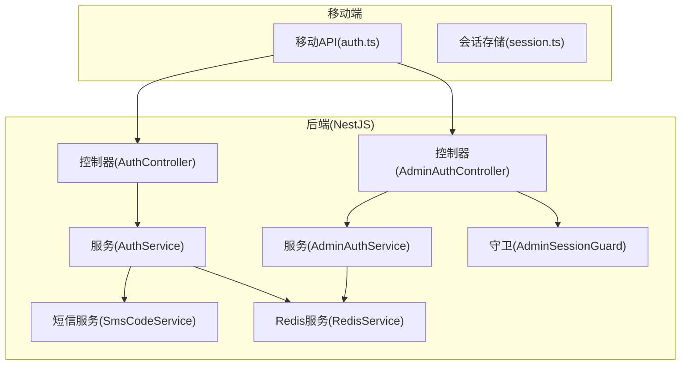
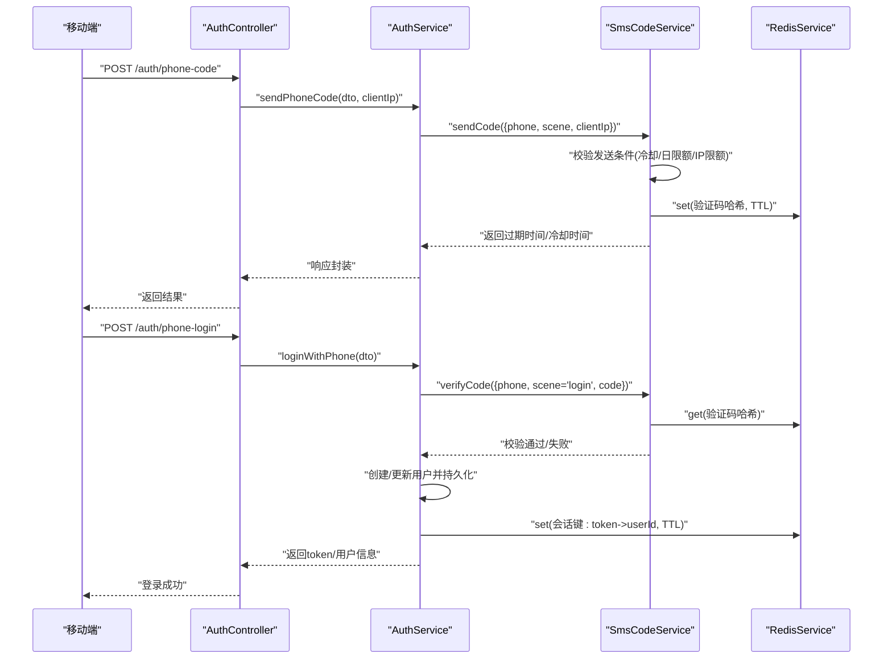
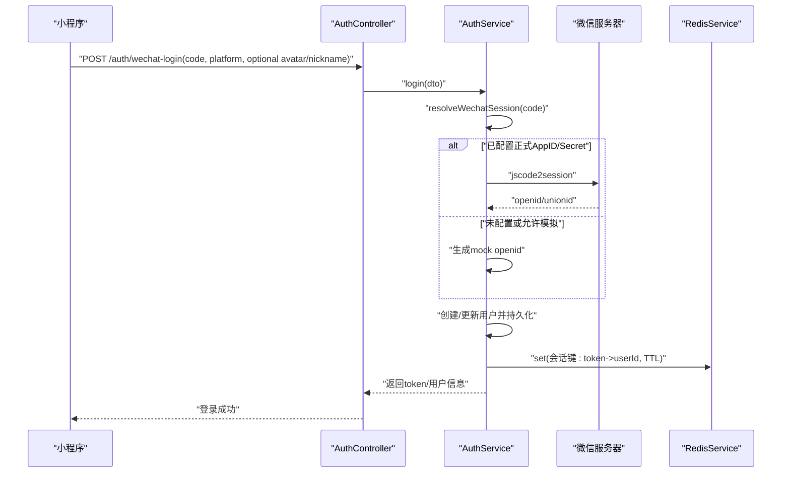
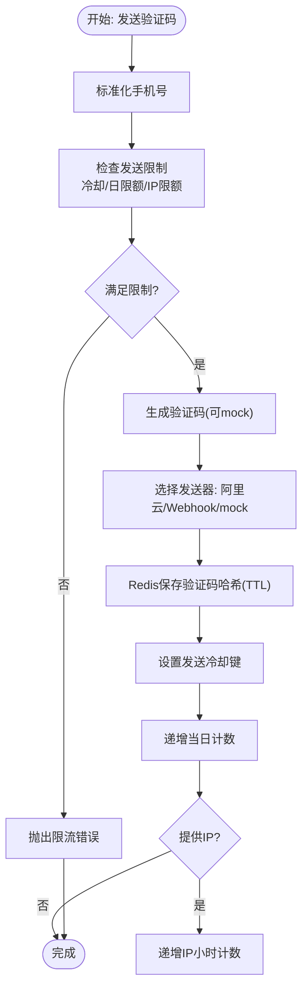
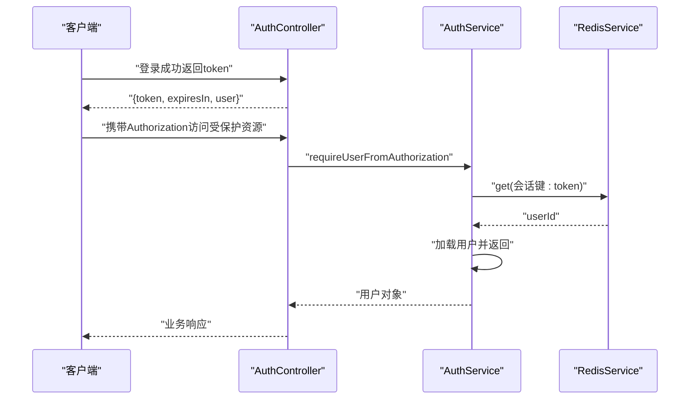
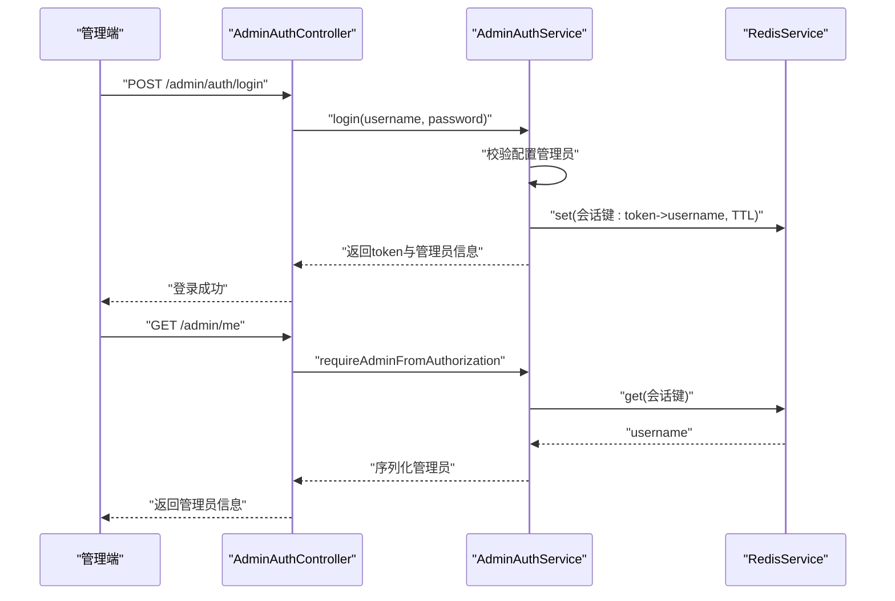
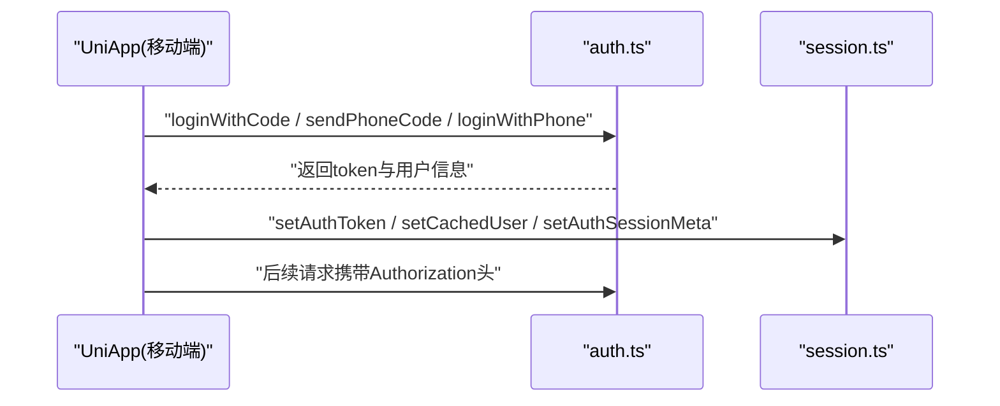
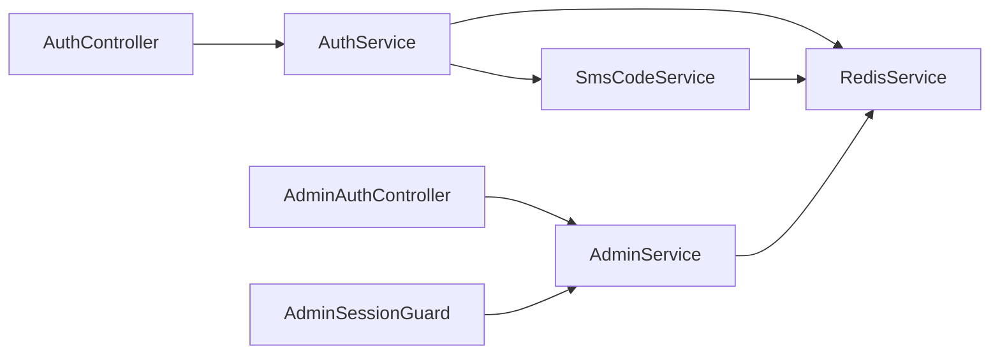

# 用户认证模块

<cite>
**本文引用的文件**
- [auth.controller.ts](file://services/api/src/auth/auth.controller.ts)
- [auth.service.ts](file://services/api/src/auth/auth.service.ts)
- [sms-code.service.ts](file://services/api/src/auth/sms-code.service.ts)
- [wechat-login.dto.ts](file://services/api/src/auth/dto/wechat-login.dto.ts)
- [phone-login.dto.ts](file://services/api/src/auth/dto/phone-login.dto.ts)
- [phone-code.dto.ts](file://services/api/src/auth/dto/phone-code.dto.ts)
- [admin-auth.controller.ts](file://services/api/src/admin-auth/admin-auth.controller.ts)
- [admin-auth.service.ts](file://services/api/src/admin-auth/admin-auth.service.ts)
- [admin-session.guard.ts](file://services/api/src/admin-auth/admin-session.guard.ts)
- [admin-auth.constants.ts](file://services/api/src/admin-auth/admin-auth.constants.ts)
- [auth.ts](file://apps/mobile/src/api/auth.ts)
- [session.ts](file://apps/mobile/src/services/session.ts)
- [admin-session.ts](file://apps/admin/src/services/admin-session.ts)
- [admin-session.ts](file://apps/admin/src/stores/admin-session.ts)
- [redis.service.ts](file://services/api/src/redis/redis.service.ts)
</cite>

## 目录
1. [简介](#简介)
2. [项目结构](#项目结构)
3. [核心组件](#核心组件)
4. [架构总览](#架构总览)
5. [详细组件分析](#详细组件分析)
6. [依赖关系分析](#依赖关系分析)
7. [性能考量](#性能考量)
8. [故障排查指南](#故障排查指南)
9. [结论](#结论)
10. [附录](#附录)

## 简介
本技术文档聚焦于用户认证模块，涵盖以下能力与流程：
- 微信授权登录：支持正式微信登录与开发环境模拟登录，返回统一会话标识与用户信息。
- 手机号登录：通过短信验证码进行登录，支持绑定手机号场景。
- 会话管理：基于 Redis 的会话存储与校验，提供会话有效期控制。
- 短信验证码服务：集成阿里云短信服务（可选 Webhook），具备发送冷却、每日限额、IP 限制、验证码哈希与安全比对等安全策略。
- 管理员认证系统：独立的管理员登录、菜单权限过滤与会话隔离。
- 认证中间件：在 NestJS 中通过守卫实现请求拦截与权限校验。
- 安全最佳实践：防暴力破解、凭据格式校验、安全存储与传输。

## 项目结构
认证相关代码主要分布在后端 NestJS 服务与前端应用中：
- 后端
  - 用户认证：auth.controller、auth.service、sms-code.service 及 DTO。
  - 管理员认证：admin-auth.controller、admin-auth.service、admin-session.guard、admin-auth.constants。
  - 会话与缓存：redis.service。
- 前端
  - 移动端：auth.api、session 存储。
  - 管理端：admin-session 存储与 Pinia Store。



**图表来源**
- [auth.controller.ts:1-36](file://services/api/src/auth/auth.controller.ts#L1-L36)
- [auth.service.ts:1-419](file://services/api/src/auth/auth.service.ts#L1-L419)
- [sms-code.service.ts:1-400](file://services/api/src/auth/sms-code.service.ts#L1-L400)
- [admin-auth.controller.ts:1-45](file://services/api/src/admin-auth/admin-auth.controller.ts#L1-L45)
- [admin-auth.service.ts:1-119](file://services/api/src/admin-auth/admin-auth.service.ts#L1-L119)
- [admin-session.guard.ts:1-25](file://services/api/src/admin-auth/admin-session.guard.ts#L1-L25)
- [redis.service.ts:1-125](file://services/api/src/redis/redis.service.ts#L1-L125)

**章节来源**
- [auth.controller.ts:1-36](file://services/api/src/auth/auth.controller.ts#L1-L36)
- [auth.service.ts:1-419](file://services/api/src/auth/auth.service.ts#L1-L419)
- [sms-code.service.ts:1-400](file://services/api/src/auth/sms-code.service.ts#L1-L400)
- [admin-auth.controller.ts:1-45](file://services/api/src/admin-auth/admin-auth.controller.ts#L1-L45)
- [admin-auth.service.ts:1-119](file://services/api/src/admin-auth/admin-auth.service.ts#L1-L119)
- [admin-session.guard.ts:1-25](file://services/api/src/admin-auth/admin-session.guard.ts#L1-L25)
- [redis.service.ts:1-125](file://services/api/src/redis/redis.service.ts#L1-L125)

## 核心组件
- AuthController：暴露 /auth/wechat-login、/auth/phone-code、/auth/phone-login 等接口，负责参数解析与调用 AuthService。
- AuthService：实现微信登录、手机号登录、会话构建与校验、用户序列化、手机号规范化与掩码等。
- SmsCodeService：短信验证码发送、校验、配额与冷却控制、阿里云/自定义 Webhook 发送器。
- AdminAuthController/AdminAuthService/AdminSessionGuard：管理员登录、菜单权限过滤、会话校验与守卫。
- RedisService：统一的 Redis 连接与操作封装，提供 get/set/del/ping 等方法。
- 前端 API 与会话存储：移动端与管理端分别维护 Token 与用户信息缓存。

**章节来源**
- [auth.controller.ts:1-36](file://services/api/src/auth/auth.controller.ts#L1-L36)
- [auth.service.ts:1-419](file://services/api/src/auth/auth.service.ts#L1-L419)
- [sms-code.service.ts:1-400](file://services/api/src/auth/sms-code.service.ts#L1-L400)
- [admin-auth.controller.ts:1-45](file://services/api/src/admin-auth/admin-auth.controller.ts#L1-L45)
- [admin-auth.service.ts:1-119](file://services/api/src/admin-auth/admin-auth.service.ts#L1-L119)
- [admin-session.guard.ts:1-25](file://services/api/src/admin-auth/admin-session.guard.ts#L1-L25)
- [redis.service.ts:1-125](file://services/api/src/redis/redis.service.ts#L1-L125)
- [auth.ts:1-56](file://apps/mobile/src/api/auth.ts#L1-L56)
- [session.ts:1-56](file://apps/mobile/src/services/session.ts#L1-L56)
- [admin-session.ts:1-30](file://apps/admin/src/services/admin-session.ts#L1-L30)
- [admin-session.ts:1-65](file://apps/admin/src/stores/admin-session.ts#L1-L65)

## 架构总览
认证模块采用“控制器-服务-缓存/外部服务”的分层架构：
- 控制器接收请求，调用服务层执行业务逻辑。
- 服务层负责数据持久化、第三方交互（微信、短信）、会话构建与校验。
- Redis 提供会话键值存储与配额计数。
- 前端通过 API 与本地存储完成登录态维护。



**图表来源**
- [auth.controller.ts:17-25](file://services/api/src/auth/auth.controller.ts#L17-L25)
- [auth.service.ts:81-131](file://services/api/src/auth/auth.service.ts#L81-L131)
- [sms-code.service.ts:35-76](file://services/api/src/auth/sms-code.service.ts#L35-L76)
- [redis.service.ts:89-104](file://services/api/src/redis/redis.service.ts#L89-L104)

## 详细组件分析

### 微信授权登录
- 流程要点
  - 前端使用小程序 code 调用 /auth/wechat-login。
  - 服务端根据配置决定走正式微信接口或模拟登录。
  - 成功后创建/更新用户并写入会话键，返回 token 与用户信息。
- 关键实现
  - 解析微信会话：调用微信 jscode2session 接口，解析 openid/unionid。
  - 模拟登录：当未配置正式密钥且允许模拟时，生成 mock openid。
  - 会话构建：随机 token 写入 Redis，设置过期时间。
  - 用户持久化：去重冲突处理，合并 unionid/phone 等字段。



**图表来源**
- [auth.controller.ts:12-15](file://services/api/src/auth/auth.controller.ts#L12-L15)
- [auth.service.ts:50-79](file://services/api/src/auth/auth.service.ts#L50-L79)
- [auth.service.ts:372-417](file://services/api/src/auth/auth.service.ts#L372-L417)
- [redis.service.ts:89-104](file://services/api/src/redis/redis.service.ts#L89-L104)

**章节来源**
- [auth.controller.ts:12-15](file://services/api/src/auth/auth.controller.ts#L12-L15)
- [auth.service.ts:50-79](file://services/api/src/auth/auth.service.ts#L50-L79)
- [auth.service.ts:372-417](file://services/api/src/auth/auth.service.ts#L372-L417)

### 手机号登录与短信验证码
- 发送验证码
  - 校验手机号格式，提取客户端 IP。
  - 触发发送前检查：冷却时间、当日发送次数、按 IP 的小时限额。
  - 生成 6 位数字验证码（可配置 mock）。
  - 以哈希形式保存到 Redis，设置验证码 TTL。
  - 设置发送冷却键，记录当日与按 IP 的计数。
- 登录校验
  - 校验验证码哈希，失败则增加错误尝试计数。
  - 成功则删除验证码与尝试计数，创建/更新用户并写入会话。
- 安全策略
  - 使用安全常量时间比较防止时序攻击。
  - 验证码哈希加入场景、手机号与“椒盐”增强抗彩虹表能力。
  - 多维度限流：冷却、日限额、IP 小时限额、最大验证尝试次数。



**图表来源**
- [sms-code.service.ts:35-76](file://services/api/src/auth/sms-code.service.ts#L35-L76)
- [sms-code.service.ts:115-146](file://services/api/src/auth/sms-code.service.ts#L115-L146)
- [sms-code.service.ts:162-168](file://services/api/src/auth/sms-code.service.ts#L162-L168)
- [sms-code.service.ts:170-188](file://services/api/src/auth/sms-code.service.ts#L170-L188)
- [sms-code.service.ts:360-378](file://services/api/src/auth/sms-code.service.ts#L360-L378)

**章节来源**
- [auth.controller.ts:17-20](file://services/api/src/auth/auth.controller.ts#L17-L20)
- [auth.service.ts:81-93](file://services/api/src/auth/auth.service.ts#L81-L93)
- [auth.service.ts:95-131](file://services/api/src/auth/auth.service.ts#L95-L131)
- [sms-code.service.ts:35-146](file://services/api/src/auth/sms-code.service.ts#L35-L146)
- [sms-code.service.ts:170-188](file://services/api/src/auth/sms-code.service.ts#L170-L188)
- [sms-code.service.ts:360-378](file://services/api/src/auth/sms-code.service.ts#L360-L378)

### 会话管理与 JWT 令牌
- 当前实现
  - 不使用 JWT，而是使用随机字符串作为 token，并以 Redis 键值存储关联用户 ID。
  - 会话键前缀区分用户与管理员，TTL 分别配置。
- 令牌生成与校验
  - 生成随机 token，写入 Redis 并返回给前端。
  - 校验时从 Authorization 头提取 Bearer token，查询 Redis 获取用户 ID 并加载用户对象。
- 刷新机制
  - 代码未实现自动刷新；建议在前端轮询或到期前主动续期，或引入 refresh token 机制。



**图表来源**
- [auth.service.ts:302-322](file://services/api/src/auth/auth.service.ts#L302-L322)
- [auth.service.ts:171-188](file://services/api/src/auth/auth.service.ts#L171-L188)
- [auth.service.ts:288-300](file://services/api/src/auth/auth.service.ts#L288-L300)
- [redis.service.ts:79-104](file://services/api/src/redis/redis.service.ts#L79-L104)

**章节来源**
- [auth.service.ts:21-22](file://services/api/src/auth/auth.service.ts#L21-L22)
- [auth.service.ts:302-322](file://services/api/src/auth/auth.service.ts#L302-L322)
- [auth.service.ts:171-188](file://services/api/src/auth/auth.service.ts#L171-L188)
- [auth.service.ts:288-300](file://services/api/src/auth/auth.service.ts#L288-L300)

### 管理员认证系统
- 登录流程
  - 校验配置的管理员用户名/密码，生成 token 并写入 Redis。
  - 返回管理员信息与权限集合。
- 权限与菜单
  - 基于固定权限集合过滤菜单项，实现菜单级权限控制。
- 会话隔离
  - 使用独立的会话键前缀与 TTL，避免与用户会话混淆。
- 守卫
  - AdminSessionGuard 在请求进入时解析并校验管理员 token，注入 request.admin。



**图表来源**
- [admin-auth.controller.ts:10-13](file://services/api/src/admin-auth/admin-auth.controller.ts#L10-L13)
- [admin-auth.controller.ts:15-28](file://services/api/src/admin-auth/admin-auth.controller.ts#L15-L28)
- [admin-auth.service.ts:24-52](file://services/api/src/admin-auth/admin-auth.service.ts#L24-L52)
- [admin-auth.service.ts:54-68](file://services/api/src/admin-auth/admin-auth.service.ts#L54-L68)
- [admin-session.guard.ts:17-23](file://services/api/src/admin-auth/admin-session.guard.ts#L17-L23)

**章节来源**
- [admin-auth.controller.ts:1-45](file://services/api/src/admin-auth/admin-auth.controller.ts#L1-L45)
- [admin-auth.service.ts:1-119](file://services/api/src/admin-auth/admin-auth.service.ts#L1-L119)
- [admin-session.guard.ts:1-25](file://services/api/src/admin-auth/admin-session.guard.ts#L1-L25)
- [admin-auth.constants.ts:1-40](file://services/api/src/admin-auth/admin-auth.constants.ts#L1-L40)

### 认证中间件与请求拦截
- 用户认证中间件
  - 通过 AuthService 的 requireUserFromAuthorization 从 Authorization 头提取 Bearer token，并校验 Redis 会话有效性。
- 管理员认证中间件
  - AdminSessionGuard 实现 CanActivate，在请求上下文中解析并注入管理员信息，用于后续路由守卫与业务处理。

```mermaid
classDiagram
class AdminSessionGuard {
+canActivate(context) bool
}
class AdminAuthService {
+requireAdminFromAuthorization(authorization) AdminProfile
-extractBearerToken(authorization) string
}
class AuthService {
+requireUserFromAuthorization(authorization) User
-extractBearerToken(authorization) string
}
AdminSessionGuard --> AdminAuthService : "依赖"
// 用户认证中间件可复用AuthService模式
```

**图表来源**
- [admin-session.guard.ts:1-25](file://services/api/src/admin-auth/admin-session.guard.ts#L1-L25)
- [admin-auth.service.ts:54-68](file://services/api/src/admin-auth/admin-auth.service.ts#L54-L68)
- [admin-auth.service.ts:105-117](file://services/api/src/admin-auth/admin-auth.service.ts#L105-L117)
- [auth.service.ts:171-188](file://services/api/src/auth/auth.service.ts#L171-L188)
- [auth.service.ts:288-300](file://services/api/src/auth/auth.service.ts#L288-L300)

**章节来源**
- [admin-session.guard.ts:1-25](file://services/api/src/admin-auth/admin-session.guard.ts#L1-L25)
- [admin-auth.service.ts:54-68](file://services/api/src/admin-auth/admin-auth.service.ts#L54-L68)
- [auth.service.ts:171-188](file://services/api/src/auth/auth.service.ts#L171-L188)

### 前端集成与会话存储
- 移动端
  - 通过 auth.ts 调用后端接口，使用 session.ts 维护 token、用户信息与会话元数据。
- 管理端
  - 使用 admin-session.ts 持久化 token，Pinia Store 管理登录态、拉取管理员信息与菜单。



**图表来源**
- [auth.ts:14-55](file://apps/mobile/src/api/auth.ts#L14-L55)
- [session.ts:15-55](file://apps/mobile/src/services/session.ts#L15-L55)

**章节来源**
- [auth.ts:1-56](file://apps/mobile/src/api/auth.ts#L1-L56)
- [session.ts:1-56](file://apps/mobile/src/services/session.ts#L1-L56)
- [admin-session.ts:1-30](file://apps/admin/src/services/admin-session.ts#L1-L30)
- [admin-session.ts:1-65](file://apps/admin/src/stores/admin-session.ts#L1-L65)

## 依赖关系分析
- 组件耦合
  - AuthController 仅依赖 AuthService；AuthService 依赖 RedisService、SmsCodeService、EntitlementsService、ConfigService。
  - AdminAuthController 依赖 AdminAuthService；AdminSessionGuard 依赖 AdminAuthService。
  - 前端 API 与会话存储与后端接口契约一致。
- 外部依赖
  - Redis：会话与配额存储。
  - 微信：jscode2session 接口。
  - 阿里云短信：SendSms 接口（可选）。
- 潜在循环依赖
  - 未发现直接循环依赖；各模块职责清晰。



**图表来源**
- [auth.controller.ts:1-36](file://services/api/src/auth/auth.controller.ts#L1-L36)
- [auth.service.ts:41-48](file://services/api/src/auth/auth.service.ts#L41-L48)
- [sms-code.service.ts:30-33](file://services/api/src/auth/sms-code.service.ts#L30-L33)
- [admin-auth.controller.ts:1-45](file://services/api/src/admin-auth/admin-auth.controller.ts#L1-L45)
- [admin-auth.service.ts:19-22](file://services/api/src/admin-auth/admin-auth.service.ts#L19-L22)
- [admin-session.guard.ts:13-15](file://services/api/src/admin-auth/admin-session.guard.ts#L13-L15)
- [redis.service.ts:1-125](file://services/api/src/redis/redis.service.ts#L1-L125)

**章节来源**
- [auth.service.ts:41-48](file://services/api/src/auth/auth.service.ts#L41-L48)
- [sms-code.service.ts:30-33](file://services/api/src/auth/sms-code.service.ts#L30-L33)
- [admin-auth.service.ts:19-22](file://services/api/src/admin-auth/admin-auth.service.ts#L19-L22)

## 性能考量
- Redis 连接与可用性
  - RedisService 提供连接状态检测与超时等待，确保高可用。
- 缓存键设计
  - 会话键与验证码键均带 TTL，避免内存泄漏。
- 并发与一致性
  - 验证码校验采用哈希与安全比较，降低碰撞风险。
- 建议优化
  - 引入连接池与重连策略，减少网络抖动影响。
  - 对高频接口增加本地缓存与限流降载。

**章节来源**
- [redis.service.ts:12-66](file://services/api/src/redis/redis.service.ts#L12-L66)
- [redis.service.ts:79-124](file://services/api/src/redis/redis.service.ts#L79-L124)

## 故障排查指南
- 常见问题定位
  - 缺少或格式错误的 Authorization 头：检查 Bearer token 提取逻辑。
  - 会话失效：确认 Redis 中是否存在对应键及 TTL。
  - 微信登录失败：检查 WECHAT_APP_ID/WECHAT_APP_SECRET 配置与 code 有效性。
  - 短信发送失败：检查短信服务商配置、签名与模板是否正确。
  - 验证码错误次数过多：查看 attemptsKey 计数与验证码哈希是否匹配。
- 建议排查步骤
  - 查看 Redis 中验证码与会话键状态。
  - 检查短信服务日志与返回码。
  - 核对前端是否正确携带 Authorization 头。

**章节来源**
- [auth.service.ts:288-300](file://services/api/src/auth/auth.service.ts#L288-L300)
- [auth.service.ts:171-188](file://services/api/src/auth/auth.service.ts#L171-L188)
- [auth.service.ts:372-417](file://services/api/src/auth/auth.service.ts#L372-L417)
- [sms-code.service.ts:205-243](file://services/api/src/auth/sms-code.service.ts#L205-L243)
- [sms-code.service.ts:78-113](file://services/api/src/auth/sms-code.service.ts#L78-L113)

## 结论
本认证模块以简洁可靠的方式实现了微信授权登录、手机号登录与会话管理，并通过 Redis 提供了高可用的会话与风控能力。管理员认证系统提供了独立的会话与权限体系。建议后续引入 JWT 刷新机制与更细粒度的权限模型，进一步提升安全性与扩展性。

## 附录
- 配置项参考
  - 微信登录：WECHAT_APP_ID、WECHAT_APP_SECRET、WECHAT_LOGIN_ALLOW_MOCK。
  - 短信服务：SMS_PROVIDER、ALIYUN_*、SMS_WEBHOOK_*、SMS_MOCK_*、SMS_CODE_PEPPER。
  - 管理员：ADMIN_USERNAME、ADMIN_PASSWORD、ADMIN_DISPLAY_NAME。
- 前端存储键
  - 移动端：fortune-hub-auth-token、fortune-hub-auth-user、fortune-hub-auth-meta。
  - 管理端：fortune-hub-admin-token（localStorage）。