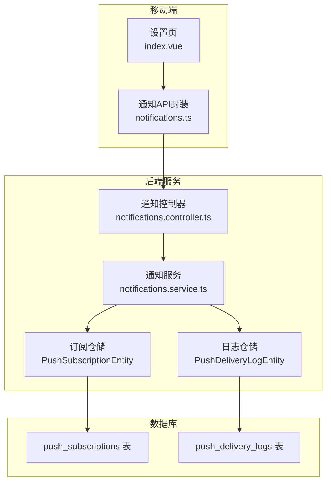
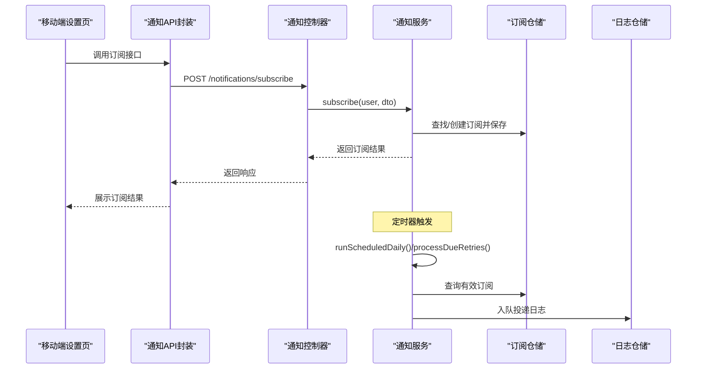
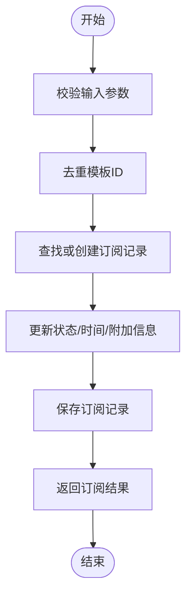
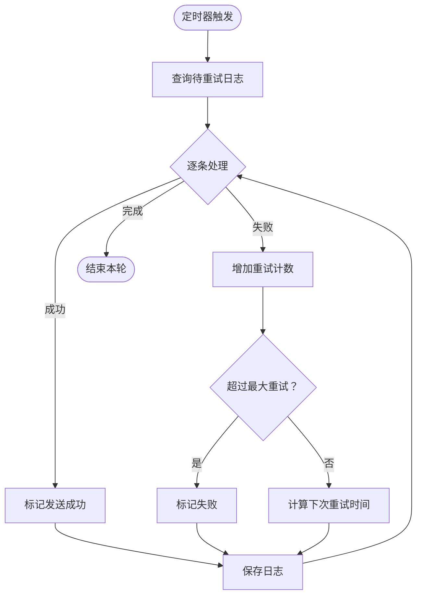
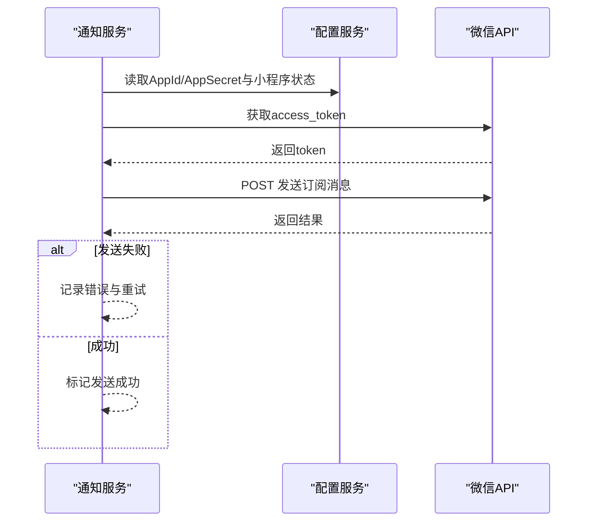
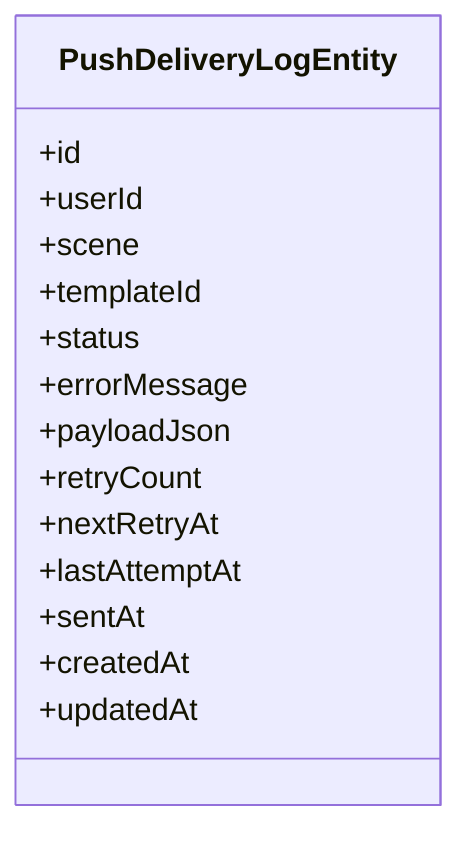
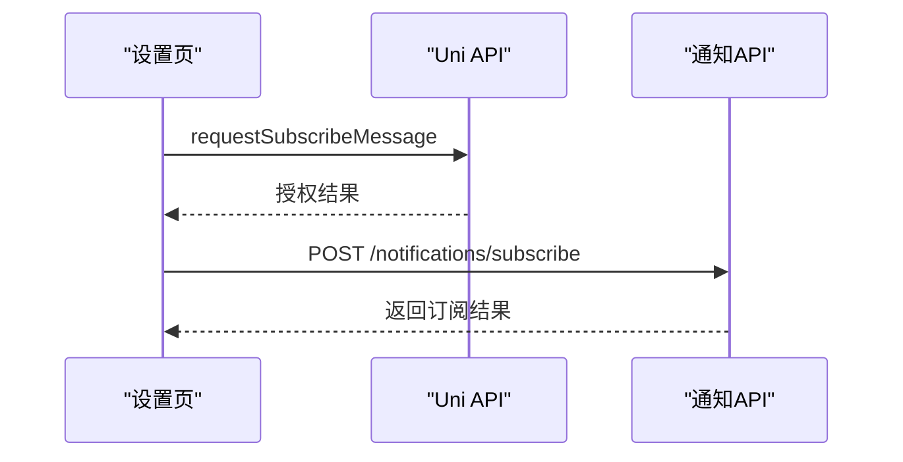
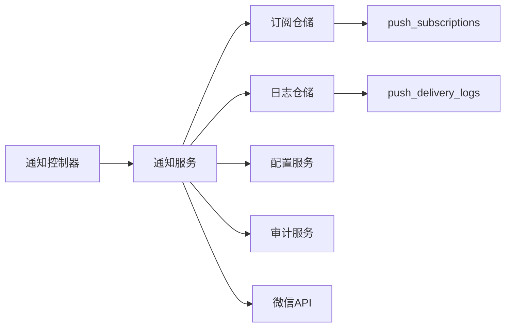
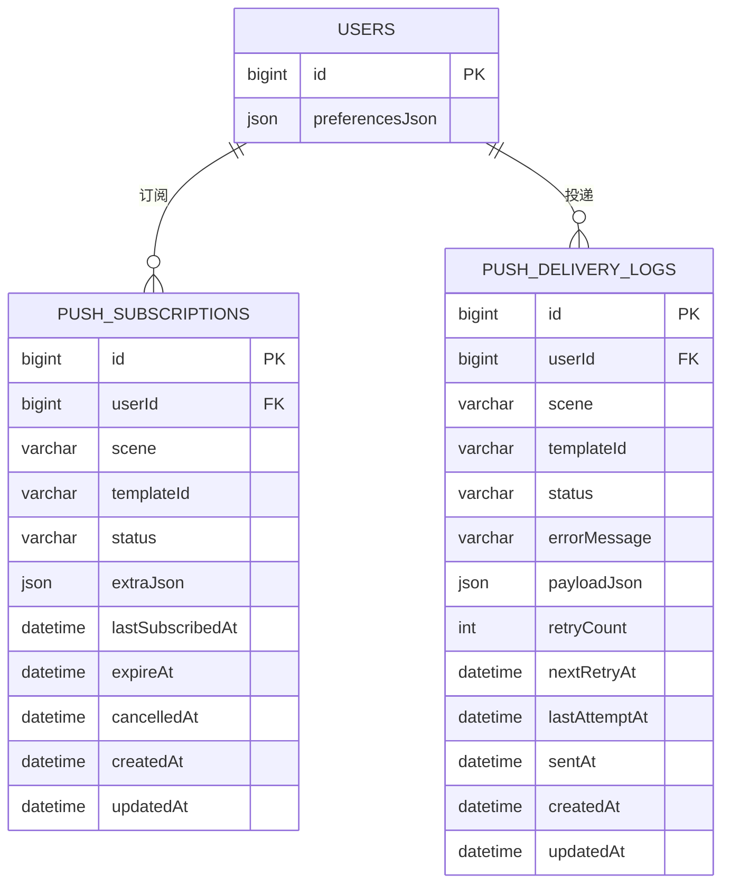

# 通知推送模块

<cite>
**本文引用的文件**
- [services/api/src/notifications/notifications.service.ts](file://services/api/src/notifications/notifications.service.ts)
- [services/api/src/notifications/notifications.controller.ts](file://services/api/src/notifications/notifications.controller.ts)
- [services/api/src/notifications/dto/subscribe-notification.dto.ts](file://services/api/src/notifications/dto/subscribe-notification.dto.ts)
- [services/api/src/notifications/dto/unsubscribe-notification.dto.ts](file://services/api/src/notifications/dto/unsubscribe-notification.dto.ts)
- [services/api/src/notifications/dto/run-notification.dto.ts](file://services/api/src/notifications/dto/run-notification.dto.ts)
- [services/api/src/database/entities/push-subscription.entity.ts](file://services/api/src/database/entities/push-subscription.entity.ts)
- [services/api/src/database/entities/push-delivery-log.entity.ts](file://services/api/src/database/entities/push-delivery-log.entity.ts)
- [services/api/src/database/migrations/1761327200000-AddUserPreferences.ts](file://services/api/src/database/migrations/1761327200000-AddUserPreferences.ts)
- [services/api/src/database/migrations/1761333600000-SettingsFeedbackNotificationsOps.ts](file://services/api/src/database/migrations/1761333600000-SettingsFeedbackNotificationsOps.ts)
- [services/api/src/database/migrations/1761350000000-ProductionOpsPolish.ts](file://services/api/src/database/migrations/1761350000000-ProductionOpsPolish.ts)
- [apps/mobile/src/pages/settings/index.vue](file://apps/mobile/src/pages/settings/index.vue)
- [apps/mobile/src/api/notifications.ts](file://apps/mobile/src/api/notifications.ts)
- [apps/mobile/src/types/settings.ts](file://apps/mobile/src/types/settings.ts)
- [services/api/src/users/dto/update-preferences.dto.ts](file://services/api/src/users/dto/update-preferences.dto.ts)
- [services/api/src/users/users.service.ts](file://services/api/src/users/users.service.ts)
</cite>

## 目录
1. [简介](#简介)
2. [项目结构](#项目结构)
3. [核心组件](#核心组件)
4. [架构总览](#架构总览)
5. [详细组件分析](#详细组件分析)
6. [依赖关系分析](#依赖关系分析)
7. [性能考量](#性能考量)
8. [故障排查指南](#故障排查指南)
9. [结论](#结论)
10. [附录](#附录)

## 简介
本技术指南面向通知推送模块，围绕“订阅管理、异步投递、重试与失败处理、模板与个性化、日志与监控、配置与策略、效果追踪”等主题进行系统化说明。该模块基于微信小程序订阅消息能力，采用“队列+定时器+限流”的异步处理模式，结合用户偏好与静默时段策略，确保在保证用户体验的前提下高效、稳定地触达用户。

## 项目结构
推送模块由后端服务、数据库实体与迁移脚本、移动端前端三部分组成：
- 后端服务：控制器与服务层负责订阅管理、定时任务、消息投递、重试与日志查询。
- 数据库：订阅表与投递日志表，配合索引保障查询与调度效率。
- 前端：移动端页面触发订阅授权与调用后端接口完成订阅。

图表来源
- [services/api/src/notifications/notifications.controller.ts:11-41](file://services/api/src/notifications/notifications.controller.ts#L11-L41)
- [services/api/src/notifications/notifications.service.ts:27-36](file://services/api/src/notifications/notifications.service.ts#L27-L36)
- [services/api/src/database/entities/push-subscription.entity.ts:10-15](file://services/api/src/database/entities/push-subscription.entity.ts#L10-L15)
- [services/api/src/database/entities/push-delivery-log.entity.ts:10-13](file://services/api/src/database/entities/push-delivery-log.entity.ts#L10-L13)

章节来源
- [services/api/src/notifications/notifications.controller.ts:11-41](file://services/api/src/notifications/notifications.controller.ts#L11-L41)
- [services/api/src/notifications/notifications.service.ts:27-36](file://services/api/src/notifications/notifications.service.ts#L27-L36)
- [services/api/src/database/entities/push-subscription.entity.ts:10-15](file://services/api/src/database/entities/push-subscription.entity.ts#L10-L15)
- [services/api/src/database/entities/push-delivery-log.entity.ts:10-13](file://services/api/src/database/entities/push-delivery-log.entity.ts#L10-L13)

## 核心组件
- 订阅管理
  - 创建订阅：支持批量模板ID去重、过期时间设定、附加信息存储。
  - 取消订阅：按场景与模板ID筛选，批量标记为取消并记录时间。
  - 查询订阅：按用户维度返回最近订阅列表。
- 异步投递与调度
  - 定时任务：可配置启用/间隔，周期性拉取到期订阅并入队。
  - 重试任务：根据状态与下次重试时间窗口批量出队发送，最多重试若干次。
  - 发送策略：结合用户偏好与静默时段过滤目标用户。
- 模板与个性化
  - 模板载荷：构建微信订阅消息载荷，包含跳转页、小程序状态、动态数据字段。
  - 场景化模板：不同场景（如日常提醒、幸运推送）使用不同标题与引导语。
- 日志与审计
  - 投递日志：记录状态、错误信息、重试次数、下次重试时间、最后尝试时间、发送时间等。
  - 管理员操作审计：对运行、重试、清理、定时执行等动作进行审计写入。
- 配置与策略
  - 运行开关与间隔：是否启用后台worker及轮询间隔。
  - 微信凭证：AppId/AppSecret与缓存；允许Mock模式用于测试。
  - 用户偏好：每日提醒、幸运推送开关、静默模式与时间段。

章节来源
- [services/api/src/notifications/notifications.service.ts:76-158](file://services/api/src/notifications/notifications.service.ts#L76-L158)
- [services/api/src/notifications/notifications.service.ts:160-278](file://services/api/src/notifications/notifications.service.ts#L160-L278)
- [services/api/src/notifications/notifications.service.ts:300-352](file://services/api/src/notifications/notifications.service.ts#L300-L352)
- [services/api/src/notifications/notifications.service.ts:381-406](file://services/api/src/notifications/notifications.service.ts#L381-L406)
- [services/api/src/notifications/notifications.service.ts:408-475](file://services/api/src/notifications/notifications.service.ts#L408-L475)
- [services/api/src/notifications/notifications.service.ts:368-379](file://services/api/src/notifications/notifications.service.ts#L368-L379)

## 架构总览
推送模块采用“控制器-服务-仓储-数据库”的分层架构，并通过定时器驱动异步任务，结合微信订阅消息API实现消息下发。

图表来源
- [services/api/src/notifications/notifications.controller.ts:24-40](file://services/api/src/notifications/notifications.controller.ts#L24-L40)
- [services/api/src/notifications/notifications.service.ts:76-111](file://services/api/src/notifications/notifications.service.ts#L76-L111)
- [services/api/src/notifications/notifications.service.ts:266-278](file://services/api/src/notifications/notifications.service.ts#L266-L278)
- [services/api/src/notifications/notifications.service.ts:300-352](file://services/api/src/notifications/notifications.service.ts#L300-L352)

## 详细组件分析

### 订阅管理流程
- 批量订阅创建
  - 输入校验：场景长度限制、模板ID数组大小限制、额外参数对象可选。
  - 去重与幂等：按用户+场景+模板ID唯一索引，不存在则创建，存在则复用。
  - 生命周期：设置状态为激活、记录最近订阅时间、设置30天有效期、清空取消时间、写入附加信息。
- 取消订阅
  - 支持按场景与模板ID集合过滤，批量更新状态为取消并记录取消时间。
- 查询订阅
  - 按用户维度查询，按最近订阅时间倒序，限制返回条数。

图表来源
- [services/api/src/notifications/dto/subscribe-notification.dto.ts:10-23](file://services/api/src/notifications/dto/subscribe-notification.dto.ts#L10-L23)
- [services/api/src/notifications/notifications.service.ts:76-111](file://services/api/src/notifications/notifications.service.ts#L76-L111)

章节来源
- [services/api/src/notifications/dto/subscribe-notification.dto.ts:10-23](file://services/api/src/notifications/dto/subscribe-notification.dto.ts#L10-L23)
- [services/api/src/notifications/dto/unsubscribe-notification.dto.ts:3-14](file://services/api/src/notifications/dto/unsubscribe-notification.dto.ts#L3-L14)
- [services/api/src/notifications/notifications.service.ts:76-158](file://services/api/src/notifications/notifications.service.ts#L76-L158)

### 异步投递与重试机制
- 定时调度
  - 启动时读取配置决定是否启用重试worker与每日worker及其间隔。
  - 每日worker：按配置的多个场景批量入队投递日志。
- 重试处理
  - 出队条件：状态为排队且到达下次重试时间，或状态为重试且到达时间，或无下次重试时间。
  - 发送成功：标记为已发送，清除重试时间。
  - 失败处理：增加重试计数，超过阈值标记为失败，否则进入重试状态并计算下次重试时间。
- 发送策略
  - 用户偏好过滤：若用户未绑定openid或关闭对应场景推送，则跳过。
  - 静默时段过滤：夜间22点至次日8点默认不发送。

图表来源
- [services/api/src/notifications/notifications.service.ts:38-63](file://services/api/src/notifications/notifications.service.ts#L38-L63)
- [services/api/src/notifications/notifications.service.ts:266-278](file://services/api/src/notifications/notifications.service.ts#L266-L278)
- [services/api/src/notifications/notifications.service.ts:300-352](file://services/api/src/notifications/notifications.service.ts#L300-L352)
- [services/api/src/notifications/notifications.service.ts:381-406](file://services/api/src/notifications/notifications.service.ts#L381-L406)

章节来源
- [services/api/src/notifications/notifications.service.ts:38-63](file://services/api/src/notifications/notifications.service.ts#L38-L63)
- [services/api/src/notifications/notifications.service.ts:266-278](file://services/api/src/notifications/notifications.service.ts#L266-L278)
- [services/api/src/notifications/notifications.service.ts:300-352](file://services/api/src/notifications/notifications.service.ts#L300-L352)
- [services/api/src/notifications/notifications.service.ts:381-406](file://services/api/src/notifications/notifications.service.ts#L381-L406)

### 模板系统与个性化
- 模板载荷构建
  - 基于场景选择标题与引导语，拼装动态字段（如时间），统一设置小程序跳转页与状态。
- 场景化模板
  - 日常提醒与幸运推送分别使用不同的标题文案与跳转路径。
- 个性化定制
  - 使用用户昵称作为个性化元素，增强消息亲和力。
- 微信订阅消息发送
  - 自动获取与缓存access_token，构造请求体并调用微信API。
  - 若未配置凭证且不允许Mock，则抛出异常；否则在Mock模式下跳过实际发送。

图表来源
- [services/api/src/notifications/notifications.service.ts:408-475](file://services/api/src/notifications/notifications.service.ts#L408-L475)
- [services/api/src/notifications/notifications.service.ts:477-503](file://services/api/src/notifications/notifications.service.ts#L477-L503)

章节来源
- [services/api/src/notifications/notifications.service.ts:408-475](file://services/api/src/notifications/notifications.service.ts#L408-L475)
- [services/api/src/notifications/notifications.service.ts:477-503](file://services/api/src/notifications/notifications.service.ts#L477-L503)

### 日志记录与分析
- 投递日志字段
  - 包含用户ID、场景、模板ID、状态、错误信息、载荷JSON、重试次数、下次重试时间、最后尝试时间、发送时间、创建/更新时间。
- 管理员操作审计
  - 对运行、重试、清理、定时执行等动作写入审计日志，便于追溯。
- 日志查询
  - 支持按场景与状态过滤，限制返回数量，按创建时间倒序。

图表来源
- [services/api/src/database/entities/push-delivery-log.entity.ts:13-52](file://services/api/src/database/entities/push-delivery-log.entity.ts#L13-L52)

章节来源
- [services/api/src/database/entities/push-delivery-log.entity.ts:13-52](file://services/api/src/database/entities/push-delivery-log.entity.ts#L13-L52)
- [services/api/src/notifications/notifications.service.ts:354-366](file://services/api/src/notifications/notifications.service.ts#L354-L366)
- [services/api/src/notifications/notifications.service.ts:368-379](file://services/api/src/notifications/notifications.service.ts#L368-L379)

### 配置管理与策略
- 运行配置
  - 是否启用通知worker、worker轮询间隔、每日worker开关与间隔、定时场景列表、是否允许Mock。
- 渠道与凭证
  - 微信AppId/AppSecret，access_token缓存与过期时间。
- 用户偏好
  - 每日提醒开关、幸运推送开关、静默模式开关；默认值在用户服务中定义。
- 频率控制与静默时段
  - 重试间隔随次数指数增长，上限固定；夜间22点至次日8点不发送。

章节来源
- [services/api/src/notifications/notifications.service.ts:38-63](file://services/api/src/notifications/notifications.service.ts#L38-L63)
- [services/api/src/notifications/notifications.service.ts:441-475](file://services/api/src/notifications/notifications.service.ts#L441-L475)
- [services/api/src/users/users.service.ts:196-203](file://services/api/src/users/users.service.ts#L196-L203)
- [services/api/src/users/dto/update-preferences.dto.ts:9-35](file://services/api/src/users/dto/update-preferences.dto.ts#L9-L35)

### 前端集成与用户交互
- 订阅授权与调用
  - 设置页触发微信订阅授权，成功后调用后端订阅接口并携带模板ID与来源信息。
- 类型定义
  - 订阅请求/响应类型与设置页返回数据结构在前端类型文件中定义。

图表来源
- [apps/mobile/src/pages/settings/index.vue:186-219](file://apps/mobile/src/pages/settings/index.vue#L186-L219)
- [apps/mobile/src/api/notifications.ts:7-12](file://apps/mobile/src/api/notifications.ts#L7-L12)
- [apps/mobile/src/types/settings.ts:90-112](file://apps/mobile/src/types/settings.ts#L90-L112)

章节来源
- [apps/mobile/src/pages/settings/index.vue:186-219](file://apps/mobile/src/pages/settings/index.vue#L186-L219)
- [apps/mobile/src/api/notifications.ts:7-12](file://apps/mobile/src/api/notifications.ts#L7-L12)
- [apps/mobile/src/types/settings.ts:90-112](file://apps/mobile/src/types/settings.ts#L90-L112)

## 依赖关系分析
- 组件耦合
  - 控制器仅依赖服务接口，服务层依赖仓储与配置/审计服务，职责清晰。
- 数据模型
  - 订阅表与日志表通过用户ID、场景建立关联，索引覆盖常用查询与调度字段。
- 外部依赖
  - 微信订阅消息API，access_token缓存减少频繁获取。

图表来源
- [services/api/src/notifications/notifications.controller.ts:11-41](file://services/api/src/notifications/notifications.controller.ts#L11-L41)
- [services/api/src/notifications/notifications.service.ts:27-36](file://services/api/src/notifications/notifications.service.ts#L27-L36)
- [services/api/src/database/entities/push-subscription.entity.ts:10-15](file://services/api/src/database/entities/push-subscription.entity.ts#L10-L15)
- [services/api/src/database/entities/push-delivery-log.entity.ts:10-13](file://services/api/src/database/entities/push-delivery-log.entity.ts#L10-L13)

章节来源
- [services/api/src/notifications/notifications.controller.ts:11-41](file://services/api/src/notifications/notifications.controller.ts#L11-L41)
- [services/api/src/notifications/notifications.service.ts:27-36](file://services/api/src/notifications/notifications.service.ts#L27-L36)
- [services/api/src/database/entities/push-subscription.entity.ts:10-15](file://services/api/src/database/entities/push-subscription.entity.ts#L10-L15)
- [services/api/src/database/entities/push-delivery-log.entity.ts:10-13](file://services/api/src/database/entities/push-delivery-log.entity.ts#L10-L13)

## 性能考量
- 查询与索引
  - 订阅表：唯一索引覆盖用户+场景+模板，场景+状态索引用于调度；日志表：用户+场景与状态+下次重试时间索引用于高效筛选。
- 并发与限流
  - 定时器轮询间隔可配置，避免高并发冲击微信API；重试次数与时间窗限制防止雪崩。
- 缓存与外部调用
  - access_token本地缓存并预留过期缓冲，降低API调用频率。
- 数据规模
  - 订阅与日志查询均设置上限，避免一次性返回过多数据。

章节来源
- [services/api/src/database/entities/push-subscription.entity.ts:10-15](file://services/api/src/database/entities/push-subscription.entity.ts#L10-L15)
- [services/api/src/database/entities/push-delivery-log.entity.ts:10-13](file://services/api/src/database/entities/push-delivery-log.entity.ts#L10-L13)
- [services/api/src/notifications/notifications.service.ts:38-63](file://services/api/src/notifications/notifications.service.ts#L38-L63)
- [services/api/src/notifications/notifications.service.ts:477-503](file://services/api/src/notifications/notifications.service.ts#L477-L503)

## 故障排查指南
- 常见问题定位
  - 未配置微信凭证：检查AppId/AppSecret；若不允许Mock，将直接抛错；可在测试环境开启Mock。
  - 用户无法接收：确认用户已绑定openid、未关闭对应场景推送、未处于静默时段。
  - 重试过多仍未送达：检查日志表中的错误信息与重试次数，必要时手动清理过期订阅或触发重试。
- 关键指标
  - 投递状态分布（排队/重试/失败/已发送）、失败原因统计、重试耗时与成功率。
- 管理员操作
  - 通过管理员接口手动触发运行、重试、清理过期订阅与定时执行，同时保留审计记录以便回溯。

章节来源
- [services/api/src/notifications/notifications.service.ts:441-475](file://services/api/src/notifications/notifications.service.ts#L441-L475)
- [services/api/src/notifications/notifications.service.ts:381-406](file://services/api/src/notifications/notifications.service.ts#L381-L406)
- [services/api/src/notifications/notifications.controller.ts:48-104](file://services/api/src/notifications/notifications.controller.ts#L48-L104)
- [services/api/src/notifications/notifications.service.ts:368-379](file://services/api/src/notifications/notifications.service.ts#L368-L379)

## 结论
该推送模块以简洁稳定的架构实现了从“订阅管理到异步投递再到日志审计”的完整闭环。通过合理的索引设计、重试策略与用户偏好过滤，既能满足高频推送需求，又能兼顾用户体验与系统稳定性。建议在生产环境中持续关注重试与失败指标，结合用户反馈优化模板与场景策略。

## 附录
- 数据模型概览

图表来源
- [services/api/src/database/entities/push-subscription.entity.ts:15-48](file://services/api/src/database/entities/push-subscription.entity.ts#L15-L48)
- [services/api/src/database/entities/push-delivery-log.entity.ts:13-52](file://services/api/src/database/entities/push-delivery-log.entity.ts#L13-L52)
- [services/api/src/database/migrations/1761327200000-AddUserPreferences.ts:4-17](file://services/api/src/database/migrations/1761327200000-AddUserPreferences.ts#L4-L17)
- [services/api/src/database/migrations/1761333600000-SettingsFeedbackNotificationsOps.ts:83-111](file://services/api/src/database/migrations/1761333600000-SettingsFeedbackNotificationsOps.ts#L83-L111)
- [services/api/src/database/migrations/1761350000000-ProductionOpsPolish.ts:12-51](file://services/api/src/database/migrations/1761350000000-ProductionOpsPolish.ts#L12-L51)