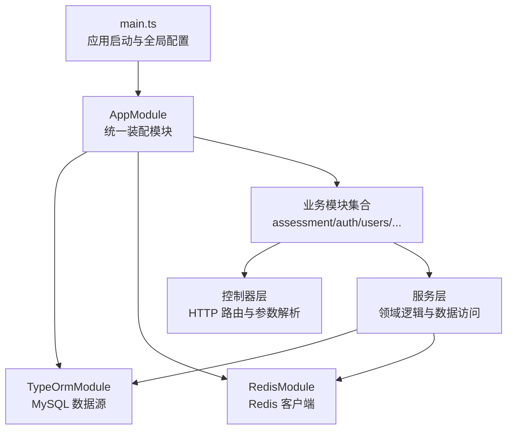
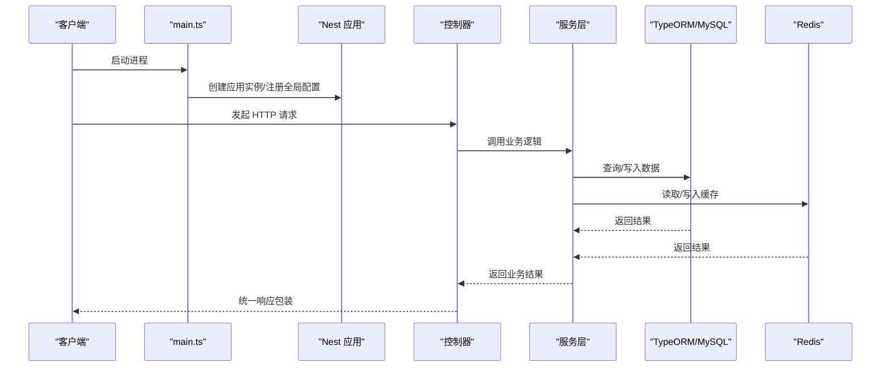
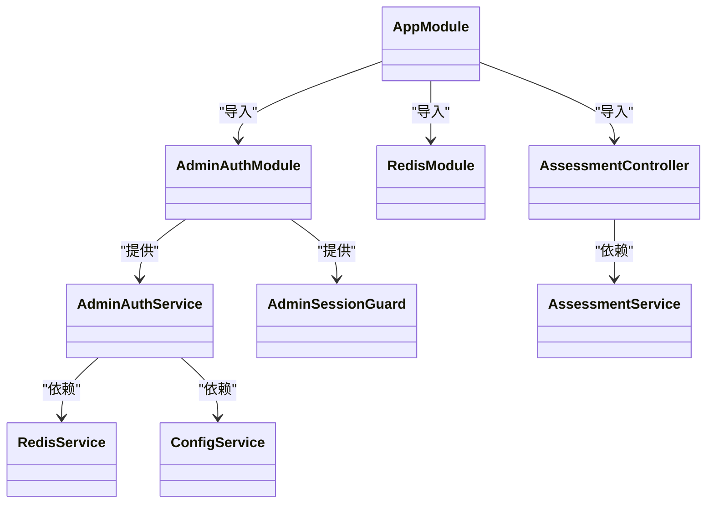
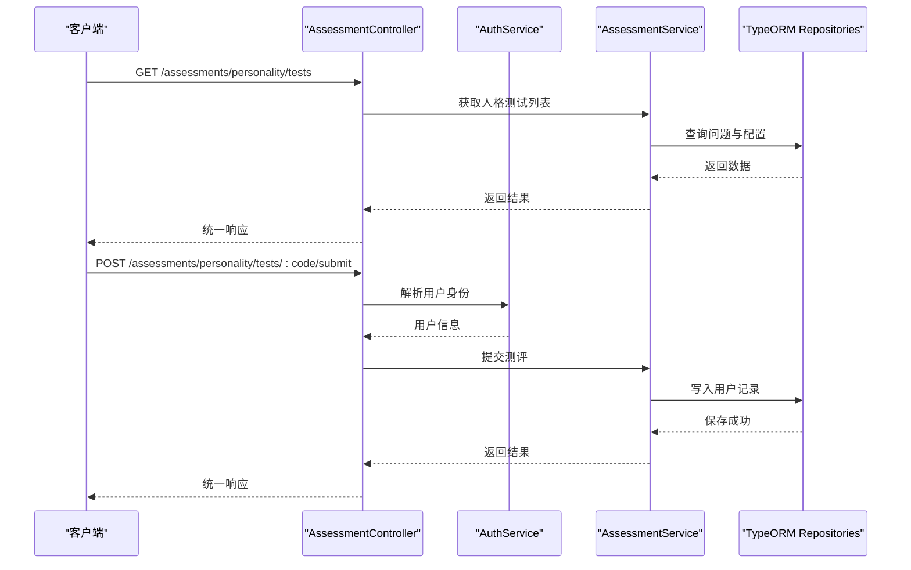
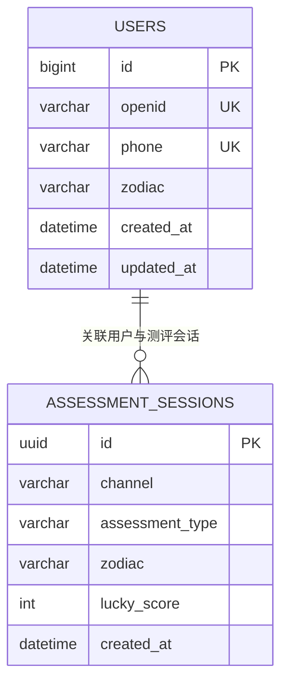
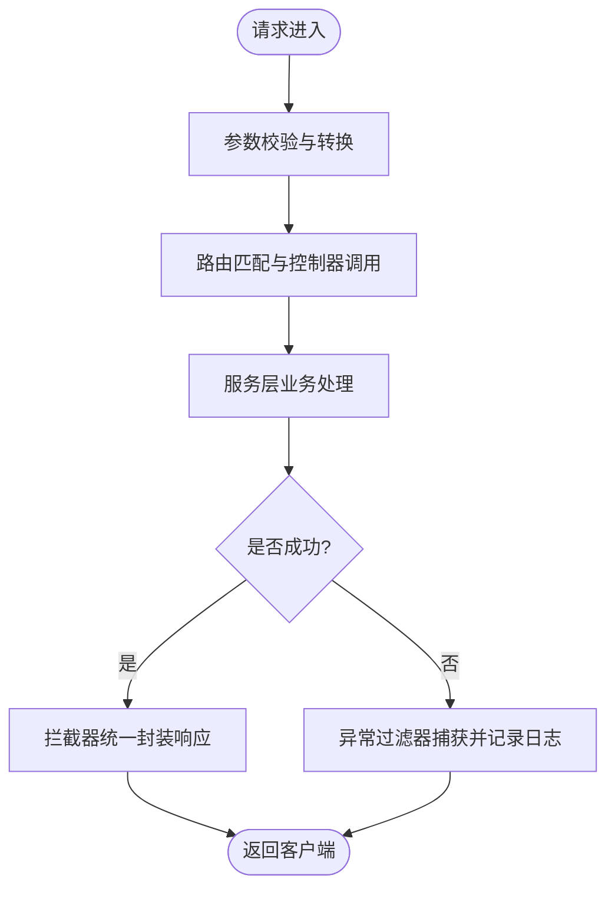
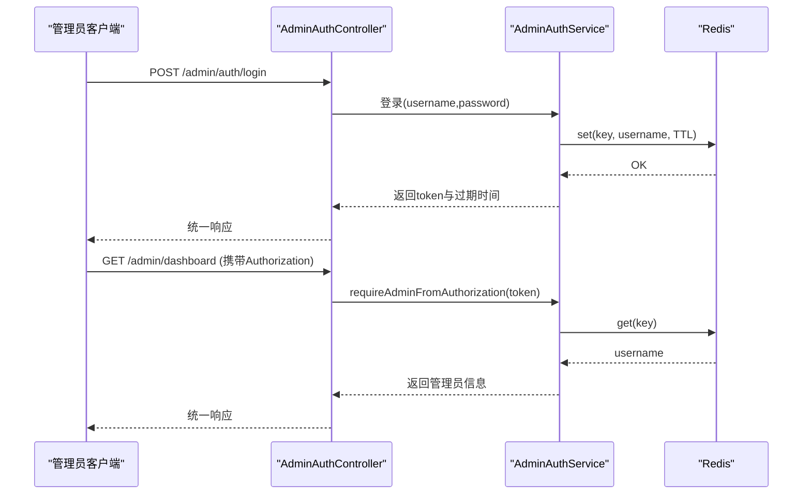
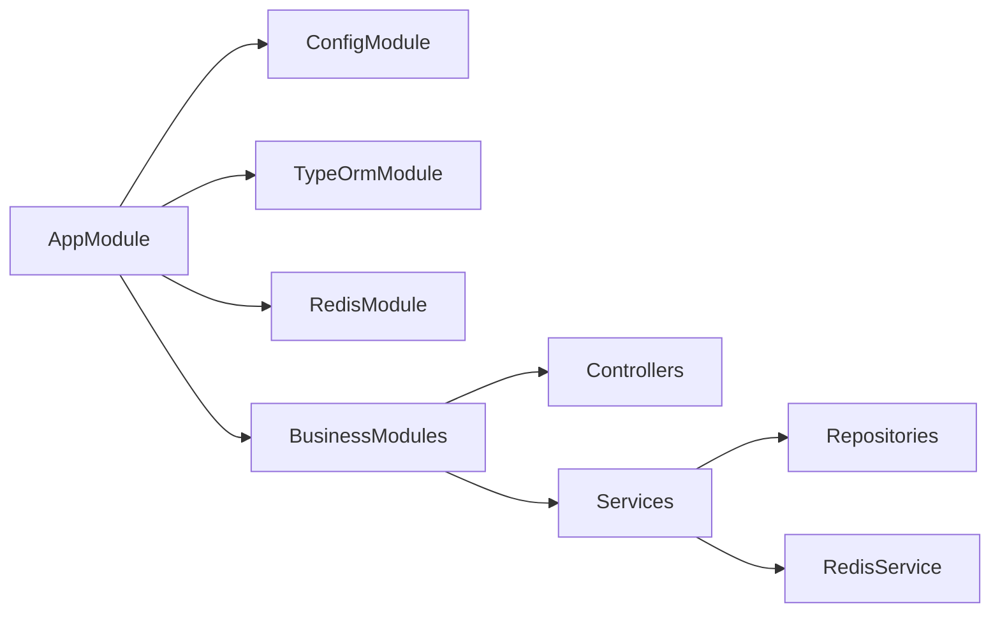

# 后端开发

<cite>
**本文引用的文件**
- [services/api/src/main.ts](file://services/api/src/main.ts)
- [services/api/src/app.module.ts](file://services/api/src/app.module.ts)
- [services/api/src/admin-auth/admin-auth.module.ts](file://services/api/src/admin-auth/admin-auth.module.ts)
- [services/api/src/admin-auth/admin-auth.service.ts](file://services/api/src/admin-auth/admin-auth.service.ts)
- [services/api/src/admin-auth/admin-session.guard.ts](file://services/api/src/admin-auth/admin-session.guard.ts)
- [services/api/src/common/common.module.ts](file://services/api/src/common/common.module.ts)
- [services/api/src/common/filters/http-exception.filter.ts](file://services/api/src/common/filters/http-exception.filter.ts)
- [services/api/src/common/interceptors/transform.interceptor.ts](file://services/api/src/common/interceptors/transform.interceptor.ts)
- [services/api/src/redis/redis.module.ts](file://services/api/src/redis/redis.module.ts)
- [services/api/src/database/data-source.ts](file://services/api/src/database/data-source.ts)
- [services/api/src/database/entities/user.entity.ts](file://services/api/src/database/entities/user.entity.ts)
- [services/api/src/database/entities/assessment-session.entity.ts](file://services/api/src/database/entities/assessment-session.entity.ts)
- [services/api/src/assessment/assessment.controller.ts](file://services/api/src/assessment/assessment.controller.ts)
- [services/api/src/assessment/assessment.service.ts](file://services/api/src/assessment/assessment.service.ts)
- [services/api/src/common/audit.service.ts](file://services/api/src/common/audit.service.ts)
</cite>

## 目录
1. [简介](#简介)
2. [项目结构](#项目结构)
3. [核心组件](#核心组件)
4. [架构总览](#架构总览)
5. [详细组件分析](#详细组件分析)
6. [依赖分析](#依赖分析)
7. [性能考虑](#性能考虑)
8. [故障排查指南](#故障排查指南)
9. [结论](#结论)
10. [附录](#附录)

## 简介
本技术指南面向 Fortune Hub 后端开发，围绕 NestJS 模块化架构、控制器与服务的职责划分、依赖注入、TypeORM 实体与关系映射、中间件与拦截器、全局异常处理、数据库连接与迁移、Redis 缓存、API 版本管理、参数校验、权限控制、日志审计等企业级能力进行系统化讲解，并提供代码组织规范、错误处理模式与性能监控最佳实践，帮助团队构建稳定、可维护、可扩展的后端服务。

## 项目结构
后端采用单体微服务形态（NestJS 应用），通过模块化拆分业务域，统一在入口应用中装配。核心目录与职责如下：
- 入口与全局配置：main.ts 负责应用启动、全局中间件/拦截器/管道注册、CORS、全局前缀设置；AppModule 统一装配各业务模块与 TypeORM、Redis。
- 业务模块：如 assessment、auth、users、orders、posters 等，每个模块包含 controller/service/dto/module 文件，遵循“按功能域”组织。
- 基础设施：common 模块提供通用服务（审计、图片生成、海报渲染、第三方图像服务）、filters/interceptors 提供横切能力；database 模块集中管理实体与数据源。
- 缓存：redis 模块提供全局 Redis 连接与服务封装。

图表来源
- [services/api/src/main.ts:1-74](file://services/api/src/main.ts#L1-L74)
- [services/api/src/app.module.ts:1-145](file://services/api/src/app.module.ts#L1-L145)

章节来源
- [services/api/src/main.ts:1-74](file://services/api/src/main.ts#L1-L74)
- [services/api/src/app.module.ts:1-145](file://services/api/src/app.module.ts#L1-L145)

## 核心组件
- 应用启动与全局配置
  - 设置全局前缀、CORS、全局验证管道、全局异常过滤器与响应拦截器。
  - CORS 支持本地开发与生产白名单，支持 Credentials 与常用方法/头。
- 模块装配
  - 使用 ConfigModule 全局注入；TypeOrmModule.forRootAsync 注入 MySQL 配置与实体列表；RedisModule 提供全局 Redis 客户端。
  - 各业务模块以 Feature Module 形式导入，控制器与服务解耦。
- 中间件/拦截器/过滤器
  - TransformInterceptor 统一响应包装；HttpExceptionFilter 统一错误响应与日志记录。
- 缓存与会话
  - RedisModule 提供 Redis 客户端与服务；AdminAuthService 使用 Redis 存储管理员会话令牌与 TTL。
- 数据持久化
  - TypeORM DataSource 集中配置实体与迁移路径；AppModule 中 TypeOrmModule.forRootAsync 读取环境变量并加载实体与迁移。

章节来源
- [services/api/src/main.ts:1-74](file://services/api/src/main.ts#L1-L74)
- [services/api/src/app.module.ts:1-145](file://services/api/src/app.module.ts#L1-L145)
- [services/api/src/common/interceptors/transform.interceptor.ts:1-59](file://services/api/src/common/interceptors/transform.interceptor.ts#L1-L59)
- [services/api/src/common/filters/http-exception.filter.ts:1-92](file://services/api/src/common/filters/http-exception.filter.ts#L1-L92)
- [services/api/src/redis/redis.module.ts:1-32](file://services/api/src/redis/redis.module.ts#L1-L32)
- [services/api/src/admin-auth/admin-auth.service.ts:1-119](file://services/api/src/admin-auth/admin-auth.service.ts#L1-L119)
- [services/api/src/database/data-source.ts:1-73](file://services/api/src/database/data-source.ts#L1-L73)

## 架构总览
下图展示应用启动、请求处理与数据访问的关键交互：

图表来源
- [services/api/src/main.ts:1-74](file://services/api/src/main.ts#L1-L74)
- [services/api/src/assessment/assessment.controller.ts:1-39](file://services/api/src/assessment/assessment.controller.ts#L1-L39)
- [services/api/src/assessment/assessment.service.ts:1-806](file://services/api/src/assessment/assessment.service.ts#L1-L806)
- [services/api/src/database/data-source.ts:1-73](file://services/api/src/database/data-source.ts#L1-L73)
- [services/api/src/redis/redis.module.ts:1-32](file://services/api/src/redis/redis.module.ts#L1-L32)

## 详细组件分析

### 模块化与依赖注入
- 模块职责
  - AppModule：集中装配 Config、TypeORM、Redis 与所有业务模块。
  - AdminAuthModule：提供管理员认证、会话守卫与服务。
  - CommonModule：提供审计、图片生成、海报渲染等跨模块通用能力。
- 依赖注入
  - 服务通过构造函数注入依赖（如 RedisService、ConfigService、TypeORM Repositories）。
  - 守卫在请求生命周期早期解析管理员身份，注入到请求对象，后续控制器可直接使用。

图表来源
- [services/api/src/app.module.ts:1-145](file://services/api/src/app.module.ts#L1-L145)
- [services/api/src/admin-auth/admin-auth.module.ts:1-14](file://services/api/src/admin-auth/admin-auth.module.ts#L1-L14)
- [services/api/src/admin-auth/admin-auth.service.ts:1-119](file://services/api/src/admin-auth/admin-auth.service.ts#L1-L119)
- [services/api/src/admin-auth/admin-session.guard.ts:1-25](file://services/api/src/admin-auth/admin-session.guard.ts#L1-L25)
- [services/api/src/redis/redis.module.ts:1-32](file://services/api/src/redis/redis.module.ts#L1-L32)

章节来源
- [services/api/src/app.module.ts:1-145](file://services/api/src/app.module.ts#L1-L145)
- [services/api/src/admin-auth/admin-auth.module.ts:1-14](file://services/api/src/admin-auth/admin-auth.module.ts#L1-L14)
- [services/api/src/admin-auth/admin-auth.service.ts:1-119](file://services/api/src/admin-auth/admin-auth.service.ts#L1-L119)
- [services/api/src/admin-auth/admin-session.guard.ts:1-25](file://services/api/src/admin-auth/admin-session.guard.ts#L1-L25)
- [services/api/src/redis/redis.module.ts:1-32](file://services/api/src/redis/redis.module.ts#L1-L32)

### 控制器与服务
- 控制器：负责路由、参数解析与调用服务。例如测评控制器根据授权头解析用户并调用服务层。
- 服务：承载业务逻辑，使用 TypeORM Repository 访问数据库，必要时使用 Redis 缓存或会话存储。

图表来源
- [services/api/src/assessment/assessment.controller.ts:1-39](file://services/api/src/assessment/assessment.controller.ts#L1-L39)
- [services/api/src/assessment/assessment.service.ts:1-806](file://services/api/src/assessment/assessment.service.ts#L1-L806)

章节来源
- [services/api/src/assessment/assessment.controller.ts:1-39](file://services/api/src/assessment/assessment.controller.ts#L1-L39)
- [services/api/src/assessment/assessment.service.ts:1-806](file://services/api/src/assessment/assessment.service.ts#L1-L806)

### TypeORM 实体与关系映射
- 实体设计
  - 用户实体包含唯一索引（openID、phone）、基础字段与时间戳列，体现用户主数据模型。
  - 测评会话实体包含 UUID 主键、渠道、类型、星座、幸运分数与创建时间，支撑测评会话追踪。
- 关系映射
  - 服务层通过 @InjectRepository 注入对应 Repository，基于实体定义进行查询与写入。
  - 数据源集中配置实体与迁移路径，支持开发/生产环境同步与迁移运行策略。

图表来源
- [services/api/src/database/entities/user.entity.ts:1-75](file://services/api/src/database/entities/user.entity.ts#L1-L75)
- [services/api/src/database/entities/assessment-session.entity.ts:1-23](file://services/api/src/database/entities/assessment-session.entity.ts#L1-L23)

章节来源
- [services/api/src/database/entities/user.entity.ts:1-75](file://services/api/src/database/entities/user.entity.ts#L1-L75)
- [services/api/src/database/entities/assessment-session.entity.ts:1-23](file://services/api/src/database/entities/assessment-session.entity.ts#L1-L23)
- [services/api/src/database/data-source.ts:1-73](file://services/api/src/database/data-source.ts#L1-L73)

### 中间件、拦截器、过滤器与全局异常处理
- 响应拦截器
  - TransformInterceptor 对非手动响应的数据进行统一包装，避免重复样板代码。
- 异常过滤器
  - HttpExceptionFilter 捕获所有异常，区分 5xx 错误并记录日志，输出统一错误体。
- 全局配置
  - main.ts 中注册全局拦截器、过滤器与 ValidationPipe，开启白名单与隐式转换。

图表来源
- [services/api/src/common/interceptors/transform.interceptor.ts:1-59](file://services/api/src/common/interceptors/transform.interceptor.ts#L1-L59)
- [services/api/src/common/filters/http-exception.filter.ts:1-92](file://services/api/src/common/filters/http-exception.filter.ts#L1-L92)
- [services/api/src/main.ts:1-74](file://services/api/src/main.ts#L1-L74)

章节来源
- [services/api/src/common/interceptors/transform.interceptor.ts:1-59](file://services/api/src/common/interceptors/transform.interceptor.ts#L1-L59)
- [services/api/src/common/filters/http-exception.filter.ts:1-92](file://services/api/src/common/filters/http-exception.filter.ts#L1-L92)
- [services/api/src/main.ts:1-74](file://services/api/src/main.ts#L1-L74)

### 缓存策略（Redis）
- 连接与配置
  - RedisModule 提供全局 Redis 客户端，支持延迟连接、重试策略与连接错误恢复。
- 会话管理
  - AdminAuthService 使用 Redis 存储管理员会话令牌与 TTL，登录成功后写入并返回 token；守卫从请求头提取 Bearer Token 并校验有效性。

图表来源
- [services/api/src/redis/redis.module.ts:1-32](file://services/api/src/redis/redis.module.ts#L1-L32)
- [services/api/src/admin-auth/admin-auth.service.ts:1-119](file://services/api/src/admin-auth/admin-auth.service.ts#L1-L119)
- [services/api/src/admin-auth/admin-session.guard.ts:1-25](file://services/api/src/admin-auth/admin-session.guard.ts#L1-L25)

章节来源
- [services/api/src/redis/redis.module.ts:1-32](file://services/api/src/redis/redis.module.ts#L1-L32)
- [services/api/src/admin-auth/admin-auth.service.ts:1-119](file://services/api/src/admin-auth/admin-auth.service.ts#L1-L119)
- [services/api/src/admin-auth/admin-session.guard.ts:1-25](file://services/api/src/admin-auth/admin-session.guard.ts#L1-L25)

### 数据库事务管理与连接池
- 连接与迁移
  - TypeOrmModule.forRootAsync 通过 ConfigService 读取 MySQL 连接参数，加载实体与迁移脚本；支持运行迁移与同步开关。
- 事务与并发
  - 在需要一致性保障的场景（如订单支付回调、库存扣减），可在服务层使用 EntityManager/TransactionRunner 包裹业务逻辑，确保原子性。
- 连接池
  - TypeORM 默认使用连接池；可通过环境变量或配置项调整最大连接数、空闲超时等参数，结合负载与数据库规格评估。

章节来源
- [services/api/src/app.module.ts:67-117](file://services/api/src/app.module.ts#L67-L117)
- [services/api/src/database/data-source.ts:32-72](file://services/api/src/database/data-source.ts#L32-L72)

### API 版本管理与参数校验
- 版本管理
  - main.ts 设置全局前缀为 api/v1，便于未来扩展 v2。
- 参数校验
  - 全局 ValidationPipe 启用白名单与隐式转换，减少脏数据进入业务层。

章节来源
- [services/api/src/main.ts:32-43](file://services/api/src/main.ts#L32-L43)

### 权限控制与审计
- 权限控制
  - AdminSessionGuard 从 Authorization 头解析 Bearer Token 并校验管理员身份，将管理员信息注入请求对象，后续控制器可直接使用。
- 审计
  - AuditService 提供统一审计写入接口，记录操作者、动作、资源与载荷，便于合规与溯源。

章节来源
- [services/api/src/admin-auth/admin-session.guard.ts:1-25](file://services/api/src/admin-auth/admin-session.guard.ts#L1-L25)
- [services/api/src/common/audit.service.ts:1-35](file://services/api/src/common/audit.service.ts#L1-L35)

### 日志与健康检查
- 日志
  - HttpExceptionFilter 对 5xx 错误进行日志记录，便于定位问题。
- 健康检查
  - AppModule 导入 HealthController，提供健康探针端点。

章节来源
- [services/api/src/common/filters/http-exception.filter.ts:32-37](file://services/api/src/common/filters/http-exception.filter.ts#L32-L37)
- [services/api/src/app.module.ts:142](file://services/api/src/app.module.ts#L142)

## 依赖分析
- 模块耦合
  - AppModule 作为根模块，聚合 Config、TypeORM、Redis 与各业务模块；业务模块之间低耦合，通过服务接口交互。
- 外部依赖
  - MySQL（TypeORM）、Redis（ioredis）、NestJS 核心生态（Config、Validation、Common）。
- 循环依赖
  - 当前结构通过模块化与服务注入避免循环依赖；若新增模块需谨慎处理双向依赖。

图表来源
- [services/api/src/app.module.ts:1-145](file://services/api/src/app.module.ts#L1-L145)

章节来源
- [services/api/src/app.module.ts:1-145](file://services/api/src/app.module.ts#L1-L145)

## 性能考虑
- 响应统一包装与序列化
  - 使用 TransformInterceptor 减少重复封装，提升一致性与可读性。
- 参数校验与隐式转换
  - ValidationPipe 在进入业务层前完成数据清洗，降低服务层分支判断成本。
- 缓存命中与降级
  - Redis 用于热点数据与会话存储，建议对高频读取接口增加缓存层，必要时引入二级缓存与降级策略。
- 数据库查询优化
  - 为高频查询字段建立合适索引（如用户 openID、phone、zodiac），避免全表扫描。
  - 使用分页与投影查询，限制返回字段大小。
- 连接池与迁移
  - 结合业务峰值合理配置连接池参数；迁移阶段避免大事务与长锁。
- 监控与告警
  - 建议接入链路追踪与指标采集，结合日志与异常过滤器输出的关键信息进行告警。

## 故障排查指南
- 统一错误响应
  - HttpExceptionFilter 将异常标准化输出，5xx 错误会记录堆栈，便于快速定位。
- CORS 问题
  - 检查 main.ts 中 CORS 白名单与本地开发域名判定逻辑，确认请求 Origin 是否在允许范围内。
- Redis 连接异常
  - 查看 RedisModule 的重试策略与连接错误恢复逻辑，确认主机、端口与网络连通性。
- 数据库连接失败
  - 检查 TypeOrmModule.forRootAsync 的环境变量与迁移配置，确认数据库可达与凭据正确。
- 参数校验失败
  - 确认 DTO 字段与 ValidationPipe 配置一致，关注白名单与隐式转换行为。

章节来源
- [services/api/src/common/filters/http-exception.filter.ts:18-92](file://services/api/src/common/filters/http-exception.filter.ts#L18-L92)
- [services/api/src/main.ts:44-59](file://services/api/src/main.ts#L44-L59)
- [services/api/src/redis/redis.module.ts:10-25](file://services/api/src/redis/redis.module.ts#L10-L25)
- [services/api/src/app.module.ts:67-117](file://services/api/src/app.module.ts#L67-L117)

## 结论
本指南系统梳理了 Fortune Hub 后端在 NestJS 模块化、TypeORM 实体设计、缓存与会话、全局异常与响应包装、权限与审计等方面的实现要点与最佳实践。通过模块化拆分、统一的横切能力与严格的参数校验，可显著提升系统的稳定性与可维护性。建议在后续迭代中持续完善监控与告警体系、数据库索引与查询优化，并在高并发场景下进一步细化缓存策略与连接池配置。

## 附录
- 代码组织规范
  - 按功能域划分模块，控制器仅负责路由与参数解析，服务承载业务逻辑，实体与仓库分离。
  - DTO 与常量集中管理，避免魔法字符串与散落配置。
- 错误处理模式
  - 统一使用 HttpExceptionFilter 输出标准错误体，5xx 错误记录日志并上报。
- 性能监控
  - 建议引入链路追踪与指标采集，结合日志与异常过滤器输出的关键信息进行告警与分析。