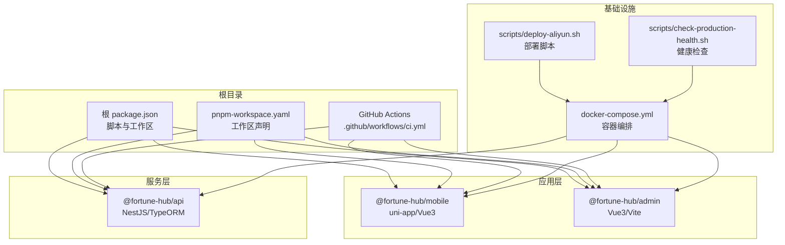
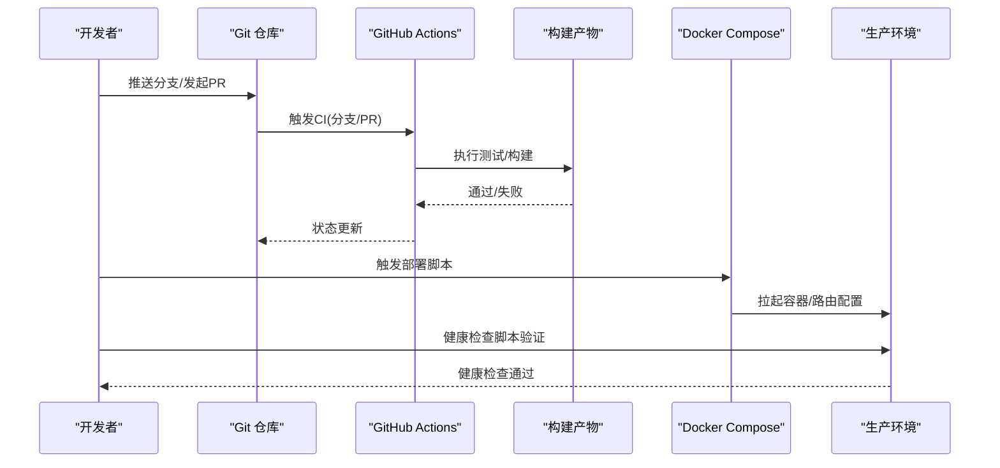
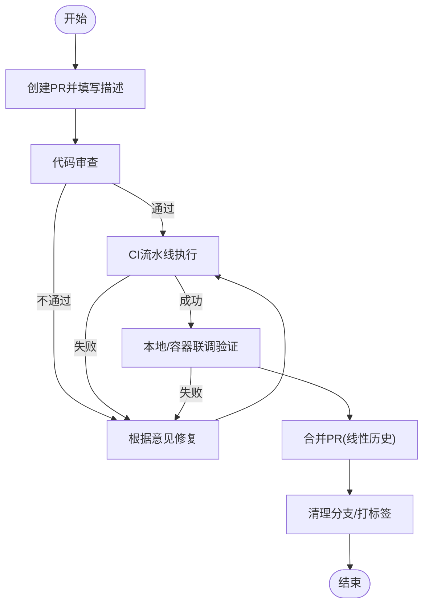
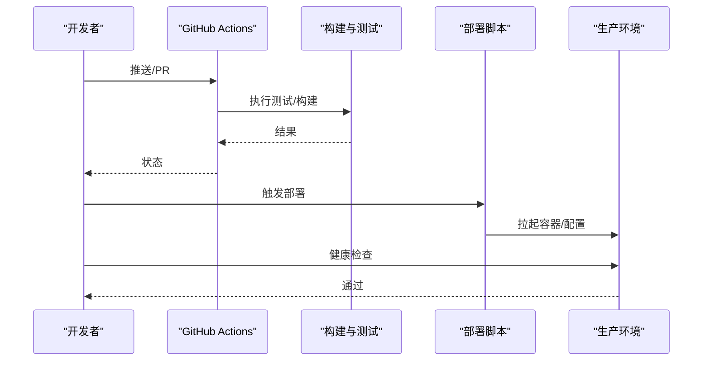
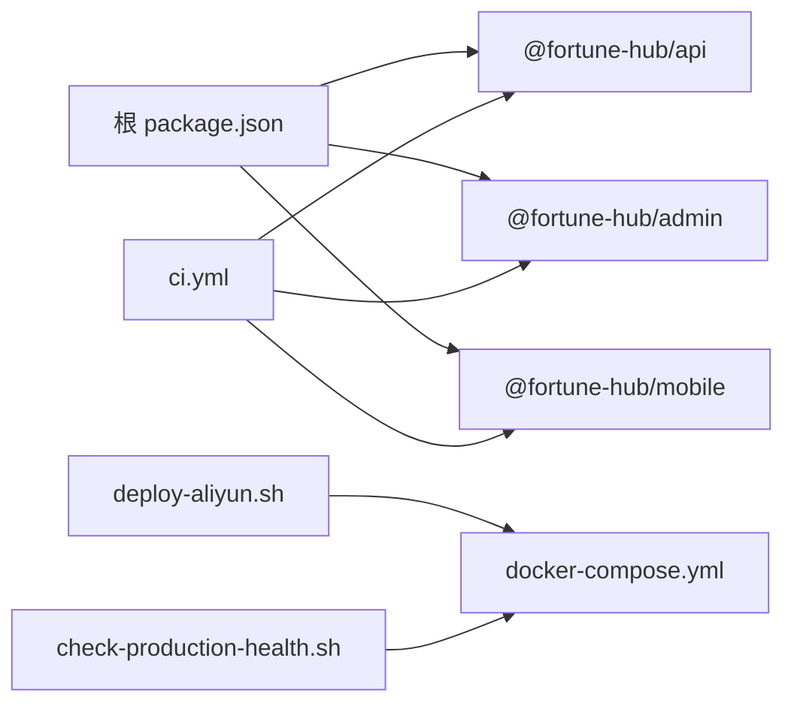

# Git工作流程

<cite>
**本文引用的文件**
- [ci.yml](file://.github/workflows/ci.yml)
- [README.md](file://README.md)
- [REVIEW.md](file://REVIEW.md)
- [package.json](file://package.json)
- [pnpm-workspace.yaml](file://pnpm-workspace.yaml)
- [docker-compose.yml](file://docker-compose.yml)
- [deploy-aliyun.sh](file://scripts/deploy-aliyun.sh)
- [check-production-health.sh](file://scripts/check-production-health.sh)
- [services/api/package.json](file://services/api/package.json)
- [apps/admin/package.json](file://apps/admin/package.json)
- [apps/mobile/package.json](file://apps/mobile/package.json)
- [1761350000000-ProductionOpsPolish.ts](file://services/api/src/database/migrations/1761350000000-ProductionOpsPolish.ts)
</cite>

## 目录
1. [简介](#简介)
2. [项目结构](#项目结构)
3. [核心组件](#核心组件)
4. [架构总览](#架构总览)
5. [详细组件分析](#详细组件分析)
6. [依赖关系分析](#依赖关系分析)
7. [性能考虑](#性能考虑)
8. [故障排查指南](#故障排查指南)
9. [结论](#结论)
10. [附录](#附录)

## 简介
本规范面向 Fortune Hub 项目，制定标准化的 Git 工作流程，涵盖分支策略、提交规范、Pull Request 流程、版本标签管理、冲突解决、以及 CI/CD 集成。目标是提升协作效率、保证代码质量与发布一致性，并为后续扩展与规模化团队协作奠定基础。

## 项目结构
- 采用 pnpm monorepo，根目录通过工作区配置统一管理多端应用与服务。
- 根脚本统一编排各子包的开发、构建与测试，便于 CI 与本地一致化执行。
- 仓库已内置基础 CI 工作流，覆盖 API 测试、构建与移动端类型检查/构建。

**图表来源**
- [package.json:1-23](file://package.json#L1-L23)
- [pnpm-workspace.yaml:1-4](file://pnpm-workspace.yaml#L1-L4)
- [.github/workflows/ci.yml:1-46](file://.github/workflows/ci.yml#L1-L46)
- [docker-compose.yml:1-170](file://docker-compose.yml#L1-L170)
- [scripts/deploy-aliyun.sh:1-199](file://scripts/deploy-aliyun.sh#L1-L199)
- [scripts/check-production-health.sh:1-86](file://scripts/check-production-health.sh#L1-L86)

**章节来源**
- [package.json:1-23](file://package.json#L1-L23)
- [pnpm-workspace.yaml:1-4](file://pnpm-workspace.yaml#L1-L4)
- [README.md:18-37](file://README.md#L18-L37)

## 核心组件
- 分支与保护策略：以 main 为主保护分支；develop 用于集成；codex/** 作为特性分支命名空间；hotfix 用于紧急修复。
- 提交规范：采用约定式提交，明确类型、作用域与简短描述；在 PR 描述中补充变更动机、影响范围与回归要点。
- PR 流程：强制双人审查（含至少一名资深成员）、通过 CI、通过本地/容器联调验证；合并前确保无冲突。
- 版本与标签：语义化版本，主版本从 v0.1.0 起步；发布说明与迁移提示在变更日志中维护。
- 冲突解决：预防（小步提交、频繁同步）、解决（工具化合并/变基、三方对比）、合并（squash 合并，保留线性历史）。
- CI/CD：GitHub Actions 触发策略覆盖 push 与 pull_request；构建产物与测试结果作为合并前置条件；部署脚本与健康检查保障线上稳定。

**章节来源**
- [.github/workflows/ci.yml:3-9](file://.github/workflows/ci.yml#L3-L9)
- [README.md:184-196](file://README.md#L184-L196)
- [scripts/deploy-aliyun.sh:49-61](file://scripts/deploy-aliyun.sh#L49-L61)

## 架构总览
下图展示从开发者本地到 CI、再到部署与健康检查的整体流程。

**图表来源**
- [.github/workflows/ci.yml:12-46](file://.github/workflows/ci.yml#L12-L46)
- [scripts/deploy-aliyun.sh:100-114](file://scripts/deploy-aliyun.sh#L100-L114)
- [scripts/check-production-health.sh:74-83](file://scripts/check-production-health.sh#L74-L83)

## 详细组件分析

### 分支策略与保护
- 主分支保护
  - main 为唯一受保护主干，禁止直接推送，强制通过 PR 合并。
  - develop 作为集成分支，合并前需通过 CI 与审查。
- 特性分支
  - 命名：feature/模块名/任务简述，例如 feature/auth/login-flow。
  - 同步：定期 rebase develop，避免长期分支漂移。
- Hotfix 分支
  - 命名：hotfix/问题简述，从 main 切出，修复后同时合并回 main 与 develop，并打补丁标签。
- 保护规则建议
  - 代码审查要求：PR 至少 1 位资深成员批准。
  - CI 必须通过：测试、构建、类型检查全部通过。
  - 线性历史：合并策略采用 squash，保持清晰提交历史。

**章节来源**
- [.github/workflows/ci.yml:3-9](file://.github/workflows/ci.yml#L3-L9)
- [scripts/deploy-aliyun.sh:100-108](file://scripts/deploy-aliyun.sh#L100-L108)

### 提交规范
- 提交类型
  - feat：新增功能
  - fix：缺陷修复
  - docs：文档更新
  - style：不影响逻辑的样式调整
  - refactor：重构（既不修复错误也不新增功能）
  - perf：性能优化
  - test：新增或修改测试
  - chore：构建流程、依赖管理等改动
- 提交格式
  - <type>(<scope>): <subject>
  - 例如：feat(api): 新增用户认证接口
- PR 描述
  - 背景与动机、变更范围、影响面、测试验证方式、回滚预案、相关 Issue/PR 链接。

**章节来源**
- [README.md:184-196](file://README.md#L184-L196)

### Pull Request 流程
- 创建 PR：选择合适基线分支，填写描述与变更说明。
- 代码审查：至少 1 人批准；复杂变更建议 2 人以上。
- CI 与测试：确保 API 测试、构建、类型检查通过；移动端构建与小程序构建通过。
- 本地联调：在容器环境中验证端到端功能。
- 合并条件：CI 通过、审查通过、无冲突、满足线性历史要求。
- 合并后：删除特性分支，必要时打标签并更新发布说明。

**图表来源**
- [.github/workflows/ci.yml:12-46](file://.github/workflows/ci.yml#L12-L46)
- [scripts/deploy-aliyun.sh:100-114](file://scripts/deploy-aliyun.sh#L100-L114)

**章节来源**
- [.github/workflows/ci.yml:12-46](file://.github/workflows/ci.yml#L12-L46)
- [scripts/deploy-aliyun.sh:100-114](file://scripts/deploy-aliyun.sh#L100-L114)

### 版本标签管理
- 语义化版本
  - v0.1.0 作为首个发布版本，定位 monorepo 初始化完成与三端联调可运行。
  - 后续遵循主版本.次版本.修订号，结合变更类型决定版本号递增。
- 发布说明
  - 在 PR 描述中维护“变更摘要”与“迁移提示”，发布时汇总为 CHANGELOG。
- 回滚策略
  - hotfix 分支从 main 切出，修复后回并 main 与 develop，并打补丁标签。
  - 生产回滚优先采用镜像版本回滚，必要时配合数据库迁移回滚。

**章节来源**
- [README.md:198-206](file://README.md#L198-L206)
- [scripts/deploy-aliyun.sh:100-108](file://scripts/deploy-aliyun.sh#L100-L108)

### 冲突解决流程
- 预防
  - 小步提交、频繁同步 develop；避免跨模块大范围长期分支。
- 解决
  - 使用三方合并工具进行对比与合并；逐文件确认差异。
- 合并
  - 优先使用 rebase 保持线性历史；合并时采用 squash，提交信息清晰可追溯。

**章节来源**
- [scripts/deploy-aliyun.sh:100-108](file://scripts/deploy-aliyun.sh#L100-L108)

### CI/CD 集成规范
- 触发条件
  - push 到 main、develop、codex/**；pull_request。
- 步骤
  - 安装依赖（冻结锁文件）、API 测试、API 构建、管理端构建、移动端类型检查、移动端小程序构建。
- 部署
  - 通过部署脚本加载环境变量，渲染 Nginx 配置，拉起容器。
- 健康检查
  - 健康检查脚本探测 API、文件服务、移动端 H5、管理端，确保服务可用。

**图表来源**
- [.github/workflows/ci.yml:12-46](file://.github/workflows/ci.yml#L12-L46)
- [scripts/deploy-aliyun.sh:100-114](file://scripts/deploy-aliyun.sh#L100-L114)
- [scripts/check-production-health.sh:74-83](file://scripts/check-production-health.sh#L74-L83)

**章节来源**
- [.github/workflows/ci.yml:3-9](file://.github/workflows/ci.yml#L3-L9)
- [.github/workflows/ci.yml:12-46](file://.github/workflows/ci.yml#L12-L46)
- [scripts/deploy-aliyun.sh:100-114](file://scripts/deploy-aliyun.sh#L100-L114)
- [scripts/check-production-health.sh:74-83](file://scripts/check-production-health.sh#L74-L83)

## 依赖关系分析
- 工作区与脚本
  - 根 package.json 统一脚本，子包通过过滤器执行各自任务。
  - pnpm-workspace.yaml 声明工作区，确保 monorepo 依赖解析与脚本执行一致。
- CI 与构建
  - CI 工作流并行执行 API 测试、构建与移动端检查，减少整体耗时。
- 部署与健康检查
  - docker-compose.yml 统一编排服务，部署脚本负责渲染 Nginx 配置与容器编排。
  - 健康检查脚本对关键端点进行探测，保障上线质量。

**图表来源**
- [package.json:6-21](file://package.json#L6-L21)
- [pnpm-workspace.yaml:1-4](file://pnpm-workspace.yaml#L1-L4)
- [.github/workflows/ci.yml:32-45](file://.github/workflows/ci.yml#L32-L45)
- [scripts/deploy-aliyun.sh:100-114](file://scripts/deploy-aliyun.sh#L100-L114)
- [scripts/check-production-health.sh:74-83](file://scripts/check-production-health.sh#L74-L83)

**章节来源**
- [package.json:6-21](file://package.json#L6-L21)
- [pnpm-workspace.yaml:1-4](file://pnpm-workspace.yaml#L1-L4)
- [.github/workflows/ci.yml:32-45](file://.github/workflows/ci.yml#L32-L45)

## 性能考虑
- CI 并行化：API 测试、构建与移动端检查并行执行，缩短流水线时间。
- 依赖锁定：CI 与部署均使用冻结锁文件，确保构建可复现，降低供应链风险。
- 健康检查：对关键服务进行探测，快速发现部署异常，减少故障恢复时间。

**章节来源**
- [.github/workflows/ci.yml:24-30](file://.github/workflows/ci.yml#L24-L30)
- [scripts/deploy-aliyun.sh:49-61](file://scripts/deploy-aliyun.sh#L49-L61)

## 故障排查指南
- CI 失败
  - 检查测试与构建日志，确认是否因类型检查或构建错误导致。
  - 确认依赖安装使用冻结锁文件，避免版本漂移。
- 部署失败
  - 校验环境变量，确保生产环境禁用弱默认密码与模拟模式。
  - 检查 Nginx 配置渲染与证书文件是否存在。
- 健康检查失败
  - 使用健康检查脚本逐项探测，定位具体服务异常。
  - 关注容器健康检查配置与依赖服务状态。

**章节来源**
- [.github/workflows/ci.yml:24-30](file://.github/workflows/ci.yml#L24-L30)
- [scripts/deploy-aliyun.sh:49-61](file://scripts/deploy-aliyun.sh#L49-L61)
- [scripts/check-production-health.sh:26-72](file://scripts/check-production-health.sh#L26-L72)

## 结论
本规范以现有仓库实践为基础，结合约定式提交、严格的 CI/CD 与部署流程，形成可执行的工作流标准。建议在团队内推广并持续演进，逐步引入更细粒度的测试与安全扫描，以支撑更大规模的交付节奏。

## 附录
- 数据库迁移参考
  - 迁移文件示例展示了如何安全地增加列与索引，建议在 PR 中同步更新迁移脚本并记录变更说明。

**章节来源**
- [1761350000000-ProductionOpsPolish.ts:12-69](file://services/api/src/database/migrations/1761350000000-ProductionOpsPolish.ts#L12-L69)