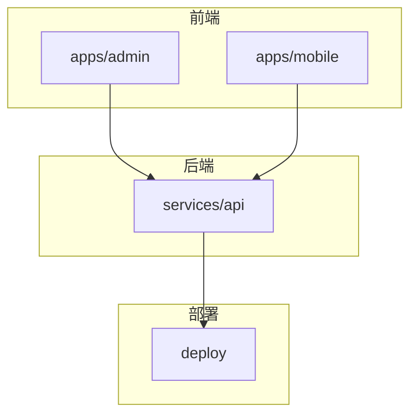
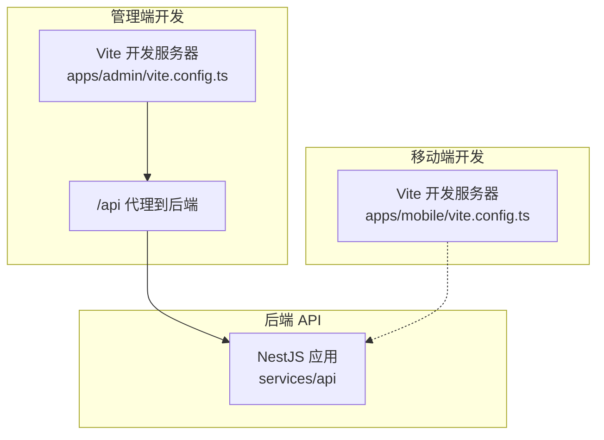
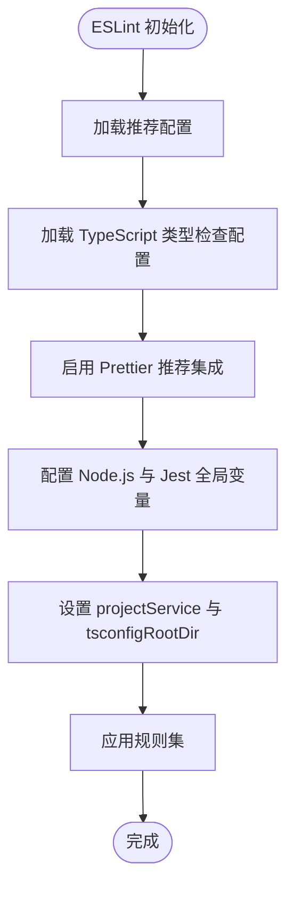
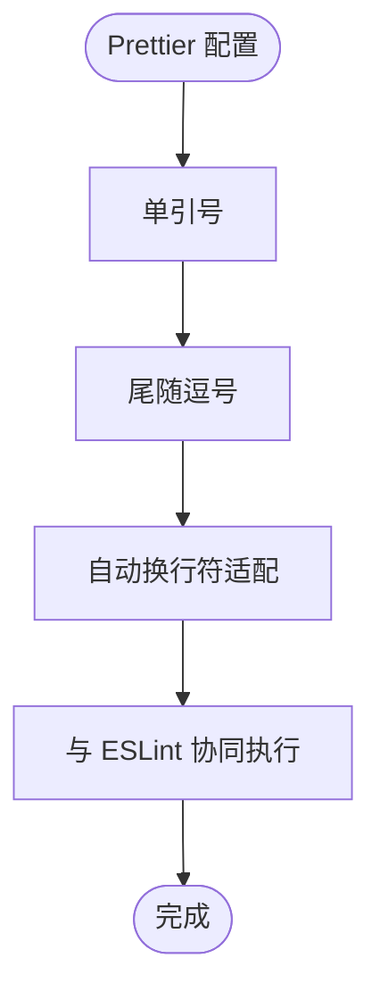
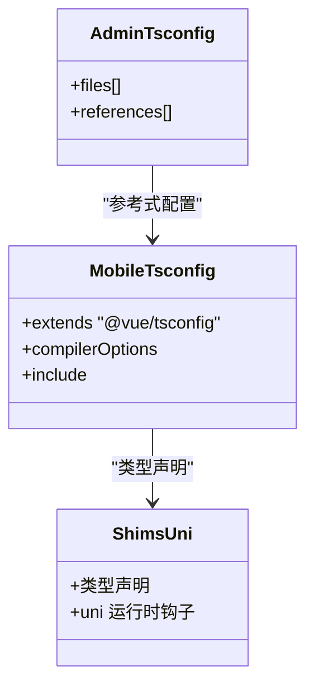
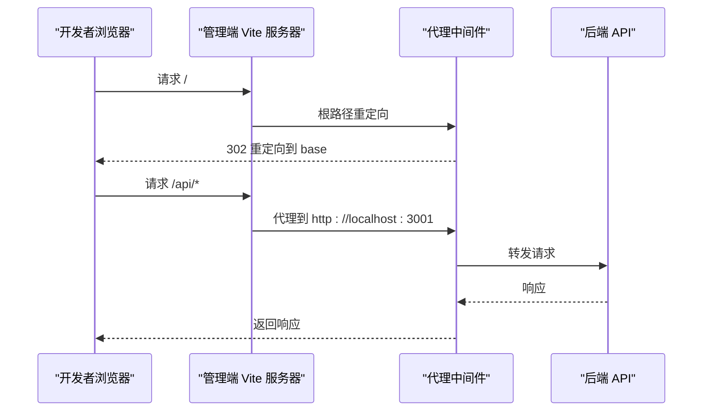
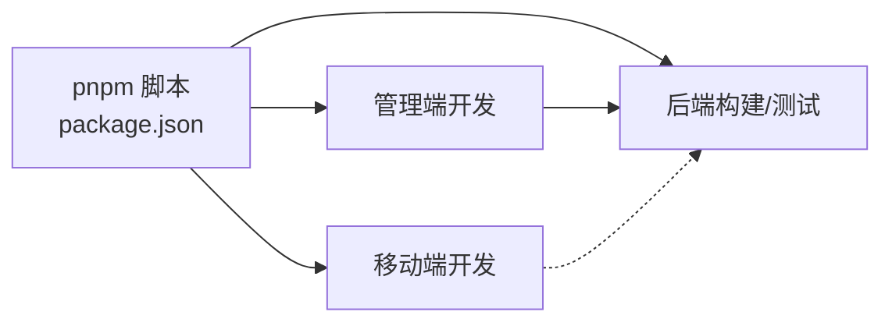

# 代码质量标准

<cite>
**本文引用的文件**
- [package.json](file://package.json)
- [REVIEW.md](file://REVIEW.md)
- [.prettierrc](file://services/api/.prettierrc)
- [eslint.config.mjs](file://services/api/eslint.config.mjs)
- [tsconfig.json](file://apps/admin/tsconfig.json)
- [tsconfig.json](file://apps/mobile/tsconfig.json)
- [vite.config.ts](file://apps/admin/vite.config.ts)
- [vite.config.ts](file://apps/mobile/vite.config.ts)
- [main.ts](file://apps/admin/src/main.ts)
- [shims-uni.d.ts](file://apps/mobile/shims-uni.d.ts)
</cite>

## 目录
1. [引言](#引言)
2. [项目结构](#项目结构)
3. [核心组件](#核心组件)
4. [架构总览](#架构总览)
5. [详细组件分析](#详细组件分析)
6. [依赖分析](#依赖分析)
7. [性能考量](#性能考量)
8. [故障排查指南](#故障排查指南)
9. [结论](#结论)
10. [附录](#附录)

## 引言
本文件为 Fortune Hub 项目的代码质量标准文档，聚焦于以下方面：
- ESLint 配置与规则：涵盖 TypeScript 类型检查、Node.js 全局变量、Jest 测试环境配置
- Prettier 格式化规则：统一代码风格、缩进与换行
- 注释与命名规范：函数/类注释、复杂逻辑说明、变量命名约定
- 文件组织结构：模块划分、文件命名、目录层级
- 代码审查清单：安全性、性能与可维护性评估要点

本标准以仓库现有配置与实践为基础，结合审查报告中的问题与优化建议，形成可执行的质量基线。

## 项目结构
Fortune Hub 采用 pnpm monorepo 组织，主要包含四个应用与服务：
- apps/admin：管理端前端（Vue 3 + Vite + Element Plus）
- apps/mobile：移动端前端（uni-app + Vue 3 + TypeScript）
- services/api：后端 API（NestJS + TypeORM + MySQL + Redis）
- deploy：部署相关（Docker Compose + Nginx）

章节来源
- [package.json:1-23](file://package.json#L1-L23)

## 核心组件
本节概述与代码质量直接相关的基础设施与工具链。

- ESLint 配置与规则
  - 使用推荐配置与 TypeScript ESLint 类型检查
  - 启用 Prettier 推荐集成，统一格式化
  - 配置 Node.js 与 Jest 全局变量
  - 关闭部分严格规则以适配现有代码，同时保留关键告警

- Prettier 格式化规则
  - 使用单引号与尾随逗号
  - 通过 endOfLine: auto 适配不同平台换行符

- TypeScript 配置
  - 管理端：引用式 tsconfig，分别配置应用与 Node 环境
  - 移动端：继承 @vue/tsconfig，启用 sourceMap、路径别名与 uni 类型

- Vite 配置
  - 管理端：基础路径规范化、根路径重定向、API 代理至后端
  - 移动端：uni 插件配置

章节来源
- [eslint.config.mjs:1-36](file://services/api/eslint.config.mjs#L1-L36)
- [.prettierrc:1-5](file://services/api/.prettierrc#L1-L5)
- [tsconfig.json:1-8](file://apps/admin/tsconfig.json#L1-L8)
- [tsconfig.json:1-14](file://apps/mobile/tsconfig.json#L1-L14)
- [vite.config.ts:1-58](file://apps/admin/vite.config.ts#L1-L58)
- [vite.config.ts:1-8](file://apps/mobile/vite.config.ts#L1-L8)

## 架构总览
下图展示前端应用与后端 API 的交互关系，以及开发服务器与代理配置。

图表来源
- [vite.config.ts:42-57](file://apps/admin/vite.config.ts#L42-L57)
- [vite.config.ts:5-7](file://apps/mobile/vite.config.ts#L5-L7)

章节来源
- [vite.config.ts:42-57](file://apps/admin/vite.config.ts#L42-L57)
- [vite.config.ts:5-7](file://apps/mobile/vite.config.ts#L5-L7)

## 详细组件分析

### ESLint 配置与规则
- 类型检查
  - 使用 TypeScript ESLint 的类型检查推荐配置，确保类型安全
  - 通过 projectService 与 tsconfigRootDir 实现跨文件类型解析
- Node.js 全局变量
  - 启用 Node.js 全局变量，满足后端运行时需求
- Jest 测试环境
  - 启用 Jest 全局变量，便于单元测试与模拟
- 规则策略
  - 关闭 @typescript-eslint/no-explicit-any，降低迁移成本
  - 对未处理 Promise 与不安全参数发出警告，避免潜在错误
  - Prettier 规则以错误级别执行，并自动适配换行符

图表来源
- [eslint.config.mjs:7-35](file://services/api/eslint.config.mjs#L7-L35)

章节来源
- [eslint.config.mjs:7-35](file://services/api/eslint.config.mjs#L7-L35)

### Prettier 格式化规则
- 统一风格
  - 使用单引号与尾随逗号，提升一致性与可读性
- 换行处理
  - endOfLine: auto 自动适配不同操作系统换行符，避免跨平台差异
- 与 ESLint 协同
  - 通过 eslint-plugin-prettier/recommended 将格式化错误以 ESLint 错误呈现，便于统一执行

图表来源
- [.prettierrc:1-5](file://services/api/.prettierrc#L1-L5)
- [eslint.config.mjs:32](file://services/api/eslint.config.mjs#L32)

章节来源
- [.prettierrc:1-5](file://services/api/.prettierrc#L1-L5)
- [eslint.config.mjs:32](file://services/api/eslint.config.mjs#L32)

### TypeScript 配置与类型声明
- 管理端
  - 通过 references 引用应用与 Node 环境 tsconfig，实现模块化编译
- 移动端
  - 继承 @vue/tsconfig，启用 sourceMap、路径别名与 uni 类型
  - 启用 DOM 与 ESNext 库，满足 uni-app 运行时需求
- 类型声明
  - 移动端使用 shims-uni.d.ts 声明 uni 运行时钩子，保证类型安全

图表来源
- [tsconfig.json:1-8](file://apps/admin/tsconfig.json#L1-L8)
- [tsconfig.json:1-14](file://apps/mobile/tsconfig.json#L1-L14)
- [shims-uni.d.ts:1-11](file://apps/mobile/shims-uni.d.ts#L1-L11)

章节来源
- [tsconfig.json:1-8](file://apps/admin/tsconfig.json#L1-L8)
- [tsconfig.json:1-14](file://apps/mobile/tsconfig.json#L1-L14)
- [shims-uni.d.ts:1-11](file://apps/mobile/shims-uni.d.ts#L1-L11)

### Vite 开发服务器与代理
- 管理端
  - 规范化 base 路径，避免多斜杠与缺少结尾斜杠
  - 根路径重定向至 base，提升开发体验
  - /api 代理至后端服务，简化跨域与本地联调
- 移动端
  - 使用 @dcloudio/vite-plugin-uni 插件进行 uni-app 开发

图表来源
- [vite.config.ts:4-40](file://apps/admin/vite.config.ts#L4-L40)
- [vite.config.ts:50-55](file://apps/admin/vite.config.ts#L50-L55)

章节来源
- [vite.config.ts:4-40](file://apps/admin/vite.config.ts#L4-L40)
- [vite.config.ts:50-55](file://apps/admin/vite.config.ts#L50-L55)

### 注释与命名规范
- 函数注释
  - 使用 JSDoc 风格，描述参数、返回值与异常
  - 对复杂逻辑补充说明，必要时标注时间/空间复杂度
- 类注释
  - 类型定义与接口需包含用途说明与关键字段含义
- 变量命名约定
  - 驼峰命名用于变量与函数
  - 常量使用大写下划线或 UPPER_SNAKE_CASE
  - 接口以 I 前缀或 -Interface 后缀区分（例如 IAuth、AuthInterface）
- 文件命名
  - 组件文件使用 PascalCase（如 MyComponent.vue）
  - 工具函数文件使用小驼峰（如 utils/myUtil.ts）
- 目录层级
  - 按功能模块划分（如 api、components、services、stores）
  - 类型定义集中于 types 目录，避免分散

说明：以上为通用最佳实践，建议在团队内统一执行；本仓库未发现专门的注释与命名规范文件，故以本节作为指导原则。

### 代码审查检查清单
- 安全性
  - 管理员凭据、数据库密码、短信模拟开关等是否通过环境变量注入，避免硬编码默认值
  - 支付回调是否具备签名验证与来源校验
  - 生产环境是否禁用 SMS 模拟模式
- 性能
  - 是否使用类型检查与严格模式减少运行时错误
  - 是否启用 sourceMap 以便调试与性能分析
- 可维护性
  - 是否统一 ESLint 与 Prettier 规则，确保团队一致
  - 是否对复杂逻辑补充注释与边界说明
  - 是否遵循模块化与文件命名约定，降低耦合

章节来源
- [REVIEW.md:47-282](file://REVIEW.md#L47-L282)

## 依赖分析
- monorepo 脚本
  - 通过 pnpm 脚本统一管理各应用与服务的开发、构建与测试
- 前后端交互
  - 管理端通过 /api 代理访问后端服务，移动端通过 uni 插件进行开发

图表来源
- [package.json:6-21](file://package.json#L6-L21)

章节来源
- [package.json:6-21](file://package.json#L6-L21)

## 性能考量
- 类型检查
  - 启用 TypeScript 类型检查有助于在构建阶段发现潜在问题，减少运行时错误
- 源码映射
  - 移动端 tsconfig 启用 sourceMap，便于调试与性能分析
- 开发代理
  - 管理端代理简化跨域与本地联调，减少不必要的网络往返

章节来源
- [tsconfig.json:3-4](file://apps/mobile/tsconfig.json#L3-L4)
- [vite.config.ts:50-55](file://apps/admin/vite.config.ts#L50-L55)

## 故障排查指南
- ESLint/Prettier 冲突
  - 确保使用 eslint-plugin-prettier/recommended，避免手动格式化与 ESLint 规则冲突
- TypeScript 解析失败
  - 检查 tsconfig 的 projectService 与 tsconfigRootDir 设置，确保类型检查正确解析
- Vite 代理无效
  - 确认 /api 代理目标地址与后端服务端口一致
- 管理端根路径跳转异常
  - 检查 base 路径规范化逻辑与重定向中间件配置

章节来源
- [eslint.config.mjs:21-24](file://services/api/eslint.config.mjs#L21-L24)
- [vite.config.ts:42-57](file://apps/admin/vite.config.ts#L42-L57)

## 结论
本文件基于仓库现有配置与审查报告，制定了 Fortun Hub 的代码质量标准与实施建议。建议团队在现有基础上：
- 统一 ESLint 与 Prettier 规则，强化类型检查
- 严格执行注释与命名规范，提升可读性与可维护性
- 按审查报告优先级修复阻塞性问题，确保生产安全
- 持续完善 CI/CD 与测试覆盖，保障交付质量

## 附录
- 相关配置文件路径
  - ESLint：services/api/eslint.config.mjs
  - Prettier：services/api/.prettierrc
  - 管理端 tsconfig：apps/admin/tsconfig.json
  - 移动端 tsconfig：apps/mobile/tsconfig.json
  - 管理端 Vite：apps/admin/vite.config.ts
  - 移动端 Vite：apps/mobile/vite.config.ts
  - 管理端入口：apps/admin/src/main.ts
  - 移动端类型声明：apps/mobile/shims-uni.d.ts
  - monorepo 脚本：package.json
  - 审查报告：REVIEW.md