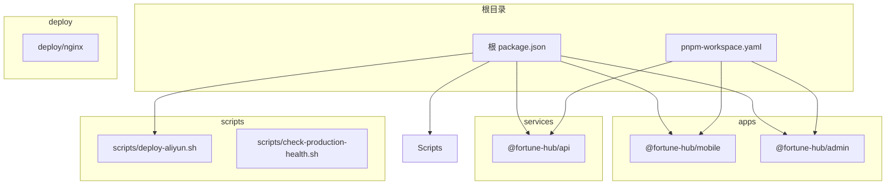
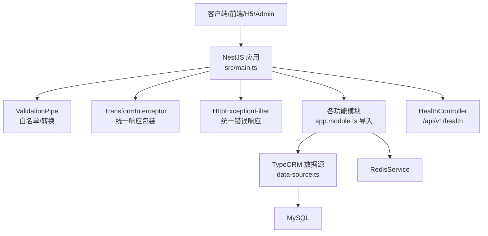
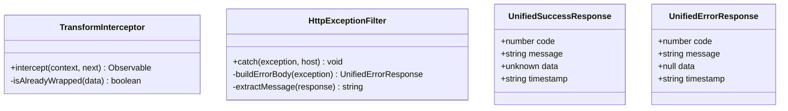
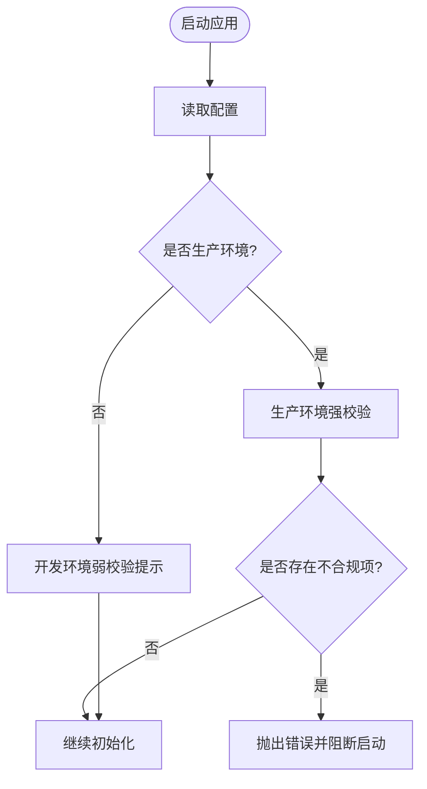
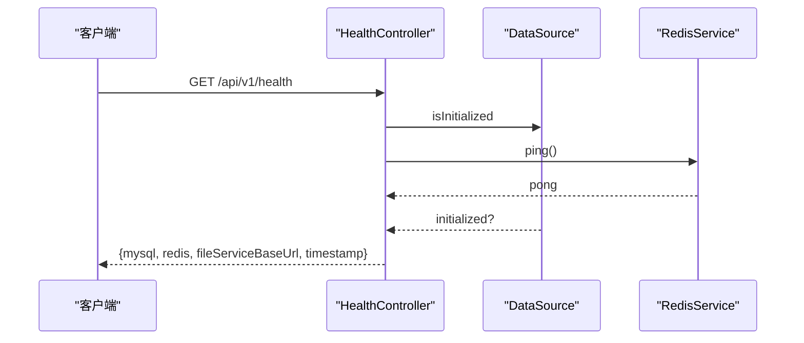
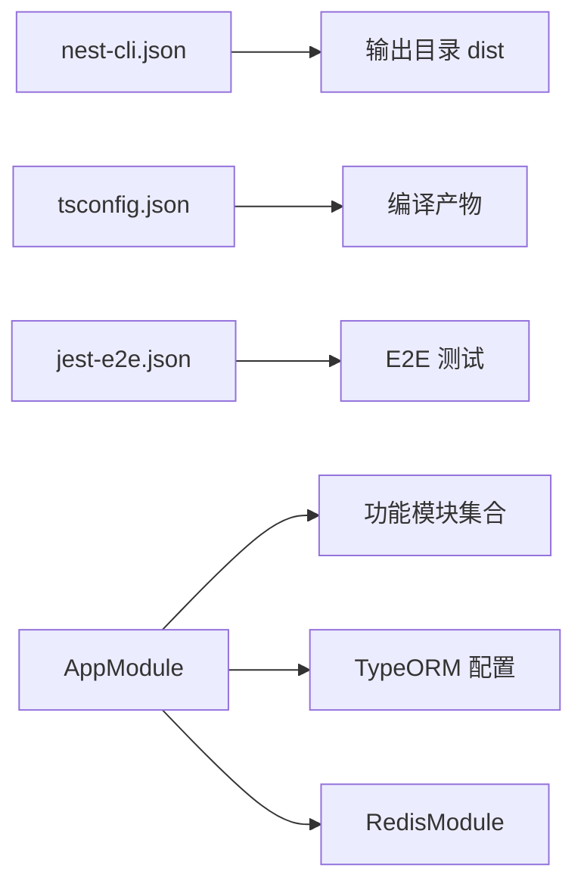

# 开发实践规范

<cite>
**本文引用的文件**
- [.github/workflows/ci.yml](file://.github/workflows/ci.yml)
- [services/api/eslint.config.mjs](file://services/api/eslint.config.mjs)
- [services/api/.prettierrc](file://services/api/.prettierrc)
- [services/api/package.json](file://services/api/package.json)
- [services/api/src/main.ts](file://services/api/src/main.ts)
- [services/api/src/app.module.ts](file://services/api/src/app.module.ts)
- [services/api/src/common/filters/http-exception.filter.ts](file://services/api/src/common/filters/http-exception.filter.ts)
- [services/api/src/common/interceptors/transform.interceptor.ts](file://services/api/src/common/interceptors/transform.interceptor.ts)
- [services/api/src/common/production-config.validator.ts](file://services/api/src/common/production-config.validator.ts)
- [services/api/src/health/health.controller.ts](file://services/api/src/health/health.controller.ts)
- [services/api/src/database/data-source.ts](file://services/api/src/database/data-source.ts)
- [services/api/nest-cli.json](file://services/api/nest-cli.json)
- [services/api/tsconfig.json](file://services/api/tsconfig.json)
- [services/api/test/jest-e2e.json](file://services/api/test/jest-e2e.json)
- [scripts/deploy-aliyun.sh](file://scripts/deploy-aliyun.sh)
- [scripts/check-production-health.sh](file://scripts/check-production-health.sh)
- [package.json](file://package.json)
- [pnpm-workspace.yaml](file://pnpm-workspace.yaml)
</cite>

## 目录
1. [引言](#引言)
2. [项目结构](#项目结构)
3. [核心组件](#核心组件)
4. [架构总览](#架构总览)
5. [详细组件分析](#详细组件分析)
6. [依赖关系分析](#依赖关系分析)
7. [性能考量](#性能考量)
8. [故障排查指南](#故障排查指南)
9. [结论](#结论)
10. [附录](#附录)

## 引言
本规范面向 Fortune Hub 后端开发实践，旨在统一代码质量、Git 工作流、配置管理、日志与错误处理、代码审查与测试、以及部署与应急响应等全流程标准。内容基于仓库现有实现提炼形成，确保团队协作一致性与生产环境稳定性。

## 项目结构
项目采用 monorepo 结构，通过 pnpm workspace 管理多包：
- apps：前端应用（移动端小程序、H5、管理后台）
- services：后端服务（NestJS API）
- deploy：部署相关模板与 Nginx 配置
- scripts：自动化脚本（部署、健康检查）
- docs：开发与接口文档
- 根级 package.json 与 pnpm-workspace.yaml 统一管理跨包脚本与工作区

图表来源
- [pnpm-workspace.yaml:1-4](file://pnpm-workspace.yaml#L1-L4)
- [package.json:1-23](file://package.json#L1-L23)

章节来源
- [pnpm-workspace.yaml:1-4](file://pnpm-workspace.yaml#L1-L4)
- [package.json:1-23](file://package.json#L1-L23)

## 核心组件
- 代码质量工具链：ESLint + Prettier，统一规则与格式化
- 架构基础：NestJS 应用模块、全局拦截器与异常过滤器、TypeORM 数据源
- 配置校验：生产环境配置强制校验与弱口令检测
- 健康检查：统一健康端点与外部服务探测脚本
- 部署与运维：一键部署脚本、Nginx 模板渲染、容器编排

章节来源
- [services/api/eslint.config.mjs:1-36](file://services/api/eslint.config.mjs#L1-L36)
- [services/api/.prettierrc:1-5](file://services/api/.prettierrc#L1-L5)
- [services/api/src/main.ts:1-74](file://services/api/src/main.ts#L1-L74)
- [services/api/src/app.module.ts:1-145](file://services/api/src/app.module.ts#L1-L145)
- [services/api/src/common/production-config.validator.ts:1-216](file://services/api/src/common/production-config.validator.ts#L1-L216)
- [services/api/src/health/health.controller.ts:1-28](file://services/api/src/health/health.controller.ts#L1-L28)
- [scripts/deploy-aliyun.sh:1-199](file://scripts/deploy-aliyun.sh#L1-L199)

## 架构总览
后端以 NestJS 为核心，通过模块化组织功能域；全局管道、拦截器与过滤器统一处理输入校验、响应包装与异常捕获；TypeORM 连接 MySQL 并支持迁移；Redis 作为缓存层；健康控制器暴露服务状态与依赖项可用性。

图表来源
- [services/api/src/main.ts:1-74](file://services/api/src/main.ts#L1-L74)
- [services/api/src/app.module.ts:1-145](file://services/api/src/app.module.ts#L1-L145)
- [services/api/src/common/interceptors/transform.interceptor.ts:1-59](file://services/api/src/common/interceptors/transform.interceptor.ts#L1-L59)
- [services/api/src/common/filters/http-exception.filter.ts:1-92](file://services/api/src/common/filters/http-exception.filter.ts#L1-L92)
- [services/api/src/database/data-source.ts:1-73](file://services/api/src/database/data-source.ts#L1-L73)
- [services/api/src/health/health.controller.ts:1-28](file://services/api/src/health/health.controller.ts#L1-L28)

## 详细组件分析

### 代码质量与格式化规范
- ESLint 配置
  - 使用 TypeScript ESLint 推荐规则集与类型检查配置
  - 启用 Prettier 推荐集成，自动修复格式问题
  - 关闭对显式 any 的严格限制，保留对浮点 Promise 与不安全参数的警告
- Prettier 规则
  - 单引号、尾随逗号全部启用
- 本地执行
  - lint 脚本：扫描并修复 ts 文件
  - format 脚本：批量格式化 src 与 test 下 ts 文件
- CI 中的执行
  - GitHub Actions 在 CI 中运行 API 测试与构建，建议在 PR 中增加 lint 与类型检查步骤以提前发现问题

章节来源
- [services/api/eslint.config.mjs:1-36](file://services/api/eslint.config.mjs#L1-L36)
- [services/api/.prettierrc:1-5](file://services/api/.prettierrc#L1-L5)
- [services/api/package.json:8-25](file://services/api/package.json#L8-L25)
- [.github/workflows/ci.yml:32-36](file://.github/workflows/ci.yml#L32-L36)

### 全局拦截器与异常过滤器
- 统一响应包装
  - TransformInterceptor 将成功响应包装为统一结构，避免重复样板代码
  - 对已包装数据与手动响应场景进行识别，防止重复包装
- 统一错误处理
  - HttpExceptionFilter 将异常转为统一错误结构，区分 5xx 错误的日志级别
  - 自动提取消息体中的第一条有效消息，保证用户可见提示一致

图表来源
- [services/api/src/common/interceptors/transform.interceptor.ts:1-59](file://services/api/src/common/interceptors/transform.interceptor.ts#L1-L59)
- [services/api/src/common/filters/http-exception.filter.ts:1-92](file://services/api/src/common/filters/http-exception.filter.ts#L1-L92)

章节来源
- [services/api/src/common/interceptors/transform.interceptor.ts:1-59](file://services/api/src/common/interceptors/transform.interceptor.ts#L1-L59)
- [services/api/src/common/filters/http-exception.filter.ts:1-92](file://services/api/src/common/filters/http-exception.filter.ts#L1-L92)

### 配置管理与生产环境验证
- 配置加载
  - ConfigModule.forRoot 全局启用，支持变量展开
  - TypeORM 数据源通过 ConfigService 注入，集中管理数据库连接参数
- 生产环境强制校验
  - 禁止在生产启用 DB_SYNCHRONIZE
  - 禁止使用弱口令与默认值（如默认管理员密码、数据库密码、短信 pepper）
  - CORS 与公开 API 基础地址必须为 HTTPS
  - 微信登录与支付相关配置需完整且符合生产要求
- 开发环境提示
  - 当 DB_SYNCHRONIZE=true 时发出警告，仅限本地丢弃库场景

图表来源
- [services/api/src/app.module.ts:63-117](file://services/api/src/app.module.ts#L63-L117)
- [services/api/src/common/production-config.validator.ts:25-104](file://services/api/src/common/production-config.validator.ts#L25-L104)

章节来源
- [services/api/src/app.module.ts:1-145](file://services/api/src/app.module.ts#L1-L145)
- [services/api/src/common/production-config.validator.ts:1-216](file://services/api/src/common/production-config.validator.ts#L1-L216)

### 日志记录与健康检查
- 日志级别
  - 5xx 错误写入错误日志，便于定位异常
- 健康检查
  - /api/v1/health 返回 MySQL 初始化状态、Redis 可达性与文件服务基地址
  - 生产健康检查脚本对 API、文件服务、H5 与管理后台进行探测，校验 HTTPS 与期望内容

图表来源
- [services/api/src/health/health.controller.ts:1-28](file://services/api/src/health/health.controller.ts#L1-L28)

章节来源
- [services/api/src/common/filters/http-exception.filter.ts:32-37](file://services/api/src/common/filters/http-exception.filter.ts#L32-L37)
- [services/api/src/health/health.controller.ts:1-28](file://services/api/src/health/health.controller.ts#L1-L28)
- [scripts/check-production-health.sh:1-86](file://scripts/check-production-health.sh#L1-L86)

### 错误处理模式
- 异常分类
  - Nest HttpException：按状态码返回统一错误结构
  - 未捕获异常：统一映射为 500 与默认提示
- 错误码与消息
  - code 字段对应 HTTP 状态码；message 提取自响应体第一条有效字符串
- 用户友好提示
  - 默认提示语用于兜底，避免泄露内部细节
- 调试信息保护
  - 5xx 错误记录堆栈，但对外仅返回通用提示

章节来源
- [services/api/src/common/filters/http-exception.filter.ts:22-63](file://services/api/src/common/filters/http-exception.filter.ts#L22-L63)

### Git 工作流程与分支策略
- 分支策略
  - 主分支：main、develop
  - 功能分支：codex/**
- 提交与合并
  - 建议遵循约定式提交（例如 feat/fix/docs/chore），并在合并前完成代码审查
- 版本标签管理
  - 建议在发布前打标签（如 v1.2.3），并与 CI 集成以触发发布流程

章节来源
- [.github/workflows/ci.yml:4-8](file://.github/workflows/ci.yml#L4-L8)

### 代码审查流程与测试覆盖率
- 代码审查
  - PR 必须通过 CI 检查，建议增加 lint 与类型检查步骤
- 测试
  - 单元测试：Jest 配置于服务包内
  - E2E 测试：独立 jest-e2e.json 配置
  - 建议设置覆盖率阈值（如语句、分支、函数、行）以保障质量

章节来源
- [services/api/package.json:73-89](file://services/api/package.json#L73-L89)
- [services/api/test/jest-e2e.json:1-10](file://services/api/test/jest-e2e.json#L1-L10)
- [.github/workflows/ci.yml:32-33](file://.github/workflows/ci.yml#L32-L33)

### 持续集成配置
- 触发条件：push 到 main/develop/codex/** 与 pull_request
- 步骤概览
  - 安装 Node.js 与 pnpm
  - 安装依赖（锁定文件）
  - 执行 API 测试、API 构建、管理端构建、移动端类型检查与构建
- 建议增强
  - 增加 lint 与类型检查步骤，确保 PR 质量

章节来源
- [.github/workflows/ci.yml:1-46](file://.github/workflows/ci.yml#L1-L46)

### 部署前检查清单与回滚策略
- 部署前检查
  - 环境变量完整性与安全性校验（生产脚本已内置）
  - 证书与 HTTPS 配置正确
  - 数据库迁移策略：禁止在生产启用同步，使用迁移脚本
- 回滚策略
  - 保留上一版本镜像与配置，快速切换
  - 如涉及数据库变更，准备反向迁移
- 故障应急响应
  - 使用健康检查脚本快速定位服务与依赖问题
  - 查看容器日志，结合错误过滤器中的堆栈信息定位异常

章节来源
- [scripts/deploy-aliyun.sh:49-61](file://scripts/deploy-aliyun.sh#L49-L61)
- [scripts/check-production-health.sh:26-72](file://scripts/check-production-health.sh#L26-72)

## 依赖关系分析
- 编译与构建
  - Nest CLI 配置包含静态资源复制到 dist
  - tsconfig 采用 NodeNext 模块解析与严格模式
- 类型与测试
  - Jest 与 ts-jest 配置，支持 e2e 与单元测试
- 依赖注入与模块化
  - AppModule 导入各功能模块与基础设施模块（Redis、数据库）

图表来源
- [services/api/nest-cli.json:1-15](file://services/api/nest-cli.json#L1-L15)
- [services/api/tsconfig.json:1-26](file://services/api/tsconfig.json#L1-L26)
- [services/api/test/jest-e2e.json:1-10](file://services/api/test/jest-e2e.json#L1-L10)
- [services/api/src/app.module.ts:61-141](file://services/api/src/app.module.ts#L61-L141)

章节来源
- [services/api/nest-cli.json:1-15](file://services/api/nest-cli.json#L1-L15)
- [services/api/tsconfig.json:1-26](file://services/api/tsconfig.json#L1-L26)
- [services/api/test/jest-e2e.json:1-10](file://services/api/test/jest-e2e.json#L1-L10)
- [services/api/src/app.module.ts:1-145](file://services/api/src/app.module.ts#L1-L145)

## 性能考量
- 响应统一包装与拦截器链路开销低，适合高并发场景
- 建议对热点接口引入缓存（Redis），并配合限流与熔断
- 数据库查询尽量使用索引与分页，避免一次性加载大结果集
- 健康检查与外部服务探测应设置合理超时，避免阻塞

## 故障排查指南
- 健康检查失败
  - 使用生产健康检查脚本定位具体服务与状态码
  - 核查 HTTPS 证书与域名解析
- 数据库连接问题
  - 确认生产配置校验通过，禁用 DB_SYNCHRONIZE
  - 检查迁移是否按计划执行
- 异常与错误
  - 关注 5xx 错误日志与堆栈
  - 使用统一错误响应字段快速定位业务异常

章节来源
- [scripts/check-production-health.sh:26-72](file://scripts/check-production-health.sh#L26-72)
- [services/api/src/common/production-config.validator.ts:56-78](file://services/api/src/common/production-config.validator.ts#L56-L78)
- [services/api/src/common/filters/http-exception.filter.ts:32-37](file://services/api/src/common/filters/http-exception.filter.ts#L32-L37)

## 结论
本规范总结了 Fortune Hub 后端在代码质量、配置管理、日志与错误处理、CI/CD、部署与应急响应等方面的实践要点。建议在现有基础上补充约定式提交、覆盖率阈值与更严格的 PR 审查流程，持续提升交付质量与稳定性。

## 附录
- 一键部署脚本
  - 支持渲染 Nginx 配置、拉取代码、启动容器、查看状态与日志
- 健康检查脚本
  - 对 API、文件服务、H5 与管理后台进行健康探测，校验 HTTPS 与期望内容

章节来源
- [scripts/deploy-aliyun.sh:152-199](file://scripts/deploy-aliyun.sh#L152-L199)
- [scripts/check-production-health.sh:74-83](file://scripts/check-production-health.sh#L74-83)