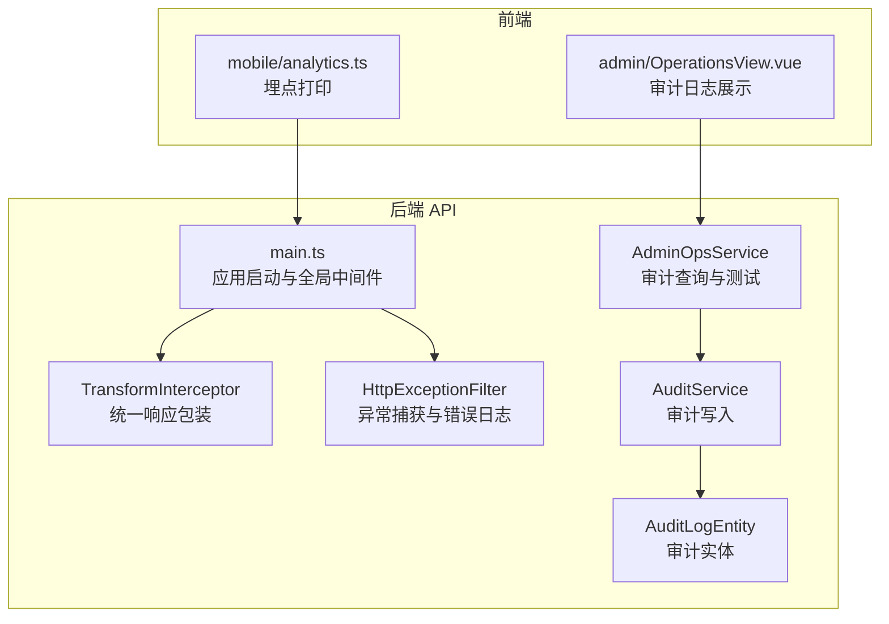
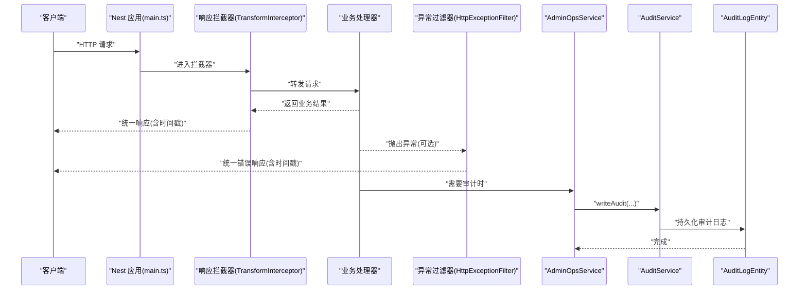
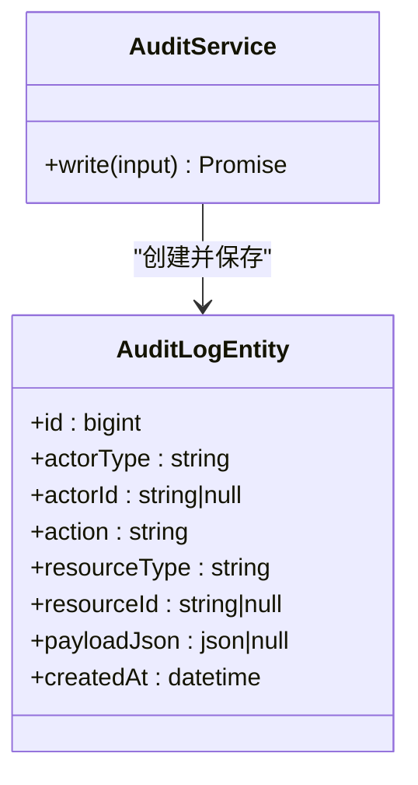
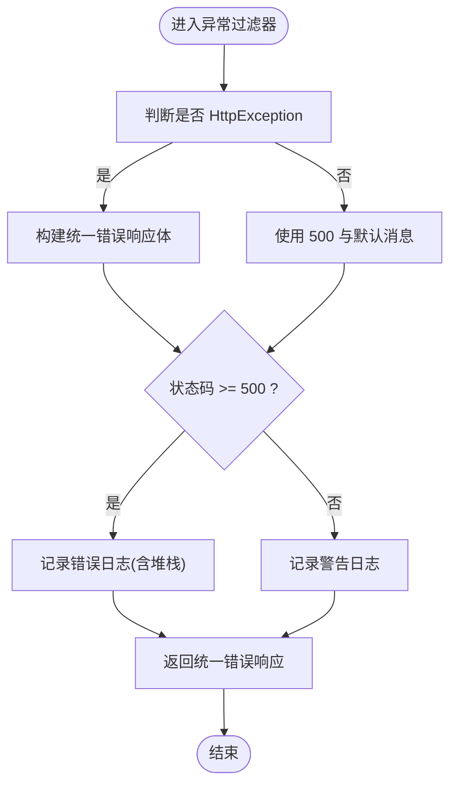
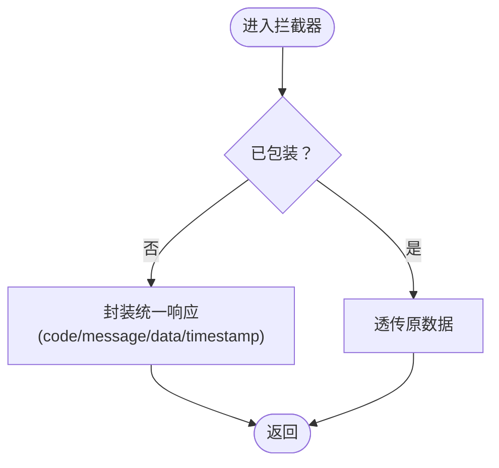
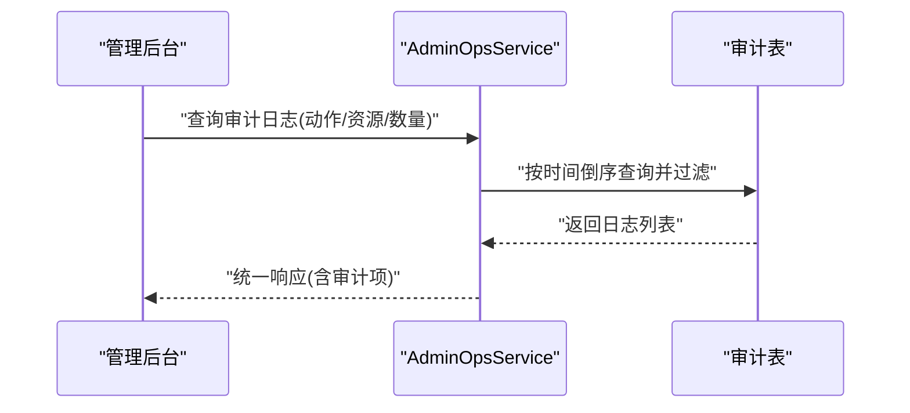
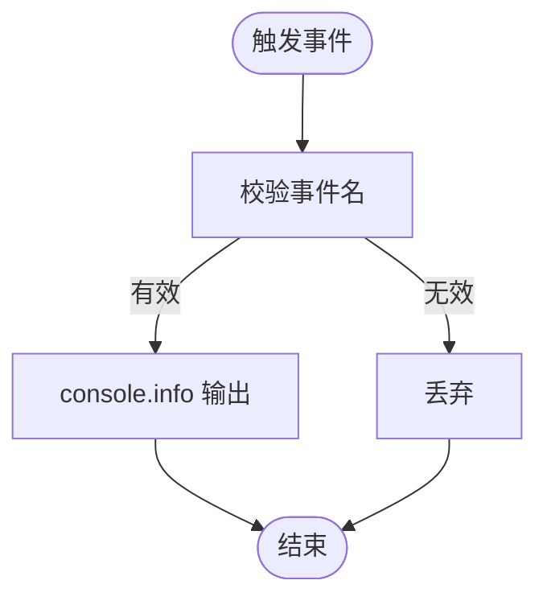
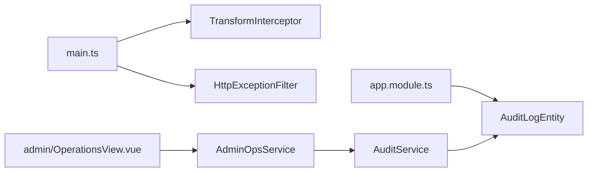

# 日志与审计

<cite>
**本文引用的文件**
- [services/api/src/common/audit.service.ts](file://services/api/src/common/audit.service.ts)
- [services/api/src/database/entities/audit-log.entity.ts](file://services/api/src/database/entities/audit-log.entity.ts)
- [services/api/src/admin-ops/admin-ops.service.ts](file://services/api/src/admin-ops/admin-ops.service.ts)
- [services/api/src/common/interceptors/transform.interceptor.ts](file://services/api/src/common/interceptors/transform.interceptor.ts)
- [services/api/src/common/filters/http-exception.filter.ts](file://services/api/src/common/filters/http-exception.filter.ts)
- [services/api/src/main.ts](file://services/api/src/main.ts)
- [services/api/src/app.module.ts](file://services/api/src/app.module.ts)
- [apps/mobile/src/services/analytics.ts](file://apps/mobile/src/services/analytics.ts)
- [apps/admin/src/views/OperationsView.vue](file://apps/admin/src/views/OperationsView.vue)
</cite>

## 目录
1. [简介](#简介)
2. [项目结构](#项目结构)
3. [核心组件](#核心组件)
4. [架构总览](#架构总览)
5. [详细组件分析](#详细组件分析)
6. [依赖关系分析](#依赖关系分析)
7. [性能考量](#性能考量)
8. [故障排查指南](#故障排查指南)
9. [结论](#结论)
10. [附录](#附录)

## 简介
本文件为 Fortune Hub 项目设计标准化的日志与审计规范，目标如下：
- 明确日志级别定义与使用场景（debug、info、warn、error），统一输出内容与上下文。
- 规范结构化日志格式（JSON 字段、时间戳、层级上下文）。
- 制定审计日志策略（用户操作记录、系统事件追踪、安全事件监控）。
- 提出日志性能优化方案（异步写入、缓冲、轮转）。
- 强调日志安全（敏感信息脱敏、访问控制、合规要求）。
- 提供日志分析工具建议（ELK 集成、实时监控、告警机制）。

## 项目结构
当前仓库中与日志与审计直接相关的关键位置：
- 后端服务（NestJS）：统一异常过滤器、响应拦截器、审计服务、审计实体、主引导入口。
- 管理后台前端：审计日志列表展示。
- 移动端前端：埋点事件打印到控制台（便于本地调试）。

图表来源
- [services/api/src/main.ts:1-74](file://services/api/src/main.ts#L1-L74)
- [services/api/src/common/interceptors/transform.interceptor.ts:1-59](file://services/api/src/common/interceptors/transform.interceptor.ts#L1-L59)
- [services/api/src/common/filters/http-exception.filter.ts:1-55](file://services/api/src/common/filters/http-exception.filter.ts#L1-L55)
- [services/api/src/common/audit.service.ts:1-35](file://services/api/src/common/audit.service.ts#L1-L35)
- [services/api/src/database/entities/audit-log.entity.ts:1-37](file://services/api/src/database/entities/audit-log.entity.ts#L1-L37)
- [services/api/src/admin-ops/admin-ops.service.ts:459-488](file://services/api/src/admin-ops/admin-ops.service.ts#L459-L488)
- [apps/mobile/src/services/analytics.ts:1-15](file://apps/mobile/src/services/analytics.ts#L1-L15)
- [apps/admin/src/views/OperationsView.vue:134-152](file://apps/admin/src/views/OperationsView.vue#L134-L152)

章节来源
- [services/api/src/main.ts:1-74](file://services/api/src/main.ts#L1-L74)
- [services/api/src/app.module.ts:1-145](file://services/api/src/app.module.ts#L1-L145)

## 核心组件
- 审计服务与实体
  - 审计服务负责将结构化审计输入持久化到数据库审计表。
  - 审计实体定义了审计日志的标准字段（操作者类型/ID、动作、资源类型/ID、载荷 JSON、创建时间等）。
- 异常过滤器
  - 捕获未处理异常，并在 5xx 错误时输出结构化错误日志。
- 响应拦截器
  - 统一包装成功响应，包含时间戳，便于日志关联与追踪。
- 管理后台审计查询
  - 支持按动作、资源类型筛选与分页，返回结构化审计数据。
- 前端埋点
  - 移动端通过控制台打印埋点事件，便于本地调试与快速验证。

章节来源
- [services/api/src/common/audit.service.ts:1-35](file://services/api/src/common/audit.service.ts#L1-L35)
- [services/api/src/database/entities/audit-log.entity.ts:1-37](file://services/api/src/database/entities/audit-log.entity.ts#L1-L37)
- [services/api/src/common/filters/http-exception.filter.ts:1-55](file://services/api/src/common/filters/http-exception.filter.ts#L1-L55)
- [services/api/src/common/interceptors/transform.interceptor.ts:1-59](file://services/api/src/common/interceptors/transform.interceptor.ts#L1-L59)
- [services/api/src/admin-ops/admin-ops.service.ts:459-488](file://services/api/src/admin-ops/admin-ops.service.ts#L459-L488)
- [apps/mobile/src/services/analytics.ts:1-15](file://apps/mobile/src/services/analytics.ts#L1-L15)

## 架构总览
下图展示了从请求进入、异常捕获、响应包装、审计写入到管理后台展示的整体流程。

图表来源
- [services/api/src/main.ts:1-74](file://services/api/src/main.ts#L1-L74)
- [services/api/src/common/interceptors/transform.interceptor.ts:1-59](file://services/api/src/common/interceptors/transform.interceptor.ts#L1-L59)
- [services/api/src/common/filters/http-exception.filter.ts:1-55](file://services/api/src/common/filters/http-exception.filter.ts#L1-L55)
- [services/api/src/admin-ops/admin-ops.service.ts:496-516](file://services/api/src/admin-ops/admin-ops.service.ts#L496-L516)
- [services/api/src/common/audit.service.ts:1-35](file://services/api/src/common/audit.service.ts#L1-L35)
- [services/api/src/database/entities/audit-log.entity.ts:1-37](file://services/api/src/database/entities/audit-log.entity.ts#L1-L37)

## 详细组件分析

### 审计服务与实体
- 审计输入结构
  - 包含操作者类型/ID、动作、资源类型/ID、可选载荷 JSON。
- 写入流程
  - 通过审计服务将输入转换为实体并持久化。
- 查询与展示
  - 管理后台支持按动作、资源类型筛选与分页，返回结构化审计数据。

图表来源
- [services/api/src/common/audit.service.ts:1-35](file://services/api/src/common/audit.service.ts#L1-L35)
- [services/api/src/database/entities/audit-log.entity.ts:1-37](file://services/api/src/database/entities/audit-log.entity.ts#L1-L37)

章节来源
- [services/api/src/common/audit.service.ts:1-35](file://services/api/src/common/audit.service.ts#L1-L35)
- [services/api/src/database/entities/audit-log.entity.ts:1-37](file://services/api/src/database/entities/audit-log.entity.ts#L1-L37)
- [services/api/src/admin-ops/admin-ops.service.ts:459-488](file://services/api/src/admin-ops/admin-ops.service.ts#L459-L488)

### 异常过滤器与错误日志
- 行为
  - 捕获所有未处理异常；对 5xx 错误进行结构化错误日志输出（包含状态码、消息、堆栈）。
- 影响
  - 统一错误输出格式，便于集中采集与分析。

图表来源
- [services/api/src/common/filters/http-exception.filter.ts:1-55](file://services/api/src/common/filters/http-exception.filter.ts#L1-L55)

章节来源
- [services/api/src/common/filters/http-exception.filter.ts:1-55](file://services/api/src/common/filters/http-exception.filter.ts#L1-L55)

### 响应拦截器与统一响应
- 行为
  - 对非手动响应（未使用 @Res()）的结果进行统一包装，包含 code、message、data、timestamp。
- 影响
  - 便于日志关联追踪与前端一致性消费。

图表来源
- [services/api/src/common/interceptors/transform.interceptor.ts:1-59](file://services/api/src/common/interceptors/transform.interceptor.ts#L1-L59)

章节来源
- [services/api/src/common/interceptors/transform.interceptor.ts:1-59](file://services/api/src/common/interceptors/transform.interceptor.ts#L1-L59)

### 管理后台审计日志展示
- 功能
  - 展示审计日志列表，包含操作者、动作、资源、资源 ID、时间等字段。
- 交互
  - 支持按动作与资源类型筛选，限制最大条数。

图表来源
- [services/api/src/admin-ops/admin-ops.service.ts:459-488](file://services/api/src/admin-ops/admin-ops.service.ts#L459-L488)
- [apps/admin/src/views/OperationsView.vue:134-152](file://apps/admin/src/views/OperationsView.vue#L134-L152)

章节来源
- [services/api/src/admin-ops/admin-ops.service.ts:459-488](file://services/api/src/admin-ops/admin-ops.service.ts#L459-L488)
- [apps/admin/src/views/OperationsView.vue:134-152](file://apps/admin/src/views/OperationsView.vue#L134-L152)

### 前端埋点与移动端日志
- 行为
  - 移动端通过控制台打印埋点事件，避免阻塞主流程。
- 建议
  - 在生产环境建议接入结构化日志 SDK，统一字段与采样策略。

图表来源
- [apps/mobile/src/services/analytics.ts:1-15](file://apps/mobile/src/services/analytics.ts#L1-L15)

章节来源
- [apps/mobile/src/services/analytics.ts:1-15](file://apps/mobile/src/services/analytics.ts#L1-L15)

## 依赖关系分析
- 全局注册
  - 主入口设置全局前缀、CORS、验证管道、拦截器与过滤器。
  - TypeORM 注册审计实体，确保审计表可用。
- 模块耦合
  - 审计服务依赖审计实体仓储；管理后台服务依赖审计仓储与审计服务。
- 前后端交互
  - 前端通过 API 获取审计日志，实现可视化审计追踪。

图表来源
- [services/api/src/main.ts:1-74](file://services/api/src/main.ts#L1-L74)
- [services/api/src/app.module.ts:1-145](file://services/api/src/app.module.ts#L1-L145)
- [services/api/src/admin-ops/admin-ops.service.ts:459-488](file://services/api/src/admin-ops/admin-ops.service.ts#L459-L488)
- [services/api/src/common/audit.service.ts:1-35](file://services/api/src/common/audit.service.ts#L1-L35)
- [services/api/src/database/entities/audit-log.entity.ts:1-37](file://services/api/src/database/entities/audit-log.entity.ts#L1-L37)
- [apps/admin/src/views/OperationsView.vue:134-152](file://apps/admin/src/views/OperationsView.vue#L134-L152)

章节来源
- [services/api/src/main.ts:1-74](file://services/api/src/main.ts#L1-L74)
- [services/api/src/app.module.ts:1-145](file://services/api/src/app.module.ts#L1-L145)

## 性能考量
- 异步写入
  - 审计写入建议采用异步方式，避免阻塞主请求路径。
- 缓冲与批量化
  - 对高频审计事件进行缓冲与批量化写入，降低数据库压力。
- 日志轮转
  - 使用系统级日志轮转工具（如 logrotate）或容器日志驱动（如 journald/fluentd）进行切割与归档。
- 过滤与采样
  - 对低价值日志进行采样或过滤，减少存储与带宽开销。
- 并发与连接池
  - 合理配置数据库连接池与超时，避免在高并发场景下成为瓶颈。

## 故障排查指南
- 常见问题
  - 审计日志缺失：检查审计服务是否被正确调用，以及数据库连接与权限。
  - 错误日志不完整：确认异常过滤器已注册且未被覆盖。
  - 响应不统一：确认拦截器未被局部禁用。
- 定位步骤
  - 查看异常过滤器输出的错误日志（5xx）。
  - 检查审计查询接口返回的数据是否符合预期。
  - 核对数据库审计表是否存在对应记录。
- 建议
  - 在关键路径增加结构化上下文（traceId、userId、action 等），便于跨服务追踪。

章节来源
- [services/api/src/common/filters/http-exception.filter.ts:1-55](file://services/api/src/common/filters/http-exception.filter.ts#L1-L55)
- [services/api/src/admin-ops/admin-ops.service.ts:459-488](file://services/api/src/admin-ops/admin-ops.service.ts#L459-L488)
- [services/api/src/database/entities/audit-log.entity.ts:1-37](file://services/api/src/database/entities/audit-log.entity.ts#L1-L37)

## 结论
本规范基于现有代码实现了“统一响应、异常日志、审计写入与查询”的闭环，并建议在生产环境中引入异步审计、日志轮转与结构化日志 SDK，以满足高性能、可观测性与合规要求。后续可在各模块中推广一致的日志与审计实践，逐步完善 ELK 集成与实时告警体系。

## 附录

### 日志级别与使用场景
- debug：开发调试、内部流程细节（仅限开发/测试环境）。
- info：常规运行信息、关键业务事件（统一响应中的时间戳即属于 info 级别信息）。
- warn：潜在风险、异常但可恢复的情况（如开发环境的配置提示）。
- error：严重错误、导致功能不可用（5xx 错误由异常过滤器统一记录）。

章节来源
- [services/api/src/common/interceptors/transform.interceptor.ts:1-59](file://services/api/src/common/interceptors/transform.interceptor.ts#L1-L59)
- [services/api/src/common/filters/http-exception.filter.ts:1-55](file://services/api/src/common/filters/http-exception.filter.ts#L1-L55)

### 结构化日志格式建议
- JSON 字段
  - 时间戳：ISO 8601 格式。
  - 级别：debug/info/warn/error。
  - 模块/服务：后端服务名。
  - 路径/方法：请求路径与方法（用于 API）。
  - 用户标识：actorId/traceId（用于审计与追踪）。
  - 动作/资源：action/resourceType/resourceId（用于审计）。
  - 载荷：payload（JSON，注意脱敏）。
  - 状态码：HTTP 状态码（API）。
  - 消息：简要描述。
  - 堆栈：错误堆栈（error 级别）。
- 时间戳处理
  - 统一使用 UTC 时间戳，便于跨时区聚合分析。

### 审计日志策略
- 记录范围
  - 管理员操作、关键业务变更、安全相关事件（登录、权限变更、配置更新等）。
- 字段标准化
  - 操作者类型/ID、动作、资源类型/ID、载荷 JSON、时间。
- 存储与查询
  - 建议建立复合索引（actorType+action、resourceType+resourceId），支持按时间倒序与条件过滤。
- 合规与脱敏
  - 载荷中敏感字段需脱敏（如手机号、身份证、密码、密钥等），遵循最小披露原则。

章节来源
- [services/api/src/database/entities/audit-log.entity.ts:1-37](file://services/api/src/database/entities/audit-log.entity.ts#L1-L37)
- [services/api/src/admin-ops/admin-ops.service.ts:459-488](file://services/api/src/admin-ops/admin-ops.service.ts#L459-L488)

### 日志安全与合规
- 敏感信息脱敏
  - 对手机号、邮箱、身份证、银行卡、密码、密钥等字段进行脱敏处理。
- 访问控制
  - 审计日志查询接口需鉴权与最小权限原则，防止越权访问。
- 合规要求
  - 留存期限、备份策略、跨境传输限制等需符合所在地区法规。

### 日志分析与监控
- ELK 集成
  - 使用 Filebeat/Fluent Bit 收集日志，经 Logstash 处理后写入 Elasticsearch，Kibana 可视化。
- 实时监控与告警
  - 基于日志指标（错误率、P95 延迟、审计事件频次）设置告警规则。
- 前端埋点
  - 生产环境建议接入结构化埋点 SDK，统一字段与采样策略，避免影响用户体验。