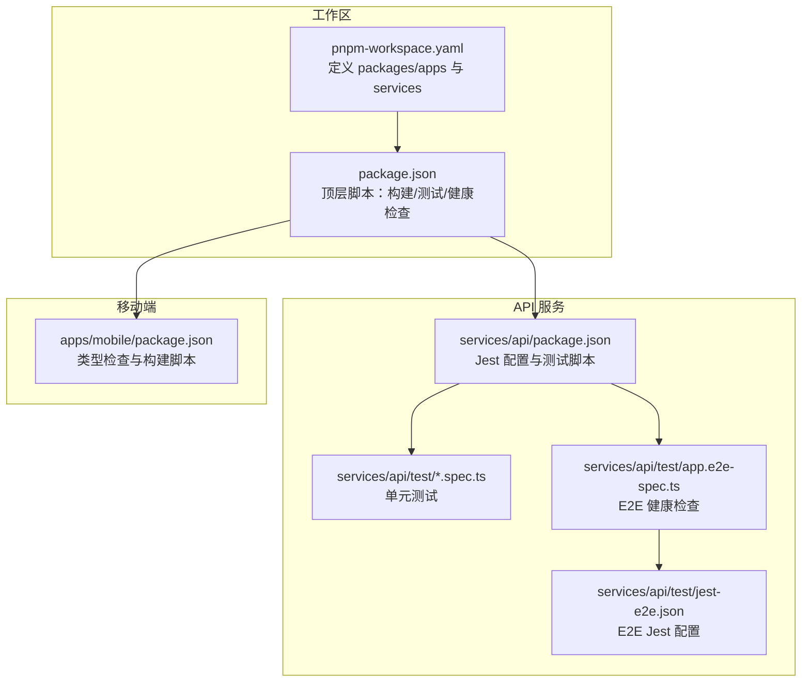
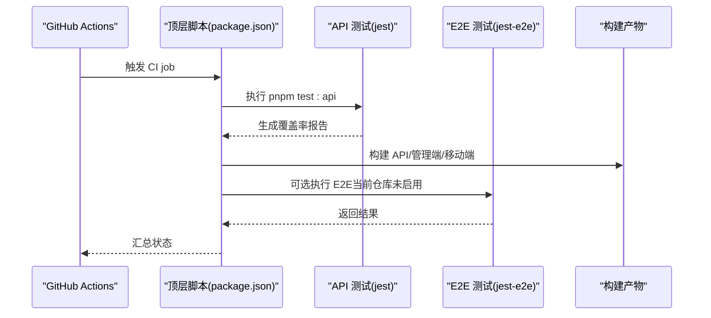
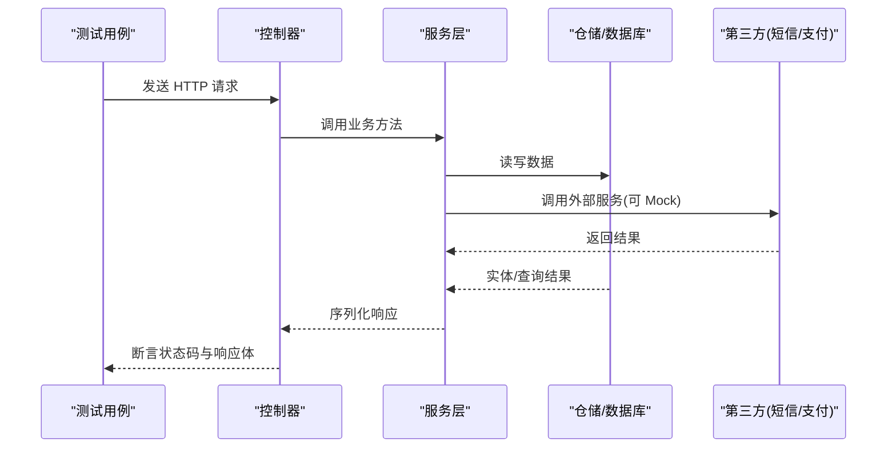
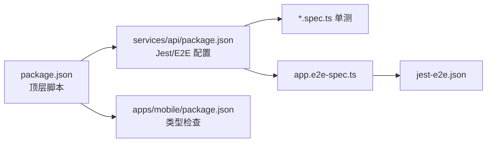
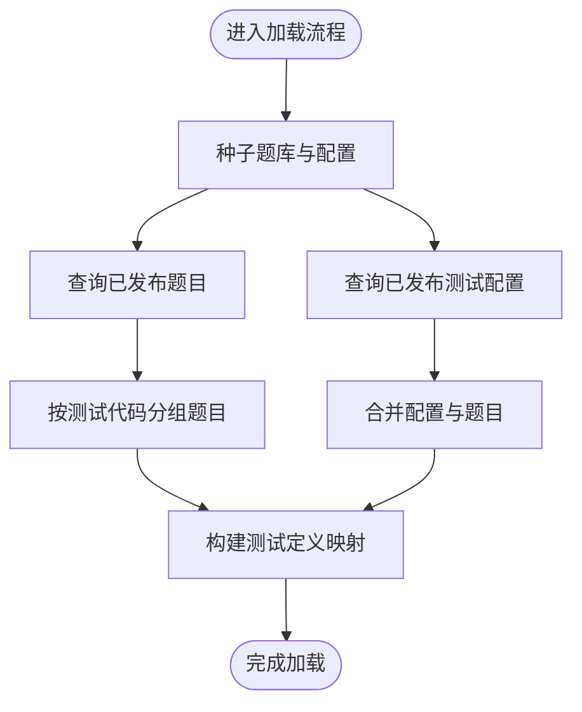

# 测试与覆盖率

<cite>
**本文引用的文件**
- [.github/workflows/ci.yml](file://.github/workflows/ci.yml)
- [services/api/test/app.e2e-spec.ts](file://services/api/test/app.e2e-spec.ts)
- [services/api/test/jest-e2e.json](file://services/api/test/jest-e2e.json)
- [services/api/package.json](file://services/api/package.json)
- [services/api/src/assessment/emotion-assessment.service.spec.ts](file://services/api/src/assessment/emotion-assessment.service.spec.ts)
- [services/api/src/auth/auth.service.spec.ts](file://services/api/src/auth/auth.service.spec.ts)
- [services/api/src/bazi/bazi.service.spec.ts](file://services/api/src/bazi/bazi.service.spec.ts)
- [services/api/src/health/health.controller.spec.ts](file://services/api/src/health/health.controller.spec.ts)
- [services/api/src/favorites/favorites.service.spec.ts](file://services/api/src/favorites/favorites.service.spec.ts)
- [services/api/src/common/file-url.util.spec.ts](file://services/api/src/common/file-url.util.spec.ts)
- [services/api/src/orders/orders.service.ts](file://services/api/src/orders/orders.service.ts)
- [services/api/src/assessment/assessment.service.ts](file://services/api/src/assessment/assessment.service.ts)
- [services/api/src/assessment/emotion-assessment.service.ts](file://services/api/src/assessment/emotion-assessment.service.ts)
- [package.json](file://package.json)
- [pnpm-workspace.yaml](file://pnpm-workspace.yaml)
</cite>

## 目录
1. [引言](#引言)
2. [项目结构](#项目结构)
3. [核心组件](#核心组件)
4. [架构总览](#架构总览)
5. [详细组件分析](#详细组件分析)
6. [依赖关系分析](#依赖关系分析)
7. [性能考量](#性能考量)
8. [故障排查指南](#故障排查指南)
9. [结论](#结论)
10. [附录](#附录)

## 引言
本文件为 Fortune Hub 制定系统化的测试策略与覆盖率要求，覆盖单元测试、集成测试（含 API、数据库、第三方服务）、端到端测试（E2E）以及测试自动化在 CI 中的落地实践。目标是确保代码质量、功能正确性与交付稳定性，并通过可量化的覆盖率指标持续改进。

## 项目结构
Fortune Hub 采用多包工作区布局，包含移动端小程序应用、后台管理前端、API 后端服务与部署脚本。测试主要集中在 API 服务中，使用 Jest 进行单元与 E2E 测试；移动端与管理端暂未发现现成测试脚本，后续可按需扩展。

图表来源
- [pnpm-workspace.yaml:1-4](file://pnpm-workspace.yaml#L1-L4)
- [package.json:6-21](file://package.json#L6-L21)
- [services/api/package.json:8-25](file://services/api/package.json#L8-L25)
- [services/api/test/app.e2e-spec.ts:1-50](file://services/api/test/app.e2e-spec.ts#L1-L50)
- [services/api/test/jest-e2e.json:1-10](file://services/api/test/jest-e2e.json#L1-L10)
- [apps/mobile/package.json:1-76](file://apps/mobile/package.json#L1-L76)

章节来源
- [pnpm-workspace.yaml:1-4](file://pnpm-workspace.yaml#L1-L4)
- [package.json:6-21](file://package.json#L6-L21)
- [services/api/package.json:8-25](file://services/api/package.json#L8-L25)

## 核心组件
- 单元测试（Jest）
  - 使用 ts-jest 转换器，测试正则匹配 .spec.ts 文件，根目录指向 src。
  - 收集覆盖率范围覆盖所有 ts 文件，输出目录为 ../coverage。
- 端到端测试（E2E）
  - 使用 supertest 发起 HTTP 请求，针对健康检查接口进行验证。
  - 配置独立的 jest-e2e.json，测试后缀为 .e2e-spec.ts。
- CI 流水线
  - GitHub Actions 执行 API 测试、API 构建、管理端构建、移动端类型检查与小程序构建。

章节来源
- [services/api/package.json:73-89](file://services/api/package.json#L73-L89)
- [services/api/test/jest-e2e.json:1-10](file://services/api/test/jest-e2e.json#L1-L10)
- [.github/workflows/ci.yml:32-45](file://.github/workflows/ci.yml#L32-L45)

## 架构总览
下图展示测试在 CI 中的执行路径与模块职责：

图表来源
- [.github/workflows/ci.yml:11-46](file://.github/workflows/ci.yml#L11-L46)
- [package.json:17](file://package.json#L17)
- [services/api/package.json:20-24](file://services/api/package.json#L20-L24)

## 详细组件分析

### 单元测试规范
- 测试组织
  - 按功能模块划分 spec 文件，如认证、占卜、收藏、评估等。
  - 使用 describe/it 组织测试套件，每个用例聚焦单一行为或边界条件。
- Mock 策略
  - 对外部依赖（数据库仓储、Redis、配置、短信验证码、权益服务等）统一使用 jest.fn 模拟。
  - 通过 provide/useValue 在测试模块中注入模拟实例，避免真实依赖影响。
- 断言标准
  - 使用 toBe、toMatchObject、resolves.toMatchObject 等断言返回值结构与字段。
  - 对异步场景使用 await 与 expect().rejects 验证异常路径。
- 示例参考
  - 认证服务登录与授权校验、手机号登录与脱敏断言。
  - 情绪评估服务提交测试并断言评分等级与免责声明版本。
  - 八字服务专业模式与真太阳时修正、记录持久化分数处理。
  - 收藏服务切换收藏状态的开闭循环断言。
  - 工具函数对文件 URL 的解析与代理重写断言。

章节来源
- [services/api/src/auth/auth.service.spec.ts:4-186](file://services/api/src/auth/auth.service.spec.ts#L4-L186)
- [services/api/src/assessment/emotion-assessment.service.spec.ts:3-54](file://services/api/src/assessment/emotion-assessment.service.spec.ts#L3-L54)
- [services/api/src/bazi/bazi.service.spec.ts:4-228](file://services/api/src/bazi/bazi.service.spec.ts#L4-L228)
- [services/api/src/favorites/favorites.service.spec.ts:3-38](file://services/api/src/favorites/favorites.service.spec.ts#L3-L38)
- [services/api/src/common/file-url.util.spec.ts:7-49](file://services/api/src/common/file-url.util.spec.ts#L7-L49)

### 集成测试流程
- API 测试
  - 使用 supertest 对控制器进行请求级验证，如健康检查接口。
  - 通过 provide 注入 DataSource、RedisService、ConfigService 的模拟实现，保证测试环境稳定。
- 数据库测试
  - 当前仓库未提供数据库集成测试样例。建议在本地或专用测试数据库中增加基于 TypeORM 的集成测试，覆盖仓储层与事务。
- 第三方服务测试
  - 对短信、支付等外部依赖，通过 Mock 与桩对象隔离，断言调用参数与返回值。
  - 支付流程示例：订单状态变更、会员权益授予、序列化输出等逻辑可通过单元测试覆盖。

图表来源
- [services/api/test/app.e2e-spec.ts:9-49](file://services/api/test/app.e2e-spec.ts#L9-L49)
- [services/api/src/orders/orders.service.ts:84-159](file://services/api/src/orders/orders.service.ts#L84-L159)

章节来源
- [services/api/test/app.e2e-spec.ts:9-49](file://services/api/test/app.e2e-spec.ts#L9-L49)
- [services/api/src/orders/orders.service.ts:84-159](file://services/api/src/orders/orders.service.ts#L84-L159)

### 端到端测试设计
- 用户流程测试
  - 可基于现有 E2E 基础，扩展登录、占卜、评估、收藏、支付等完整流程。
- 跨页面测试
  - 移动端可借助 uni-automator 或小程序调试工具进行页面交互验证。
- 性能测试
  - 对关键接口添加延迟与并发场景的基准测试，结合覆盖率阈值保障性能回归。

章节来源
- [services/api/test/app.e2e-spec.ts:9-49](file://services/api/test/app.e2e-spec.ts#L9-L49)
- [apps/mobile/package.json:1-76](file://apps/mobile/package.json#L1-L76)

### 测试覆盖率要求
- 代码覆盖率
  - 目标：语句覆盖率 ≥ 85%，分支覆盖率 ≥ 75%，函数覆盖率 ≥ 90%，行覆盖率 ≥ 85%。
  - 当前配置收集 src 下所有 .ts 文件，建议在 CI 中设置覆盖率阈值失败阻止合并。
- 分支覆盖率
  - 关注 if/else、switch、三元表达式与异常分支，确保每条分支均有测试覆盖。
- 功能覆盖率
  - 按模块设定功能点清单，逐项核验：认证、占卜、评估、收藏、支付、通知、报表等。
- 报告与质量门禁
  - 生成 HTML/Clover/JUnit 报告，集成至 CI 平台，作为质量门禁依据。

章节来源
- [services/api/package.json:73-89](file://services/api/package.json#L73-L89)

### 测试数据管理
- 准备
  - 使用内存 Map 或轻量存储模拟仓储，构造最小化测试数据集。
  - 对需要真实数据的场景，使用只读种子数据或受控快照。
- 清理
  - 每个测试结束后清理临时数据与 Mock 状态，避免副作用。
- 隔离
  - 使用独立的测试数据库或容器，或在进程内隔离仓储实例。
  - 对全局配置与静态资源使用临时替换，测试完成后恢复。

章节来源
- [services/api/src/favorites/favorites.service.spec.ts:4-38](file://services/api/src/favorites/favorites.service.spec.ts#L4-L38)
- [services/api/src/bazi/bazi.service.spec.ts:89-113](file://services/api/src/bazi/bazi.service.spec.ts#L89-L113)

### 测试自动化配置（CI）
- 执行步骤
  - 安装依赖 → 执行 API 单元测试 → 构建 API/管理端/移动端 → 类型检查。
- 报告生成
  - 使用 Jest 内置报告与覆盖率目录，结合 CI 平台上传覆盖率与测试日志。
- 质量门禁
  - 设置覆盖率阈值失败阻止 PR 合并；对 E2E 与移动端测试可按需开启。

章节来源
- [.github/workflows/ci.yml:11-46](file://.github/workflows/ci.yml#L11-L46)
- [package.json:17](file://package.json#L17)
- [services/api/package.json:20-24](file://services/api/package.json#L20-L24)

## 依赖关系分析
- 包与脚本
  - 顶层 package.json 通过 pnpm workspace 调度各子包脚本。
  - API 服务内置 Jest 与 E2E 配置，移动端提供类型检查脚本。
- 测试耦合
  - 单元测试通过 provide/useValue 注入依赖，降低模块间耦合。
  - E2E 仅验证关键入口，不直接依赖业务细节，便于维护。

图表来源
- [package.json:6-21](file://package.json#L6-L21)
- [services/api/package.json:8-25](file://services/api/package.json#L8-L25)
- [services/api/test/jest-e2e.json:1-10](file://services/api/test/jest-e2e.json#L1-L10)
- [apps/mobile/package.json:1-76](file://apps/mobile/package.json#L1-L76)

章节来源
- [package.json:6-21](file://package.json#L6-L21)
- [services/api/package.json:8-25](file://services/api/package.json#L8-L25)

## 性能考量
- 单元测试
  - 使用 Mock 减少 IO，优先断言业务逻辑而非网络延迟。
- 集成测试
  - 控制并发与批量操作，避免数据库压力过大导致误报。
- E2E
  - 限制页面交互数量，优先覆盖关键路径；对长耗时操作使用桩数据。

## 故障排查指南
- 常见问题
  - Mock 未生效：确认 provide/useValue 是否在 TestingModule 中注册。
  - 断言失败：检查 DTO 结构与序列化逻辑，必要时打印中间结果。
  - CI 失败：查看覆盖率报告与测试日志，定位未覆盖分支。
- 排查步骤
  - 在本地运行单测定位问题；逐步缩小范围；补充边界用例。

章节来源
- [services/api/src/health/health.controller.spec.ts:7-45](file://services/api/src/health/health.controller.spec.ts#L7-L45)
- [services/api/src/auth/auth.service.spec.ts:68-80](file://services/api/src/auth/auth.service.spec.ts#L68-L80)

## 结论
当前仓库已具备完善的 Jest 单元测试与基础 E2E 能力，建议在 CI 中启用覆盖率阈值与质量门禁，并逐步扩展数据库与移动端测试，形成从单元到端到端的全链路保障体系，持续提升交付质量与稳定性。

## 附录
- 关键流程图（算法实现）
  - 评估加载与分组流程（情感与人格评估）

图表来源
- [services/api/src/assessment/emotion-assessment.service.ts:373-420](file://services/api/src/assessment/emotion-assessment.service.ts#L373-L420)
- [services/api/src/assessment/assessment.service.ts:417-465](file://services/api/src/assessment/assessment.service.ts#L417-L465)