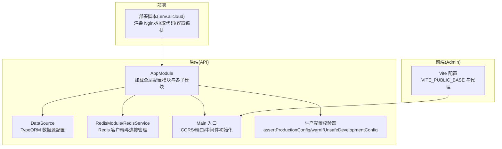
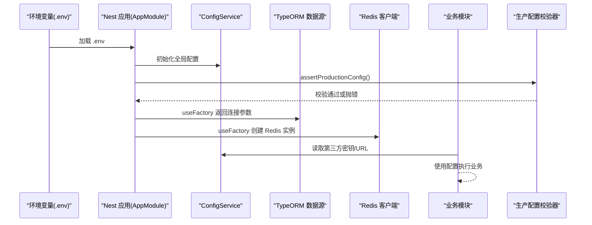
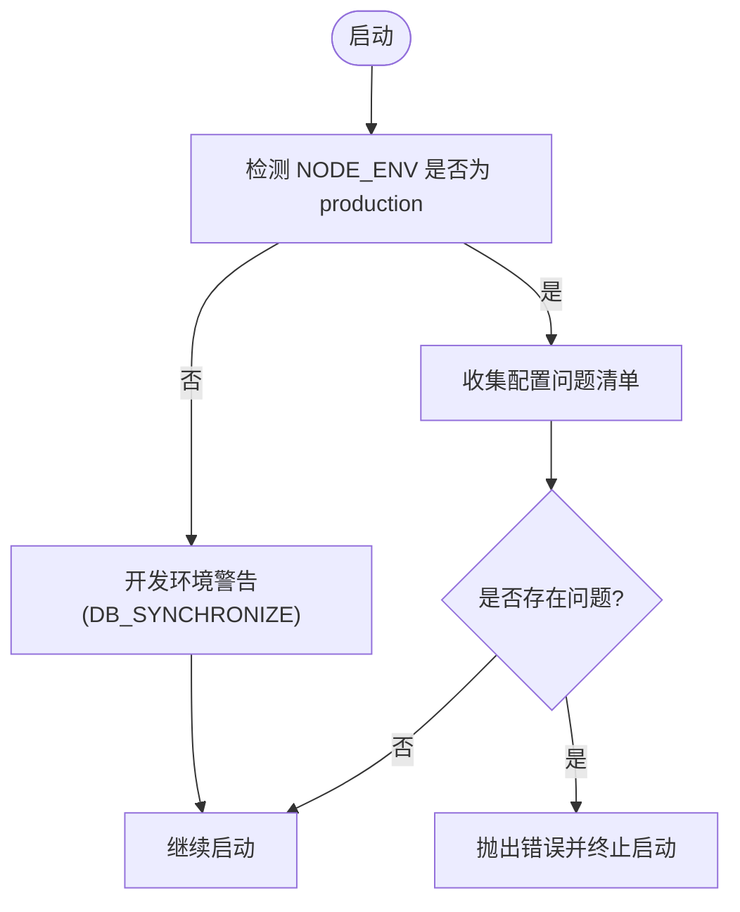
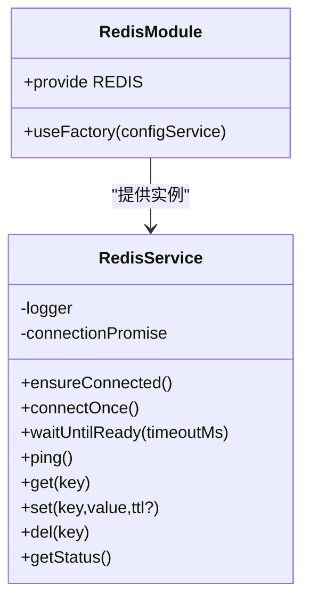
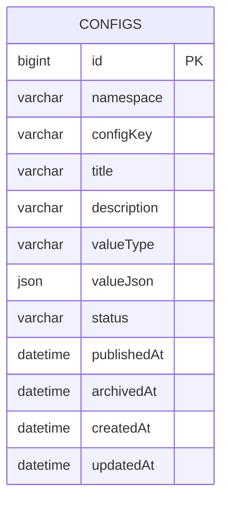
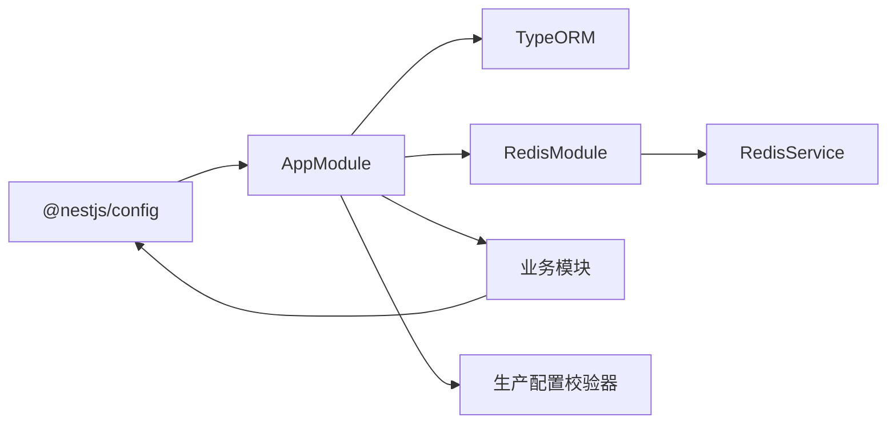

# 配置管理

<cite>
**本文引用的文件**
- [services/api/src/app.module.ts](file://services/api/src/app.module.ts)
- [services/api/src/main.ts](file://services/api/src/main.ts)
- [services/api/src/database/data-source.ts](file://services/api/src/database/data-source.ts)
- [services/api/src/redis/redis.module.ts](file://services/api/src/redis/redis.module.ts)
- [services/api/src/redis/redis.service.ts](file://services/api/src/redis/redis.service.ts)
- [services/api/src/common/production-config.validator.ts](file://services/api/src/common/production-config.validator.ts)
- [services/api/src/common/production-config.validator.spec.ts](file://services/api/src/common/production-config.validator.spec.ts)
- [services/api/src/database/entities/app-config.entity.ts](file://services/api/src/database/entities/app-config.entity.ts)
- [services/api/src/admin-content/admin-content.service.ts](file://services/api/src/admin-content/admin-content.service.ts)
- [services/api/src/admin-content/dto/save-config-entry.dto.ts](file://services/api/src/admin-content/dto/save-config-entry.dto.ts)
- [services/api/src/auth/sms-code.service.ts](file://services/api/src/auth/sms-code.service.ts)
- [services/api/src/auth/auth.service.ts](file://services/api/src/auth/auth.service.ts)
- [services/api/src/common/image-generation.service.ts](file://services/api/src/common/image-generation.service.ts)
- [services/api/package.json](file://services/api/package.json)
- [scripts/deploy-aliyun.sh](file://scripts/deploy-aliyun.sh)
- [apps/admin/vite.config.ts](file://apps/admin/vite.config.ts)
</cite>

## 目录
1. [引言](#引言)
2. [项目结构](#项目结构)
3. [核心组件](#核心组件)
4. [架构总览](#架构总览)
5. [详细组件分析](#详细组件分析)
6. [依赖关系分析](#依赖关系分析)
7. [性能考量](#性能考量)
8. [故障排查指南](#故障排查指南)
9. [结论](#结论)
10. [附录](#附录)

## 引言
本文件为 Fortune Hub 建立统一的配置管理规范，覆盖环境变量与配置文件结构、TypeORM 与 Redis 连接、第三方服务密钥、配置验证机制（含生产校验、启动参数检查、默认值处理）、配置热更新策略（运行时修改、缓存与生效机制）、安全措施（密钥轮换、访问控制、加密存储）以及配置迁移指南（版本升级、兼容性与数据迁移）。目标是确保开发、测试、生产环境的一致性与安全性，降低配置错误带来的风险。

## 项目结构
后端采用 NestJS + TypeORM + ioredis 架构，配置通过 @nestjs/config 注入；前端使用 Vite，支持基于环境变量的构建与代理。部署脚本通过 .env 文件注入环境变量，配合 docker-compose 启动服务。

图表来源
- [services/api/src/app.module.ts:61-145](file://services/api/src/app.module.ts#L61-L145)
- [services/api/src/main.ts:8-74](file://services/api/src/main.ts#L8-L74)
- [services/api/src/database/data-source.ts:32-73](file://services/api/src/database/data-source.ts#L32-L73)
- [services/api/src/redis/redis.module.ts:1-31](file://services/api/src/redis/redis.module.ts#L1-L31)
- [apps/admin/vite.config.ts:42-57](file://apps/admin/vite.config.ts#L42-L57)
- [scripts/deploy-aliyun.sh:26-46](file://scripts/deploy-aliyun.sh#L26-L46)

章节来源
- [services/api/src/app.module.ts:61-145](file://services/api/src/app.module.ts#L61-L145)
- [services/api/src/main.ts:8-74](file://services/api/src/main.ts#L8-L74)
- [services/api/src/database/data-source.ts:32-73](file://services/api/src/database/data-source.ts#L32-L73)
- [services/api/src/redis/redis.module.ts:1-31](file://services/api/src/redis/redis.module.ts#L1-L31)
- [apps/admin/vite.config.ts:42-57](file://apps/admin/vite.config.ts#L42-L57)
- [scripts/deploy-aliyun.sh:26-46](file://scripts/deploy-aliyun.sh#L26-L46)

## 核心组件
- 全局配置模块：在应用启动时加载环境变量，供 TypeORM、Redis、业务模块按需读取。
- 生产配置校验器：在生产环境强制校验关键配置项，拒绝弱口令、不安全 URL、禁用支付等高风险设置。
- 数据源配置：集中定义 MySQL 连接参数与实体列表，支持同步/迁移开关。
- Redis 模块与服务：延迟连接、重连策略、超时等待与错误降级。
- 配置持久化实体：以数据库表形式存储命名空间化的配置键值，支持状态（草稿/发布/归档）与 JSON 值。
- 前端构建配置：通过 VITE_* 环境变量控制公共路径与代理后端 API。
- 部署脚本：从 .env 文件注入变量，渲染 Nginx 配置并启动容器。

章节来源
- [services/api/src/app.module.ts:61-145](file://services/api/src/app.module.ts#L61-L145)
- [services/api/src/common/production-config.validator.ts:25-114](file://services/api/src/common/production-config.validator.ts#L25-L114)
- [services/api/src/database/data-source.ts:32-73](file://services/api/src/database/data-source.ts#L32-L73)
- [services/api/src/redis/redis.module.ts:1-31](file://services/api/src/redis/redis.module.ts#L1-L31)
- [services/api/src/redis/redis.service.ts:12-125](file://services/api/src/redis/redis.service.ts#L12-L125)
- [services/api/src/database/entities/app-config.entity.ts:10-50](file://services/api/src/database/entities/app-config.entity.ts#L10-L50)
- [apps/admin/vite.config.ts:42-57](file://apps/admin/vite.config.ts#L42-L57)
- [scripts/deploy-aliyun.sh:26-46](file://scripts/deploy-aliyun.sh#L26-L46)

## 架构总览
下图展示配置在系统中的流向：环境变量经由 @nestjs/config 注入到 TypeORM、Redis、业务模块；生产校验器在启动阶段拦截不安全配置；前端通过 Vite 读取构建期环境变量；部署脚本负责将 .env 变量注入容器。

图表来源
- [services/api/src/app.module.ts:63-117](file://services/api/src/app.module.ts#L63-L117)
- [services/api/src/common/production-config.validator.ts:25-114](file://services/api/src/common/production-config.validator.ts#L25-L114)
- [services/api/src/database/data-source.ts:32-73](file://services/api/src/database/data-source.ts#L32-L73)
- [services/api/src/redis/redis.module.ts:13-26](file://services/api/src/redis/redis.module.ts#L13-L26)

## 详细组件分析

### 环境变量与配置文件结构
- 全局配置模块：启用全局 ConfigModule，允许变量展开，便于引用与组合。
- 启动入口：读取 PORT、CORS_ORIGIN 并解析为白名单数组；区分生产与本地开发的 CORS 放行策略。
- 数据源：直接读取 MYSQL_* 环境变量，集中声明实体列表与迁移路径。
- Redis：读取 REDIS_HOST/REDIS_PORT，启用延迟连接、重试与只读/连接错误重连策略。
- 第三方服务密钥：微信小程序登录所需 APP ID/SECRET、短信服务提供商与模拟开关、图像生成模型与 Endpoint 等。
- 前端：Vite 读取 VITE_PUBLIC_BASE 控制静态资源基础路径，代理到后端 API。

章节来源
- [services/api/src/app.module.ts:63-117](file://services/api/src/app.module.ts#L63-L117)
- [services/api/src/main.ts:10-61](file://services/api/src/main.ts#L10-L61)
- [services/api/src/database/data-source.ts:32-73](file://services/api/src/database/data-source.ts#L32-L73)
- [services/api/src/redis/redis.module.ts:13-26](file://services/api/src/redis/redis.module.ts#L13-L26)
- [services/api/src/auth/auth.service.ts:374-377](file://services/api/src/auth/auth.service.ts#L374-L377)
- [services/api/src/auth/sms-code.service.ts:192-194](file://services/api/src/auth/sms-code.service.ts#L192-L194)
- [services/api/src/common/image-generation.service.ts:57-88](file://services/api/src/common/image-generation.service.ts#L57-L88)
- [apps/admin/vite.config.ts:42-57](file://apps/admin/vite.config.ts#L42-L57)

### 配置验证机制
- 生产环境强制校验：仅在 NODE_ENV=production 时执行；校验内容包括管理员账号/密码、数据库密码、支付模式、短信提供商、CORS/URL 必填与 HTTPS 要求、开发环境禁止同步开关等。
- 开发环境提示：当 DB_SYNCHRONIZE=true 时发出警告，提醒仅用于本地临时数据库。
- 单元测试：对“弱口令”“不安全 URL”“Mock 支付/短信”等场景进行断言，保证校验器行为稳定。

图表来源
- [services/api/src/common/production-config.validator.ts:38-114](file://services/api/src/common/production-config.validator.ts#L38-L114)
- [services/api/src/common/production-config.validator.spec.ts:12-76](file://services/api/src/common/production-config.validator.spec.ts#L12-L76)

章节来源
- [services/api/src/common/production-config.validator.ts:25-114](file://services/api/src/common/production-config.validator.ts#L25-L114)
- [services/api/src/common/production-config.validator.spec.ts:12-76](file://services/api/src/common/production-config.validator.spec.ts#L12-L76)

### TypeORM 配置与默认值处理
- 连接参数：从环境变量读取主机、端口、用户名、密码、数据库名；默认值在 useFactory 中显式给出，避免空值导致异常。
- 同步与迁移：通过 DB_RUN_MIGRATIONS 与 DB_SYNCHRONIZE 控制迁移执行与自动同步；生产建议关闭同步，仅允许迁移。
- 实体与迁移：集中声明实体列表与迁移路径，确保一致性。

章节来源
- [services/api/src/app.module.ts:67-117](file://services/api/src/app.module.ts#L67-L117)
- [services/api/src/database/data-source.ts:32-73](file://services/api/src/database/data-source.ts#L32-L73)

### Redis 连接与错误处理
- 延迟连接：lazyConnect=true，首次使用时才建立连接，降低启动开销。
- 重连策略：最大重试次数、重试间隔上限、只读/连接类错误自动重连。
- 连接状态：封装 ensureConnected/waitUntilReady/ping/get/set/del 等方法，失败时记录告警并返回兜底结果。

图表来源
- [services/api/src/redis/redis.module.ts:13-26](file://services/api/src/redis/redis.module.ts#L13-L26)
- [services/api/src/redis/redis.service.ts:12-125](file://services/api/src/redis/redis.service.ts#L12-L125)

章节来源
- [services/api/src/redis/redis.module.ts:1-31](file://services/api/src/redis/redis.module.ts#L1-L31)
- [services/api/src/redis/redis.service.ts:12-125](file://services/api/src/redis/redis.service.ts#L12-L125)

### 配置持久化与管理
- 数据库存储：AppConfigEntity 提供命名空间、键、标题、描述、类型、JSON 值、状态、时间戳等字段。
- 管理接口：支持分页查询、创建/更新/变更状态/删除；保存时校验唯一性与状态合法性；序列化输出统一格式。
- DTO 校验：SaveConfigEntryDto 对命名空间、键、标题、类型、状态、JSON 值进行长度与枚举约束。

图表来源
- [services/api/src/database/entities/app-config.entity.ts:10-50](file://services/api/src/database/entities/app-config.entity.ts#L10-L50)

章节来源
- [services/api/src/admin-content/admin-content.service.ts:454-584](file://services/api/src/admin-content/admin-content.service.ts#L454-L584)
- [services/api/src/admin-content/dto/save-config-entry.dto.ts:9-38](file://services/api/src/admin-content/dto/save-config-entry.dto.ts#L9-L38)
- [services/api/src/database/entities/app-config.entity.ts:10-50](file://services/api/src/database/entities/app-config.entity.ts#L10-L50)

### 第三方服务密钥与敏感信息保护
- 微信小程序：WECHAT_APP_ID、WECHAT_APP_SECRET、是否允许 Mock 登录。
- 短信服务：SMS_PROVIDER、SMS_MOCK_ENABLED、短信加盐 pepper。
- 图像生成：ZHIPU_IMAGE_MODEL、Endpoint、壁纸尺寸模板等。
- 敏感信息保护：生产校验器拒绝弱口令与不安全 URL；部署脚本从 .env 读取变量，避免硬编码；Redis/MySQL 密码通过环境变量注入。

章节来源
- [services/api/src/auth/auth.service.ts:374-377](file://services/api/src/auth/auth.service.ts#L374-L377)
- [services/api/src/auth/sms-code.service.ts:192-194](file://services/api/src/auth/sms-code.service.ts#L192-L194)
- [services/api/src/common/image-generation.service.ts:57-88](file://services/api/src/common/image-generation.service.ts#L57-L88)
- [services/api/src/common/production-config.validator.ts:7-21](file://services/api/src/common/production-config.validator.ts#L7-L21)
- [scripts/deploy-aliyun.sh:26-46](file://scripts/deploy-aliyun.sh#L26-L46)

### 配置热更新策略
- 运行时修改：通过管理后台对 AppConfigEntity 的 valueJson 进行更新；状态为“已发布”的配置可被业务模块读取。
- 配置缓存：RedisService 提供 get/set/del，可在业务层对热点配置做缓存；注意 TTL 设置与失效策略。
- 生效机制：业务模块按需读取 ConfigService 或直接访问数据库；若采用缓存，需在配置变更时主动刷新缓存。
- 建议：对高频读取的配置增加本地内存缓存（带版本号），结合数据库状态字段实现灰度与回滚。

章节来源
- [services/api/src/admin-content/admin-content.service.ts:473-544](file://services/api/src/admin-content/admin-content.service.ts#L473-L544)
- [services/api/src/redis/redis.service.ts:79-115](file://services/api/src/redis/redis.service.ts#L79-L115)
- [services/api/src/database/entities/app-config.entity.ts:32-33](file://services/api/src/database/entities/app-config.entity.ts#L32-L33)

### 配置安全措施
- 密钥轮换：通过环境变量滚动替换密钥；生产校验器拒绝弱口令；部署脚本支持从 .env 切换新密钥。
- 访问控制：CORS 白名单严格限制；生产环境禁止本地回环 URL；Redis/MySQL 连接仅限内网访问。
- 加密存储：敏感字段建议在数据库中加密存储（如 AES），并在业务层解密使用；当前代码未见加密实现，建议补充。

章节来源
- [services/api/src/common/production-config.validator.ts:144-165](file://services/api/src/common/production-config.validator.ts#L144-L165)
- [services/api/src/main.ts:44-59](file://services/api/src/main.ts#L44-L59)
- [services/api/src/redis/redis.module.ts:17-25](file://services/api/src/redis/redis.module.ts#L17-L25)

### 配置迁移指南
- 版本升级：通过迁移脚本执行数据库结构变更；生产环境仅允许迁移，禁止自动同步。
- 兼容性：新增配置键时，提供默认值与向后兼容逻辑；对废弃键保留过渡期读取。
- 数据迁移：使用 TypeORM CLI 生成/运行/回滚迁移；必要时编写自定义迁移脚本处理复杂数据转换。

章节来源
- [services/api/package.json:16-19](file://services/api/package.json#L16-L19)
- [services/api/src/database/data-source.ts:71-72](file://services/api/src/database/data-source.ts#L71-L72)

## 依赖关系分析
- 组件耦合：AppModule 作为装配中心，依赖 ConfigService 为 TypeORM、Redis、业务模块提供配置；生产校验器独立于业务模块，启动即执行。
- 外部依赖：TypeORM、ioredis、@nestjs/config；前端依赖 Vite 与 Vue 插件。
- 风险点：若 .env 缺失关键键或值为弱口令，启动将失败；Redis/MySQL 连接失败会触发降级日志。

图表来源
- [services/api/src/app.module.ts:63-117](file://services/api/src/app.module.ts#L63-L117)
- [services/api/src/common/production-config.validator.ts:25-114](file://services/api/src/common/production-config.validator.ts#L25-L114)
- [services/api/src/redis/redis.module.ts:13-26](file://services/api/src/redis/redis.module.ts#L13-L26)

章节来源
- [services/api/src/app.module.ts:63-117](file://services/api/src/app.module.ts#L63-L117)
- [services/api/src/common/production-config.validator.ts:25-114](file://services/api/src/common/production-config.validator.ts#L25-L114)
- [services/api/src/redis/redis.module.ts:13-26](file://services/api/src/redis/redis.module.ts#L13-L26)

## 性能考量
- 启动性能：Redis 延迟连接减少冷启动阻塞；TypeORM 自动同步关闭，避免启动时大量 DDL。
- 运行性能：对热点配置使用 Redis 缓存；合理设置 TTL，避免缓存穿透与雪崩。
- 网络性能：CORS 白名单精确控制，减少跨域预检与无效请求。

## 故障排查指南
- 启动失败（生产校验）：检查 NODE_ENV、管理员密码、数据库密码、支付/短信配置、URL 是否为 HTTPS 且非本地回环。
- CORS 拒绝：确认 CORS_ORIGIN 包含前端域名，生产环境不允许本地回环。
- Redis 连接失败：查看连接状态与错误日志，确认主机/端口、网络可达性与只读/连接错误重连策略。
- 数据库同步：生产环境请勿开启 DB_SYNCHRONIZE，使用迁移脚本更新结构。

章节来源
- [services/api/src/common/production-config.validator.ts:116-165](file://services/api/src/common/production-config.validator.ts#L116-L165)
- [services/api/src/main.ts:44-59](file://services/api/src/main.ts#L44-L59)
- [services/api/src/redis/redis.service.ts:12-125](file://services/api/src/redis/redis.service.ts#L12-L125)

## 结论
通过统一的配置管理规范，Fortune Hub 在开发、测试、生产三环境中实现了强一致与强安全：严格的生产校验、明确的默认值与迁移策略、完善的 Redis 缓存与错误降级、以及可扩展的配置持久化能力。建议后续补充敏感字段加密与配置审计能力，进一步提升安全性与可观测性。

## 附录
- 环境变量清单（示例）
  - 运行与网络：NODE_ENV、PORT、CORS_ORIGIN
  - 数据库：MYSQL_HOST、MYSQL_PORT、MYSQL_USER、MYSQL_PASSWORD、MYSQL_DATABASE、DB_RUN_MIGRATIONS、DB_SYNCHRONIZE
  - 缓存：REDIS_HOST、REDIS_PORT
  - 第三方：WECHAT_APP_ID、WECHAT_APP_SECRET、SMS_PROVIDER、SMS_MOCK_ENABLED、ZHIPU_IMAGE_MODEL、FILE_SERVICE_TOKEN、PUBLIC_API_BASE_URL
  - 部署：APP_DOMAIN、ENABLE_HTTPS、DEPLOY_BRANCH、SSL_CERT_SOURCE、SSL_KEY_SOURCE

章节来源
- [services/api/src/app.module.ts:74-113](file://services/api/src/app.module.ts#L74-L113)
- [services/api/src/main.ts:18-21](file://services/api/src/main.ts#L18-L21)
- [services/api/src/database/data-source.ts:34-38](file://services/api/src/database/data-source.ts#L34-L38)
- [services/api/src/redis/redis.module.ts:15-16](file://services/api/src/redis/redis.module.ts#L15-L16)
- [services/api/src/auth/auth.service.ts:374-377](file://services/api/src/auth/auth.service.ts#L374-L377)
- [services/api/src/auth/sms-code.service.ts:192-194](file://services/api/src/auth/sms-code.service.ts#L192-L194)
- [services/api/src/common/image-generation.service.ts:57-88](file://services/api/src/common/image-generation.service.ts#L57-L88)
- [scripts/deploy-aliyun.sh:26-46](file://scripts/deploy-aliyun.sh#L26-L46)