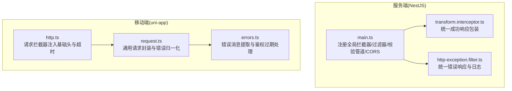
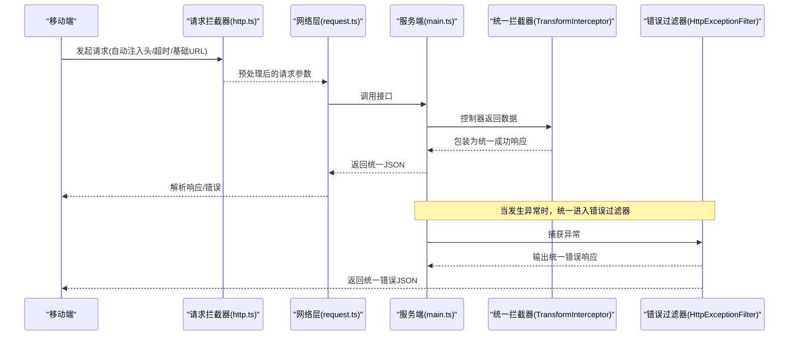
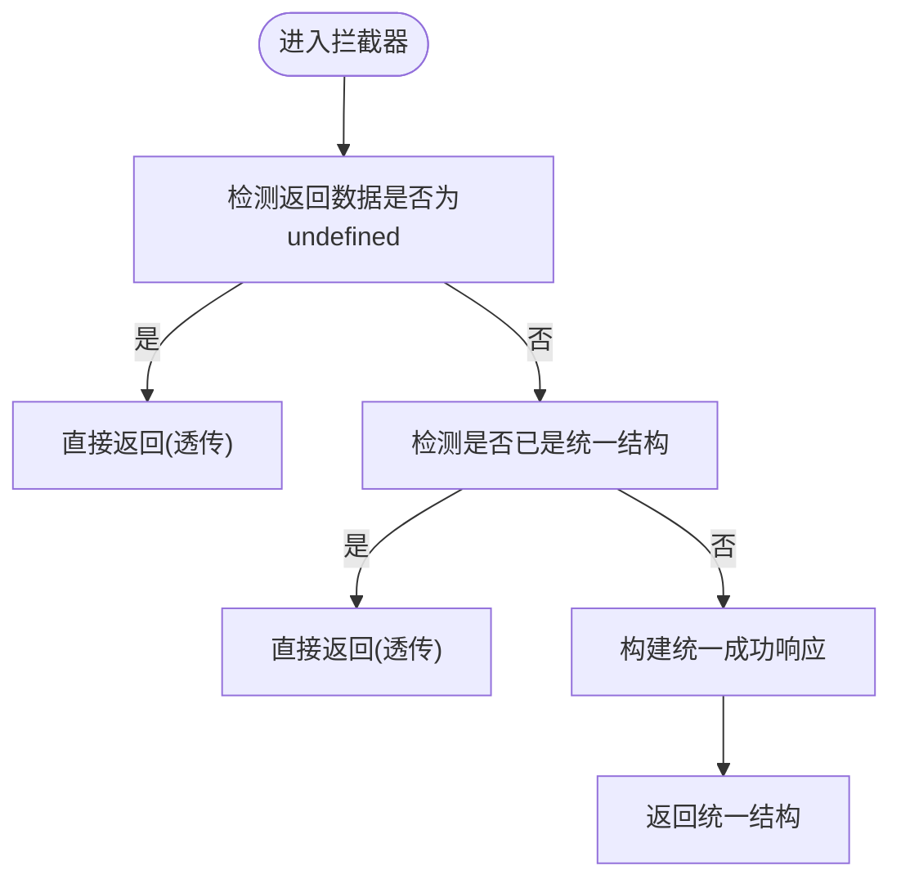
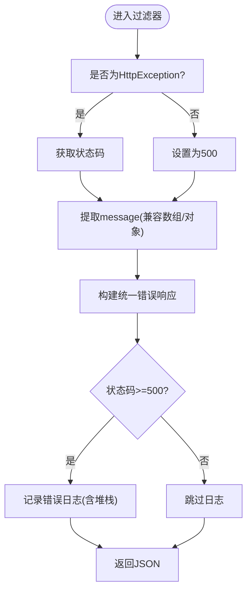
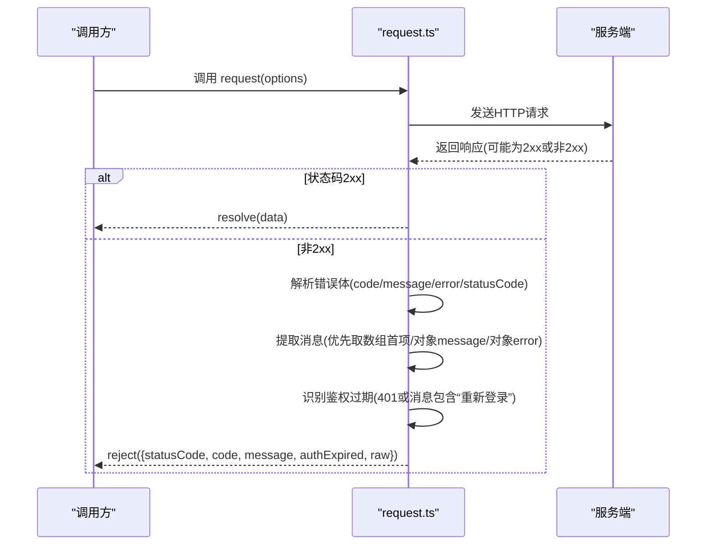
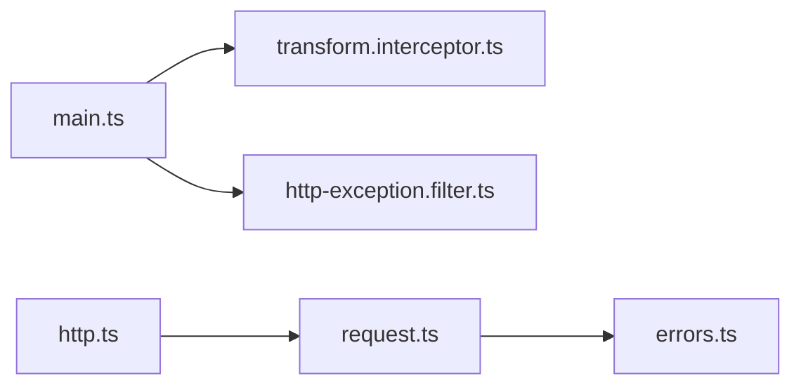

# 错误处理模式

<cite>
**本文引用的文件**
- [services/api/src/common/filters/http-exception.filter.ts](file://services/api/src/common/filters/http-exception.filter.ts)
- [services/api/src/common/interceptors/transform.interceptor.ts](file://services/api/src/common/interceptors/transform.interceptor.ts)
- [services/api/src/main.ts](file://services/api/src/main.ts)
- [apps/mobile/src/services/errors.ts](file://apps/mobile/src/services/errors.ts)
- [apps/mobile/src/interceptors/http.ts](file://apps/mobile/src/interceptors/http.ts)
- [apps/mobile/src/services/request.ts](file://apps/mobile/src/services/request.ts)
- [services/api/src/auth/auth.service.ts](file://services/api/src/auth/auth.service.ts)
</cite>

## 目录
1. [引言](#引言)
2. [项目结构](#项目结构)
3. [核心组件](#核心组件)
4. [架构总览](#架构总览)
5. [详细组件分析](#详细组件分析)
6. [依赖关系分析](#依赖关系分析)
7. [性能考量](#性能考量)
8. [故障排查指南](#故障排查指南)
9. [结论](#结论)
10. [附录](#附录)

## 引言
本文件为 Fortune Hub 建立统一的错误处理模式规范，覆盖服务端与移动端两端。目标是：
- 明确异常分类与处理策略：业务异常、系统异常、网络异常
- 统一错误码与国际化支持、用户友好提示
- 规范 HTTP 状态码使用（2xx 成功、4xx 客户端错误、5xx 服务器错误）
- 制定统一 JSON 错误响应格式与调试信息控制
- 规范错误日志记录（堆栈、上下文、性能指标）
- 提供错误恢复策略：重试、降级、熔断

## 项目结构
本项目由三部分组成：
- 服务端（NestJS）：全局拦截器与过滤器负责统一响应与错误处理
- 移动端（uni-app）：请求拦截器、通用请求封装与错误归一化
- 共享约定：统一的错误响应结构、状态码使用与日志记录

图表来源
- [services/api/src/main.ts:32-43](file://services/api/src/main.ts#L32-L43)
- [services/api/src/common/interceptors/transform.interceptor.ts:17-46](file://services/api/src/common/interceptors/transform.interceptor.ts#L17-L46)
- [services/api/src/common/filters/http-exception.filter.ts:18-40](file://services/api/src/common/filters/http-exception.filter.ts#L18-L40)
- [apps/mobile/src/services/request.ts:13-69](file://apps/mobile/src/services/request.ts#L13-L69)
- [apps/mobile/src/services/errors.ts:3-51](file://apps/mobile/src/services/errors.ts#L3-L51)
- [apps/mobile/src/interceptors/http.ts:18-48](file://apps/mobile/src/interceptors/http.ts#L18-L48)

章节来源
- [services/api/src/main.ts:32-43](file://services/api/src/main.ts#L32-L43)
- [apps/mobile/src/interceptors/http.ts:18-48](file://apps/mobile/src/interceptors/http.ts#L18-L48)

## 核心组件
- 统一成功响应拦截器：对控制器返回数据进行统一包装，避免重复字段与结构不一致
- 统一错误过滤器：捕获所有未处理异常，输出统一错误体，并按状态码级别记录日志
- 请求拦截器：自动注入基础头、超时时间、基础 URL，减少重复配置
- 通用请求封装：统一封装 success/fail 分支，解析服务端错误体，识别鉴权过期场景
- 错误消息归一化：从多种可能的错误载体中提取可读消息，提供回退文案

章节来源
- [services/api/src/common/interceptors/transform.interceptor.ts:17-58](file://services/api/src/common/interceptors/transform.interceptor.ts#L17-L58)
- [services/api/src/common/filters/http-exception.filter.ts:18-90](file://services/api/src/common/filters/http-exception.filter.ts#L18-L90)
- [apps/mobile/src/interceptors/http.ts:18-48](file://apps/mobile/src/interceptors/http.ts#L18-L48)
- [apps/mobile/src/services/request.ts:13-69](file://apps/mobile/src/services/request.ts#L13-L69)
- [apps/mobile/src/services/errors.ts:3-51](file://apps/mobile/src/services/errors.ts#L3-L51)

## 架构总览
下图展示从客户端到服务端的请求链路与错误处理路径。

图表来源
- [apps/mobile/src/interceptors/http.ts:18-48](file://apps/mobile/src/interceptors/http.ts#L18-L48)
- [apps/mobile/src/services/request.ts:13-69](file://apps/mobile/src/services/request.ts#L13-L69)
- [services/api/src/main.ts:32-43](file://services/api/src/main.ts#L32-L43)
- [services/api/src/common/interceptors/transform.interceptor.ts:17-46](file://services/api/src/common/interceptors/transform.interceptor.ts#L17-L46)
- [services/api/src/common/filters/http-exception.filter.ts:18-40](file://services/api/src/common/filters/http-exception.filter.ts#L18-L40)

## 详细组件分析

### 统一成功响应拦截器（TransformInterceptor）
- 功能：对控制器返回数据进行统一包装，包含 code/message/data/timestamp 字段；若数据已为统一结构则透传；对显式返回 undefined 的场景（如文件下载）不做包装
- 复杂度：O(1)，仅做结构判断与对象拼装
- 优化点：可扩展 data 序列化钩子以支持分页元信息等

图表来源
- [services/api/src/common/interceptors/transform.interceptor.ts:21-58](file://services/api/src/common/interceptors/transform.interceptor.ts#L21-L58)

章节来源
- [services/api/src/common/interceptors/transform.interceptor.ts:17-58](file://services/api/src/common/interceptors/transform.interceptor.ts#L17-L58)

### 统一错误过滤器（HttpExceptionFilter）
- 功能：捕获所有异常，根据是否为 HttpException 决定状态码；提取 message（兼容数组与对象），构造统一错误响应；对 5xx 错误记录堆栈日志
- 复杂度：O(1)，字符串与对象解析
- 日志策略：仅在 5xx 时记录堆栈，避免生产环境泄露敏感信息

图表来源
- [services/api/src/common/filters/http-exception.filter.ts:22-90](file://services/api/src/common/filters/http-exception.filter.ts#L22-L90)

章节来源
- [services/api/src/common/filters/http-exception.filter.ts:18-90](file://services/api/src/common/filters/http-exception.filter.ts#L18-L90)

### 服务端引导与全局注册（main.ts）
- 功能：设置全局前缀、注册全局过滤器与拦截器、启用 CORS、注册校验管道
- 关键点：全局拦截器保证所有响应统一；全局过滤器保证所有异常统一；ValidationPipe 启用转换与隐式类型转换

章节来源
- [services/api/src/main.ts:32-43](file://services/api/src/main.ts#L32-L43)

### 移动端请求拦截器（http.ts）
- 功能：自动注入基础 URL、超时时间、客户端标识与认证头；分别针对普通请求与上传请求设置不同默认超时
- 关键点：避免重复配置，统一注入 Authorization 与 X-Client

章节来源
- [apps/mobile/src/interceptors/http.ts:18-48](file://apps/mobile/src/interceptors/http.ts#L18-L48)

### 通用请求封装与错误归一化（request.ts）
- 功能：统一封装 success/fail 分支；当状态码不在 2xx 时，解析服务端错误体（code/message/error/statusCode），提取第一条可用消息；识别 401 或包含“重新登录”的消息为鉴权过期
- 错误对象：包含 statusCode/code/message/authExpired/raw
- 回退策略：当无法解析时，使用平台 errMsg 或统一回退文案

图表来源
- [apps/mobile/src/services/request.ts:13-69](file://apps/mobile/src/services/request.ts#L13-L69)

章节来源
- [apps/mobile/src/services/request.ts:13-69](file://apps/mobile/src/services/request.ts#L13-L69)

### 错误消息提取与鉴权过期处理（errors.ts）
- 功能：从多种错误载体中提取可读消息；提供 isAuthExpiredError 与 handleAuthExpired 辅助函数，清理会话并提示用户
- 关键点：兼容 message、errmsg、errMsg 等字段；支持数组消息取首个非空字符串

章节来源
- [apps/mobile/src/services/errors.ts:3-51](file://apps/mobile/src/services/errors.ts#L3-L51)

### 业务异常示例（AuthService）
- 功能：演示如何抛出标准 Nest 异常（如 UnauthorizedException、ConflictException、BadRequestException、BadGatewayException），由统一过滤器接管
- 关键点：数据库唯一约束冲突通过捕获驱动错误并映射为业务冲突异常

章节来源
- [services/api/src/auth/auth.service.ts:144-163](file://services/api/src/auth/auth.service.ts#L144-L163)
- [services/api/src/auth/auth.service.ts:175-185](file://services/api/src/auth/auth.service.ts#L175-L185)

## 依赖关系分析
- 服务端
  - main.ts 依赖 TransformInterceptor 与 HttpExceptionFilter
  - TransformInterceptor 无外部依赖
  - HttpExceptionFilter 依赖 Nest Logger 与 HttpStatus
- 移动端
  - request.ts 依赖 http.ts 注入的头与基础 URL
  - errors.ts 与 request.ts 协作完成错误消息提取与鉴权过期处理

图表来源
- [services/api/src/main.ts:32-43](file://services/api/src/main.ts#L32-L43)
- [services/api/src/common/interceptors/transform.interceptor.ts:17-46](file://services/api/src/common/interceptors/transform.interceptor.ts#L17-L46)
- [services/api/src/common/filters/http-exception.filter.ts:18-40](file://services/api/src/common/filters/http-exception.filter.ts#L18-L40)
- [apps/mobile/src/interceptors/http.ts:18-48](file://apps/mobile/src/interceptors/http.ts#L18-L48)
- [apps/mobile/src/services/request.ts:13-69](file://apps/mobile/src/services/request.ts#L13-L69)
- [apps/mobile/src/services/errors.ts:3-51](file://apps/mobile/src/services/errors.ts#L3-L51)

## 性能考量
- 统一拦截器与过滤器均为轻量操作，对吞吐影响极小
- 建议在服务端对高频错误（如鉴权失败）增加缓存命中率与快速拒绝策略
- 移动端请求拦截器统一超时设置，避免个别接口拖慢整体体验
- 对 5xx 错误记录堆栈，建议在生产环境限制日志采样率，避免日志风暴

## 故障排查指南
- 服务端
  - 若出现 5xx 错误但未记录堆栈，检查过滤器是否被正确注册
  - 若统一响应缺失 code/message/data/timestamp，检查控制器是否直接返回原始对象而非 DTO
- 移动端
  - 若错误消息显示“请求失败”，检查服务端是否返回了可解析的错误体
  - 若频繁出现“重新登录”，确认鉴权过期逻辑是否触发并清理本地会话
  - 若网络错误，检查请求拦截器是否正确注入 Authorization 与 X-Client

章节来源
- [services/api/src/common/filters/http-exception.filter.ts:32-37](file://services/api/src/common/filters/http-exception.filter.ts#L32-L37)
- [services/api/src/common/interceptors/transform.interceptor.ts:34-36](file://services/api/src/common/interceptors/transform.interceptor.ts#L34-L36)
- [apps/mobile/src/services/request.ts:43-49](file://apps/mobile/src/services/request.ts#L43-L49)
- [apps/mobile/src/interceptors/http.ts:23-34](file://apps/mobile/src/interceptors/http.ts#L23-L34)

## 结论
通过统一的成功响应包装、错误过滤与移动端错误归一化，Fortune Hub 实现了跨端一致的错误处理体验。建议在此基础上进一步完善错误码体系、国际化与调试信息分级策略，以提升可观测性与可维护性。

## 附录

### 异常分类与处理策略
- 业务异常
  - 示例：用户不存在、手机号已被绑定、参数校验失败
  - 处理：抛出标准 Nest 异常（如 UnauthorizedException、ConflictException、BadRequestException），由过滤器统一输出
- 系统异常
  - 示例：数据库连接失败、第三方服务不可用
  - 处理：抛出标准异常（如 BadGatewayException），过滤器输出 5xx 统一错误体并记录堆栈
- 网络异常
  - 示例：移动端网络超时、DNS 解析失败
  - 处理：request.ts 在 fail 分支中解析 errMsg 并回退提示

章节来源
- [services/api/src/auth/auth.service.ts:144-163](file://services/api/src/auth/auth.service.ts#L144-L163)
- [services/api/src/auth/auth.service.ts:175-185](file://services/api/src/auth/auth.service.ts#L175-L185)
- [apps/mobile/src/services/request.ts:59-66](file://apps/mobile/src/services/request.ts#L59-L66)

### 错误码设计规范
- 设计原则
  - 语义明确：错误码应反映具体错误类型，便于前端与日志检索
  - 可扩展：预留业务域错误码区间，避免冲突
  - 国际化：错误消息支持多语言，错误码保持稳定
- 建议结构
  - 一级：系统/业务域（如 1/2）
  - 二级：模块（如 01/02）
  - 三级：具体错误（如 01/02）
  - 示例：10101 表示“认证模块-令牌无效”
- 用户提示
  - 使用统一错误过滤器与 request.ts 的消息提取，确保提示一致性
  - 对于 5xx，向用户显示通用提示并记录日志以便追踪

章节来源
- [services/api/src/common/filters/http-exception.filter.ts:42-63](file://services/api/src/common/filters/http-exception.filter.ts#L42-L63)
- [apps/mobile/src/services/request.ts:38-42](file://apps/mobile/src/services/request.ts#L38-L42)

### HTTP 状态码使用
- 2xx 成功
  - 语义：请求成功，响应体为统一成功结构
  - 注意：避免直接返回原始对象，需经拦截器包装
- 4xx 客户端错误
  - 语义：参数错误、鉴权失败、资源不存在等
  - 处理：由过滤器输出统一错误体；移动端识别 401 与“重新登录”消息进行鉴权过期处理
- 5xx 服务器错误
  - 语义：服务内部错误
  - 处理：过滤器输出统一错误体并记录堆栈日志

章节来源
- [services/api/src/common/interceptors/transform.interceptor.ts:34-44](file://services/api/src/common/interceptors/transform.interceptor.ts#L34-L44)
- [services/api/src/common/filters/http-exception.filter.ts:27-30](file://services/api/src/common/filters/http-exception.filter.ts#L27-L30)
- [apps/mobile/src/services/request.ts:43-49](file://apps/mobile/src/services/request.ts#L43-L49)

### 统一错误响应格式
- 字段
  - code：状态码或自定义错误码
  - message：错误信息（字符串或数组首项）
  - data：错误时为 null
  - timestamp：ISO 时间戳
- 示例路径
  - 统一错误体构建：[buildErrorBody:42-63](file://services/api/src/common/filters/http-exception.filter.ts#L42-L63)
  - 统一成功体构建：[拦截器包装:34-44](file://services/api/src/common/interceptors/transform.interceptor.ts#L34-L44)

章节来源
- [services/api/src/common/filters/http-exception.filter.ts:11-16](file://services/api/src/common/filters/http-exception.filter.ts#L11-L16)
- [services/api/src/common/interceptors/transform.interceptor.ts:10-15](file://services/api/src/common/interceptors/transform.interceptor.ts#L10-L15)

### 错误日志记录
- 记录内容
  - 状态码、消息、堆栈（仅 5xx）
  - 上下文：请求路径、方法、客户端标识
- 建议
  - 生产环境限制日志采样率，避免日志风暴
  - 对敏感信息脱敏（如手机号、Token）

章节来源
- [services/api/src/common/filters/http-exception.filter.ts:32-37](file://services/api/src/common/filters/http-exception.filter.ts#L32-L37)

### 错误恢复策略
- 重试机制
  - 适用：瞬时网络波动、第三方限流
  - 建议：指数退避，最大重试次数与超时阈值可配置
- 降级方案
  - 适用：部分功能不可用时，返回兜底数据或简化视图
- 熔断处理
  - 适用：第三方服务持续不稳定
  - 建议：统计错误率与请求量，超过阈值后短时熔断并快速失败

[本节为通用指导，无需特定文件引用]