# 实体模型设计

<cite>
**本文引用的文件**
- [services/api/src/database/entities/user.entity.ts](file://services/api/src/database/entities/user.entity.ts)
- [services/api/src/database/entities/user-record.entity.ts](file://services/api/src/database/entities/user-record.entity.ts)
- [services/api/src/database/entities/order.entity.ts](file://services/api/src/database/entities/order.entity.ts)
- [services/api/src/database/entities/favorite.entity.ts](file://services/api/src/database/entities/favorite.entity.ts)
- [services/api/src/database/entities/assessment-session.entity.ts](file://services/api/src/database/entities/assessment-session.entity.ts)
- [services/api/src/database/entities/assessment-question.entity.ts](file://services/api/src/database/entities/assessment-question.entity.ts)
- [services/api/src/database/entities/assessment-test-group.entity.ts](file://services/api/src/database/entities/assessment-test-group.entity.ts)
- [services/api/src/database/entities/membership-product.entity.ts](file://services/api/src/database/entities/membership-product.entity.ts)
- [services/api/src/database/entities/report-template.entity.ts](file://services/api/src/database/entities/report-template.entity.ts)
- [services/api/src/database/entities/fortune-content.entity.ts](file://services/api/src/database/entities/fortune-content.entity.ts)
- [services/api/src/database/entities/divination-review.entity.ts](file://services/api/src/database/entities/divination-review.entity.ts)
- [services/api/src/database/entities/user-consent.entity.ts](file://services/api/src/database/entities/user-consent.entity.ts)
- [services/api/src/database/data-source.ts](file://services/api/src/database/data-source.ts)
</cite>

## 目录
1. [简介](#简介)
2. [项目结构](#项目结构)
3. [核心组件](#核心组件)
4. [架构总览](#架构总览)
5. [详细组件分析](#详细组件分析)
6. [依赖分析](#依赖分析)
7. [性能考虑](#性能考虑)
8. [故障排查指南](#故障排查指南)
9. [结论](#结论)
10. [附录](#附录)

## 简介
本文件系统性梳理 Fortune Hub 的 TypeORM 实体模型设计与实现，围绕以下主题展开：TypeORM 装饰器用法（@Entity、@Column、@PrimaryGeneratedColumn、@Index、@CreateDateColumn、@UpdateDateColumn）、字段类型映射规则（字符串、数字、日期、JSON 等）、主键与外键设计原则（自增主键、UUID 主键选择策略）、索引设计规范（唯一索引、复合索引）以及实体关系映射示例（一对一、一对多、多对多）。同时给出数据验证、默认值与字段约束的最佳实践，帮助开发者在保持一致性的同时提升可维护性与查询性能。

## 项目结构
本项目采用按功能域划分的模块化组织方式，数据库层位于服务端应用内部，TypeORM 数据源集中配置，实体文件按领域模型分组存放于 entities 目录下，并通过数据源统一注册。

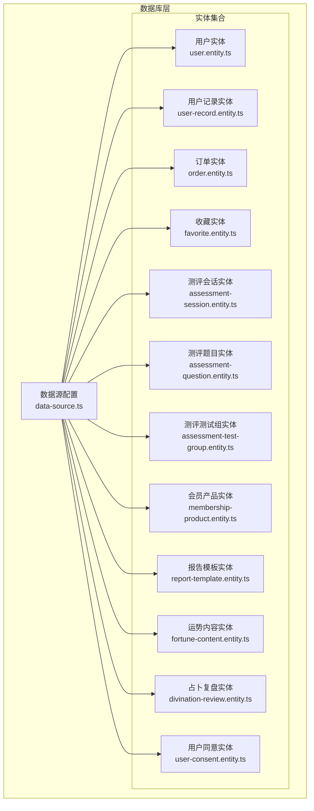

图表来源
- [services/api/src/database/data-source.ts:32-72](file://services/api/src/database/data-source.ts#L32-L72)
- [services/api/src/database/entities/user.entity.ts:10-74](file://services/api/src/database/entities/user.entity.ts#L10-L74)
- [services/api/src/database/entities/user-record.entity.ts:10-49](file://services/api/src/database/entities/user-record.entity.ts#L10-L49)
- [services/api/src/database/entities/order.entity.ts:10-52](file://services/api/src/database/entities/order.entity.ts#L10-L52)
- [services/api/src/database/entities/favorite.entity.ts:10-48](file://services/api/src/database/entities/favorite.entity.ts#L10-L48)
- [services/api/src/database/entities/assessment-session.entity.ts:3-22](file://services/api/src/database/entities/assessment-session.entity.ts#L3-L22)
- [services/api/src/database/entities/assessment-question.entity.ts:10-51](file://services/api/src/database/entities/assessment-question.entity.ts#L10-L51)
- [services/api/src/database/entities/assessment-test-group.entity.ts:10-48](file://services/api/src/database/entities/assessment-test-group.entity.ts#L10-L48)
- [services/api/src/database/entities/membership-product.entity.ts:10-49](file://services/api/src/database/entities/membership-product.entity.ts#L10-L49)
- [services/api/src/database/entities/report-template.entity.ts:10-61](file://services/api/src/database/entities/report-template.entity.ts#L10-L61)
- [services/api/src/database/entities/fortune-content.entity.ts:10-48](file://services/api/src/database/entities/fortune-content.entity.ts#L10-L48)
- [services/api/src/database/entities/divination-review.entity.ts:10-66](file://services/api/src/database/entities/divination-review.entity.ts#L10-L66)
- [services/api/src/database/entities/user-consent.entity.ts:10-46](file://services/api/src/database/entities/user-consent.entity.ts#L10-L46)

章节来源
- [services/api/src/database/data-source.ts:32-72](file://services/api/src/database/data-source.ts#L32-L72)

## 核心组件
本节聚焦 TypeORM 装饰器在实体中的典型用法与配置要点，涵盖实体声明、列定义、主键生成、索引与时间戳管理。

- @Entity：用于标记类为数据库表映射实体，支持指定表名等选项。
- @Column：定义列属性，包括类型、长度、是否可空、默认值、精度/小数位等。
- @PrimaryGeneratedColumn：定义主键生成策略，支持自增或 UUID。
- @Index：定义索引，支持唯一索引与复合索引。
- @CreateDateColumn/@UpdateDateColumn：自动维护创建与更新时间戳。

示例路径（不展示具体代码内容）
- [用户实体装饰器与列定义:10-74](file://services/api/src/database/entities/user.entity.ts#L10-L74)
- [用户记录实体装饰器与列定义:10-49](file://services/api/src/database/entities/user-record.entity.ts#L10-L49)
- [订单实体装饰器与列定义:10-52](file://services/api/src/database/entities/order.entity.ts#L10-L52)
- [收藏实体装饰器与列定义:10-48](file://services/api/src/database/entities/favorite.entity.ts#L10-L48)
- [测评会话实体装饰器与列定义:3-22](file://services/api/src/database/entities/assessment-session.entity.ts#L3-L22)
- [测评题目实体装饰器与列定义:10-51](file://services/api/src/database/entities/assessment-question.entity.ts#L10-L51)
- [测评测试组实体装饰器与列定义:10-48](file://services/api/src/database/entities/assessment-test-group.entity.ts#L10-L48)
- [会员产品实体装饰器与列定义:10-49](file://services/api/src/database/entities/membership-product.entity.ts#L10-L49)
- [报告模板实体装饰器与列定义:10-61](file://services/api/src/database/entities/report-template.entity.ts#L10-L61)
- [运势内容实体装饰器与列定义:10-48](file://services/api/src/database/entities/fortune-content.entity.ts#L10-L48)
- [占卜复盘实体装饰器与列定义:10-66](file://services/api/src/database/entities/divination-review.entity.ts#L10-L66)
- [用户同意实体装饰器与列定义:10-46](file://services/api/src/database/entities/user-consent.entity.ts#L10-L46)

章节来源
- [services/api/src/database/entities/user.entity.ts:10-74](file://services/api/src/database/entities/user.entity.ts#L10-L74)
- [services/api/src/database/entities/user-record.entity.ts:10-49](file://services/api/src/database/entities/user-record.entity.ts#L10-L49)
- [services/api/src/database/entities/order.entity.ts:10-52](file://services/api/src/database/entities/order.entity.ts#L10-L52)
- [services/api/src/database/entities/favorite.entity.ts:10-48](file://services/api/src/database/entities/favorite.entity.ts#L10-L48)
- [services/api/src/database/entities/assessment-session.entity.ts:3-22](file://services/api/src/database/entities/assessment-session.entity.ts#L3-L22)
- [services/api/src/database/entities/assessment-question.entity.ts:10-51](file://services/api/src/database/entities/assessment-question.entity.ts#L10-L51)
- [services/api/src/database/entities/assessment-test-group.entity.ts:10-48](file://services/api/src/database/entities/assessment-test-group.entity.ts#L10-L48)
- [services/api/src/database/entities/membership-product.entity.ts:10-49](file://services/api/src/database/entities/membership-product.entity.ts#L10-L49)
- [services/api/src/database/entities/report-template.entity.ts:10-61](file://services/api/src/database/entities/report-template.entity.ts#L10-L61)
- [services/api/src/database/entities/fortune-content.entity.ts:10-48](file://services/api/src/database/entities/fortune-content.entity.ts#L10-L48)
- [services/api/src/database/entities/divination-review.entity.ts:10-66](file://services/api/src/database/entities/divination-review.entity.ts#L10-L66)
- [services/api/src/database/entities/user-consent.entity.ts:10-46](file://services/api/src/database/entities/user-consent.entity.ts#L10-L46)

## 架构总览
下图展示了数据源与实体之间的装配关系，体现实体注册、迁移路径与运行时加载顺序。

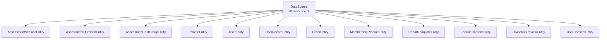

图表来源
- [services/api/src/database/data-source.ts:32-72](file://services/api/src/database/data-source.ts#L32-L72)

章节来源
- [services/api/src/database/data-source.ts:32-72](file://services/api/src/database/data-source.ts#L32-L72)

## 详细组件分析

### 用户实体（UserEntity）
- 主键：自增 bigint，无符号。
- 唯一索引：openid、phone。
- 普通索引：zodiac。
- 字段类型映射：字符串（varchar/date/json）、日期（datetime）、布尔默认值（通过枚举/字符串表示）。
- 默认值与约束：gender 默认值、vipStatus 默认值、部分字段允许为空。
- 时间戳：自动维护创建与更新时间。

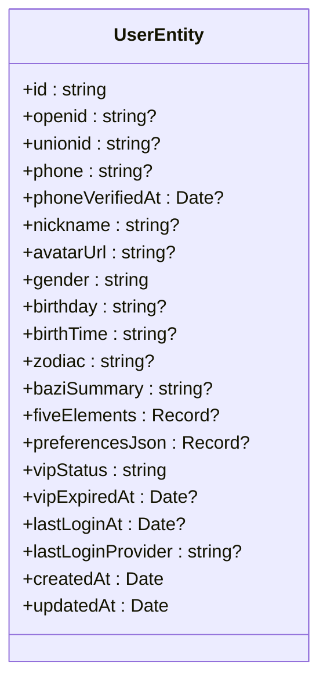

图表来源
- [services/api/src/database/entities/user.entity.ts:14-74](file://services/api/src/database/entities/user.entity.ts#L14-L74)

章节来源
- [services/api/src/database/entities/user.entity.ts:10-74](file://services/api/src/database/entities/user.entity.ts#L10-L74)

### 用户记录实体（UserRecordEntity）
- 主键：自增 bigint，无符号。
- 复合索引：userId + recordType；createdAt。
- 字段类型映射：字符串、数值（decimal）、布尔、JSON。
- 默认值与约束：布尔默认值、字符串长度限制。
- 时间戳：自动维护创建与更新时间。

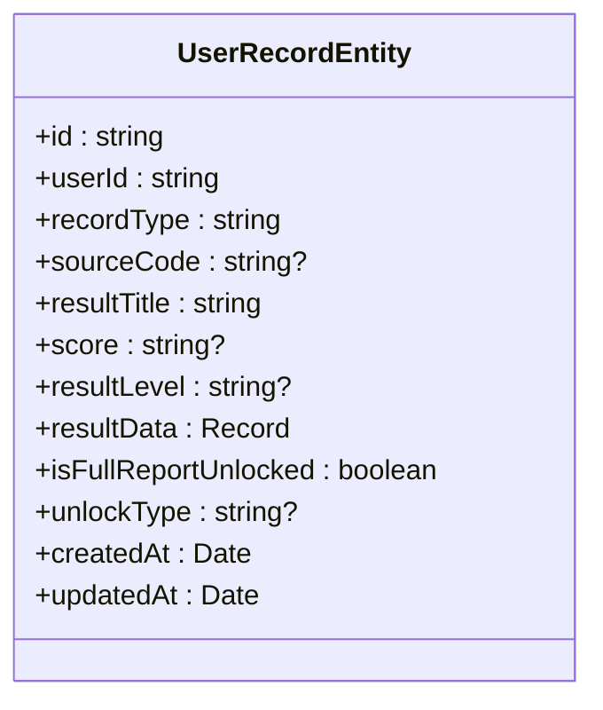

图表来源
- [services/api/src/database/entities/user-record.entity.ts:13-49](file://services/api/src/database/entities/user-record.entity.ts#L13-L49)

章节来源
- [services/api/src/database/entities/user-record.entity.ts:10-49](file://services/api/src/database/entities/user-record.entity.ts#L10-L49)

### 订单实体（OrderEntity）
- 主键：自增 bigint，无符号。
- 唯一索引：orderNo；复合索引：userId + status。
- 字段类型映射：字符串、整型（金额以分为单位）、JSON、日期。
- 默认值与约束：orderType、status 默认值。
- 时间戳：自动维护创建与更新时间。

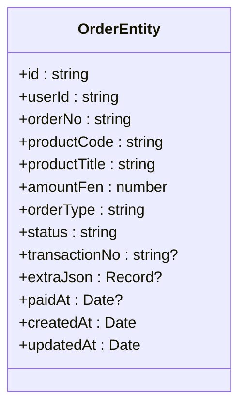

图表来源
- [services/api/src/database/entities/order.entity.ts:13-52](file://services/api/src/database/entities/order.entity.ts#L13-L52)

章节来源
- [services/api/src/database/entities/order.entity.ts:10-52](file://services/api/src/database/entities/order.entity.ts#L10-L52)

### 收藏实体（FavoriteEntity）
- 主键：自增 bigint，无符号。
- 唯一索引：userId + itemType + itemKey；复合索引：userId + createdAt。
- 字段类型映射：字符串、JSON。
- 默认值与约束：字符串长度限制。
- 时间戳：自动维护创建与更新时间。

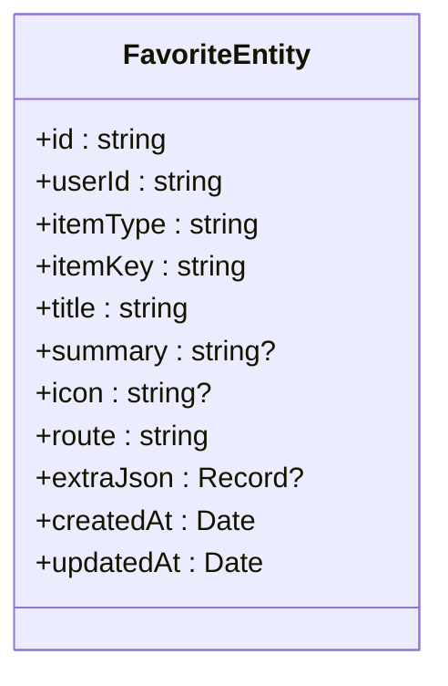

图表来源
- [services/api/src/database/entities/favorite.entity.ts:15-48](file://services/api/src/database/entities/favorite.entity.ts#L15-L48)

章节来源
- [services/api/src/database/entities/favorite.entity.ts:10-48](file://services/api/src/database/entities/favorite.entity.ts#L10-L48)

### 测评会话实体（AssessmentSessionEntity）
- 主键：UUID。
- 字段类型映射：字符串、整型。
- 默认值与约束：整型默认值。
- 时间戳：自动维护创建时间。

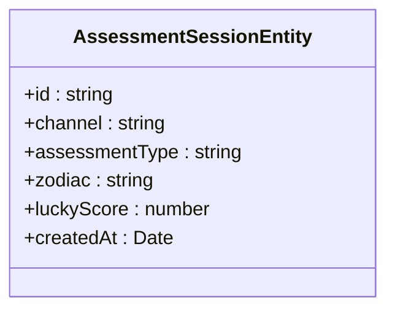

图表来源
- [services/api/src/database/entities/assessment-session.entity.ts:4-22](file://services/api/src/database/entities/assessment-session.entity.ts#L4-L22)

章节来源
- [services/api/src/database/entities/assessment-session.entity.ts:3-22](file://services/api/src/database/entities/assessment-session.entity.ts#L3-L22)

### 测评题目实体（AssessmentQuestionEntity）
- 主键：自增 bigint，无符号。
- 复合索引：category + testCode + sortOrder；category + testCode + questionId（唯一）。
- 字段类型映射：文本、JSON、整型、日期。
- 默认值与约束：状态默认值。
- 时间戳：自动维护创建与更新时间。

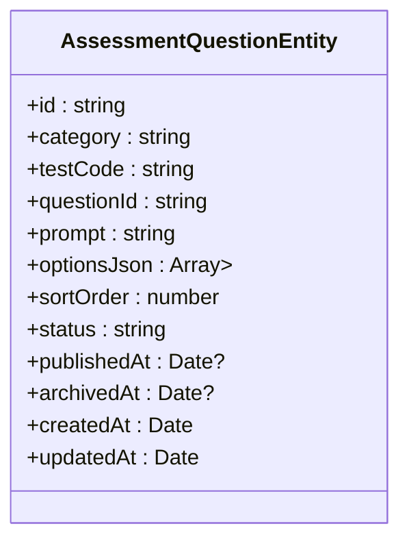

图表来源
- [services/api/src/database/entities/assessment-question.entity.ts:15-51](file://services/api/src/database/entities/assessment-question.entity.ts#L15-L51)

章节来源
- [services/api/src/database/entities/assessment-question.entity.ts:10-51](file://services/api/src/database/entities/assessment-question.entity.ts#L10-L51)

### 测评测试组实体（AssessmentTestGroupEntity）
- 主键：自增 bigint，无符号。
- 唯一索引：category + code；复合索引：category + status。
- 字段类型映射：字符串、整型、日期。
- 默认值与约束：字符串默认值、整型默认值。
- 时间戳：自动维护创建与更新时间。

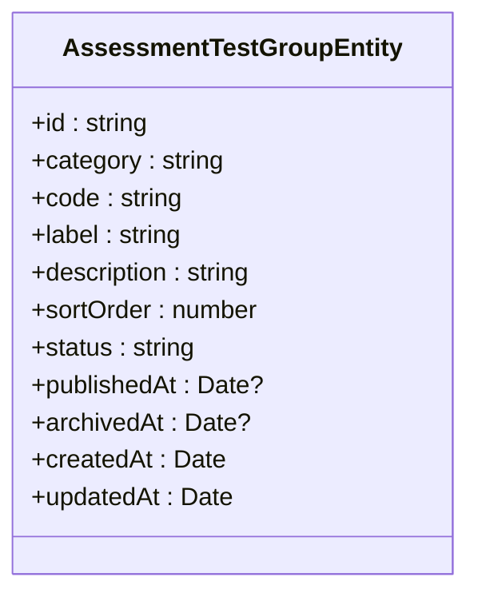

图表来源
- [services/api/src/database/entities/assessment-test-group.entity.ts:15-48](file://services/api/src/database/entities/assessment-test-group.entity.ts#L15-L48)

章节来源
- [services/api/src/database/entities/assessment-test-group.entity.ts:10-48](file://services/api/src/database/entities/assessment-test-group.entity.ts#L10-L48)

### 会员产品实体（MembershipProductEntity）
- 主键：自增 bigint，无符号。
- 唯一索引：code；复合索引：status + sortOrder。
- 字段类型映射：字符串、整型、JSON。
- 默认值与约束：整型默认值。
- 时间戳：自动维护创建与更新时间。

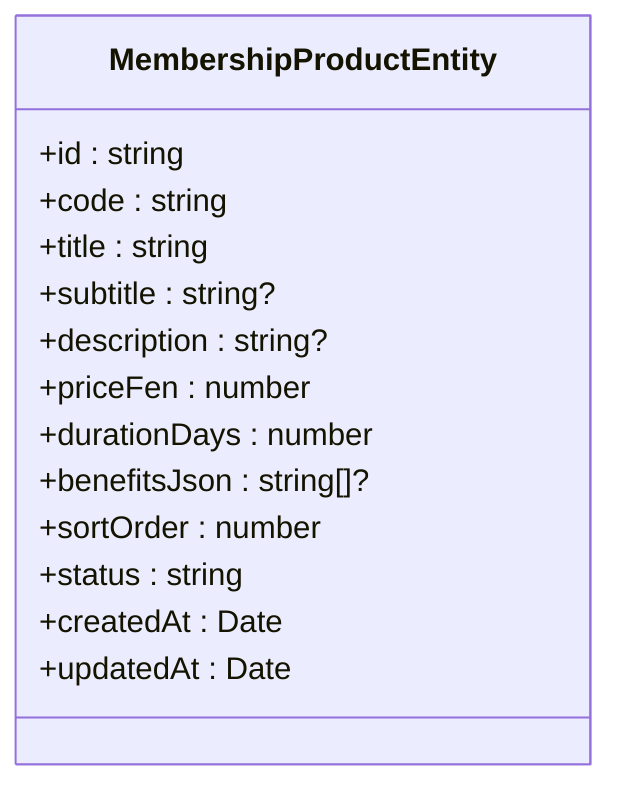

图表来源
- [services/api/src/database/entities/membership-product.entity.ts:13-49](file://services/api/src/database/entities/membership-product.entity.ts#L13-L49)

章节来源
- [services/api/src/database/entities/membership-product.entity.ts:10-49](file://services/api/src/database/entities/membership-product.entity.ts#L10-L49)

### 报告模板实体（ReportTemplateEntity）
- 主键：自增 bigint，无符号。
- 唯一索引：templateType + bizCode；复合索引：templateType + status + sortOrder。
- 字段类型映射：字符串、整型、JSON、日期。
- 默认值与约束：字符串默认值。
- 时间戳：自动维护创建与更新时间。

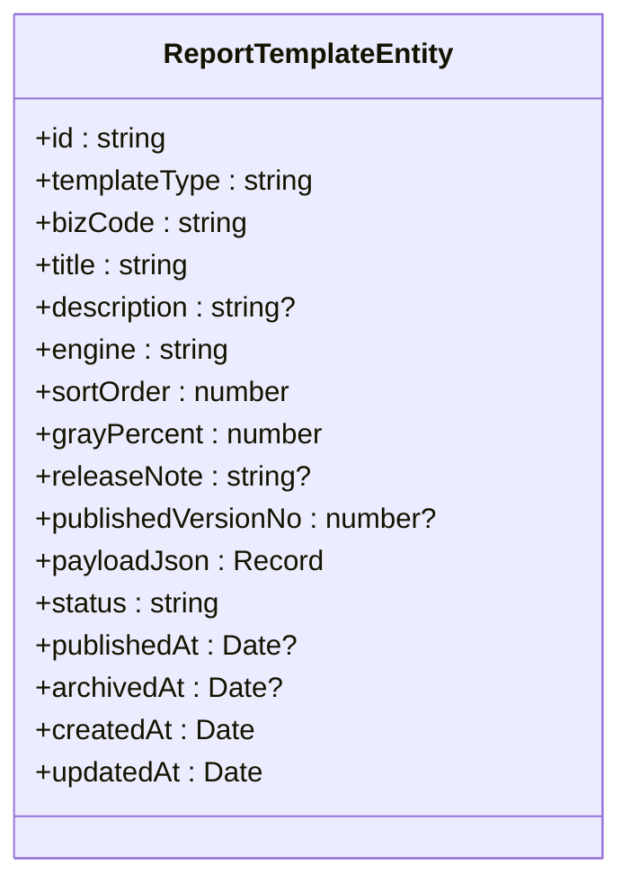

图表来源
- [services/api/src/database/entities/report-template.entity.ts:13-61](file://services/api/src/database/entities/report-template.entity.ts#L13-L61)

章节来源
- [services/api/src/database/entities/report-template.entity.ts:10-61](file://services/api/src/database/entities/report-template.entity.ts#L10-L61)

### 运势内容实体（FortuneContentEntity）
- 主键：自增 bigint，无符号。
- 复合索引：contentType + status + publishDate。
- 字段类型映射：字符串、日期、JSON、日期。
- 默认值与约束：字符串默认值。
- 时间戳：自动维护创建与更新时间。

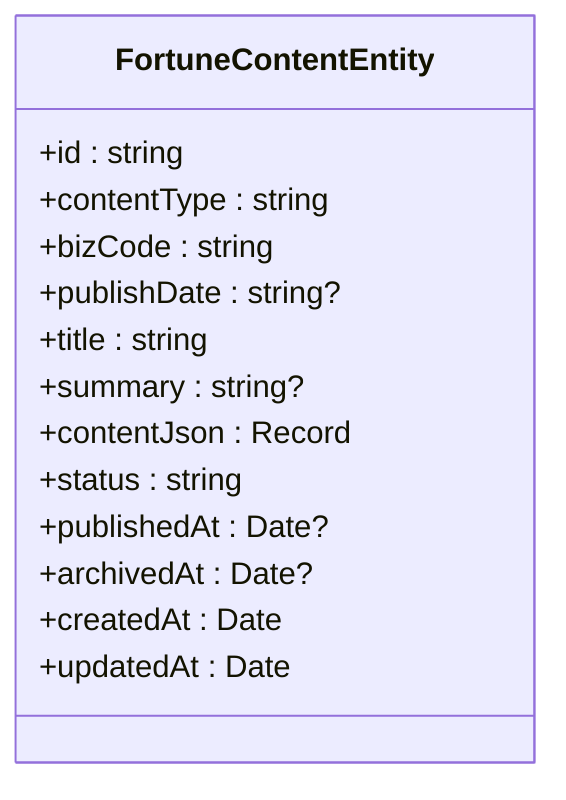

图表来源
- [services/api/src/database/entities/fortune-content.entity.ts:12-48](file://services/api/src/database/entities/fortune-content.entity.ts#L12-L48)

章节来源
- [services/api/src/database/entities/fortune-content.entity.ts:10-48](file://services/api/src/database/entities/fortune-content.entity.ts#L10-L48)

### 占卜复盘实体（DivinationReviewEntity）
- 主键：自增 bigint，无符号。
- 唯一索引：userId + resultId；复合索引：userId + updatedAt。
- 字段类型映射：布尔、字符串、JSON、整型、日期。
- 默认值与约束：布尔默认值、枚举字符串默认值。
- 时间戳：自动维护创建与更新时间。

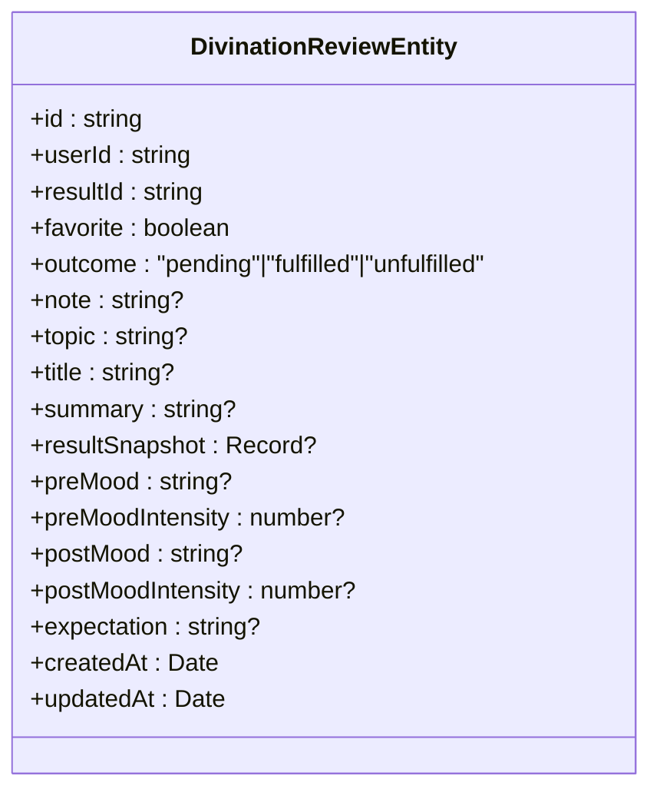

图表来源
- [services/api/src/database/entities/divination-review.entity.ts:15-66](file://services/api/src/database/entities/divination-review.entity.ts#L15-L66)

章节来源
- [services/api/src/database/entities/divination-review.entity.ts:10-66](file://services/api/src/database/entities/divination-review.entity.ts#L10-L66)

### 用户同意实体（UserConsentEntity）
- 主键：自增 bigint，无符号。
- 复合索引：userId + consentType；consentType + version + status。
- 字段类型映射：字符串、JSON、日期。
- 默认值与约束：字符串默认值。
- 时间戳：自动维护创建与更新时间。

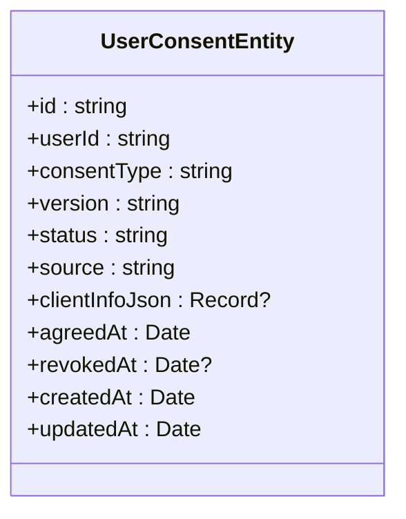

图表来源
- [services/api/src/database/entities/user-consent.entity.ts:13-46](file://services/api/src/database/entities/user-consent.entity.ts#L13-L46)

章节来源
- [services/api/src/database/entities/user-consent.entity.ts:10-46](file://services/api/src/database/entities/user-consent.entity.ts#L10-L46)

### 关系映射示例与最佳实践
- 一对一：通过唯一索引与外键约束实现（例如用户与用户记录、用户与占卜复盘之间的一对一关联可通过 userId + 唯一索引实现）。
- 一对多：通过外键字段（如 userId）与查询侧聚合实现（例如用户与多个收藏项）。
- 多对多：通过中间表或 JSON 数组存储实现（例如收藏项的多对多标签，若存在中间表则建议使用独立实体承载）。
- 外键设计：当前实体未显式使用 @ManyToOne/@OneToMany 等关系装饰器，但通过外键字段（如 userId）与索引组合实现逻辑关联；建议在需要强一致性的场景引入关系装饰器以增强可读性与工具链支持。

章节来源
- [services/api/src/database/entities/user-record.entity.ts:17-18](file://services/api/src/database/entities/user-record.entity.ts#L17-L18)
- [services/api/src/database/entities/favorite.entity.ts:19-20](file://services/api/src/database/entities/favorite.entity.ts#L19-L20)
- [services/api/src/database/entities/divination-review.entity.ts:19-20](file://services/api/src/database/entities/divination-review.entity.ts#L19-L20)

## 依赖分析
- 数据源装配：数据源集中注册所有实体与迁移路径，确保运行时加载顺序与一致性。
- 实体耦合：实体间通过外键字段（如 userId）建立弱耦合关联，避免直接关系装饰器导致的循环依赖风险。
- 外部依赖：TypeORM 作为 ORM 框架，MySQL 作为持久化后端；数据源配置集中管理主机、端口、账号、数据库、时区与同步策略。

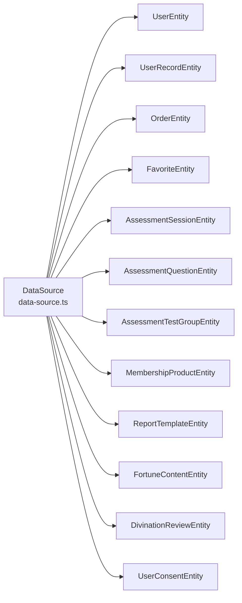

图表来源
- [services/api/src/database/data-source.ts:32-72](file://services/api/src/database/data-source.ts#L32-L72)

章节来源
- [services/api/src/database/data-source.ts:32-72](file://services/api/src/database/data-source.ts#L32-L72)

## 性能考虑
- 索引设计
  - 唯一索引：用于保证业务唯一性（如 openid、phone、orderNo、收藏唯一键），减少重复写入与查询歧义。
  - 复合索引：覆盖高频查询条件（如用户维度 + 状态、类型 + 排序、时间范围），降低全表扫描概率。
- 字段类型选择
  - 高基数字符串使用 varchar 并限定长度；金额统一使用整型（分）存储，避免浮点误差。
  - JSON 字段仅在必要时使用，避免过度反范式化导致查询复杂度上升。
- 时间戳
  - 使用自动时间戳装饰器，减少业务侧冗余逻辑，统一时区与时钟处理。
- 主键策略
  - 自增主键适用于高吞吐写入场景；UUID 主键适用于分布式场景或需要隐藏自增序列的场景。

## 故障排查指南
- 索引冲突
  - 现象：唯一索引冲突导致插入失败。
  - 排查：确认唯一键组合与业务规则一致，检查数据清洗与幂等处理。
- 查询性能异常
  - 现象：慢查询或回表过多。
  - 排查：核对 WHERE 条件是否命中索引，评估复合索引覆盖度，必要时调整索引顺序或拆分查询。
- 类型不匹配
  - 现象：JSON 字段解析错误或数值精度丢失。
  - 排查：确认字段类型与默认值配置，金额字段统一为整型存储。
- 时间与时区
  - 现象：时间显示异常或跨时区错乱。
  - 排查：核对数据源时区配置与前端展示策略，确保统一时区处理。

## 结论
本实体模型设计遵循“明确主键、合理索引、类型清晰、默认值与约束可见”的原则，结合自增与 UUID 的主键策略满足不同场景需求。通过复合索引与 JSON 字段的适度使用，在保证查询效率的同时兼顾灵活性。建议在后续迭代中逐步引入关系装饰器以增强可读性与工具链支持，并持续优化索引覆盖与查询模式。

## 附录
- 字段类型映射速查
  - 字符串：varchar/char，配合 length 限制。
  - 数字：int/tinint/smallint/bigint，decimal(precision,scale)，unsigned 控制正数。
  - 日期：datetime/date/time，统一时区与时钟。
  - JSON：json，用于动态结构或配置存储。
- 装饰器最佳实践
  - @Entity：明确表名，便于迁移与维护。
  - @Column：严格定义长度、精度、默认值与可空性。
  - @PrimaryGeneratedColumn：优先自增主键，必要时使用 UUID。
  - @Index：为高频查询字段建立唯一或复合索引。
  - @CreateDateColumn/@UpdateDateColumn：统一时间戳管理，避免业务侧重复逻辑。