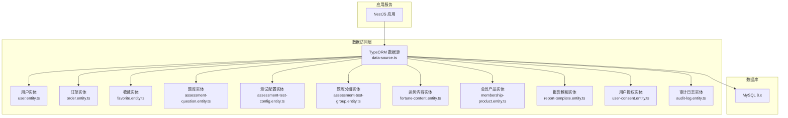
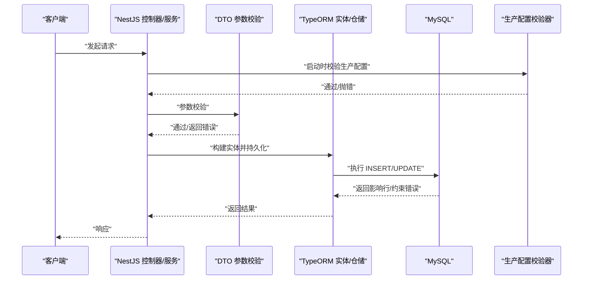
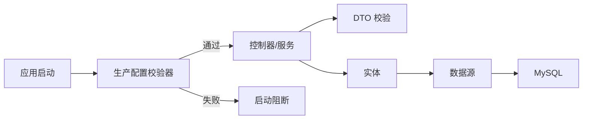

# 数据完整性与安全

<cite>
**本文引用的文件**
- [数据库设计文档.md](file://docs/数据库设计文档.md)
- [data-source.ts](file://services/api/src/database/data-source.ts)
- [user.entity.ts](file://services/api/src/database/entities/user.entity.ts)
- [order.entity.ts](file://services/api/src/database/entities/order.entity.ts)
- [favorite.entity.ts](file://services/api/src/database/entities/favorite.entity.ts)
- [assessment-question.entity.ts](file://services/api/src/database/entities/assessment-question.entity.ts)
- [assessment-test-config.entity.ts](file://services/api/src/database/entities/assessment-test-config.entity.ts)
- [assessment-test-group.entity.ts](file://services/api/src/database/entities/assessment-test-group.entity.ts)
- [fortune-content.entity.ts](file://services/api/src/database/entities/fortune-content.entity.ts)
- [membership-product.entity.ts](file://services/api/src/database/entities/membership-product.entity.ts)
- [report-template.entity.ts](file://services/api/src/database/entities/report-template.entity.ts)
- [user-consent.entity.ts](file://services/api/src/database/entities/user-consent.entity.ts)
- [audit-log.entity.ts](file://services/api/src/database/entities/audit-log.entity.ts)
- [production-config.validator.ts](file://services/api/src/common/production-config.validator.ts)
- [admin-login.dto.ts](file://services/api/src/admin-auth/dto/admin-login.dto.ts)
- [phone-login.dto.ts](file://services/api/src/auth/dto/phone-login.dto.ts)
- [update-profile.dto.ts](file://services/api/src/users/dto/update-profile.dto.ts)
- [create-order.dto.ts](file://services/api/src/orders/dto/create-order.dto.ts)
</cite>

## 目录
1. [引言](#引言)
2. [项目结构](#项目结构)
3. [核心组件](#核心组件)
4. [架构总览](#架构总览)
5. [详细组件分析](#详细组件分析)
6. [依赖分析](#依赖分析)
7. [性能考虑](#性能考虑)
8. [故障排查指南](#故障排查指南)
9. [结论](#结论)
10. [附录](#附录)

## 引言
本文件面向 Fortune Hub 的数据完整性与安全，系统性梳理数据库约束设计（NOT NULL、UNIQUE、CHECK 的使用场景）、外键与级联策略、前后端与数据库三层验证机制、数据加密与传输安全、备份与恢复策略，以及数据脱敏与隐私合规实践。文档以仓库现有代码与设计文档为基础，结合实体定义与配置校验器，给出可落地的实施建议与最佳实践。

## 项目结构
- 后端采用 NestJS + TypeORM + MySQL，数据库连接与实体注册集中在数据源配置中。
- 实体定义覆盖用户、订单、收藏、测评题库、运势内容、会员产品、报告模板、用户授权与审计日志等核心业务表。
- 配置校验器在生产环境强制要求 HTTPS、强口令、禁用危险开关，并校验支付相关参数。

图表来源
- [data-source.ts:32-72](file://services/api/src/database/data-source.ts#L32-L72)
- [user.entity.ts:10-74](file://services/api/src/database/entities/user.entity.ts#L10-L74)
- [order.entity.ts:10-52](file://services/api/src/database/entities/order.entity.ts#L10-L52)
- [favorite.entity.ts:10-48](file://services/api/src/database/entities/favorite.entity.ts#L10-L48)
- [assessment-question.entity.ts:10-51](file://services/api/src/database/entities/assessment-question.entity.ts#L10-L51)
- [assessment-test-config.entity.ts:10-66](file://services/api/src/database/entities/assessment-test-config.entity.ts#L10-L66)
- [assessment-test-group.entity.ts:10-48](file://services/api/src/database/entities/assessment-test-group.entity.ts#L10-L48)
- [fortune-content.entity.ts:10-48](file://services/api/src/database/entities/fortune-content.entity.ts#L10-L48)
- [membership-product.entity.ts:10-49](file://services/api/src/database/entities/membership-product.entity.ts#L10-L49)
- [report-template.entity.ts:10-61](file://services/api/src/database/entities/report-template.entity.ts#L10-L61)
- [user-consent.entity.ts:10-46](file://services/api/src/database/entities/user-consent.entity.ts#L10-L46)
- [audit-log.entity.ts:9-36](file://services/api/src/database/entities/audit-log.entity.ts#L9-L36)

章节来源
- [data-source.ts:32-72](file://services/api/src/database/data-source.ts#L32-L72)
- [数据库设计文档.md:1-515](file://docs/数据库设计文档.md#L1-L515)

## 核心组件
- 数据源与实体注册：集中于数据源配置，统一加载所有业务实体与迁移脚本路径。
- 实体与索引：各实体通过装饰器声明字段类型、默认值、索引与唯一约束，形成数据库层面的约束基础。
- 配置校验器：在生产环境强制执行安全与合规检查，避免弱口令、非 HTTPS、错误支付配置等风险。

章节来源
- [data-source.ts:32-72](file://services/api/src/database/data-source.ts#L32-L72)
- [production-config.validator.ts:25-104](file://services/api/src/common/production-config.validator.ts#L25-L104)

## 架构总览
下图展示数据完整性与安全的关键交互：请求经 DTO 校验与业务服务处理，最终由 TypeORM 写入数据库；生产配置校验器在启动阶段拦截不合规配置；审计日志贯穿关键操作。

图表来源
- [production-config.validator.ts:25-104](file://services/api/src/common/production-config.validator.ts#L25-L104)
- [admin-login.dto.ts:3-13](file://services/api/src/admin-auth/dto/admin-login.dto.ts#L3-L13)
- [phone-login.dto.ts:3-23](file://services/api/src/auth/dto/phone-login.dto.ts#L3-L23)
- [update-profile.dto.ts:10-37](file://services/api/src/users/dto/update-profile.dto.ts#L10-L37)
- [create-order.dto.ts:3-7](file://services/api/src/orders/dto/create-order.dto.ts#L3-L7)
- [data-source.ts:32-72](file://services/api/src/database/data-source.ts#L32-L72)

## 详细组件分析

### 数据约束设计（NOT NULL、UNIQUE、CHECK）
- NOT NULL 约束
  - 实体字段通过装饰器声明长度与是否可空，部分字段具备默认值，体现“非空优先”的设计倾向。
  - 示例：用户实体中的昵称、头像、性别、VIP 状态等字段具备默认值或非空约束；订单实体中的订单号、产品编码、金额等字段为非空。
- UNIQUE 约束
  - 通过实体装饰器定义唯一索引，确保业务唯一性。
  - 示例：用户表的 openid、phone 唯一索引；收藏表的用户+条目类型的唯一组合；题库表的分类+测试编码+题目编码唯一索引；测试配置表的分类+编码唯一索引；会员产品表的编码唯一索引；报告模板的模板类型+业务编码唯一索引。
- CHECK 约束
  - 代码中未直接出现 CHECK 约束定义；可通过枚举值限制与 DTO 校验实现语义检查。
  - 示例：性别枚举校验、状态字段默认值与取值范围控制、手机号格式与长度校验。

章节来源
- [user.entity.ts:10-74](file://services/api/src/database/entities/user.entity.ts#L10-L74)
- [order.entity.ts:10-52](file://services/api/src/database/entities/order.entity.ts#L10-L52)
- [favorite.entity.ts:10-48](file://services/api/src/database/entities/favorite.entity.ts#L10-L48)
- [assessment-question.entity.ts:10-51](file://services/api/src/database/entities/assessment-question.entity.ts#L10-L51)
- [assessment-test-config.entity.ts:10-66](file://services/api/src/database/entities/assessment-test-config.entity.ts#L10-L66)
- [assessment-test-group.entity.ts:10-48](file://services/api/src/database/entities/assessment-test-group.entity.ts#L10-L48)
- [membership-product.entity.ts:10-49](file://services/api/src/database/entities/membership-product.entity.ts#L10-L49)
- [report-template.entity.ts:10-61](file://services/api/src/database/entities/report-template.entity.ts#L10-L61)

### 外键约束与级联操作
- 实体间关系
  - 用户与订单：一对多（1:N），用户主键与订单 userId 关联。
  - 用户与收藏：一对多（1:N），用户主键与收藏 userId 关联。
  - 测评题库：分组（1:N）→ 配置（1:N）→ 题目（1:N）。
  - 运势内容：独立表，供首页与详情读取。
  - 会员产品：与订单通过 productCode 关联。
- 外键与级联策略
  - 当前实体定义未显式声明外键与 ON DELETE/ON UPDATE 级联行为；若需强一致性，可在迁移脚本中显式添加外键约束与级联策略。
  - 建议策略
    - 级联删除：谨慎使用，避免误删关联数据；对“可软删除”的记录建议软删除字段替代物理删除。
    - 级联更新：对业务编码、状态等关键字段建议 NO ACTION 或 RESTRICT，防止误更新导致数据漂移。
    - 参考：用户-订单、用户-收藏、产品-订单等强依赖关系可考虑 RESTRICT 或 SET NULL（视业务允许性而定）。

章节来源
- [数据库设计文档.md:375-429](file://docs/数据库设计文档.md#L375-L429)
- [user.entity.ts:10-74](file://services/api/src/database/entities/user.entity.ts#L10-L74)
- [order.entity.ts:10-52](file://services/api/src/database/entities/order.entity.ts#L10-L52)
- [favorite.entity.ts:10-48](file://services/api/src/database/entities/favorite.entity.ts#L10-L48)
- [assessment-test-group.entity.ts:10-48](file://services/api/src/database/entities/assessment-test-group.entity.ts#L10-L48)
- [assessment-test-config.entity.ts:10-66](file://services/api/src/database/entities/assessment-test-config.entity.ts#L10-L66)
- [assessment-question.entity.ts:10-51](file://services/api/src/database/entities/assessment-question.entity.ts#L10-L51)
- [membership-product.entity.ts:10-49](file://services/api/src/database/entities/membership-product.entity.ts#L10-L49)

### 数据验证机制（前端、后端、数据库）
- 前端验证
  - 使用 class-validator 对输入进行长度、格式、可选性等约束，如手机号、验证码、昵称、头像、生日、性别、出生时间、订单产品编码等。
- 后端验证
  - DTO 层二次校验，结合业务规则（如性别枚举、时间格式正则）。
- 数据库层面约束
  - 通过实体装饰器声明字段类型、长度、默认值与唯一索引，形成数据库级约束。
- 建议
  - 前后端均保留校验，数据库约束作为最后一道防线；对敏感字段（如手机号）建议在入库前做标准化与脱敏处理。

章节来源
- [admin-login.dto.ts:3-13](file://services/api/src/admin-auth/dto/admin-login.dto.ts#L3-L13)
- [phone-login.dto.ts:3-23](file://services/api/src/auth/dto/phone-login.dto.ts#L3-L23)
- [update-profile.dto.ts:10-37](file://services/api/src/users/dto/update-profile.dto.ts#L10-L37)
- [create-order.dto.ts:3-7](file://services/api/src/orders/dto/create-order.dto.ts#L3-L7)
- [user.entity.ts:10-74](file://services/api/src/database/entities/user.entity.ts#L10-L74)
- [order.entity.ts:10-52](file://services/api/src/database/entities/order.entity.ts#L10-L52)

### 数据加密策略
- 传输加密
  - 生产配置校验器强制要求 PUBLIC_API_BASE_URL、FILE_SERVICE_BASE_URL、CORS_ORIGIN 为 HTTPS，确保数据在传输通道中受 TLS 保护。
- 存储加密
  - 代码中未发现对数据库字段的透明数据加密（TDE）或列级加密实现；建议对敏感字段（如手机号、支付凭证）在应用层进行加密存储，并配合密钥管理服务。
- 敏感数据处理
  - DTO 中对手机号与验证码长度与格式进行约束；建议在入库前对手机号做去噪与标准化处理，必要时进行哈希或加盐存储。
- 密钥与证书
  - 微信支付相关密钥、证书序列号等在生产校验器中严格校验，防止弱口令与错误配置。

章节来源
- [production-config.validator.ts:46-101](file://services/api/src/common/production-config.validator.ts#L46-L101)
- [phone-login.dto.ts:3-23](file://services/api/src/auth/dto/phone-login.dto.ts#L3-L23)

### 数据备份与恢复策略
- 全量备份与增量备份
  - 建议结合 MySQL 企业版备份工具或 Percona XtraBackup 实施全量与增量备份；按业务峰值与 RPO/RTO 制定备份窗口与保留周期。
- Point-in-Time Recovery（PITR）
  - 启用二进制日志（binlog），定期截取全量备份并结合 binlog 实现时间点恢复；恢复前进行一致性校验。
- 迁移与结构发布
  - 生产环境禁止 DB_SYNCHRONIZE=true，统一通过迁移脚本发布结构变更；迁移脚本需纳入 CI/CD 审批流程。

章节来源
- [数据库设计文档.md:508-515](file://docs/数据库设计文档.md#L508-L515)
- [production-config.validator.ts:56-58](file://services/api/src/common/production-config.validator.ts#L56-L58)
- [data-source.ts:32-72](file://services/api/src/database/data-source.ts#L32-L72)

### 数据脱敏与隐私保护
- 用户个人信息
  - 用户实体包含昵称、头像、性别、生日、出生时间、手机号、最后登录信息等字段；建议对手机号在存储前进行脱敏或哈希处理。
- 用户授权与同意
  - 用户授权实体记录授权类型、版本、来源、同意时间与撤销时间，支持隐私合规追踪。
- 审计日志
  - 审计日志实体记录操作者、动作、资源类型与资源 ID，便于审计与追溯。
- 隐私合规
  - 生产配置校验器强制 HTTPS 与强口令，避免明文传输与弱口令带来的隐私泄露风险。

章节来源
- [user.entity.ts:10-74](file://services/api/src/database/entities/user.entity.ts#L10-L74)
- [user-consent.entity.ts:10-46](file://services/api/src/database/entities/user-consent.entity.ts#L10-L46)
- [audit-log.entity.ts:9-36](file://services/api/src/database/entities/audit-log.entity.ts#L9-L36)
- [production-config.validator.ts:46-51](file://services/api/src/common/production-config.validator.ts#L46-L51)

## 依赖分析
- 组件耦合
  - 控制器依赖服务，服务依赖仓储与实体；实体依赖 TypeORM 注解；生产配置校验器在应用启动阶段被调用，影响整体启动流程。
- 外部依赖
  - MySQL 8.x；NestJS/TypeORM 生态；微信登录与支付相关配置。
- 潜在风险
  - 若未显式声明外键与级联策略，可能造成数据不一致；生产配置校验失败会导致启动中断，避免错误配置上线。

图表来源
- [production-config.validator.ts:25-104](file://services/api/src/common/production-config.validator.ts#L25-L104)
- [data-source.ts:32-72](file://services/api/src/database/data-source.ts#L32-L72)

章节来源
- [production-config.validator.ts:25-104](file://services/api/src/common/production-config.validator.ts#L25-L104)
- [data-source.ts:32-72](file://services/api/src/database/data-source.ts#L32-L72)

## 性能考虑
- 索引设计
  - 用户表对 openid、phone 建立唯一索引；收藏表对用户+条目建立唯一索引；题库、测试配置、报告模板等均建立复合索引，提升查询效率。
- 查询优化
  - 建议根据高频查询维度（如用户状态、内容类型、发布时间、产品状态等）评估索引覆盖与回表成本。
- 写入优化
  - 对大字段（JSON）合理拆分或延迟加载；批量写入时注意事务大小与锁竞争。

章节来源
- [user.entity.ts:10-74](file://services/api/src/database/entities/user.entity.ts#L10-L74)
- [favorite.entity.ts:10-48](file://services/api/src/database/entities/favorite.entity.ts#L10-L48)
- [assessment-question.entity.ts:10-51](file://services/api/src/database/entities/assessment-question.entity.ts#L10-L51)
- [assessment-test-config.entity.ts:10-66](file://services/api/src/database/entities/assessment-test-config.entity.ts#L10-L66)
- [report-template.entity.ts:10-61](file://services/api/src/database/entities/report-template.entity.ts#L10-L61)

## 故障排查指南
- 启动失败（生产配置不合规）
  - 现象：应用启动即抛出配置问题错误。
  - 排查：检查 ADMIN_USERNAME/PASSWORD、MYSQL_PASSWORD、SMS_CODE_PEPPER、HTTPS URL、CORS_ORIGIN、微信登录与支付相关参数是否满足校验器要求。
- 数据插入失败（唯一约束冲突）
  - 现象：INSERT 报错，提示唯一索引冲突。
  - 排查：确认 openid、phone、收藏唯一键、题库唯一键、测试配置唯一键、会员产品编码、报告模板唯一键是否重复。
- 支付相关异常
  - 现象：支付回调或验签失败。
  - 排查：确认微信支付商户号、API v3 密钥、证书序列号、通知地址等配置是否正确且符合生产校验器要求。
- 迁移发布失败
  - 现象：迁移执行失败或结构不一致。
  - 排查：确认 DB_SYNCHRONIZE=false，使用 DB_RUN_MIGRATIONS=true 执行迁移；检查迁移脚本与实体定义一致性。

章节来源
- [production-config.validator.ts:25-104](file://services/api/src/common/production-config.validator.ts#L25-L104)
- [user.entity.ts:10-74](file://services/api/src/database/entities/user.entity.ts#L10-L74)
- [favorite.entity.ts:10-48](file://services/api/src/database/entities/favorite.entity.ts#L10-L48)
- [assessment-question.entity.ts:10-51](file://services/api/src/database/entities/assessment-question.entity.ts#L10-L51)
- [assessment-test-config.entity.ts:10-66](file://services/api/src/database/entities/assessment-test-config.entity.ts#L10-L66)
- [membership-product.entity.ts:10-49](file://services/api/src/database/entities/membership-product.entity.ts#L10-L49)
- [report-template.entity.ts:10-61](file://services/api/src/database/entities/report-template.entity.ts#L10-L61)

## 结论
Fortune Hub 在数据完整性与安全方面已具备良好基础：实体层约束、唯一索引、DTO 校验与生产配置校验共同构成多层防护；建议进一步完善外键与级联策略、引入列级加密与 PITR、强化迁移发布流程与审计追踪，以满足生产级数据治理与隐私合规要求。

## 附录
- 关键实体字段与索引概览
  - 用户：openid、phone 唯一索引；性别、VIP 状态默认值。
  - 订单：订单号唯一索引；金额、状态字段。
  - 收藏：用户+条目类型+条目键唯一索引。
  - 测评题库：分类+测试编码+题目编码唯一索引；分类+测试编码唯一索引；分组+编码唯一索引。
  - 会员产品：编码唯一索引。
  - 报告模板：模板类型+业务编码唯一索引。
  - 用户授权：用户+授权类型索引；授权类型+版本+状态索引。
  - 审计日志：操作者+动作索引；资源类型+资源 ID 索引。

章节来源
- [user.entity.ts:10-74](file://services/api/src/database/entities/user.entity.ts#L10-L74)
- [order.entity.ts:10-52](file://services/api/src/database/entities/order.entity.ts#L10-L52)
- [favorite.entity.ts:10-48](file://services/api/src/database/entities/favorite.entity.ts#L10-L48)
- [assessment-question.entity.ts:10-51](file://services/api/src/database/entities/assessment-question.entity.ts#L10-L51)
- [assessment-test-config.entity.ts:10-66](file://services/api/src/database/entities/assessment-test-config.entity.ts#L10-L66)
- [assessment-test-group.entity.ts:10-48](file://services/api/src/database/entities/assessment-test-group.entity.ts#L10-L48)
- [membership-product.entity.ts:10-49](file://services/api/src/database/entities/membership-product.entity.ts#L10-L49)
- [report-template.entity.ts:10-61](file://services/api/src/database/entities/report-template.entity.ts#L10-L61)
- [user-consent.entity.ts:10-46](file://services/api/src/database/entities/user-consent.entity.ts#L10-L46)
- [audit-log.entity.ts:9-36](file://services/api/src/database/entities/audit-log.entity.ts#L9-L36)