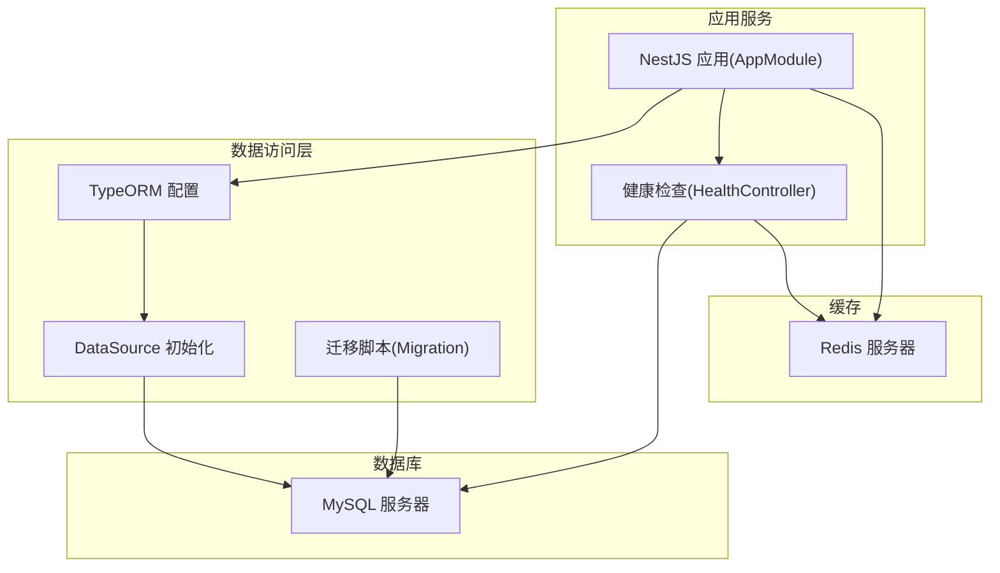
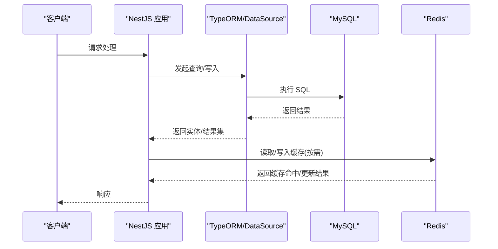
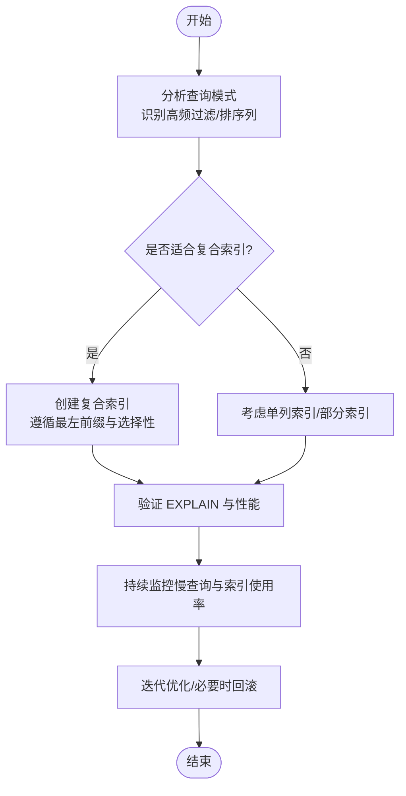
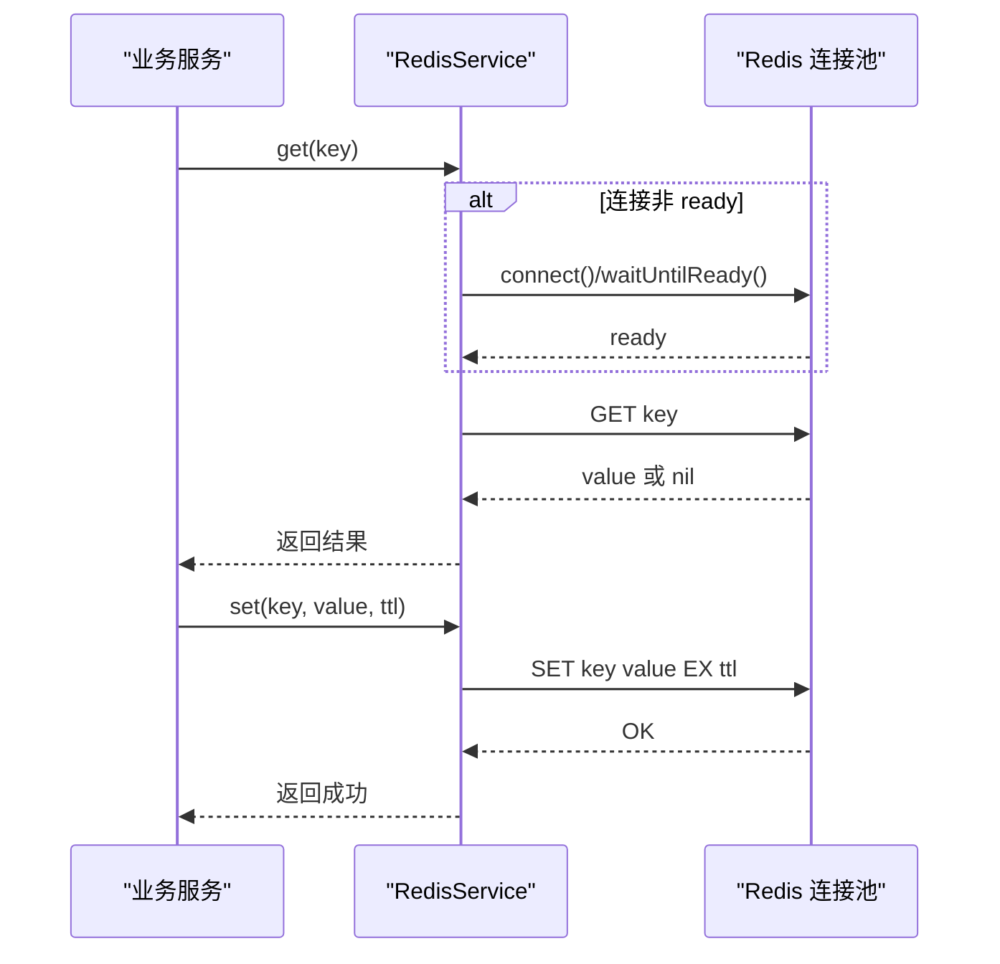
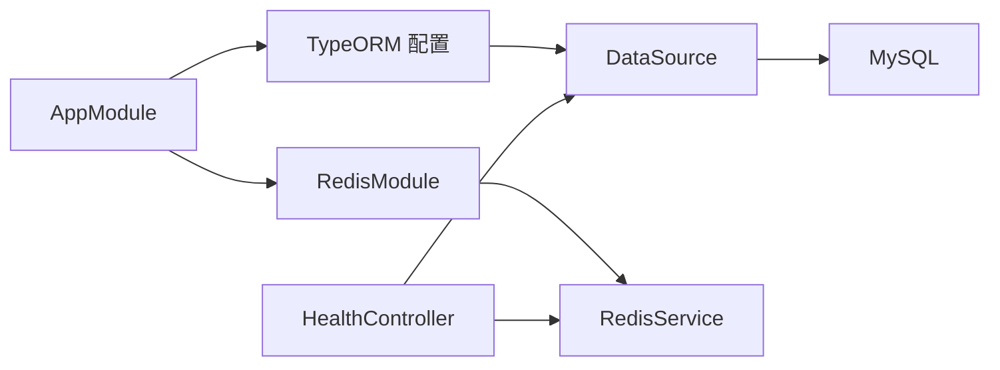

# 数据库性能优化

<cite>
**本文引用的文件**
- [services/api/src/app.module.ts](file://services/api/src/app.module.ts)
- [services/api/src/database/data-source.ts](file://services/api/src/database/data-source.ts)
- [services/api/src/database/entities/user.entity.ts](file://services/api/src/database/entities/user.entity.ts)
- [services/api/src/database/entities/user-metric-snapshot.entity.ts](file://services/api/src/database/entities/user-metric-snapshot.entity.ts)
- [services/api/src/database/entities/assessment-session.entity.ts](file://services/api/src/database/entities/assessment-session.entity.ts)
- [services/api/src/database/migrations/1762800000000-OptimizePosterMetricLookupIndexes.ts](file://services/api/src/database/migrations/1762800000000-OptimizePosterMetricLookupIndexes.ts)
- [services/api/src/database/migrations/1762900000000-AddPhoneAuthToUsers.ts](file://services/api/src/database/migrations/1762900000000-AddPhoneAuthToUsers.ts)
- [services/api/src/database/migrations/1762600000000-AddUserMetricSnapshots.ts](file://services/api/src/database/migrations/1762600000000-AddUserMetricSnapshots.ts)
- [services/api/src/redis/redis.module.ts](file://services/api/src/redis/redis.module.ts)
- [services/api/src/redis/redis.service.ts](file://services/api/src/redis/redis.service.ts)
- [services/api/src/health/health.controller.ts](file://services/api/src/health/health.controller.ts)
- [services/api/src/common/production-config.validator.ts](file://services/api/src/common/production-config.validator.ts)
- [services/api/src/users/profile-metrics.service.ts](file://services/api/src/users/profile-metrics.service.ts)
- [scripts/dev-api.mjs](file://scripts/dev-api.mjs)
</cite>

## 目录
1. [简介](#简介)
2. [项目结构](#项目结构)
3. [核心组件](#核心组件)
4. [架构总览](#架构总览)
5. [详细组件分析](#详细组件分析)
6. [依赖关系分析](#依赖关系分析)
7. [性能考量](#性能考量)
8. [故障排查指南](#故障排查指南)
9. [结论](#结论)
10. [附录](#附录)

## 简介
本文件面向 Fortune Hub 的数据库性能优化，聚焦以下主题：
- 索引优化策略：单列索引、复合索引、部分索引的设计原则与应用
- 查询性能分析：EXPLAIN 使用、慢查询日志、查询计划优化
- 连接池配置：连接数、超时、连接复用策略
- 缓存策略：查询结果缓存、热点数据缓存、缓存失效机制
- 监控指标：连接数、查询延迟、锁等待等关键指标的监控与告警
- 高级优化：读写分离、分库分表的应用场景与实施方法

## 项目结构
后端基于 NestJS + TypeORM，数据库为 MySQL，Redis 作为缓存层；健康检查同时覆盖 MySQL 与 Redis。

图示来源
- [services/api/src/app.module.ts:67-117](file://services/api/src/app.module.ts#L67-L117)
- [services/api/src/database/data-source.ts:32-72](file://services/api/src/database/data-source.ts#L32-L72)
- [services/api/src/health/health.controller.ts:6-27](file://services/api/src/health/health.controller.ts#L6-L27)

章节来源
- [services/api/src/app.module.ts:61-145](file://services/api/src/app.module.ts#L61-L145)
- [services/api/src/database/data-source.ts:1-73](file://services/api/src/database/data-source.ts#L1-L73)
- [services/api/src/health/health.controller.ts:1-28](file://services/api/src/health/health.controller.ts#L1-L28)

## 核心组件
- 数据源与连接配置：通过 TypeORM DataSource 和 AppModule 的 TypeOrmModule.forRootAsync 提供统一配置入口，支持从环境变量读取主机、端口、账号、密码、数据库名等参数，并可控制是否自动执行迁移与同步。
- 实体与索引：用户表、评估会话表、指标快照表等均在实体层面声明索引，迁移脚本中补充或调整索引以满足查询需求。
- 缓存：RedisModule 提供连接工厂与重连策略，RedisService 封装连接状态管理与基础操作。
- 健康检查：HealthController 同时检查 MySQL 初始化状态与 Redis Ping 结果，输出服务状态与时间戳。

章节来源
- [services/api/src/database/data-source.ts:32-72](file://services/api/src/database/data-source.ts#L32-L72)
- [services/api/src/app.module.ts:67-117](file://services/api/src/app.module.ts#L67-L117)
- [services/api/src/redis/redis.module.ts:1-31](file://services/api/src/redis/redis.module.ts#L1-L31)
- [services/api/src/redis/redis.service.ts:1-124](file://services/api/src/redis/redis.service.ts#L1-L124)
- [services/api/src/health/health.controller.ts:6-27](file://services/api/src/health/health.controller.ts#L6-L27)

## 架构总览
下图展示数据库与缓存在系统中的位置及交互路径。

图示来源
- [services/api/src/app.module.ts:67-117](file://services/api/src/app.module.ts#L67-L117)
- [services/api/src/database/data-source.ts:32-72](file://services/api/src/database/data-source.ts#L32-L72)
- [services/api/src/redis/redis.service.ts:79-115](file://services/api/src/redis/redis.service.ts#L79-L115)

## 详细组件分析

### 索引优化策略与实践
- 单列索引
  - 用户表对唯一标识与常用过滤字段建立单列唯一索引，例如 openid、phone，确保去重与快速查找。
  - 设计原则：对高选择性、频繁等值/范围查询的列建立单列索引；避免对低选择性的布尔或枚举列过度索引。
  - 应用场景：登录态查询、手机号登录、用户画像检索。
  章节来源
  - [services/api/src/database/entities/user.entity.ts:10-14](file://services/api/src/database/entities/user.entity.ts#L10-L14)
  - [services/api/src/database/migrations/1762900000000-AddPhoneAuthToUsers.ts:45-52](file://services/api/src/database/migrations/1762900000000-AddPhoneAuthToUsers.ts#L45-L52)

- 复合索引
  - 指标快照表与海报相关表针对“用户+时间”的组合查询建立复合索引，提升按用户维度的时间序列查询效率。
  - 设计原则：遵循最左前缀原则，将区分度高且常作为过滤条件的列放在前面；避免过多重叠索引导致写入成本上升。
  - 应用场景：用户每日指标快照查询、海报任务与分享记录的用户-时间排序。
  章节来源
  - [services/api/src/database/entities/user-metric-snapshot.entity.ts:10-18](file://services/api/src/database/entities/user-metric-snapshot.entity.ts#L10-L18)
  - [services/api/src/database/migrations/1762800000000-OptimizePosterMetricLookupIndexes.ts:8-25](file://services/api/src/database/migrations/1762800000000-OptimizePosterMetricLookupIndexes.ts#L8-L25)

- 部分索引（条件索引）
  - 在现有实体与迁移中未发现显式部分索引；建议对具有明确过滤条件的列（如状态、类型）结合表达式或条件谓词创建部分索引，降低索引体积并提升扫描效率。
  - 设计原则：仅对特定状态或时间段的数据建立索引，减少全表扫描概率。
  - 应用场景：订单状态查询、推送订阅状态过滤、报表模板版本筛选。
  章节来源
  - [services/api/src/database/migrations/1761262800000-ContentOpsFoundation.ts:192-202](file://services/api/src/database/migrations/1761262800000-ContentOpsFoundation.ts#L192-L202)

- 索引维护与演进
  - 通过迁移脚本新增/删除索引，避免直接在生产库手工变更；在 down 中回滚索引，保证迁移幂等。
  章节来源
  - [services/api/src/database/migrations/1762800000000-OptimizePosterMetricLookupIndexes.ts:27-38](file://services/api/src/database/migrations/1762800000000-OptimizePosterMetricLookupIndexes.ts#L27-L38)
  - [services/api/src/database/migrations/1762900000000-AddPhoneAuthToUsers.ts:59-74](file://services/api/src/database/migrations/1762900000000-AddPhoneAuthToUsers.ts#L59-L74)

图示来源
- [services/api/src/database/migrations/1762800000000-OptimizePosterMetricLookupIndexes.ts:8-25](file://services/api/src/database/migrations/1762800000000-OptimizePosterMetricLookupIndexes.ts#L8-L25)
- [services/api/src/database/entities/user-metric-snapshot.entity.ts:10-18](file://services/api/src/database/entities/user-metric-snapshot.entity.ts#L10-L18)

### 查询性能分析方法
- EXPLAIN 使用
  - 对涉及 JOIN、GROUP BY、ORDER BY、LIMIT 的复杂查询执行 EXPLAIN，关注 key、rows、Extra 列，确认是否使用到预期索引、是否存在临时表与文件排序。
  - 建议：优先保证过滤条件能命中索引，避免在 WHERE 子句中对索引列做函数运算或隐式转换。
- 慢查询日志分析
  - 在 MySQL 中启用慢查询日志，设置阈值（如 1 秒），定期导出并分析热点 SQL 与执行计划。
  - 关注：重复执行的长尾 SQL、缺少索引的扫描型查询、大 LIMIT 的分页查询。
- 查询计划优化
  - 针对时间序列查询（如用户指标快照）优先使用复合索引；避免 SELECT *，只取必要列。
  - 对于高并发写入场景，拆分批量写入为小批次，降低锁竞争。
  章节来源
  - [services/api/src/database/entities/user-metric-snapshot.entity.ts:10-18](file://services/api/src/database/entities/user-metric-snapshot.entity.ts#L10-L18)
  - [services/api/src/database/migrations/1762800000000-OptimizePosterMetricLookupIndexes.ts:8-25](file://services/api/src/database/migrations/1762800000000-OptimizePosterMetricLookupIndexes.ts#L8-L25)

### 数据库连接池配置
- 连接数设置
  - 基于 MySQL 最大连接数与应用并发量设定池大小；建议保留一定余量应对峰值与长事务。
- 超时配置
  - 设置连接超时、请求超时、查询超时，避免线程长时间占用导致资源枯竭。
- 连接复用策略
  - 保持连接池常驻连接，减少频繁创建销毁开销；对空闲连接设置回收策略。
- TypeORM 连接配置入口
  - 通过 TypeOrmModule.forRootAsync 从配置服务读取数据库参数，支持运行时切换迁移与同步开关。
  章节来源
  - [services/api/src/app.module.ts:67-117](file://services/api/src/app.module.ts#L67-L117)
  - [services/api/src/database/data-source.ts:32-72](file://services/api/src/database/data-source.ts#L32-L72)

### 缓存策略设计
- 查询结果缓存
  - 对稳定查询（如配置项、报表模板）进行结果缓存，设置合理 TTL；对热点数据采用预热策略。
- 热点数据缓存
  - 基于 Redis 的键空间过期与淘汰策略，保障热点键的命中率；对频繁更新的数据采用写后失效或写后更新策略。
- 缓存失效机制
  - 写操作成功后主动失效相关键；对批量更新采用前缀匹配清理；对不可靠网络异常进行降级与重试。
- Redis 连接与可用性
  - RedisModule 提供懒加载连接、重试策略与错误恢复；RedisService 封装连接状态检测与超时等待。
  章节来源
  - [services/api/src/redis/redis.module.ts:14-25](file://services/api/src/redis/redis.module.ts#L14-L25)
  - [services/api/src/redis/redis.service.ts:12-66](file://services/api/src/redis/redis.service.ts#L12-L66)

图示来源
- [services/api/src/redis/redis.service.ts:79-115](file://services/api/src/redis/redis.service.ts#L79-L115)
- [services/api/src/redis/redis.module.ts:14-25](file://services/api/src/redis/redis.module.ts#L14-L25)

### 数据库监控指标与告警
- 连接数
  - 监控活跃连接数与最大连接数比值，防止连接池耗尽。
- 查询延迟
  - 统计 P95/P99 延迟，识别慢查询与热点接口。
- 锁等待时间
  - 观察锁等待与行锁冲突，定位热点写入与长事务。
- 健康检查
  - HealthController 输出 MySQL 初始化状态与 Redis Ping 结果，便于平台侧统一监控。
  章节来源
  - [services/api/src/health/health.controller.ts:14-26](file://services/api/src/health/health.controller.ts#L14-L26)

### 读写分离与分库分表
- 读写分离
  - 通过独立只读副本承载报表与历史查询，主库专注写入；对最终一致性场景允许短延迟。
- 分库分表
  - 基于用户维度（如 userId）进行水平分片，结合复合索引（userId, date）实现高效查询；对冷数据下沉归档库。
- 实施建议
  - 先在迁移层引入新表结构与路由规则，逐步切流；对跨分片聚合查询采用多路合并策略。
  章节来源
  - [services/api/src/database/migrations/1762800000000-OptimizePosterMetricLookupIndexes.ts:8-25](file://services/api/src/database/migrations/1762800000000-OptimizePosterMetricLookupIndexes.ts#L8-L25)
  - [services/api/src/database/entities/user-metric-snapshot.entity.ts:10-18](file://services/api/src/database/entities/user-metric-snapshot.entity.ts#L10-L18)

## 依赖关系分析
- 应用模块依赖 TypeORM 进行数据库初始化与迁移；DataSource 与 AppModule 的配置共同决定连接参数与实体集合。
- RedisModule 为全局注入，RedisService 提供统一的缓存访问能力。
- 健康检查同时依赖 DataSource 与 RedisService，形成数据库与缓存的双栈健康视图。

图示来源
- [services/api/src/app.module.ts:67-117](file://services/api/src/app.module.ts#L67-L117)
- [services/api/src/database/data-source.ts:32-72](file://services/api/src/database/data-source.ts#L32-L72)
- [services/api/src/redis/redis.module.ts:1-31](file://services/api/src/redis/redis.module.ts#L1-L31)
- [services/api/src/health/health.controller.ts:6-27](file://services/api/src/health/health.controller.ts#L6-L27)

章节来源
- [services/api/src/app.module.ts:61-145](file://services/api/src/app.module.ts#L61-L145)
- [services/api/src/database/data-source.ts:1-73](file://services/api/src/database/data-source.ts#L1-L73)
- [services/api/src/redis/redis.module.ts:1-31](file://services/api/src/redis/redis.module.ts#L1-L31)
- [services/api/src/health/health.controller.ts:1-28](file://services/api/src/health/health.controller.ts#L1-L28)

## 性能考量
- 写入优化
  - 批量插入与 upsert：对指标快照等高频写入场景，采用 upsert 并指定唯一键，减少重复写入。
  - 错误降级：当目标表不存在或字段缺失时，记录警告并暂时禁用持久化，避免阻塞主流程。
- 查询优化
  - 复合索引优先：围绕“用户+时间”等常见过滤维度建立复合索引。
  - 减少回表：尽量使用覆盖索引，避免回表带来的额外 IO。
- 缓存策略
  - 热点接口与静态配置优先缓存；对写后读一致性要求高的场景采用写后失效。
- 连接与资源
  - 控制连接池大小与超时，避免连接泄漏与资源争用。
- 章节来源
  - [services/api/src/users/profile-metrics.service.ts:526-573](file://services/api/src/users/profile-metrics.service.ts#L526-L573)
  - [services/api/src/database/migrations/1762600000000-AddUserMetricSnapshots.ts:94-104](file://services/api/src/database/migrations/1762600000000-AddUserMetricSnapshots.ts#L94-L104)

## 故障排查指南
- 生产配置校验
  - 在开发环境禁止开启 DB_SYNCHRONIZE；生产环境必须严格校验敏感配置。
- 健康检查
  - 通过 /health 接口快速判断 MySQL 初始化状态与 Redis 可达性；若任一为 DOWN，立即介入。
- Redis 连接问题
  - 检查连接状态机与超时等待逻辑，必要时缩短超时阈值并增加重试次数。
- 章节来源
  - [services/api/src/common/production-config.validator.ts:106-114](file://services/api/src/common/production-config.validator.ts#L106-L114)
  - [services/api/src/health/health.controller.ts:14-26](file://services/api/src/health/health.controller.ts#L14-L26)
  - [services/api/src/redis/redis.service.ts:12-66](file://services/api/src/redis/redis.service.ts#L12-L66)

## 结论
通过在实体与迁移中系统性地设计单列与复合索引、结合 EXPLAIN 与慢查询日志持续优化查询计划、配合 Redis 缓存与严格的连接池配置，以及在健康检查中统一监控数据库与缓存状态，Fortune Hub 可在高并发场景下获得稳定且可预期的数据库性能表现。对于未来更大规模的数据体量，建议逐步引入读写分离与分库分表策略，并配套完善的监控与告警体系。

## 附录
- 环境变量与本地开发
  - 本地开发可通过 .env 文件设置数据库与 Redis 参数；脚本可解析 .env 并辅助端口探测。
  章节来源
  - [scripts/dev-api.mjs:8-55](file://scripts/dev-api.mjs#L8-L55)