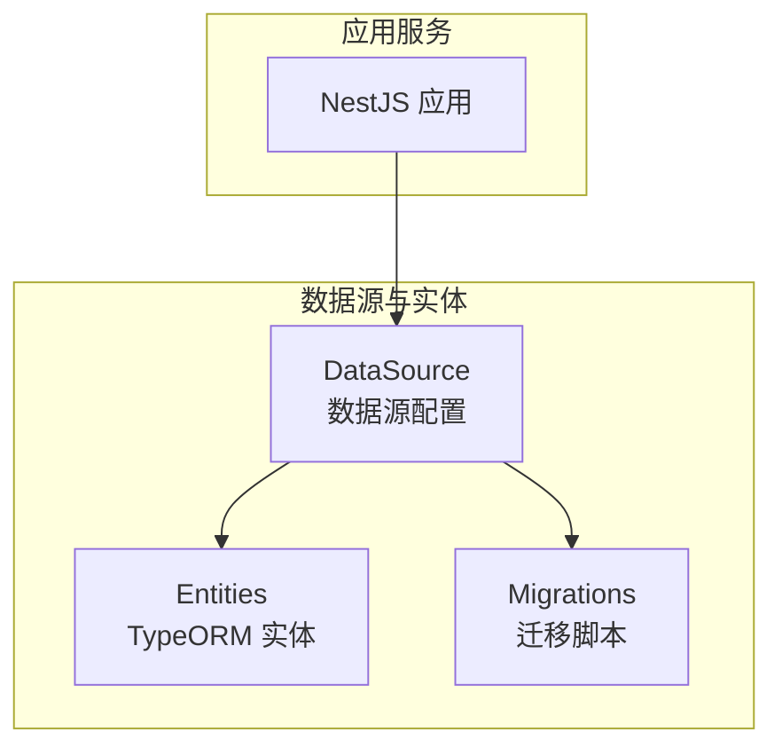
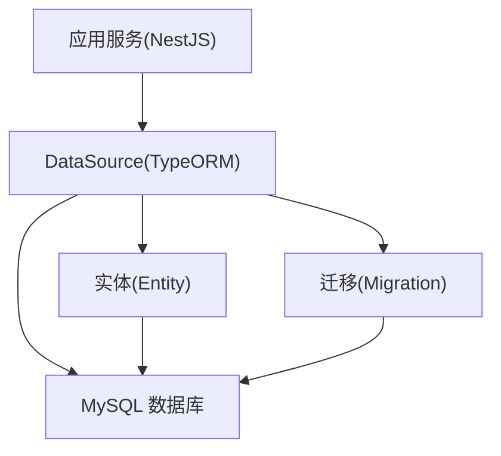
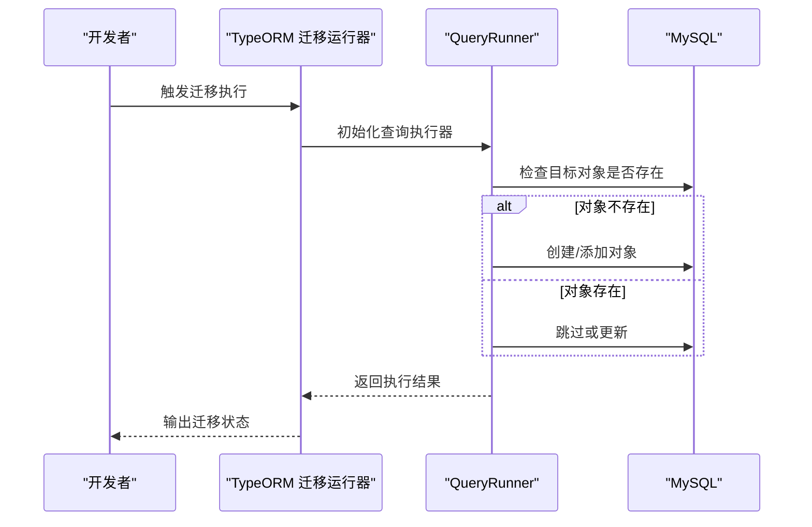
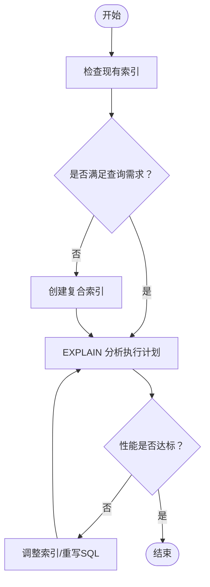
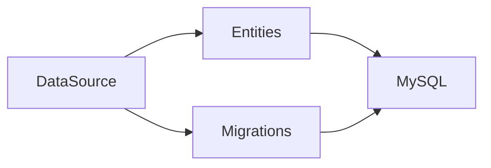

# 数据库设计

<cite>
**本文引用的文件**
- [services/api/src/database/data-source.ts](file://services/api/src/database/data-source.ts)
- [services/api/src/database/entities/user.entity.ts](file://services/api/src/database/entities/user.entity.ts)
- [services/api/src/database/entities/user-record.entity.ts](file://services/api/src/database/entities/user-record.entity.ts)
- [services/api/src/database/entities/assessment-question.entity.ts](file://services/api/src/database/entities/assessment-question.entity.ts)
- [services/api/src/database/entities/order.entity.ts](file://services/api/src/database/entities/order.entity.ts)
- [services/api/src/database/entities/report-template.entity.ts](file://services/api/src/database/entities/report-template.entity.ts)
- [services/api/src/database/entities/fortune-content.entity.ts](file://services/api/src/database/entities/fortune-content.entity.ts)
- [services/api/src/database/entities/membership-product.entity.ts](file://services/api/src/database/entities/membership-product.entity.ts)
- [services/api/src/database/entities/favorite.entity.ts](file://services/api/src/database/entities/favorite.entity.ts)
- [services/api/src/database/migrations/1761262800000-ContentOpsFoundation.ts](file://services/api/src/database/migrations/1761262800000-ContentOpsFoundation.ts)
- [services/api/src/database/migrations/1762800000000-OptimizePosterMetricLookupIndexes.ts](file://services/api/src/database/migrations/1762800000000-OptimizePosterMetricLookupIndexes.ts)
- [services/api/src/database/migrations/1763000000000-FixPulseAndDivinationReviewSchema.ts](file://services/api/src/database/migrations/1763000000000-FixPulseAndDivinationReviewSchema.ts)
- [docs/数据库设计文档.md](file://docs/数据库设计文档.md)
</cite>

## 目录
1. [简介](#简介)
2. [项目结构](#项目结构)
3. [核心组件](#核心组件)
4. [架构总览](#架构总览)
5. [详细组件分析](#详细组件分析)
6. [依赖分析](#依赖分析)
7. [性能考虑](#性能考虑)
8. [故障排查指南](#故障排查指南)
9. [结论](#结论)
10. [附录](#附录)

## 简介
本文件面向 Fortune Hub 的数据库设计与实现，聚焦于 TypeORM 实体设计原则、实体关系映射、数据库迁移管理策略、索引优化策略、数据模型设计规范、数据库连接池与事务并发控制、以及备份恢复与监控告警机制。文档基于仓库中现有的数据源配置、实体定义与迁移脚本进行系统化梳理，并给出可操作的改进建议与最佳实践。

## 项目结构
数据库相关的核心位于后端服务模块中，采用 TypeORM 作为 ORM 框架，数据源集中配置，实体与迁移脚本分别组织在独立目录下，便于版本化与演进。

图示来源
- [services/api/src/database/data-source.ts:32-72](file://services/api/src/database/data-source.ts#L32-L72)

章节来源
- [services/api/src/database/data-source.ts:1-73](file://services/api/src/database/data-source.ts#L1-73)

## 核心组件
- 数据源配置：集中定义数据库类型、主机、端口、账号、密码、数据库名、时区、实体集合与迁移路径。
- 实体层：以 @Entity 装饰器声明表结构，结合 @Index 定义索引，使用 Column、CreateDateColumn、UpdateDateColumn 等装饰器映射字段类型与元数据。
- 迁移层：以 MigrationInterface 实现 up/down 方法，支持表结构演进、列变更、索引增删与回填逻辑。

章节来源
- [services/api/src/database/data-source.ts:32-72](file://services/api/src/database/data-source.ts#L32-L72)
- [services/api/src/database/entities/user.entity.ts:10-74](file://services/api/src/database/entities/user.entity.ts#L10-L74)
- [services/api/src/database/migrations/1761262800000-ContentOpsFoundation.ts:12-64](file://services/api/src/database/migrations/1761262800000-ContentOpsFoundation.ts#L12-L64)

## 架构总览
下图展示数据库层与应用层的交互关系，以及实体与迁移在整体架构中的定位。

图示来源
- [services/api/src/database/data-source.ts:32-72](file://services/api/src/database/data-source.ts#L32-L72)

## 详细组件分析

### 数据源配置（DataSource）
- 数据库类型：MySQL
- 连接参数：host、port、username、password、database、timezone
- 同步策略：关闭自动同步（synchronize=false），通过迁移驱动结构变更
- 实体注册：集中导入所有实体
- 迁移路径：扫描 migrations 目录下的 TypeScript/JavaScript 文件

章节来源
- [services/api/src/database/data-source.ts:32-72](file://services/api/src/database/data-source.ts#L32-L72)

### 实体设计原则与字段映射
- 主键：统一使用 bigint unsigned 自增主键，确保大表容量与性能
- 字段类型：根据业务语义选择合适类型，如金额使用 decimal，枚举使用 varchar/tinyint，JSON 使用 json
- 索引：通过 @Index 装饰器定义唯一索引与普通索引，覆盖高频查询条件
- 时间戳：统一使用 CreateDateColumn/UpdateDateColumn 记录创建与更新时间
- 示例实体：
  - 用户表：包含 openid、unionid、phone、昵称、头像、性别、生日、星座、VIP 状态、最后登录时间等
  - 记录表：保存用户结果历史，包含记录类型、来源编码、分数、等级、结构化结果数据等
  - 订单表：包含用户 ID、订单号、产品编码、金额、状态、支付流水号、支付时间等
  - 报告模板表：包含模板类型、业务编码、标题、描述、排序、状态、发布时间等
  - 幸运物与内容表：包含业务编码、标题、摘要、分类、发布日期、状态、内容 JSON 等
  - 收藏表：包含用户 ID、条目类型、条目键、标题、路由、额外 JSON 等

章节来源
- [services/api/src/database/entities/user.entity.ts:10-74](file://services/api/src/database/entities/user.entity.ts#L10-L74)
- [services/api/src/database/entities/user-record.entity.ts:10-49](file://services/api/src/database/entities/user-record.entity.ts#L10-L49)
- [services/api/src/database/entities/order.entity.ts:10-52](file://services/api/src/database/entities/order.entity.ts#L10-L52)
- [services/api/src/database/entities/report-template.entity.ts:10-61](file://services/api/src/database/entities/report-template.entity.ts#L10-L61)
- [services/api/src/database/entities/fortune-content.entity.ts:10-48](file://services/api/src/database/entities/fortune-content.entity.ts#L10-L48)
- [services/api/src/database/entities/membership-product.entity.ts:10-49](file://services/api/src/database/entities/membership-product.entity.ts#L10-L49)
- [services/api/src/database/entities/favorite.entity.ts:10-48](file://services/api/src/database/entities/favorite.entity.ts#L10-L48)

### 实体关系映射
- 一对多关系
  - 用户 → 订单：一个用户可有多笔订单
  - 用户 → 记录：一个用户可有多条结果记录
  - 用户 → 收藏：一个用户可有多条收藏
- 多对一关系
  - 记录 → 用户：记录归属用户
  - 订单 → 用户：订单归属用户
  - 收藏 → 用户：收藏归属用户
- 多对多关系
  - 通过中间表或 JSON 字段实现，例如会员权益、结果画像等
- 关系建议
  - 评估题库：运营分类 → 测试配置 → 题目（一对多）
  - 内容体系：内容表与模板表解耦，通过业务编码关联
  - 幸运物与报告模板：通过业务编码与状态维度建立检索索引

章节来源
- [docs/数据库设计文档.md:375-429](file://docs/数据库设计文档.md#L375-L429)

### 数据库迁移管理策略
- 迁移脚本编写
  - 使用 MigrationInterface.up/down 实现结构变更与回滚
  - 支持表创建、列添加/删除、索引增删、数据回填
- 版本控制
  - 迁移文件按时间戳命名，确保执行顺序
  - 通过 QueryRunner 检查表/列/索引是否存在，避免重复执行
- 生产环境部署
  - 默认关闭自动同步，强制通过迁移发布结构变更
  - 在部署脚本中校验 DB_SYNCHRONIZE=false，防止误用

图示来源
- [services/api/src/database/migrations/1761262800000-ContentOpsFoundation.ts:12-64](file://services/api/src/database/migrations/1761262800000-ContentOpsFoundation.ts#L12-L64)
- [services/api/src/database/migrations/1762800000000-OptimizePosterMetricLookupIndexes.ts:8-38](file://services/api/src/database/migrations/1762800000000-OptimizePosterMetricLookupIndexes.ts#L8-L38)
- [services/api/src/database/migrations/1763000000000-FixPulseAndDivinationReviewSchema.ts:12-28](file://services/api/src/database/migrations/1763000000000-FixPulseAndDivinationReviewSchema.ts#L12-L28)

章节来源
- [services/api/src/database/migrations/1761262800000-ContentOpsFoundation.ts:12-64](file://services/api/src/database/migrations/1761262800000-ContentOpsFoundation.ts#L12-L64)
- [services/api/src/database/migrations/1762800000000-OptimizePosterMetricLookupIndexes.ts:8-38](file://services/api/src/database/migrations/1762800000000-OptimizePosterMetricLookupIndexes.ts#L8-L38)
- [services/api/src/database/migrations/1763000000000-FixPulseAndDivinationReviewSchema.ts:12-28](file://services/api/src/database/migrations/1763000000000-FixPulseAndDivinationReviewSchema.ts#L12-L28)

### 索引优化策略
- 复合索引设计
  - 用户表：唯一索引 openid、唯一索引 phone、普通索引 zodiac
  - 评估题库：复合索引 category+testCode+sortOrder、唯一索引 category+testCode+questionId
  - 订单表：唯一索引 orderNo、复合索引 userId+status
  - 报告模板：唯一索引 templateType+bizCode、复合索引 templateType+status+sortOrder
  - 记录表：复合索引 userId+recordType、单列索引 createdAt
  - 内容表：复合索引 contentType+status+publishDate
  - 收藏表：唯一索引 userId+itemType+itemKey、复合索引 userId+createdAt
- 查询性能优化
  - 为高频查询条件建立复合索引，减少全表扫描
  - 为时间范围查询建立索引，如 shares/poster_jobs 的 userId+createdAt
- 慢查询分析
  - 建议结合 EXPLAIN 分析执行计划，识别缺失索引或索引失效场景
  - 对热点表定期评估索引使用率，清理冗余索引

图示来源
- [services/api/src/database/entities/user.entity.ts:11-13](file://services/api/src/database/entities/user.entity.ts#L11-L13)
- [services/api/src/database/entities/assessment-question.entity.ts:11-14](file://services/api/src/database/entities/assessment-question.entity.ts#L11-L14)
- [services/api/src/database/entities/order.entity.ts:11-12](file://services/api/src/database/entities/order.entity.ts#L11-L12)
- [services/api/src/database/entities/report-template.entity.ts:11-12](file://services/api/src/database/entities/report-template.entity.ts#L11-L12)
- [services/api/src/database/entities/user-record.entity.ts:11-12](file://services/api/src/database/entities/user-record.entity.ts#L11-L12)
- [services/api/src/database/entities/fortune-content.entity.ts](file://services/api/src/database/entities/fortune-content.entity.ts#L11)
- [services/api/src/database/entities/favorite.entity.ts:11-14](file://services/api/src/database/entities/favorite.entity.ts#L11-L14)
- [services/api/src/database/migrations/1762800000000-OptimizePosterMetricLookupIndexes.ts:8-25](file://services/api/src/database/migrations/1762800000000-OptimizePosterMetricLookupIndexes.ts#L8-L25)

章节来源
- [services/api/src/database/entities/user.entity.ts:11-13](file://services/api/src/database/entities/user.entity.ts#L11-L13)
- [services/api/src/database/entities/assessment-question.entity.ts:11-14](file://services/api/src/database/entities/assessment-question.entity.ts#L11-L14)
- [services/api/src/database/entities/order.entity.ts:11-12](file://services/api/src/database/entities/order.entity.ts#L11-L12)
- [services/api/src/database/entities/report-template.entity.ts:11-12](file://services/api/src/database/entities/report-template.entity.ts#L11-L12)
- [services/api/src/database/entities/user-record.entity.ts:11-12](file://services/api/src/database/entities/user-record.entity.ts#L11-L12)
- [services/api/src/database/entities/fortune-content.entity.ts](file://services/api/src/database/entities/fortune-content.entity.ts#L11)
- [services/api/src/database/entities/favorite.entity.ts:11-14](file://services/api/src/database/entities/favorite.entity.ts#L11-L14)
- [services/api/src/database/migrations/1762800000000-OptimizePosterMetricLookupIndexes.ts:8-25](file://services/api/src/database/migrations/1762800000000-OptimizePosterMetricLookupIndexes.ts#L8-L25)

### 数据模型设计规范
- 命名约定
  - 表名与字段名采用 snake_case，实体类名使用 PascalCase
- 字段约束
  - 主键：bigint unsigned 自增
  - 金额：decimal(10,2) 或整数分值（如 amountFen）
  - 状态：varchar 或 tinyint，统一枚举化
  - JSON：用于灵活结构与扩展字段
- 数据完整性
  - 唯一索引保证业务唯一性（如 openid、phone、orderNo、bizCode）
  - 状态字段与生命周期字段（publishedAt/archivedAt）配合使用
  - 外键约束：当前实体间主要通过业务编码与索引保障一致性，必要时可在迁移中补充外键

章节来源
- [docs/数据库设计文档.md:16-32](file://docs/数据库设计文档.md#L16-L32)
- [services/api/src/database/entities/order.entity.ts:11-12](file://services/api/src/database/entities/order.entity.ts#L11-L12)
- [services/api/src/database/entities/report-template.entity.ts:11-12](file://services/api/src/database/entities/report-template.entity.ts#L11-L12)
- [services/api/src/database/entities/fortune-content.entity.ts](file://services/api/src/database/entities/fortune-content.entity.ts#L11)
- [services/api/src/database/entities/favorite.entity.ts:11-14](file://services/api/src/database/entities/favorite.entity.ts#L11-L14)

### 数据库连接池、事务与并发控制
- 连接池配置
  - 在 DataSource 中可通过连接池参数（如最大连接数、空闲超时、获取超时等）进行调优
- 事务管理
  - 使用 QueryRunner 或 Repository 的事务方法包裹多表写入，确保原子性
- 并发控制
  - 对高并发写入场景使用唯一索引避免重复提交
  - 对热点数据使用读写分离与缓存降压

章节来源
- [services/api/src/database/data-source.ts:32-72](file://services/api/src/database/data-source.ts#L32-L72)

### 备份恢复与监控告警
- 备份策略
  - 建议采用定时全量+增量备份，保留至少 7 天的恢复点
- 恢复演练
  - 定期进行 RTO/RPO 回放测试，验证备份可用性
- 监控告警
  - 关键指标：连接数、慢查询、锁等待、磁盘空间、复制延迟
  - 告警阈值：针对慢查询（>1s）、锁等待（>10s）、连接池耗尽等设定阈值

章节来源
- [docs/数据库设计文档.md:508-515](file://docs/数据库设计文档.md#L508-L515)

## 依赖分析
- 组件耦合
  - 实体与迁移之间弱耦合：迁移负责结构演进，实体负责数据映射
  - 数据源集中管理实体与迁移，降低分散配置风险
- 外部依赖
  - TypeORM 作为 ORM 框架，依赖 MySQL 驱动
- 潜在循环依赖
  - 实体间通过业务编码关联，避免直接循环引用

图示来源
- [services/api/src/database/data-source.ts:41-70](file://services/api/src/database/data-source.ts#L41-L70)

章节来源
- [services/api/src/database/data-source.ts:41-70](file://services/api/src/database/data-source.ts#L41-L70)

## 性能考虑
- 索引策略
  - 为高频查询条件建立复合索引，避免全表扫描
  - 对时间序列数据建立时间维度索引，提升范围查询效率
- SQL 优化
  - 避免 SELECT *，只取必要字段
  - 合理使用 LIMIT，防止结果集过大
- 缓存与异步
  - 对静态内容与热点查询引入缓存
  - 对非实时写入场景采用异步处理

## 故障排查指南
- 迁移失败
  - 检查迁移文件命名与执行顺序
  - 使用 QueryRunner 检查对象是否存在，避免重复执行
- 索引缺失导致慢查询
  - 使用 EXPLAIN 分析执行计划，补充复合索引
- 连接池耗尽
  - 检查事务未提交、长事务、连接泄漏等问题
- 数据不一致
  - 核对唯一索引与业务编码，确保幂等性

章节来源
- [services/api/src/database/migrations/1761262800000-ContentOpsFoundation.ts:281-302](file://services/api/src/database/migrations/1761262800000-ContentOpsFoundation.ts#L281-L302)
- [services/api/src/database/migrations/1763000000000-FixPulseAndDivinationReviewSchema.ts:312-360](file://services/api/src/database/migrations/1763000000000-FixPulseAndDivinationReviewSchema.ts#L312-L360)

## 结论
本数据库设计方案以 TypeORM 为核心，通过实体与迁移共同演进，实现了结构化与灵活性的平衡。在索引设计、迁移策略、并发控制与监控告警方面提供了可操作的实践建议。建议在生产环境中持续完善迁移发布链路、审计与合规能力，并逐步引入更细粒度的索引与缓存策略，以支撑业务的长期增长。

## 附录
- 设计文档要点回顾：命名约定、字段约束、数据完整性、迁移策略、索引优化、备份恢复与监控告警
- 实体清单：用户、记录、订单、报告模板、内容、会员产品、收藏等

章节来源
- [docs/数据库设计文档.md:16-32](file://docs/数据库设计文档.md#L16-L32)
- [docs/数据库设计文档.md:456-488](file://docs/数据库设计文档.md#L456-L488)