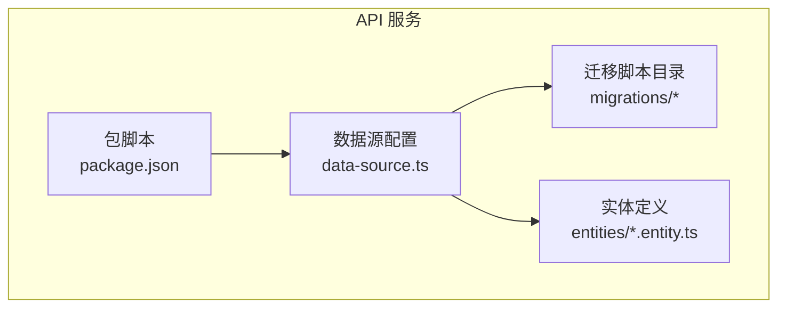
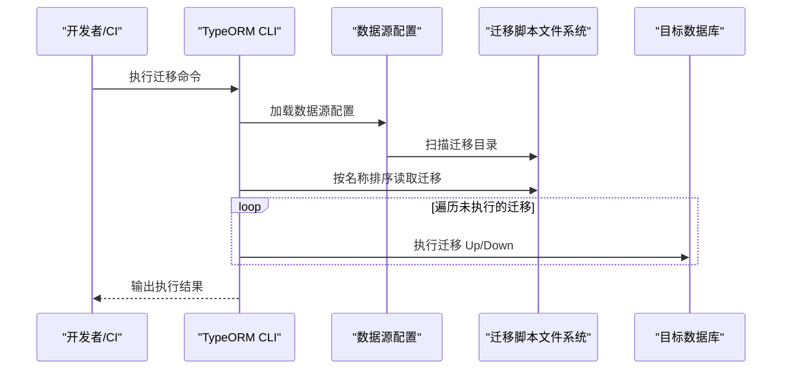
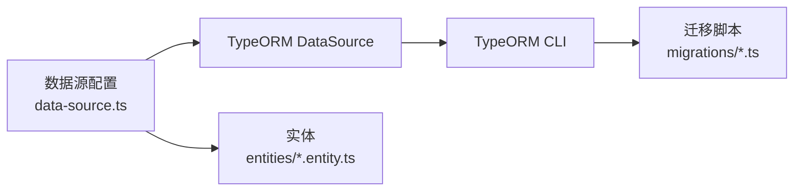

# 数据库迁移管理

<cite>
**本文引用的文件**
- [services/api/src/database/data-source.ts](file://services/api/src/database/data-source.ts)
- [services/api/src/database/migrations/1761262800000-ContentOpsFoundation.ts](file://services/api/src/database/migrations/1761262800000-ContentOpsFoundation.ts)
- [services/api/src/database/migrations/1763000000000-FixPulseAndDivinationReviewSchema.ts](file://services/api/src/database/migrations/1763000000000-FixPulseAndDivinationReviewSchema.ts)
- [services/api/package.json](file://services/api/package.json)
- [services/api/src/database/entities/user.entity.ts](file://services/api/src/database/entities/user.entity.ts)
- [services/api/src/main.ts](file://services/api/src/main.ts)
</cite>

## 目录
1. [简介](#简介)
2. [项目结构](#项目结构)
3. [核心组件](#核心组件)
4. [架构总览](#架构总览)
5. [详细组件分析](#详细组件分析)
6. [依赖分析](#依赖分析)
7. [性能考虑](#性能考虑)
8. [故障排查指南](#故障排查指南)
9. [结论](#结论)
10. [附录](#附录)

## 简介
本文件面向 Fortune Hub 的数据库迁移管理，系统性阐述 TypeORM 迁移脚本的编写规范（命名、Up/Down 方法）、迁移版本控制策略（版本号、执行顺序、回滚机制）、生产环境迁移部署流程（连接配置、执行命令、错误处理），并提供最佳实践与常见问题的解决方案。文档以仓库中现有的迁移脚本与数据源配置为依据，确保内容可追溯、可落地。

## 项目结构
- 迁移脚本位于服务端 API 工程的数据库目录下，采用时间戳前缀加描述的命名方式，便于按时间顺序执行。
- 数据源配置集中于数据源文件，声明了数据库类型、连接参数、实体与迁移路径等。
- 迁移命令通过包脚本统一暴露，便于在 CI/CD 或本地开发中执行。

**图表来源**
- [services/api/src/database/data-source.ts:32-72](file://services/api/src/database/data-source.ts#L32-L72)
- [services/api/src/database/migrations/1761262800000-ContentOpsFoundation.ts:1-320](file://services/api/src/database/migrations/1761262800000-ContentOpsFoundation.ts#L1-L320)
- [services/api/src/database/entities/user.entity.ts:1-75](file://services/api/src/database/entities/user.entity.ts#L1-L75)
- [services/api/package.json:8-25](file://services/api/package.json#L8-L25)

**章节来源**
- [services/api/src/database/data-source.ts:1-73](file://services/api/src/database/data-source.ts#L1-L73)
- [services/api/package.json:1-91](file://services/api/package.json#L1-L91)

## 核心组件
- 数据源配置：集中定义数据库连接、实体集合与迁移扫描路径，确保迁移工具可正确加载迁移脚本。
- 迁移脚本：每个迁移类实现 Up/Down 方法，分别用于向前与向后演进；脚本内使用查询器进行表结构变更与数据填充。
- 包脚本：提供迁移运行、回滚、生成与创建的命令，统一在 CI/CD 中调用。

**章节来源**
- [services/api/src/database/data-source.ts:32-72](file://services/api/src/database/data-source.ts#L32-L72)
- [services/api/src/database/migrations/1761262800000-ContentOpsFoundation.ts:12-64](file://services/api/src/database/migrations/1761262800000-ContentOpsFoundation.ts#L12-L64)
- [services/api/package.json:16-19](file://services/api/package.json#L16-L19)

## 架构总览
迁移生命周期由“数据源配置 → 迁移脚本 → CLI 命令 → 执行”构成。TypeORM 会根据迁移文件的名称顺序执行 Up 方法；回滚时按相反顺序执行 Down 方法。

**图表来源**
- [services/api/src/database/data-source.ts:71-72](file://services/api/src/database/data-source.ts#L71-L72)
- [services/api/package.json:16-19](file://services/api/package.json#L16-L19)

## 详细组件分析

### 迁移脚本编写规范
- 命名规则
  - 使用时间戳前缀（毫秒级）+ 描述的方式，确保全局唯一且天然有序。
  - 示例：[1761262800000-ContentOpsFoundation.ts](file://services/api/src/database/migrations/1761262800000-ContentOpsFoundation.ts#L10)，[1763000000000-FixPulseAndDivinationReviewSchema.ts](file://services/api/src/database/migrations/1763000000000-FixPulseAndDivinationReviewSchema.ts#L10)。
- Up/Down 实现
  - Up：执行正向变更，如建表、加列、加索引、数据回填等。
  - Down：执行逆向变更，如删列、删表、删除索引等；需保证幂等与安全性。
  - 幂等检查：多数迁移通过“是否存在”判断避免重复执行，例如先判断表或列是否存在再决定创建或跳过。
  - 数据回填：Up 中对已有数据进行补全，Down 中通常不回写数据，仅清理结构。
- 可扩展模式
  - 将通用操作封装为私有方法（如 ensureXxxTable、addColumnIfMissing、addIndexIfMissing），提升可维护性与复用度。

**章节来源**
- [services/api/src/database/migrations/1761262800000-ContentOpsFoundation.ts:12-64](file://services/api/src/database/migrations/1761262800000-ContentOpsFoundation.ts#L12-L64)
- [services/api/src/database/migrations/1763000000000-FixPulseAndDivinationReviewSchema.ts:12-28](file://services/api/src/database/migrations/1763000000000-FixPulseAndDivinationReviewSchema.ts#L12-L28)
- [services/api/src/database/migrations/1761262800000-ContentOpsFoundation.ts:281-308](file://services/api/src/database/migrations/1761262800000-ContentOpsFoundation.ts#L281-L308)
- [services/api/src/database/migrations/1763000000000-FixPulseAndDivinationReviewSchema.ts:312-360](file://services/api/src/database/migrations/1763000000000-FixPulseAndDivinationReviewSchema.ts#L312-L360)

### 版本控制策略
- 版本号管理
  - 使用时间戳作为版本号，天然保证顺序与唯一性，避免手动维护版本号带来的冲突。
- 执行顺序
  - TypeORM 按文件名排序执行迁移；命名中的时间戳即排序依据。
- 回滚机制
  - Down 方法按相反顺序回滚；建议每次迁移尽量小步、可逆，降低回滚风险。
  - 对于破坏性变更，Down 中应谨慎处理数据丢失风险。

**章节来源**
- [services/api/src/database/migrations/1761262800000-ContentOpsFoundation.ts:10-64](file://services/api/src/database/migrations/1761262800000-ContentOpsFoundation.ts#L10-L64)
- [services/api/src/database/migrations/1763000000000-FixPulseAndDivinationReviewSchema.ts:18-28](file://services/api/src/database/migrations/1763000000000-FixPulseAndDivinationReviewSchema.ts#L18-L28)

### 生产环境迁移部署流程
- 数据库连接配置
  - 数据源通过环境变量注入主机、端口、用户名、密码与数据库名；默认时区设置为 UTC。
  - 连接参数来源于数据源配置文件，确保与部署环境一致。
- 迁移执行命令
  - 通过包脚本统一暴露迁移命令，便于在 CI/CD 中直接调用。
  - 常用命令：
    - 运行迁移：migration:run
    - 回滚迁移：migration:revert
    - 创建新迁移：migration:create
    - 生成迁移：migration:generate
- 错误处理策略
  - 建议在 CI/CD 中捕获 CLI 返回码与日志输出，失败时中断流水线并通知运维。
  - 在生产环境执行迁移前，务必进行备份与预演验证。

**章节来源**
- [services/api/src/database/data-source.ts:32-40](file://services/api/src/database/data-source.ts#L32-L40)
- [services/api/package.json:16-19](file://services/api/package.json#L16-L19)

### 迁移最佳实践
- 数据备份
  - 在执行重大结构变更或回滚前，对目标库进行快照或导出，确保可恢复。
- 事务处理
  - TypeORM 迁移默认在一个事务中执行；若迁移体量过大，建议拆分为多个小迁移，减少锁竞争与失败影响面。
- 性能优化
  - 合理添加索引，避免在大表上频繁重建索引。
  - 对批量更新/回填数据，分批处理并记录进度，防止长时间阻塞。
- 幂等与安全
  - 所有 DDL/DML 前先判断对象是否存在，避免重复执行导致异常。
  - 对敏感字段与外键关系，先评估影响范围再执行。

**章节来源**
- [services/api/src/database/migrations/1761262800000-ContentOpsFoundation.ts:66-138](file://services/api/src/database/migrations/1761262800000-ContentOpsFoundation.ts#L66-L138)
- [services/api/src/database/migrations/1763000000000-FixPulseAndDivinationReviewSchema.ts:312-360](file://services/api/src/database/migrations/1763000000000-FixPulseAndDivinationReviewSchema.ts#L312-L360)

### 常见迁移问题与解决
- 数据不一致
  - 现象：迁移后数据状态异常或缺失。
  - 处理：在 Up 中增加数据回填逻辑；Down 中避免写回数据，仅清理结构。
  - 参考：[1761262800000-ContentOpsFoundation.ts:304-308](file://services/api/src/database/migrations/1761262800000-ContentOpsFoundation.ts#L304-L308) 的回填实现。
- 索引冲突
  - 现象：重复索引或唯一约束冲突。
  - 处理：在迁移中先检测索引是否存在，再决定创建或跳过；必要时先删除旧索引再创建新索引。
  - 参考：[1763000000000-FixPulseAndDivinationReviewSchema.ts:336-360](file://services/api/src/database/migrations/1763000000000-FixPulseAndDivinationReviewSchema.ts#L336-L360) 的索引检测与创建。
- 外键约束
  - 现象：删除/修改字段时触发外键约束。
  - 处理：优先调整依赖关系或临时禁用约束（谨慎），或先迁移从表再主表，确保引用完整性。
  - 建议：在迁移中显式注释外键关系，便于回滚时定位。

**章节来源**
- [services/api/src/database/migrations/1761262800000-ContentOpsFoundation.ts:304-308](file://services/api/src/database/migrations/1761262800000-ContentOpsFoundation.ts#L304-L308)
- [services/api/src/database/migrations/1763000000000-FixPulseAndDivinationReviewSchema.ts:336-360](file://services/api/src/database/migrations/1763000000000-FixPulseAndDivinationReviewSchema.ts#L336-L360)

## 依赖分析
- 数据源配置依赖 TypeORM 的 DataSource，扫描迁移目录并加载实体。
- 迁移脚本依赖 QueryRunner 提供的 DDL/DML 能力。
- 包脚本依赖 TypeORM CLI，通过数据源文件定位迁移上下文。

**图表来源**
- [services/api/src/database/data-source.ts:32-72](file://services/api/src/database/data-source.ts#L32-L72)
- [services/api/package.json:16-19](file://services/api/package.json#L16-L19)

**章节来源**
- [services/api/src/database/data-source.ts:1-73](file://services/api/src/database/data-source.ts#L1-L73)
- [services/api/package.json:1-91](file://services/api/package.json#L1-L91)

## 性能考虑
- 迁移体积与执行时间
  - 将大迁移拆分为多个小迁移，降低单次执行时间与锁持有时间。
- 索引与并发
  - 避免在高峰期执行大规模索引重建；必要时分批进行。
- 数据回填
  - 分页处理大批量数据，记录进度，失败可重试。

## 故障排查指南
- 迁移未执行
  - 检查迁移文件是否符合命名规范与扫描路径。
  - 确认数据源配置的迁移路径与实际文件位置一致。
- 执行失败
  - 查看 CLI 输出与数据库日志，定位具体 SQL 错误。
  - 若涉及外键或索引冲突，先回滚至上一个稳定版本，修复后再执行。
- 回滚异常
  - 确保 Down 方法完整覆盖 Up 的所有变更；对不可逆操作（如删除数据）需在 Up 中做好备份策略。

**章节来源**
- [services/api/src/database/data-source.ts:71-72](file://services/api/src/database/data-source.ts#L71-L72)
- [services/api/package.json:16-19](file://services/api/package.json#L16-L19)

## 结论
本项目基于 TypeORM 的迁移体系，采用时间戳命名与幂等实现，结合包脚本统一执行入口，形成可追踪、可回滚、可扩展的迁移管理方案。建议在生产环境中严格遵循备份、分批、验证与监控的流程，确保迁移安全与稳定性。

## 附录
- 关键文件路径与职责
  - 数据源配置：[data-source.ts:32-72](file://services/api/src/database/data-source.ts#L32-L72)
  - 迁移脚本示例：[ContentOpsFoundation.ts:12-64](file://services/api/src/database/migrations/1761262800000-ContentOpsFoundation.ts#L12-L64)、[FixPulseAndDivinationReviewSchema.ts:12-28](file://services/api/src/database/migrations/1763000000000-FixPulseAndDivinationReviewSchema.ts#L12-L28)
  - 包脚本命令：[package.json:16-19](file://services/api/package.json#L16-L19)
  - 实体示例：[user.entity.ts:10-75](file://services/api/src/database/entities/user.entity.ts#L10-L75)