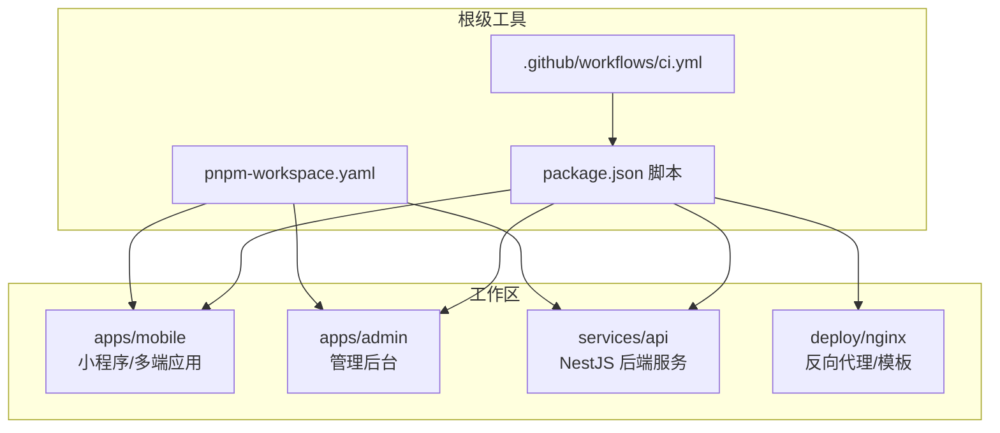
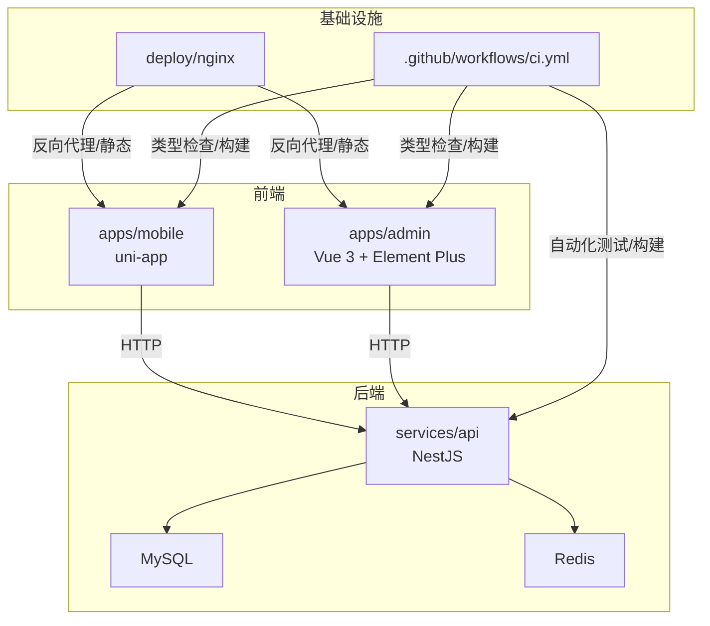
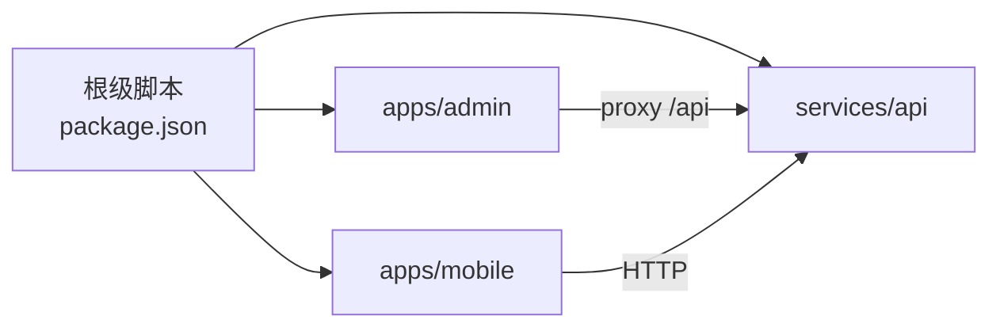

# 开发规范

<cite>
**本文引用的文件**
- [.github/workflows/ci.yml](file://.github/workflows/ci.yml)
- [package.json](file://package.json)
- [pnpm-workspace.yaml](file://pnpm-workspace.yaml)
- [services/api/eslint.config.mjs](file://services/api/eslint.config.mjs)
- [services/api/.prettierrc](file://services/api/.prettierrc)
- [services/api/package.json](file://services/api/package.json)
- [services/api/src/app.module.ts](file://services/api/src/app.module.ts)
- [services/api/src/main.ts](file://services/api/src/main.ts)
- [apps/admin/vite.config.ts](file://apps/admin/vite.config.ts)
- [apps/admin/src/main.ts](file://apps/admin/src/main.ts)
- [apps/admin/package.json](file://apps/admin/package.json)
- [apps/mobile/vite.config.ts](file://apps/mobile/vite.config.ts)
- [apps/mobile/package.json](file://apps/mobile/package.json)
- [services/api/tsconfig.json](file://services/api/tsconfig.json)
- [apps/admin/tsconfig.json](file://apps/admin/tsconfig.json)
</cite>

## 目录
1. 引言
2. 项目结构
3. 核心组件
4. 架构总览
5. 详细组件分析
6. 依赖关系分析
7. 性能考虑
8. 故障排查指南
9. 结论
10. 附录

## 引言
本规范旨在为 Fortune Hub 项目建立统一、可执行的开发与协作标准，覆盖代码风格（TypeScript、Vue、SCSS）、Git 工作流与分支策略、代码评审流程、命名约定与文件组织、组件与 API 设计原则、数据库设计标准、性能优化、安全编码实践、测试驱动开发与持续集成等。目标是提升团队效率、降低技术债、保障交付质量。

## 项目结构
项目采用多包工作区（pnpm workspaces）组织，包含移动端应用、管理后台、API 服务与部署配置。根级脚本统一编排各子包构建与测试；CI 流水线在 GitHub Actions 中执行端到端验证。

图表来源
- [package.json:1-23](file://package.json#L1-L23)
- [pnpm-workspace.yaml:1-4](file://pnpm-workspace.yaml#L1-L4)
- [.github/workflows/ci.yml:1-46](file://.github/workflows/ci.yml#L1-L46)

章节来源
- [package.json:1-23](file://package.json#L1-L23)
- [pnpm-workspace.yaml:1-4](file://pnpm-workspace.yaml#L1-L4)

## 核心组件
- 管理后台（Vue 3 + Vite + Element Plus）
  - 入口与路由：[apps/admin/src/main.ts:1-15](file://apps/admin/src/main.ts#L1-L15)
  - 开发服务器与代理：[apps/admin/vite.config.ts:1-58](file://apps/admin/vite.config.ts#L1-L58)
  - 依赖与脚本：[apps/admin/package.json:1-32](file://apps/admin/package.json#L1-L32)
- 移动端（uni-app + Vite）
  - 插件与多端构建：[apps/mobile/vite.config.ts:1-8](file://apps/mobile/vite.config.ts#L1-L8)
  - 多平台构建脚本：[apps/mobile/package.json:1-76](file://apps/mobile/package.json#L1-L76)
- API 服务（NestJS + TypeORM + MySQL）
  - 应用模块与数据库装配：[services/api/src/app.module.ts:1-145](file://services/api/src/app.module.ts#L1-L145)
  - 启动与全局中间件：[services/api/src/main.ts:1-74](file://services/api/src/main.ts#L1-L74)
  - 类型检查与构建配置：[services/api/tsconfig.json:1-26](file://services/api/tsconfig.json#L1-L26)
  - ESLint/Prettier 配置：[services/api/eslint.config.mjs:1-36](file://services/api/eslint.config.mjs#L1-L36), [services/api/.prettierrc:1-5](file://services/api/.prettierrc#L1-L5)
- 持续集成
  - CI 流程：[ci.yml:1-46](file://.github/workflows/ci.yml#L1-L46)

章节来源
- [apps/admin/src/main.ts:1-15](file://apps/admin/src/main.ts#L1-L15)
- [apps/admin/vite.config.ts:1-58](file://apps/admin/vite.config.ts#L1-L58)
- [apps/admin/package.json:1-32](file://apps/admin/package.json#L1-L32)
- [apps/mobile/vite.config.ts:1-8](file://apps/mobile/vite.config.ts#L1-L8)
- [apps/mobile/package.json:1-76](file://apps/mobile/package.json#L1-L76)
- [services/api/src/app.module.ts:1-145](file://services/api/src/app.module.ts#L1-L145)
- [services/api/src/main.ts:1-74](file://services/api/src/main.ts#L1-L74)
- [services/api/tsconfig.json:1-26](file://services/api/tsconfig.json#L1-L26)
- [services/api/eslint.config.mjs:1-36](file://services/api/eslint.config.mjs#L1-L36)
- [services/api/.prettierrc:1-5](file://services/api/.prettierrc#L1-L5)
- [.github/workflows/ci.yml:1-46](file://.github/workflows/ci.yml#L1-L46)

## 架构总览
系统由前端（管理后台与移动端）与后端 API 组成，通过 Vite/uni-app 构建，NestJS 提供 REST 服务，TypeORM 连接 MySQL，Redis 用于缓存与会话相关能力，Nginx 作为反向代理与静态资源服务。

图表来源
- [services/api/src/app.module.ts:1-145](file://services/api/src/app.module.ts#L1-L145)
- [services/api/src/main.ts:1-74](file://services/api/src/main.ts#L1-L74)
- [apps/admin/vite.config.ts:1-58](file://apps/admin/vite.config.ts#L1-L58)
- [apps/mobile/vite.config.ts:1-8](file://apps/mobile/vite.config.ts#L1-L8)
- [pnpm-workspace.yaml:1-4](file://pnpm-workspace.yaml#L1-L4)
- [.github/workflows/ci.yml:1-46](file://.github/workflows/ci.yml#L1-L46)

## 详细组件分析

### 管理后台（apps/admin）
- 入口与依赖
  - 使用 Pinia、Vue Router、Element Plus，样式入口统一加载 SCSS 主文件。
  - 参考路径：[apps/admin/src/main.ts:1-15](file://apps/admin/src/main.ts#L1-L15)
- 开发与代理
  - Vite 默认端口 5173，本地代理 /api 到后端服务端口 3001。
  - 参考路径：[apps/admin/vite.config.ts:1-58](file://apps/admin/vite.config.ts#L1-L58)
- 依赖与脚本
  - 构建使用 vue-tsc + vite，运行时依赖 Vue 3、Element Plus、Pinia、Vue Router。
  - 参考路径：[apps/admin/package.json:1-32](file://apps/admin/package.json#L1-L32)

章节来源
- [apps/admin/src/main.ts:1-15](file://apps/admin/src/main.ts#L1-L15)
- [apps/admin/vite.config.ts:1-58](file://apps/admin/vite.config.ts#L1-L58)
- [apps/admin/package.json:1-32](file://apps/admin/package.json#L1-L32)

### 移动端（apps/mobile）
- 多端构建
  - 基于 uni-app，Vite 插件按平台打包，支持微信小程序、H5、快应用等多端。
  - 参考路径：[apps/mobile/vite.config.ts:1-8](file://apps/mobile/vite.config.ts#L1-L8), [apps/mobile/package.json:1-76](file://apps/mobile/package.json#L1-L76)
- 类型检查
  - 提供 type-check 脚本，确保 TS 类型安全。
  - 参考路径：[apps/mobile/package.json:1-76](file://apps/mobile/package.json#L1-L76)

章节来源
- [apps/mobile/vite.config.ts:1-8](file://apps/mobile/vite.config.ts#L1-L8)
- [apps/mobile/package.json:1-76](file://apps/mobile/package.json#L1-L76)

### API 服务（services/api）
- 应用模块与数据库
  - 使用 TypeORM 注入实体与迁移，集中注册各业务模块。
  - 参考路径：[services/api/src/app.module.ts:1-145](file://services/api/src/app.module.ts#L1-L145)
- 启动与全局中间件
  - 设置全局前缀、过滤器、拦截器、校验管道与 CORS 策略。
  - 参考路径：[services/api/src/main.ts:1-74](file://services/api/src/main.ts#L1-L74)
- 类型检查与构建
  - 编译目标 ES2023，严格空值检查与一致大小写约束。
  - 参考路径：[services/api/tsconfig.json:1-26](file://services/api/tsconfig.json#L1-L26)
- 代码质量
  - ESLint + Prettier，推荐规则启用，禁用显式 any，对浮点 Promise 与不安全参数发出警告。
  - 参考路径：[services/api/eslint.config.mjs:1-36](file://services/api/eslint.config.mjs#L1-L36), [services/api/.prettierrc:1-5](file://services/api/.prettierrc#L1-L5)

章节来源
- [services/api/src/app.module.ts:1-145](file://services/api/src/app.module.ts#L1-L145)
- [services/api/src/main.ts:1-74](file://services/api/src/main.ts#L1-L74)
- [services/api/tsconfig.json:1-26](file://services/api/tsconfig.json#L1-L26)
- [services/api/eslint.config.mjs:1-36](file://services/api/eslint.config.mjs#L1-L36)
- [services/api/.prettierrc:1-5](file://services/api/.prettierrc#L1-L5)

### 持续集成（.github/workflows/ci.yml）
- 触发条件：push 到 main/develop/codex/**，或 PR 打开时触发
- 步骤：安装 pnpm、安装依赖、运行 API 测试、构建 API、构建管理后台、类型检查移动端、构建移动端
- 参考路径：[ci.yml:1-46](file://.github/workflows/ci.yml#L1-L46)

章节来源
- [.github/workflows/ci.yml:1-46](file://.github/workflows/ci.yml#L1-L46)

## 依赖关系分析
- 工作区与脚本
  - 根级 package.json 通过 pnpm workspace 管理子包，统一 dev/build/test 脚本。
  - 参考路径：[package.json:1-23](file://package.json#L1-L23), [pnpm-workspace.yaml:1-4](file://pnpm-workspace.yaml#L1-L4)
- 前后端交互
  - 管理后台通过 /api 代理访问后端；移动端直接以 HTTP 访问后端。
  - 参考路径：[apps/admin/vite.config.ts:1-58](file://apps/admin/vite.config.ts#L1-L58), [apps/mobile/vite.config.ts:1-8](file://apps/mobile/vite.config.ts#L1-L8)

图表来源
- [package.json:1-23](file://package.json#L1-L23)
- [apps/admin/vite.config.ts:1-58](file://apps/admin/vite.config.ts#L1-L58)
- [apps/mobile/vite.config.ts:1-8](file://apps/mobile/vite.config.ts#L1-L8)

章节来源
- [package.json:1-23](file://package.json#L1-L23)
- [pnpm-workspace.yaml:1-4](file://pnpm-workspace.yaml#L1-L4)

## 性能考虑
- 构建与打包
  - 使用 Vite 与 vue-tsc 并行处理，减少冷启动时间；移动端按平台构建，避免不必要的全量打包。
  - 参考路径：[apps/admin/package.json:1-32](file://apps/admin/package.json#L1-L32), [apps/mobile/package.json:1-76](file://apps/mobile/package.json#L1-L76)
- 类型检查
  - 在 CI 中单独执行类型检查，避免阻塞热更新；移动端提供独立 type-check 脚本。
  - 参考路径：[apps/mobile/package.json:1-76](file://apps/mobile/package.json#L1-L76), [.github/workflows/ci.yml:1-46](file://.github/workflows/ci.yml#L1-L46)
- API 层
  - 启用全局校验管道与响应拦截器，减少重复样板代码；合理设置 CORS，避免预检风暴。
  - 参考路径：[services/api/src/main.ts:1-74](file://services/api/src/main.ts#L1-L74)

## 故障排查指南
- CORS 错误
  - 确认后端允许的源列表已包含前端开发地址；生产环境仅允许白名单域名。
  - 参考路径：[services/api/src/main.ts:1-74](file://services/api/src/main.ts#L1-L74)
- 代理无效
  - 管理后台代理默认指向后端 3001 端口，确认后端已启动且端口正确。
  - 参考路径：[apps/admin/vite.config.ts:1-58](file://apps/admin/vite.config.ts#L1-L58)
- 类型错误
  - 在移动端执行 type-check，定位类型问题；必要时在 IDE 中打开 TS Server。
  - 参考路径：[apps/mobile/package.json:1-76](file://apps/mobile/package.json#L1-L76)
- CI 失败
  - 检查依赖安装、测试覆盖率与构建日志；优先修复 API 测试与类型检查。
  - 参考路径：[ci.yml:1-46](file://.github/workflows/ci.yml#L1-L46)

章节来源
- [services/api/src/main.ts:1-74](file://services/api/src/main.ts#L1-L74)
- [apps/admin/vite.config.ts:1-58](file://apps/admin/vite.config.ts#L1-L58)
- [apps/mobile/package.json:1-76](file://apps/mobile/package.json#L1-L76)
- [.github/workflows/ci.yml:1-46](file://.github/workflows/ci.yml#L1-L46)

## 结论
本规范基于现有仓库配置提炼出统一的开发与协作标准，涵盖代码风格、工作流、评审、命名与组织、组件与 API 设计、数据库标准、性能与安全、测试与 CI 等方面。建议团队在实际落地中逐步完善文档与工具链，持续迭代以适应业务演进。

## 附录

### 代码风格与格式化
- TypeScript
  - 编译目标：ES2023；严格空值检查；禁止隐式 any；装饰器与元数据启用。
  - 参考路径：[services/api/tsconfig.json:1-26](file://services/api/tsconfig.json#L1-L26)
- ESLint/Prettier
  - 推荐规则启用；单引号、尾随逗号；对显式 any 关闭，对浮点 Promise 与不安全参数发出警告。
  - 参考路径：[services/api/eslint.config.mjs:1-36](file://services/api/eslint.config.mjs#L1-L36), [services/api/.prettierrc:1-5](file://services/api/.prettierrc#L1-L5)

章节来源
- [services/api/tsconfig.json:1-26](file://services/api/tsconfig.json#L1-L26)
- [services/api/eslint.config.mjs:1-36](file://services/api/eslint.config.mjs#L1-L36)
- [services/api/.prettierrc:1-5](file://services/api/.prettierrc#L1-L5)

### Git 工作流与分支策略
- 分支保护
  - main/develop/codex/** 分支受保护，PR 必须通过 CI 与评审。
  - 参考路径：[ci.yml:1-46](file://.github/workflows/ci.yml#L1-L46)
- 提交建议
  - 使用清晰的提交信息，遵循“类型: 内容”的格式；关联任务编号与变更范围。

### 代码评审流程
- 触发与要求
  - PR 自动触发 CI；至少一名维护者批准；通过所有检查项。
  - 参考路径：[ci.yml:1-46](file://.github/workflows/ci.yml#L1-L46)

### 命名约定与文件组织
- 文件命名
  - 组件与页面使用 PascalCase；工具函数与常量使用 camelCase；DTO 使用大驼峰并带 DTO 后缀。
- 目录组织
  - 前端按功能域分层（components/composables/services/stores/views），后端按模块拆分（dto/controller/service/module）。
- 注释规范
  - 公共 API 与复杂逻辑需提供 JSDoc 注释；TODO/NOTE 使用明确标记并附带链接或任务号。

### 组件开发规范
- Vue 组件
  - 单文件组件内联样式与逻辑分离；Props 明确类型与默认值；事件命名使用 onXxx；状态集中管理。
  - 参考路径：[apps/admin/src/main.ts:1-15](file://apps/admin/src/main.ts#L1-L15)

### API 设计原则
- REST 风格
  - 资源命名复数；HTTP 方法语义化；状态码与错误体标准化。
- 安全
  - 全局校验管道开启；CORS 白名单控制；敏感头与跨域凭证谨慎使用。
  - 参考路径：[services/api/src/main.ts:1-74](file://services/api/src/main.ts#L1-L74)

### 数据库设计标准
- 实体与迁移
  - 实体集中注册；迁移文件按时间戳命名；生产环境谨慎启用同步与自动迁移。
  - 参考路径：[services/api/src/app.module.ts:1-145](file://services/api/src/app.module.ts#L1-L145)

### 性能优化建议
- 构建阶段
  - 合理拆分包与懒加载；关闭无用插件；启用压缩与 Tree Shaking。
- 运行阶段
  - 启用缓存与 CDN；限制并发请求；延迟加载非首屏资源。

### 安全编码实践
- 输入校验
  - 使用 DTO 与校验管道；拒绝不受信任输入；避免 SQL 注入与命令注入。
- 传输安全
  - HTTPS 强制；CORS 严格白名单；敏感数据加密存储。
- 权限控制
  - 基于角色的访问控制（RBAC）；接口鉴权与授权分离。

### 测试驱动开发与质量保证
- 单元测试
  - 使用 Jest；覆盖核心业务逻辑；保持测试隔离与可读性。
- 集成测试
  - E2E 场景覆盖关键流程；数据库回滚或使用测试副本。
- 质量门禁
  - CI 中强制执行测试与类型检查；覆盖率阈值逐步提升。

### 持续集成与自动化
- 流水线
  - 覆盖测试、构建与类型检查；按平台构建移动端产物。
  - 参考路径：[ci.yml:1-46](file://.github/workflows/ci.yml#L1-L46)
- 发布策略
  - 版本号与变更日志规范化；灰度发布与健康检查脚本配合。