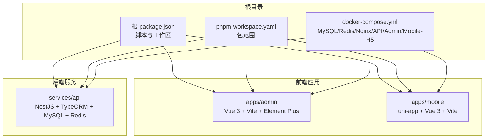
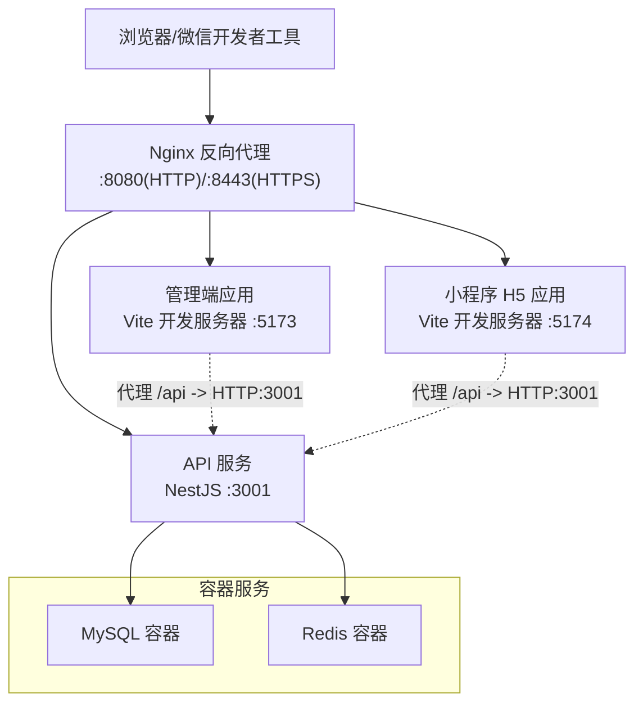
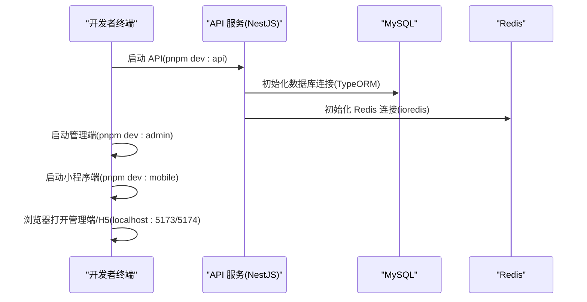
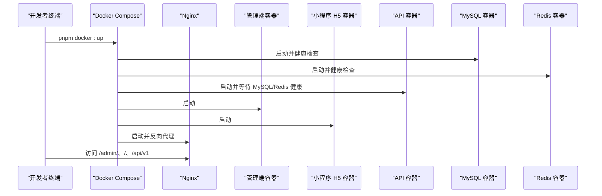

# 快速开始

<cite>
**本文引用的文件**
- [README.md](file://README.md)
- [package.json](file://package.json)
- [pnpm-workspace.yaml](file://pnpm-workspace.yaml)
- [docker-compose.yml](file://docker-compose.yml)
- [scripts/dev-api.mjs](file://scripts/dev-api.mjs)
- [services/api/src/main.ts](file://services/api/src/main.ts)
- [services/api/src/app.module.ts](file://services/api/src/app.module.ts)
- [services/api/package.json](file://services/api/package.json)
- [apps/admin/vite.config.ts](file://apps/admin/vite.config.ts)
- [apps/admin/package.json](file://apps/admin/package.json)
- [apps/admin/src/stores/admin-session.ts](file://apps/admin/src/stores/admin-session.ts)
- [apps/mobile/vite.config.ts](file://apps/mobile/vite.config.ts)
- [apps/mobile/package.json](file://apps/mobile/package.json)
- [apps/mobile/src/config/env.ts](file://apps/mobile/src/config/env.ts)
</cite>

## 目录
1. [简介](#简介)
2. [项目结构](#项目结构)
3. [核心组件](#核心组件)
4. [架构总览](#架构总览)
5. [详细组件分析](#详细组件分析)
6. [依赖关系分析](#依赖关系分析)
7. [性能注意事项](#性能注意事项)
8. [故障排查指南](#故障排查指南)
9. [结论](#结论)
10. [附录](#附录)

## 简介
本指南面向首次参与 Fortune Hub 项目的开发者，帮助你在本地快速搭建并运行完整的开发环境，涵盖 Node.js、pnpm、Docker 等工具安装，环境变量准备，数据库与 Redis 的本地或容器化配置，以及 API、管理端、小程序端的启动流程与差异说明。你将获得：
- 完整的环境准备步骤
- 环境变量文件复制与配置要点
- 本地开发与 Docker 调试方式
- 不同开发模式（H5 预览 vs 小程序原生）的差异与访问地址
- 常见问题排查与解决方案

## 项目结构
Fortune Hub 采用 monorepo 结构，包含三个前端应用与一个后端服务，配合 Docker Compose 提供本地联调与部署基础设施。

图表来源
- [package.json:1-23](file://package.json#L1-L23)
- [pnpm-workspace.yaml:1-4](file://pnpm-workspace.yaml#L1-L4)
- [docker-compose.yml:1-170](file://docker-compose.yml#L1-L170)

章节来源
- [README.md:18-37](file://README.md#L18-L37)
- [package.json:1-23](file://package.json#L1-L23)
- [pnpm-workspace.yaml:1-4](file://pnpm-workspace.yaml#L1-L4)

## 核心组件
- 包管理器：pnpm（工作区）
- 前端管理端：Vue 3 + Vite + Element Plus
- 前端小程序端：uni-app + Vue 3 + Vite
- 后端 API：NestJS + TypeORM + MySQL + Redis
- 基础设施：Docker Compose + Nginx 反向代理

章节来源
- [README.md:58-64](file://README.md#L58-L64)
- [apps/admin/package.json:1-32](file://apps/admin/package.json#L1-L32)
- [apps/mobile/package.json:1-76](file://apps/mobile/package.json#L1-L76)
- [services/api/package.json:1-91](file://services/api/package.json#L1-L91)

## 架构总览
下图展示了本地开发与 Docker 环境下的请求流转与端口映射关系。

图表来源
- [docker-compose.yml:147-166](file://docker-compose.yml#L147-L166)
- [apps/admin/vite.config.ts:48-57](file://apps/admin/vite.config.ts#L48-L57)
- [README.md:97-115](file://README.md#L97-L115)

## 详细组件分析

### 环境准备与工具安装
- Node.js：使用官方安装包或 nvm 安装 LTS 版本，确保版本满足各包依赖要求。
- pnpm：作为包管理器与 monorepo 工作区工具，安装后执行一次性安装以拉取所有依赖。
- Docker：用于一键启动 MySQL、Redis、Nginx、API、管理端、小程序 H5 应用；如需本地直连数据库，也可仅启动 API 与数据库容器。

章节来源
- [README.md:66-72](file://README.md#L66-L72)
- [README.md:139-146](file://README.md#L139-L146)

### 环境变量准备与配置
- 复制示例环境文件：
  - 根目录、小程序端、管理端、API 服务分别复制各自的 .env.example 到 .env。
- 关键配置项（非穷举）：
  - 数据库：MYSQL_HOST、MYSQL_PORT、MYSQL_USER、MYSQL_PASSWORD、MYSQL_DATABASE
  - 缓存：REDIS_HOST、REDIS_PORT
  - 文件服务：FILE_SERVICE_BASE_URL（本地开发默认指向 3000 端口）
  - CORS：CORS_ORIGIN（允许跨域来源，本地默认包含管理端与 H5 端口）
  - 微信相关：WECHAT_APP_ID、WECHAT_APP_SECRET、WECHAT_LOGIN_ALLOW_MOCK
  - 短信服务：SMS_PROVIDER、ALIBABA_CLOUD_ACCESS_KEY_ID、ALIBABA_CLOUD_ACCESS_KEY_SECRET 等
  - 支付与海报：PAYMENT_MODE、POSTER_* 系列参数
- 注意：
  - 若使用 Docker Compose，API 服务会自动读取容器内环境变量；若直接本地运行 API，需确保 .env 中的数据库与 Redis 地址正确。
  - 开发脚本会尝试解析 Docker 暴露的 MySQL 端口并注入到 API 进程环境，避免端口不一致导致连接失败。

章节来源
- [README.md:74-81](file://README.md#L74-L81)
- [docker-compose.yml:54-106](file://docker-compose.yml#L54-L106)
- [scripts/dev-api.mjs:87-99](file://scripts/dev-api.mjs#L87-L99)

### 本地开发启动流程
- 一次性安装依赖：
  - 在根目录执行安装命令，拉取所有包依赖。
- 启动本地开发（三端同时）：
  - API：pnpm dev:api
  - 管理端：pnpm dev:admin
  - 小程序端：pnpm dev:mobile
- 浏览器预览小程序 H5：
  - pnpm dev:mobile:h5

预期效果：
- 管理端访问：http://localhost:5173
- 小程序 H5 访问：http://localhost:5174
- API 健康检查：http://localhost:3001/api/v1/health
- API 首页接口：http://localhost:3001/api/v1/home/index

章节来源
- [README.md:83-96](file://README.md#L83-L96)
- [README.md:97-105](file://README.md#L97-L105)
- [package.json:6-21](file://package.json#L6-L21)

### 开发模式差异（H5 预览 vs 小程序原生）
- H5 预览（dev:mobile:h5）：
  - 使用 uni 的 H5 模式，便于在浏览器中快速调试页面与交互。
  - 适合前端联调与 UI/UX 快速迭代。
- 小程序原生（dev:mobile）：
  - 输出到目标平台（如微信小程序），需要对应 IDE（如微信开发者工具）进行真机调试。
  - 适合最终联调与平台兼容性验证。

章节来源
- [apps/mobile/package.json:4-38](file://apps/mobile/package.json#L4-L38)
- [README.md:112-115](file://README.md#L112-L115)

### 端到端启动序列（本地直连）

图表来源
- [services/api/src/app.module.ts:67-117](file://services/api/src/app.module.ts#L67-L117)
- [services/api/src/main.ts:8-62](file://services/api/src/main.ts#L8-L62)
- [package.json:6-21](file://package.json#L6-L21)

### 端到端启动序列（Docker Compose）

图表来源
- [docker-compose.yml:1-170](file://docker-compose.yml#L1-L170)
- [package.json:19-20](file://package.json#L19-L20)

## 依赖关系分析
- 工作区与脚本：
  - 根 package.json 定义了统一的开发与构建脚本，通过 pnpm filter 指定到具体子包。
  - pnpm-workspace.yaml 声明 apps/* 与 services/* 为工作区包范围。
- 前端代理与基础路径：
  - 管理端通过 Vite 代理 /api 到 API 服务端口；基础路径由 VITE_PUBLIC_BASE 控制（默认 /admin/）。
  - 小程序端通过 Vite 插件与 uni 插件支持多平台构建与开发。
- 后端连接：
  - API 服务通过 ConfigModule 读取环境变量，TypeORM 连接 MySQL，RedisModule 连接 Redis。
  - CORS 默认允许本地开发来源，生产环境受 CORS_ORIGIN 控制。

章节来源
- [package.json:6-21](file://package.json#L6-L21)
- [pnpm-workspace.yaml:1-4](file://pnpm-workspace.yaml#L1-L4)
- [apps/admin/vite.config.ts:42-57](file://apps/admin/vite.config.ts#L42-L57)
- [apps/mobile/vite.config.ts:1-8](file://apps/mobile/vite.config.ts#L1-L8)
- [services/api/src/app.module.ts:67-117](file://services/api/src/app.module.ts#L67-L117)
- [services/api/src/main.ts:12-59](file://services/api/src/main.ts#L12-L59)

## 性能注意事项
- 本地开发优先使用 Vite 的热更新能力，减少全量编译时间。
- API 侧 TypeORM 的 synchronize 与 migrationsRun 仅在开发阶段建议开启，生产环境应关闭同步并使用迁移脚本保证数据一致性。
- Redis 作为缓存与会话存储，注意键空间与过期策略，避免内存膨胀。
- Docker 环境下，Nginx 作为反向代理，建议启用静态资源缓存与 Gzip 压缩提升加载速度。

## 故障排查指南
- 端口冲突
  - 管理端默认端口 5173、小程序 H5 默认端口 5174、API 默认端口 3001、Nginx 默认 8080/8443。若端口被占用，请修改对应服务的端口映射或释放端口。
- CORS 报错
  - 确认 CORS_ORIGIN 是否包含当前访问来源（本地开发默认允许 localhost/127.0.0.1 对应端口）。
- 数据库连接失败
  - 若使用 Docker Compose，确认 MySQL 容器健康状态；若本地直连，确认 .env 中的 MYSQL_HOST/PORT/USER/PASSWORD 正确。
  - API 启动脚本会尝试从 Docker 解析 MySQL 端口并注入到进程环境，若失败请手动指定端口。
- Redis 连接失败
  - 确认 REDIS_HOST/REDIS_PORT 与容器内暴露一致；Docker 环境下默认端口 6379。
- 文件服务不可用
  - 确认 FILE_SERVICE_BASE_URL 指向正确的文件服务地址；本地开发默认 3000 端口。
- 微信登录/短信服务异常
  - 确认 WECHAT_* 与短信相关密钥配置正确；如需模拟，可开启相应 MOCK 开关。
- 管理端登录与菜单加载
  - 登录成功后会拉取管理员信息与菜单，若为空，检查 API 健康与权限模块是否正常。

章节来源
- [services/api/src/main.ts:12-59](file://services/api/src/main.ts#L12-L59)
- [scripts/dev-api.mjs:57-99](file://scripts/dev-api.mjs#L57-L99)
- [docker-compose.yml:54-106](file://docker-compose.yml#L54-L106)
- [apps/admin/src/stores/admin-session.ts:27-55](file://apps/admin/src/stores/admin-session.ts#L27-L55)

## 结论
通过本指南，你可以完成 Fortune Hub 的环境准备与本地开发启动，理解三端与后端的交互关系，并掌握 Docker 与本地直连两种开发模式的差异与适用场景。遇到问题时，可依据“故障排查指南”逐项核对配置与端口，快速定位并解决。

## 附录

### 常用命令速查
- 依赖安装：在根目录执行安装命令
- 启动 API：pnpm dev:api
- 启动管理端：pnpm dev:admin
- 启动小程序端：pnpm dev:mobile
- 启动小程序 H5：pnpm dev:mobile:h5
- 构建全部：pnpm build
- 测试 API：pnpm test:api
- 类型检查（小程序）：pnpm type-check:mobile
- 启动 Docker：pnpm docker:up
- 停止 Docker：pnpm docker:down

章节来源
- [README.md:116-137](file://README.md#L116-L137)
- [package.json:6-21](file://package.json#L6-L21)