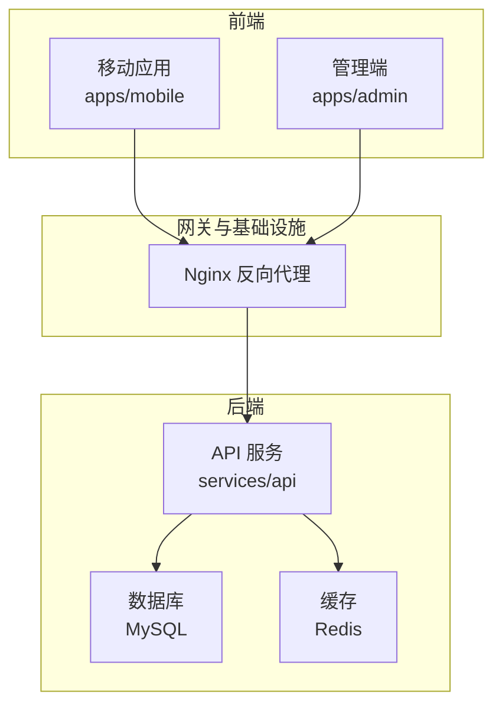
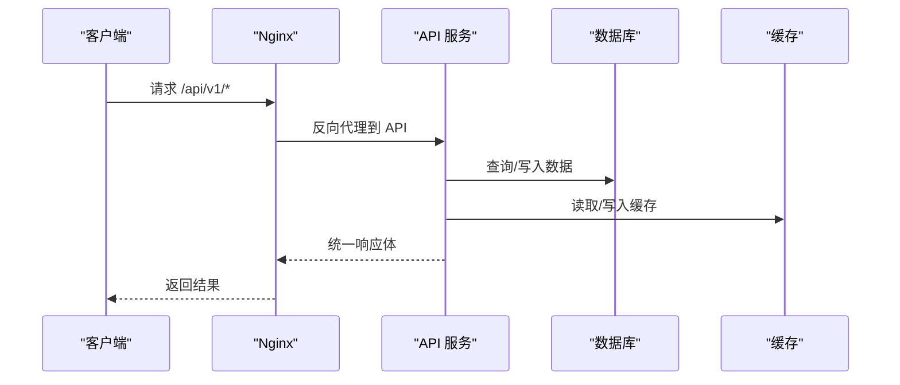
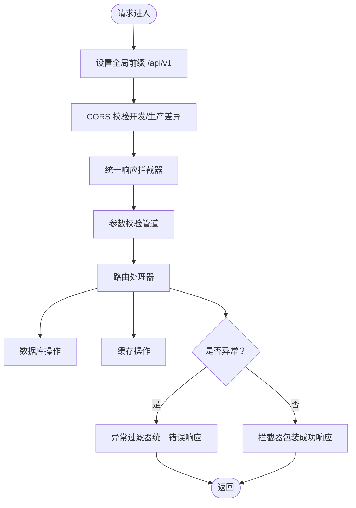
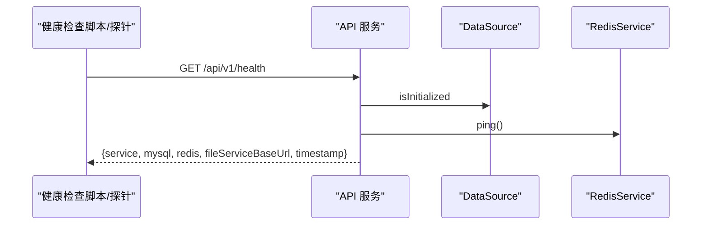
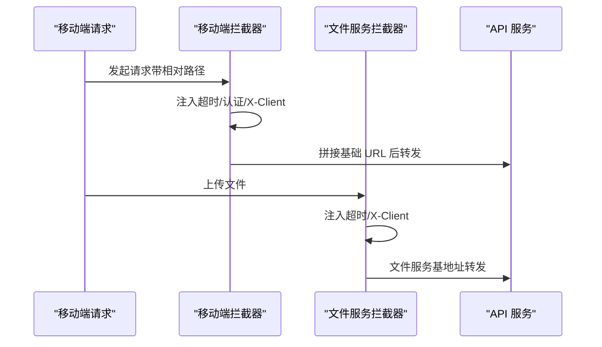
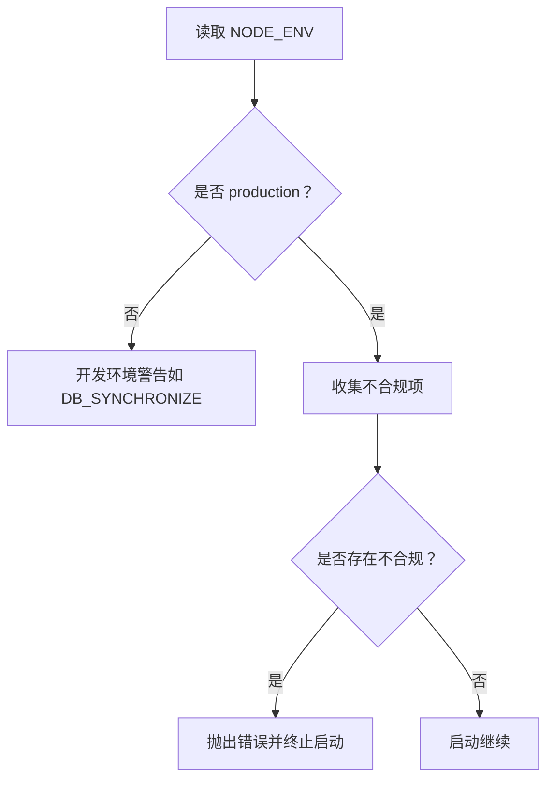
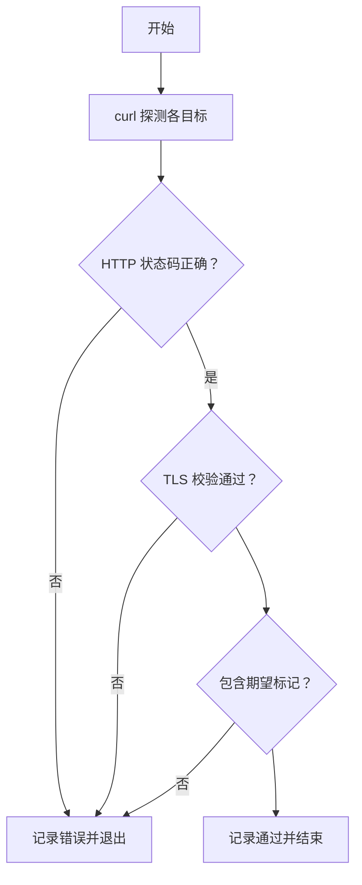
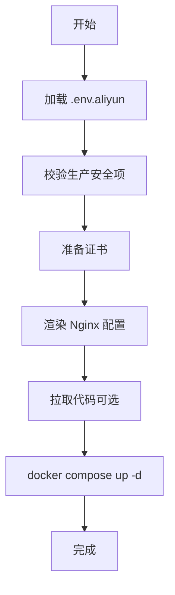
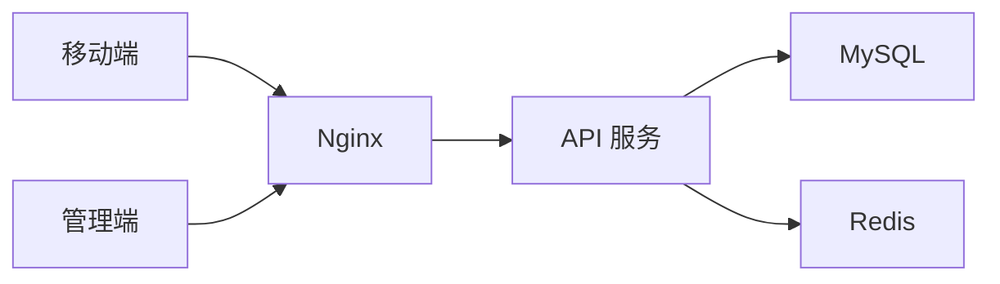

# 故障排除

<cite>
**本文引用的文件**
- [README.md](file://README.md)
- [docker-compose.yml](file://docker-compose.yml)
- [scripts/check-production-health.sh](file://scripts/check-production-health.sh)
- [scripts/deploy-aliyun.sh](file://scripts/deploy-aliyun.sh)
- [services/api/src/main.ts](file://services/api/src/main.ts)
- [services/api/src/app.module.ts](file://services/api/src/app.module.ts)
- [services/api/src/common/filters/http-exception.filter.ts](file://services/api/src/common/filters/http-exception.filter.ts)
- [services/api/src/common/interceptors/transform.interceptor.ts](file://services/api/src/common/interceptors/transform.interceptor.ts)
- [services/api/src/common/production-config.validator.ts](file://services/api/src/common/production-config.validator.ts)
- [services/api/src/health/health.controller.ts](file://services/api/src/health/health.controller.ts)
- [apps/mobile/src/interceptors/http.ts](file://apps/mobile/src/interceptors/http.ts)
- [apps/admin/src/api/http.ts](file://apps/admin/src/api/http.ts)
- [apps/mobile/src/config/env.ts](file://apps/mobile/src/config/env.ts)
</cite>

## 目录
1. [简介](#简介)
2. [项目结构](#项目结构)
3. [核心组件](#核心组件)
4. [架构总览](#架构总览)
5. [详细组件分析](#详细组件分析)
6. [依赖关系分析](#依赖关系分析)
7. [性能考虑](#性能考虑)
8. [故障排除指南](#故障排除指南)
9. [结论](#结论)
10. [附录](#附录)

## 简介
本指南面向 Fortune Hub 的开发者与运维人员，提供系统化的故障排除与问题诊断方法。内容覆盖环境配置、依赖冲突、数据库连接失败、API 调用异常、跨域与认证问题、日志分析与性能瓶颈定位、内存泄漏检测、不同环境（开发 vs 生产）的问题特征与策略、监控指标与告警处理流程、紧急响应预案、问题上报模板与调试工具使用指南。

## 项目结构
Fortune Hub 采用 monorepo 架构，包含移动端（uni-app）、管理端（Vue 3 + Vite）、后端 API（NestJS + TypeORM + MySQL + Redis），并通过 Nginx 进行反向代理与 HTTPS 终端。Docker Compose 提供本地与生产级编排，健康检查脚本用于生产环境可用性验证。

图表来源
- [docker-compose.yml:1-170](file://docker-compose.yml#L1-L170)
- [README.md:18-37](file://README.md#L18-L37)

章节来源
- [README.md:1-206](file://README.md#L1-L206)
- [docker-compose.yml:1-170](file://docker-compose.yml#L1-L170)

## 核心组件
- API 引导与全局中间件：统一拦截器、异常过滤器、CORS、校验管道、全局前缀设置。
- 健康检查控制器：返回 MySQL 初始化状态、Redis Ping 结果、文件服务基地址与时间戳。
- 前端拦截器：移动端与管理端分别注入基础 URL、超时、认证头与客户端标识。
- 生产配置校验器：强制生产环境安全配置，禁止弱口令与本地来源，确保 HTTPS。
- 健康检查脚本：对 API、文件服务、移动端 H5、管理端进行 HTTP(S) 健康探测。
- 部署脚本：阿里云部署流程，含证书准备、Nginx 配置渲染、容器编排与日志查看。

章节来源
- [services/api/src/main.ts:1-74](file://services/api/src/main.ts#L1-L74)
- [services/api/src/health/health.controller.ts:1-28](file://services/api/src/health/health.controller.ts#L1-L28)
- [apps/mobile/src/interceptors/http.ts:1-49](file://apps/mobile/src/interceptors/http.ts#L1-L49)
- [apps/admin/src/api/http.ts:1-21](file://apps/admin/src/api/http.ts#L1-L21)
- [services/api/src/common/production-config.validator.ts:1-216](file://services/api/src/common/production-config.validator.ts#L1-L216)
- [scripts/check-production-health.sh:1-86](file://scripts/check-production-health.sh#L1-L86)
- [scripts/deploy-aliyun.sh:1-199](file://scripts/deploy-aliyun.sh#L1-L199)

## 架构总览
下图展示从客户端到 API、数据库与缓存的整体交互路径，以及健康检查与部署流程的关键节点。

图表来源
- [docker-compose.yml:43-119](file://docker-compose.yml#L43-L119)
- [services/api/src/app.module.ts:67-117](file://services/api/src/app.module.ts#L67-L117)

## 详细组件分析

### API 引导与中间件
- 全局前缀：所有路由统一以 /api/v1 开头，便于反向代理与多环境隔离。
- CORS：允许开发环境本地回环与显式配置的 HTTPS 来源；生产环境严格校验来源与协议。
- 全局拦截器：统一成功响应包装，避免重复封装与裸返回。
- 全局异常过滤器：统一错误响应体，5xx 错误记录堆栈日志。
- 校验管道：白名单与隐式类型转换，减少脏数据进入业务层。

图表来源
- [services/api/src/main.ts:32-59](file://services/api/src/main.ts#L32-L59)
- [services/api/src/common/interceptors/transform.interceptor.ts:17-58](file://services/api/src/common/interceptors/transform.interceptor.ts#L17-L58)
- [services/api/src/common/filters/http-exception.filter.ts:18-40](file://services/api/src/common/filters/http-exception.filter.ts#L18-L40)

章节来源
- [services/api/src/main.ts:1-74](file://services/api/src/main.ts#L1-L74)
- [services/api/src/common/interceptors/transform.interceptor.ts:1-59](file://services/api/src/common/interceptors/transform.interceptor.ts#L1-L59)
- [services/api/src/common/filters/http-exception.filter.ts:1-92](file://services/api/src/common/filters/http-exception.filter.ts#L1-L92)

### 健康检查控制器
- 返回服务名、数据库初始化状态、Redis Ping 结果、文件服务基地址与时间戳。
- 作为生产健康检查脚本与容器健康探针的统一入口。

图表来源
- [services/api/src/health/health.controller.ts:6-27](file://services/api/src/health/health.controller.ts#L6-L27)

章节来源
- [services/api/src/health/health.controller.ts:1-28](file://services/api/src/health/health.controller.ts#L1-L28)

### 前端拦截器与环境配置
- 移动端拦截器：自动拼接基础 URL、注入超时、认证头与客户端标识；上传文件走文件服务基地址。
- 管理端拦截器：统一基础 URL、超时与认证头。
- 环境配置：根据平台与开发模式选择 API 与文件服务基地址，避免硬编码。

图表来源
- [apps/mobile/src/interceptors/http.ts:18-48](file://apps/mobile/src/interceptors/http.ts#L18-L48)
- [apps/admin/src/api/http.ts:4-20](file://apps/admin/src/api/http.ts#L4-L20)
- [apps/mobile/src/config/env.ts:26-40](file://apps/mobile/src/config/env.ts#L26-L40)

章节来源
- [apps/mobile/src/interceptors/http.ts:1-49](file://apps/mobile/src/interceptors/http.ts#L1-L49)
- [apps/admin/src/api/http.ts:1-21](file://apps/admin/src/api/http.ts#L1-L21)
- [apps/mobile/src/config/env.ts:1-41](file://apps/mobile/src/config/env.ts#L1-L41)

### 生产配置校验器
- 强制生产环境 HTTPS 来源与地址、强口令、禁用本地来源、禁用模拟支付与短信。
- 在非生产环境仅发出警告（如 DB_SYNCHRONIZE=true）。

图表来源
- [services/api/src/common/production-config.validator.ts:25-104](file://services/api/src/common/production-config.validator.ts#L25-L104)

章节来源
- [services/api/src/common/production-config.validator.ts:1-216](file://services/api/src/common/production-config.validator.ts#L1-L216)

### 健康检查脚本
- 对 API、文件服务、移动端 H5、管理端进行 HTTP(S) 健康探测，校验状态码、TLS 校验与期望内容标记。
- 支持超时与详细日志输出，便于定位网络与证书问题。

图表来源
- [scripts/check-production-health.sh:26-82](file://scripts/check-production-health.sh#L26-L82)

章节来源
- [scripts/check-production-health.sh:1-86](file://scripts/check-production-health.sh#L1-L86)

### 部署脚本（阿里云）
- 加载环境变量、校验生产安全项、准备证书、渲染 Nginx 配置、拉取代码、启动容器、查看状态与日志。
- 禁止生产使用模拟支付、模拟短信与数据库同步模式。

图表来源
- [scripts/deploy-aliyun.sh:26-114](file://scripts/deploy-aliyun.sh#L26-L114)

章节来源
- [scripts/deploy-aliyun.sh:1-199](file://scripts/deploy-aliyun.sh#L1-L199)

## 依赖关系分析
- API 服务依赖 MySQL 与 Redis，容器健康检查确保依赖可用。
- Nginx 作为统一入口，将 /api/、/admin/、/ 路由分发至对应服务。
- 前端通过环境变量注入 API 与文件服务基地址，避免硬编码导致的跨环境问题。

图表来源
- [docker-compose.yml:147-166](file://docker-compose.yml#L147-L166)
- [services/api/src/app.module.ts:67-117](file://services/api/src/app.module.ts#L67-L117)

章节来源
- [docker-compose.yml:1-170](file://docker-compose.yml#L1-L170)
- [services/api/src/app.module.ts:1-145](file://services/api/src/app.module.ts#L1-L145)

## 性能考虑
- 超时与重试：移动端请求默认 12s，上传文件默认 20s；根据网络状况与资源大小调整。
- 缓存命中：合理利用 Redis 缓存热点数据，降低数据库压力。
- 数据库连接池与索引：确保查询语句与索引优化，避免慢查询。
- 前端懒加载与资源压缩：控制包体积与请求数，提升首屏性能。
- 容器健康检查：通过健康探针及时发现依赖异常，避免雪崩。

## 故障排除指南

### 一、环境配置问题
- 症状
  - API 启动报错或直接退出
  - 健康检查失败
  - 生产环境访问出现跨域或证书错误
- 排查步骤
  - 核对 .env 与 .env.aliyun 中关键变量（数据库、Redis、管理员账号与密码、微信配置、支付配置、CORS、HTTPS 基地址）。
  - 使用生产配置校验器逻辑逐项核对：禁止弱口令、必须为 HTTPS、禁止本地来源、禁止模拟支付/短信。
  - 若为生产部署，确认已渲染 Nginx 配置并放置有效证书。
- 处理建议
  - 替换弱口令与默认值，确保 HTTPS 与合法来源。
  - 使用部署脚本自动准备证书与渲染配置。
  - 如需本地测试，使用开发环境变量并允许本地回环来源。

章节来源
- [services/api/src/common/production-config.validator.ts:25-104](file://services/api/src/common/production-config.validator.ts#L25-L104)
- [scripts/deploy-aliyun.sh:68-98](file://scripts/deploy-aliyun.sh#L68-L98)
- [services/api/src/main.ts:18-59](file://services/api/src/main.ts#L18-L59)

### 二、依赖冲突与启动失败
- 症状
  - API 启动时报数据库连接失败或模块导入错误
  - Docker Compose 启动后 API 无法健康
- 排查步骤
  - 查看容器日志：docker compose logs -f --tail=200
  - 确认 MySQL/Redis 容器健康状态与端口映射
  - 核对数据库迁移开关与同步开关（生产禁止同步）
- 处理建议
  - 使用迁移而非同步；确保数据库初始化与迁移脚本执行成功
  - 检查网络连通性与主机绑定地址

章节来源
- [docker-compose.yml:18-42](file://docker-compose.yml#L18-L42)
- [services/api/src/app.module.ts:110-116](file://services/api/src/app.module.ts#L110-L116)
- [scripts/deploy-aliyun.sh:131-134](file://scripts/deploy-aliyun.sh#L131-L134)

### 三、数据库连接失败
- 症状
  - 健康接口返回 mysql: DOWN
  - 控制台报连接超时或凭证错误
- 排查步骤
  - 核对 MYSQL_HOST/PORT/USER/PASSWORD/DATABASE
  - 确认容器间网络与端口映射
  - 执行数据库健康检查命令
- 处理建议
  - 使用 compose 健康检查确认数据库可用
  - 检查防火墙与绑定地址（开发环境可绑定 0.0.0.0）

章节来源
- [docker-compose.yml:18-23](file://docker-compose.yml#L18-L23)
- [services/api/src/health/health.controller.ts:18-18](file://services/api/src/health/health.controller.ts#L18-L18)
- [services/api/src/app.module.ts:75-79](file://services/api/src/app.module.ts#L75-L79)

### 四、API 调用异常
- 症状
  - 前端请求 4xx/5xx，统一错误响应体
  - 控制台出现异常堆栈
- 排查步骤
  - 检查全局异常过滤器是否生效，关注 5xx 错误日志
  - 核对请求头（Authorization、X-Client）、超时与基础 URL
  - 使用健康检查脚本验证 API 与依赖状态
- 处理建议
  - 修复业务层异常或 DTO 参数校验
  - 前端统一注入认证头与客户端标识

章节来源
- [services/api/src/common/filters/http-exception.filter.ts:22-40](file://services/api/src/common/filters/http-exception.filter.ts#L22-L40)
- [apps/mobile/src/interceptors/http.ts:23-33](file://apps/mobile/src/interceptors/http.ts#L23-L33)
- [apps/admin/src/api/http.ts:12-20](file://apps/admin/src/api/http.ts#L12-L20)
- [scripts/check-production-health.sh:74-82](file://scripts/check-production-health.sh#L74-L82)

### 五、跨域与认证问题
- 症状
  - 浏览器报跨域错误
  - 登录或需要权限的接口返回未授权
- 排查步骤
  - 核对 CORS_ORIGIN 是否包含前端来源且为 HTTPS
  - 确认前端是否正确注入 Authorization 与 X-Client
  - 检查生产环境是否允许本地来源（开发例外）
- 处理建议
  - 在开发环境允许本地回环来源，在生产环境严格限制
  - 统一在拦截器中注入认证头与客户端标识

章节来源
- [services/api/src/main.ts:18-59](file://services/api/src/main.ts#L18-L59)
- [apps/mobile/src/interceptors/http.ts:27-32](file://apps/mobile/src/interceptors/http.ts#L27-L32)
- [apps/admin/src/api/http.ts:12-17](file://apps/admin/src/api/http.ts#L12-L17)

### 六、日志分析技巧
- API 日志
  - 关注 5xx 错误日志与堆栈
  - 使用统一错误响应体定位具体接口与参数
- 容器日志
  - docker compose logs -f --tail=200
  - 结合健康检查脚本输出定位网络与证书问题
- 健康检查
  - 使用脚本输出的 HTTP 状态码、TLS 校验结果与响应体前若干行辅助判断

章节来源
- [services/api/src/common/filters/http-exception.filter.ts:32-37](file://services/api/src/common/filters/http-exception.filter.ts#L32-L37)
- [scripts/check-production-health.sh:38-72](file://scripts/check-production-health.sh#L38-L72)
- [scripts/deploy-aliyun.sh:131-134](file://scripts/deploy-aliyun.sh#L131-L134)

### 七、性能瓶颈定位
- 前端
  - 检查请求超时与并发数，优化资源加载
- 后端
  - 关注数据库慢查询与连接池占用
  - 利用 Redis 缓存热点数据
- 基础设施
  - Nginx 层面检查限速与缓冲区配置
  - 健康探针与容器重启策略避免雪崩

章节来源
- [apps/mobile/src/interceptors/http.ts:25-26](file://apps/mobile/src/interceptors/http.ts#L25-L26)
- [docker-compose.yml:110-119](file://docker-compose.yml#L110-L119)

### 八、内存泄漏检测
- 建议
  - 使用 Node.js 内置分析工具与第三方工具对 API 进行采样
  - 观察长连接与定时任务是否正确释放
  - 前端注意组件销毁时取消订阅与清理定时器

### 九、不同环境的问题特征与策略
- 开发环境
  - 允许本地回环来源与弱校验，DB 可同步，便于快速迭代
  - 健康检查脚本与本地联调地址见 README
- 生产环境
  - 严格 HTTPS、强口令、禁止模拟支付/短信、禁止 DB 同步
  - 使用部署脚本自动化证书与配置渲染，健康检查脚本保障上线质量

章节来源
- [README.md:97-111](file://README.md#L97-L111)
- [services/api/src/main.ts:44-59](file://services/api/src/main.ts#L44-L59)
- [services/api/src/common/production-config.validator.ts:46-101](file://services/api/src/common/production-config.validator.ts#L46-L101)
- [scripts/deploy-aliyun.sh:49-61](file://scripts/deploy-aliyun.sh#L49-L61)

### 十、监控指标与告警处理流程
- 指标
  - API 健康：/api/v1/health 返回 mysql 与 redis 状态
  - 容器健康：compose 健康探针与外部健康检查脚本
  - TLS：证书有效性与校验结果
- 告警
  - 健康检查失败触发告警
  - 5xx 错误率上升触发告警
- 处理流程
  - 自动化巡检 → 告警 → 快速定位 → 应急处置 → 回滚与复盘

章节来源
- [services/api/src/health/health.controller.ts:14-26](file://services/api/src/health/health.controller.ts#L14-L26)
- [scripts/check-production-health.sh:74-82](file://scripts/check-production-health.sh#L74-L82)
- [docker-compose.yml:110-119](file://docker-compose.yml#L110-L119)

### 十一、紧急响应预案
- 快速恢复
  - 检查并重启 API/依赖容器
  - 回滚到上一个健康版本
- 降级
  - 关闭非关键功能（如海报生成、推送）
- 通知
  - 通过运维渠道发布影响范围与预计恢复时间

章节来源
- [scripts/deploy-aliyun.sh:117-119](file://scripts/deploy-aliyun.sh#L117-L119)

### 十二、问题上报模板
- 环境信息
  - 环境：开发/测试/生产
  - 版本：提交哈希或标签
- 现象描述
  - 复现步骤、预期与实际
- 日志与截图
  - 前端控制台、API 日志、健康检查输出
- 影响范围
  - 用户影响面、接口范围、依赖服务
- 处理建议
  - 临时规避方案与修复计划

### 十三、调试工具使用指南
- 健康检查脚本
  - 设置目标域名与超时，观察 HTTP 状态码与 TLS 校验
- Docker 日志
  - 实时查看容器日志，定位依赖与业务异常
- 前端断点
  - 在拦截器注入点与请求发起点设置断点，检查头与 URL

章节来源
- [scripts/check-production-health.sh:13-20](file://scripts/check-production-health.sh#L13-L20)
- [scripts/deploy-aliyun.sh:131-134](file://scripts/deploy-aliyun.sh#L131-L134)
- [apps/mobile/src/interceptors/http.ts:23-33](file://apps/mobile/src/interceptors/http.ts#L23-L33)

## 结论
通过统一的健康检查、严格的生产配置校验、完善的前端拦截器与日志策略，Fortune Hub 能够在开发与生产环境中快速定位与解决问题。建议团队将本指南纳入日常运维流程，结合自动化脚本与监控告警，持续提升系统的稳定性与可维护性。

## 附录
- 常用本地联调地址与脚本参考见 README
- Docker Compose 默认容器转发规则与健康检查配置见 docker-compose.yml

章节来源
- [README.md:97-137](file://README.md#L97-L137)
- [docker-compose.yml:152-157](file://docker-compose.yml#L152-L157)