# 数据库设计

<cite>
**本文引用的文件**
- [data-source.ts](file://services/api/src/database/data-source.ts)
- [user.entity.ts](file://services/api/src/database/entities/user.entity.ts)
- [assessment-session.entity.ts](file://services/api/src/database/entities/assessment-session.entity.ts)
- [favorite.entity.ts](file://services/api/src/database/entities/favorite.entity.ts)
- [order.entity.ts](file://services/api/src/database/entities/order.entity.ts)
- [divination-review.entity.ts](file://services/api/src/database/entities/divination-review.entity.ts)
- [user-record.entity.ts](file://services/api/src/database/entities/user-record.entity.ts)
- [mood-record.entity.ts](file://services/api/src/database/entities/mood-record.entity.ts)
- [meditation-record.entity.ts](file://services/api/src/database/entities/meditation-record.entity.ts)
- [daily-pulse-record.entity.ts](file://services/api/src/database/entities/daily-pulse-record.entity.ts)
- [breathing-record.entity.ts](file://services/api/src/database/entities/breathing-record.entity.ts)
- [1761320000000-AddFavorites.ts](file://services/api/src/database/migrations/1761320000000-AddFavorites.ts)
- [1761323600000-AddMoodAndMeditationRecords.ts](file://services/api/src/database/migrations/1761323600000-AddMoodAndMeditationRecords.ts)
- [1761327200000-AddUserPreferences.ts](file://services/api/src/database/migrations/1761327200000-AddUserPreferences.ts)
- [1762500000000-AddDivinationReviews.ts](file://services/api/src/database/migrations/1762500000000-AddDivinationReviews.ts)
- [1762600000000-AddUserMetricSnapshots.ts](file://services/api/src/database/migrations/1762600000000-AddUserMetricSnapshots.ts)
</cite>

## 目录
1. [简介](#简介)
2. [项目结构](#项目结构)
3. [核心组件](#核心组件)
4. [架构总览](#架构总览)
5. [详细组件分析](#详细组件分析)
6. [依赖关系分析](#依赖关系分析)
7. [性能考量](#性能考量)
8. [故障排查指南](#故障排查指南)
9. [结论](#结论)
10. [附录](#附录)

## 简介
本文件为 Fortune Hub 项目的数据库设计与实现文档，聚焦于基于 TypeORM 的数据模型、索引与约束策略、迁移管理与版本演进、并发与一致性保障、查询性能优化等主题。文档以“用户”“测评会话”“占卜记录”“收藏”“订单”等核心实体为主线，结合迁移脚本与数据源配置，帮助开发者快速理解并正确使用数据模型。

## 项目结构
数据库相关代码集中在后端服务模块中，采用分层组织：
- 数据源配置：定义连接参数、实体集合、迁移路径
- 实体定义：每个领域模型对应一个实体类，标注索引与列属性
- 迁移管理：按时间戳命名的迁移文件，负责表结构与索引的增量演进

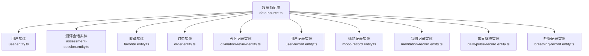

图表来源
- [data-source.ts:32-72](file://services/api/src/database/data-source.ts#L32-L72)
- [user.entity.ts:10-74](file://services/api/src/database/entities/user.entity.ts#L10-L74)
- [assessment-session.entity.ts:3-22](file://services/api/src/database/entities/assessment-session.entity.ts#L3-L22)
- [favorite.entity.ts:10-48](file://services/api/src/database/entities/favorite.entity.ts#L10-L48)
- [order.entity.ts:10-52](file://services/api/src/database/entities/order.entity.ts#L10-L52)
- [divination-review.entity.ts:10-66](file://services/api/src/database/entities/divination-review.entity.ts#L10-L66)
- [user-record.entity.ts:10-49](file://services/api/src/database/entities/user-record.entity.ts#L10-L49)
- [mood-record.entity.ts:10-40](file://services/api/src/database/entities/mood-record.entity.ts#L10-L40)
- [meditation-record.entity.ts:10-73](file://services/api/src/database/entities/meditation-record.entity.ts#L10-L73)
- [daily-pulse-record.entity.ts:10-42](file://services/api/src/database/entities/daily-pulse-record.entity.ts#L10-L42)
- [breathing-record.entity.ts:9-41](file://services/api/src/database/entities/breathing-record.entity.ts#L9-L41)

章节来源
- [data-source.ts:1-73](file://services/api/src/database/data-source.ts#L1-L73)

## 核心组件
本节对关键实体进行逐项说明，涵盖字段语义、索引与约束、典型查询场景及性能考虑。

- 用户表（users）
  - 主键：自增 bigint
  - 唯一索引：openid、phone
  - 其他索引：星座字段
  - 字段要点：微信标识、手机号、头像昵称、性别、生日/生时、星座、紫微斗数摘要、五行分布、偏好 JSON、VIP 状态与到期时间、最近登录信息、时间戳
  - 典型用途：身份认证、个性化推荐、会员权益校验
  - 章节来源
    - [user.entity.ts:14-74](file://services/api/src/database/entities/user.entity.ts#L14-L74)

- 测评会话表（assessment_sessions）
  - 主键：UUID
  - 字段要点：渠道、测评类型、星座、幸运分数、创建时间
  - 典型用途：记录一次测评的元信息，便于统计与回溯
  - 章节来源
    - [assessment-session.entity.ts:4-22](file://services/api/src/database/entities/assessment-session.entity.ts#L4-L22)

- 收藏表（favorites）
  - 主键：自增 bigint
  - 唯一索引：用户+条目类型+条目键
  - 辅助索引：用户+创建时间
  - 字段要点：用户 ID、条目类型、条目键、标题、摘要、图标、路由、扩展 JSON、时间戳
  - 典型用途：用户收藏内容去重与快速检索
  - 章节来源
    - [favorite.entity.ts:15-48](file://services/api/src/database/entities/favorite.entity.ts#L15-L48)

- 订单表（orders）
  - 主键：自增 bigint
  - 唯一索引：订单号
  - 辅助索引：用户+状态
  - 字段要点：用户 ID、订单号、产品编码/标题、金额（分）、订单类型、状态、交易单号、扩展 JSON、支付时间、时间戳
  - 典型用途：交易闭环、对账与报表
  - 章节来源
    - [order.entity.ts:13-52](file://services/api/src/database/entities/order.entity.ts#L13-L52)

- 占卜记录表（divination_reviews）
  - 主键：自增 bigint
  - 唯一索引：用户+结果 ID
  - 辅助索引：用户+更新时间
  - 字段要点：用户 ID、结果 ID、收藏标记、结果状态、备注、话题、标题、摘要、结果快照、前后情绪与强度、期望、时间戳
  - 典型用途：占卜历史与复盘，支持按用户聚合与趋势分析
  - 章节来源
    - [divination-review.entity.ts:15-66](file://services/api/src/database/entities/divination-review.entity.ts#L15-L66)

- 用户记录表（records）
  - 主键：自增 bigint
  - 辅助索引：用户+记录类型；全局创建时间索引
  - 字段要点：用户 ID、记录类型、来源编码、结果标题、分数、等级、结果 JSON、是否解锁全报告、解锁类型、时间戳
  - 典型用途：保存各类用户产出或评估结果，支持按类型与时间检索
  - 章节来源
    - [user-record.entity.ts:13-49](file://services/api/src/database/entities/user-record.entity.ts#L13-L49)

- 情绪记录表（mood_records）
  - 主键：自增 bigint
  - 唯一索引：用户+记录日期
  - 辅助索引：用户+更新时间
  - 字段要点：用户 ID、记录日期、情绪类型、情绪分值、情感标签数组、日记内容、时间戳
  - 典型用途：每日情绪追踪与趋势分析
  - 章节来源
    - [mood-record.entity.ts:13-40](file://services/api/src/database/entities/mood-record.entity.ts#L13-L40)

- 冥想记录表（meditation_records）
  - 主键：自增 bigint
  - 辅助索引：用户+记录日期；用户+更新时间
  - 字段要点：用户 ID、记录日期、标题、分类、来源类型、来源标题、时长（分钟）、完成状态、摘要、意图、前后情绪与强度、专注度、身心感受、洞察、后续行动、时间戳
  - 典型用途：冥想行为追踪与效果评估
  - 章节来源
    - [meditation-record.entity.ts:13-73](file://services/api/src/database/entities/meditation-record.entity.ts#L13-L73)

- 每日脉搏表（daily_pulse_records）
  - 主键：自增 bigint
  - 唯一索引：用户+记录日期
  - 字段要点：用户 ID、记录日期、当日情绪、强度、类别、备注、响应情绪、时间戳
  - 典型用途：每日健康脉搏式记录
  - 章节来源
    - [daily-pulse-record.entity.ts:12-42](file://services/api/src/database/entities/daily-pulse-record.entity.ts#L12-L42)

- 呼吸记录表（breathing_records）
  - 主键：自增 bigint
  - 辅助索引：用户
  - 字段要点：用户 ID、模式、轮数、时长（秒）、前后情绪与强度、时间戳
  - 典型用途：呼吸训练行为记录
  - 章节来源
    - [breathing-record.entity.ts:11-41](file://services/api/src/database/entities/breathing-record.entity.ts#L11-L41)

## 架构总览
下图展示数据库层在应用中的位置与职责边界，以及与迁移机制的关系。

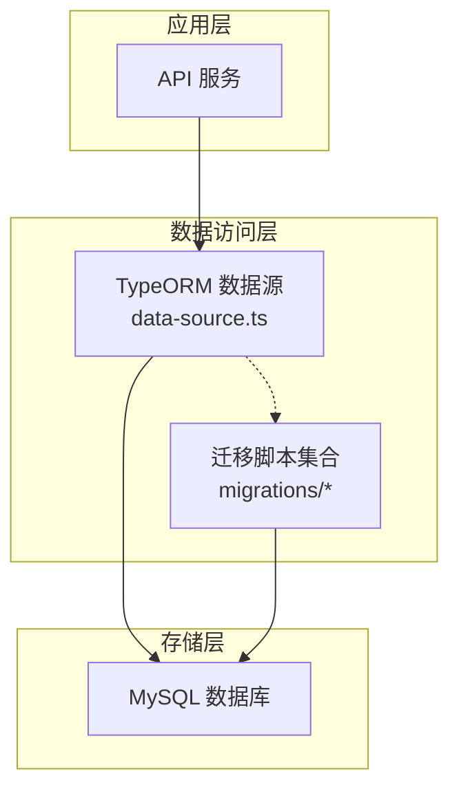

图表来源
- [data-source.ts:32-72](file://services/api/src/database/data-source.ts#L32-L72)

## 详细组件分析

### 用户实体（UserEntity）分析
- 设计理念
  - 多身份标识：微信 openid/unionid 与手机号双唯一索引，满足多端登录与绑定需求
  - 个性化与隐私：偏好 JSON、头像昵称、性别、生日/生时、星座、五行分布
  - 会员体系：VIP 状态与到期时间，便于权限与权益控制
  - 登录审计：最近登录时间与来源，便于风控与运营分析
- 关系与约束
  - 与收藏、订单、记录、情绪/冥想/脉搏/呼吸等记录表存在一对多关系
  - 唯一性通过索引保障，避免重复绑定
- 性能建议
  - 对常用过滤条件（如 openid、phone、zodiac）建立索引，已由实体注解实现
  - 查询时尽量使用复合索引覆盖（如用户+时间），减少回表

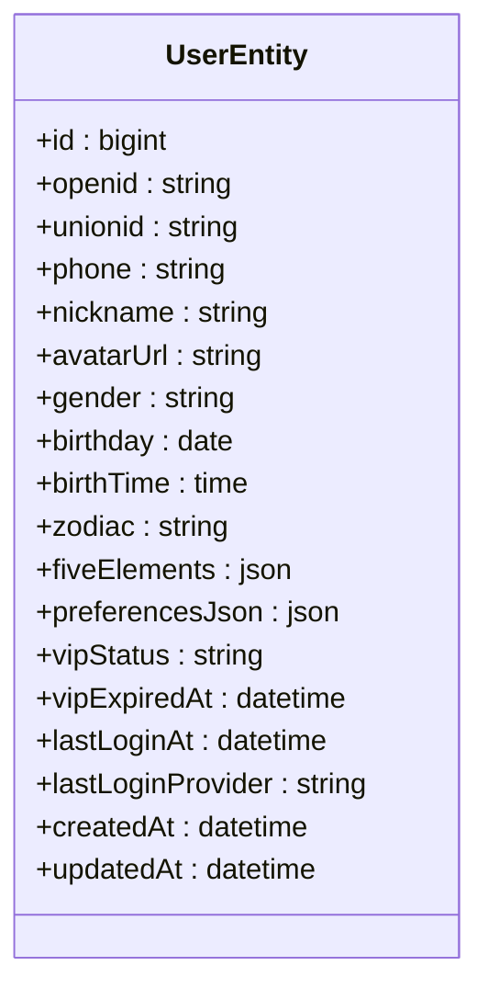

图表来源
- [user.entity.ts:14-74](file://services/api/src/database/entities/user.entity.ts#L14-L74)

章节来源
- [user.entity.ts:14-74](file://services/api/src/database/entities/user.entity.ts#L14-L74)

### 收藏实体（FavoriteEntity）分析
- 设计理念
  - 通用收藏模型：通过 itemType/itemKey 组合唯一标识任意类型的收藏条目
  - 路由与元信息：title/summary/icon/route 提供前端展示所需信息
  - 时间维度：按用户+创建时间排序，便于列表展示
- 关系与约束
  - 与用户表为多对一
  - 唯一索引确保同一用户对同一条目的收藏不重复
- 性能建议
  - 使用用户+类型+时间的复合索引，支持高效分页与去重

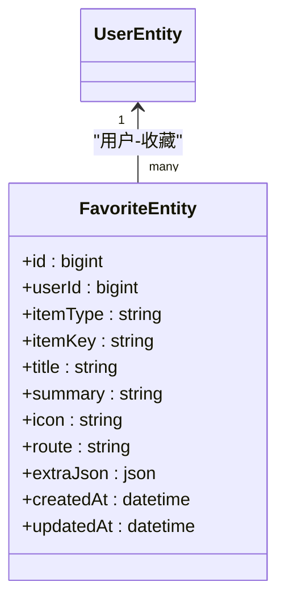

图表来源
- [favorite.entity.ts:15-48](file://services/api/src/database/entities/favorite.entity.ts#L15-L48)
- [user.entity.ts:14-74](file://services/api/src/database/entities/user.entity.ts#L14-L74)

章节来源
- [favorite.entity.ts:15-48](file://services/api/src/database/entities/favorite.entity.ts#L15-L48)

### 订单实体（OrderEntity）分析
- 设计理念
  - 交易闭环：订单号唯一、状态机驱动、支付时间可追溯
  - 扩展性：产品编码/标题、扩展 JSON 存储业务上下文
  - 成本核算：金额以“分”为单位，避免浮点误差
- 关系与约束
  - 与用户表为多对一
  - 订单号唯一，用户+状态组合索引支持按用户与状态筛选
- 性能建议
  - 对高频查询（用户+状态、订单号）使用索引覆盖
  - 支付回调与对账流程应幂等处理

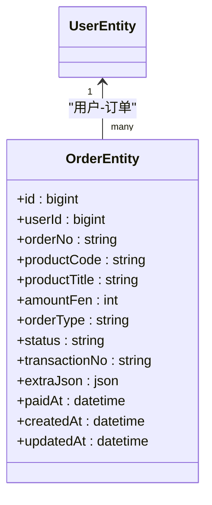

图表来源
- [order.entity.ts:13-52](file://services/api/src/database/entities/order.entity.ts#L13-L52)
- [user.entity.ts:14-74](file://services/api/src/database/entities/user.entity.ts#L14-L74)

章节来源
- [order.entity.ts:13-52](file://services/api/src/database/entities/order.entity.ts#L13-L52)

### 占卜记录实体（DivinationReviewEntity）分析
- 设计理念
  - 结果去重：用户+结果 ID 唯一，防止重复记录
  - 状态化管理：结果状态（待定/已实现/未实现）便于运营与统计
  - 快照与复盘：结果快照 JSON 保留原始数据，便于回放与分析
- 关系与约束
  - 与用户表为多对一
  - 唯一索引与用户+更新时间索引支撑高效查询
- 性能建议
  - 按用户聚合查询时优先使用用户+更新时间索引
  - 结果快照字段按需加载，避免大对象频繁传输

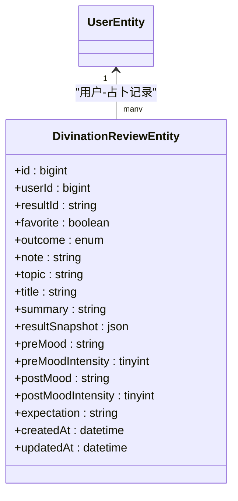

图表来源
- [divination-review.entity.ts:15-66](file://services/api/src/database/entities/divination-review.entity.ts#L15-L66)
- [user.entity.ts:14-74](file://services/api/src/database/entities/user.entity.ts#L14-L74)

章节来源
- [divination-review.entity.ts:15-66](file://services/api/src/database/entities/divination-review.entity.ts#L15-L66)

### 用户记录实体（UserRecordEntity）分析
- 设计理念
  - 通用结果容器：通过 recordType 与结果 JSON 支持多种记录类型
  - 解锁机制：是否解锁全报告与解锁类型字段便于内容分发
- 关系与约束
  - 与用户表为多对一
  - 用户+类型与全局创建时间索引支持高效检索
- 性能建议
  - 对高频查询（用户+类型）使用复合索引
  - 结果 JSON 字段按需解析，避免不必要的序列化开销

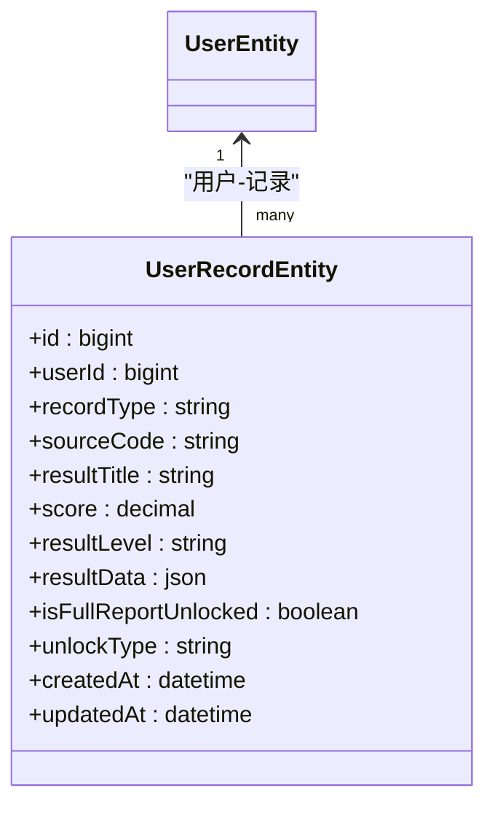

图表来源
- [user-record.entity.ts:13-49](file://services/api/src/database/entities/user-record.entity.ts#L13-L49)
- [user.entity.ts:14-74](file://services/api/src/database/entities/user.entity.ts#L14-L74)

章节来源
- [user-record.entity.ts:13-49](file://services/api/src/database/entities/user-record.entity.ts#L13-L49)

### 情绪记录实体（MoodRecordEntity）分析
- 设计理念
  - 日常追踪：唯一索引确保同用户同日仅一条记录
  - 细粒度指标：情绪类型与分值、情感标签、日记内容
- 关系与约束
  - 与用户表为多对一
  - 唯一索引与用户+更新时间索引支撑高效查询
- 性能建议
  - 按日期范围查询时优先使用用户+日期索引
  - 标签与日记内容按需加载

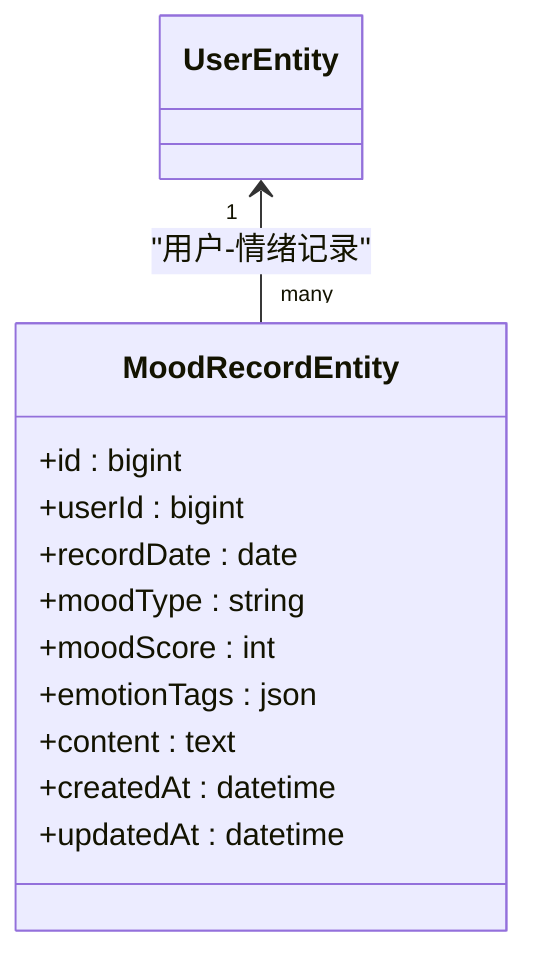

图表来源
- [mood-record.entity.ts:13-40](file://services/api/src/database/entities/mood-record.entity.ts#L13-L40)
- [user.entity.ts:14-74](file://services/api/src/database/entities/user.entity.ts#L14-L74)

章节来源
- [mood-record.entity.ts:13-40](file://services/api/src/database/entities/mood-record.entity.ts#L13-L40)

### 冥想记录实体（MeditationRecordEntity）分析
- 设计理念
  - 行为量化：时长、完成状态、前后情绪与专注度
  - 来源与分类：来源类型与标题便于内容溯源
- 关系与约束
  - 与用户表为多对一
  - 用户+日期与用户+更新时间索引
- 性能建议
  - 按日期范围与完成状态组合查询时使用复合索引
  - 长文本字段（摘要、洞察、后续行动）按需加载

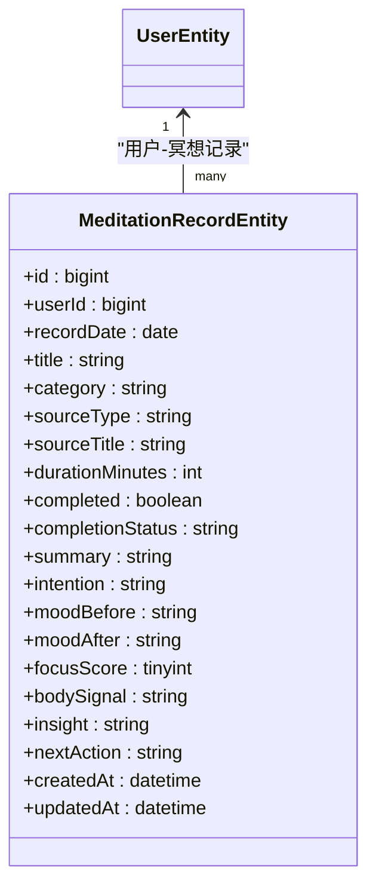

图表来源
- [meditation-record.entity.ts:13-73](file://services/api/src/database/entities/meditation-record.entity.ts#L13-L73)
- [user.entity.ts:14-74](file://services/api/src/database/entities/user.entity.ts#L14-L74)

章节来源
- [meditation-record.entity.ts:13-73](file://services/api/src/database/entities/meditation-record.entity.ts#L13-L73)

### 每日脉搏实体（DailyPulseRecordEntity）分析
- 设计理念
  - 简洁高效：每日一条记录，记录情绪、强度、类别与备注
- 关系与约束
  - 与用户表为多对一
  - 唯一索引确保日唯一性
- 性能建议
  - 按日期范围查询时使用用户+日期索引

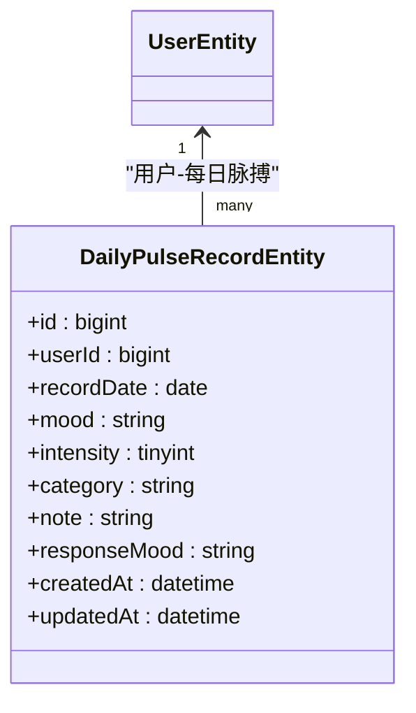

图表来源
- [daily-pulse-record.entity.ts:12-42](file://services/api/src/database/entities/daily-pulse-record.entity.ts#L12-L42)
- [user.entity.ts:14-74](file://services/api/src/database/entities/user.entity.ts#L14-L74)

章节来源
- [daily-pulse-record.entity.ts:12-42](file://services/api/src/database/entities/daily-pulse-record.entity.ts#L12-L42)

### 呼吸记录实体（BreathingRecordEntity）分析
- 设计理念
  - 训练量化：模式、轮数、时长、前后情绪与强度
- 关系与约束
  - 与用户表为多对一
  - 用户索引支持按用户检索
- 性能建议
  - 按用户聚合统计时使用用户索引

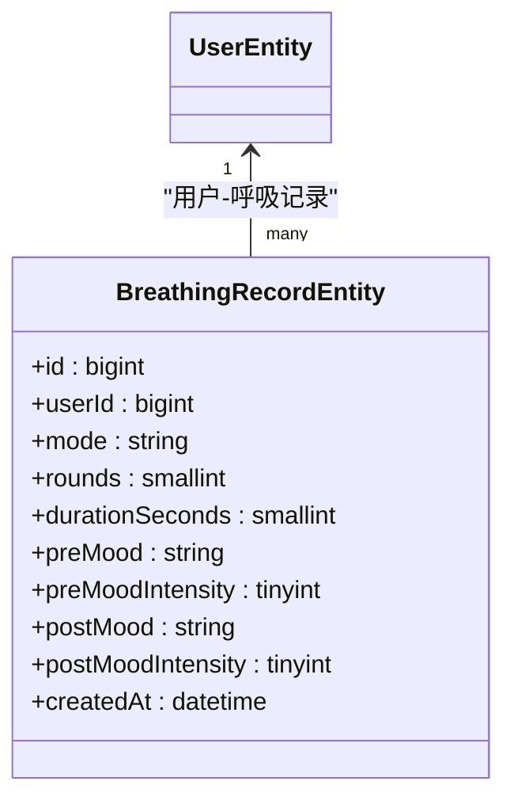

图表来源
- [breathing-record.entity.ts:11-41](file://services/api/src/database/entities/breathing-record.entity.ts#L11-L41)
- [user.entity.ts:14-74](file://services/api/src/database/entities/user.entity.ts#L14-L74)

章节来源
- [breathing-record.entity.ts:11-41](file://services/api/src/database/entities/breathing-record.entity.ts#L11-L41)

## 依赖关系分析
- 组件耦合
  - 所有记录类实体均依赖用户表，体现“用户为中心”的数据组织
  - 收藏、订单、占卜记录、用户记录作为上层业务的“结果载体”，与用户形成稳定的多对一关系
- 外部依赖
  - TypeORM 作为 ORM 框架，负责实体映射、索引与迁移管理
  - MySQL 作为持久化存储，承载所有业务数据
- 潜在风险
  - 复合索引设计需与查询模式匹配，避免冗余索引导致写入放大
  - JSON 字段的查询与索引能力有限，建议在必要时拆分或物化

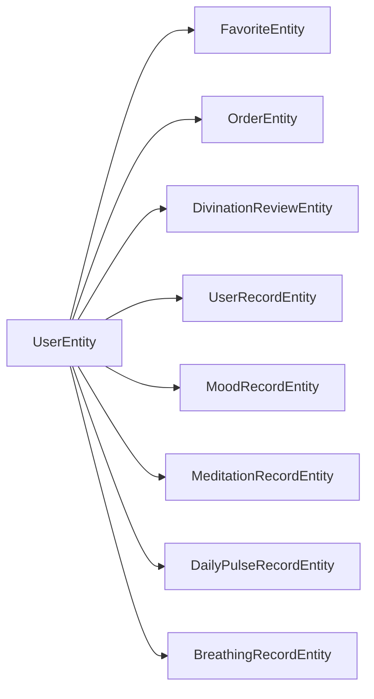

图表来源
- [user.entity.ts:14-74](file://services/api/src/database/entities/user.entity.ts#L14-L74)
- [favorite.entity.ts:15-48](file://services/api/src/database/entities/favorite.entity.ts#L15-L48)
- [order.entity.ts:13-52](file://services/api/src/database/entities/order.entity.ts#L13-L52)
- [divination-review.entity.ts:15-66](file://services/api/src/database/entities/divination-review.entity.ts#L15-L66)
- [user-record.entity.ts:13-49](file://services/api/src/database/entities/user-record.entity.ts#L13-L49)
- [mood-record.entity.ts:13-40](file://services/api/src/database/entities/mood-record.entity.ts#L13-L40)
- [meditation-record.entity.ts:13-73](file://services/api/src/database/entities/meditation-record.entity.ts#L13-L73)
- [daily-pulse-record.entity.ts:12-42](file://services/api/src/database/entities/daily-pulse-record.entity.ts#L12-L42)
- [breathing-record.entity.ts:11-41](file://services/api/src/database/entities/breathing-record.entity.ts#L11-L41)

## 性能考量
- 索引策略
  - 唯一索引：用户标识（openid/phone）、收藏唯一键、订单号、用户+日期（情绪/脉搏/冥想）、用户+结果 ID（占卜）
  - 复合索引：用户+创建时间（收藏）、用户+更新时间（情绪/占卜/冥想）、用户+记录日期（情绪/脉搏/冥想）
- 查询优化
  - 使用覆盖索引减少回表
  - 分页查询时优先使用索引列排序与过滤
  - JSON 字段避免在 WHERE 中直接使用，必要时物化派生字段
- 并发与一致性
  - 写入密集场景建议批量提交与幂等处理
  - 对关键状态变更（如订单状态、占卜结果状态）使用乐观锁或事务保障一致性
- 迁移与版本演进
  - 采用时间戳命名的迁移文件，确保可重复执行与回滚
  - 新增列或索引时，先在迁移中声明，再在实体中补充注解，保持一致

## 故障排查指南
- 常见问题
  - 唯一约束冲突：收藏重复、订单号重复、用户标识重复
  - 查询慢：缺少合适索引、WHERE 中对 JSON 字段直接过滤
  - 迁移失败：迁移顺序错误、目标表已存在但结构不同
- 排查步骤
  - 检查实体注解与迁移文件的索引定义是否一致
  - 使用 EXPLAIN 分析慢查询，确认是否命中预期索引
  - 对重复数据进行清洗或去重后再执行迁移
- 参考迁移脚本
  - 收藏表创建与索引：[1761320000000-AddFavorites.ts:6-96](file://services/api/src/database/migrations/1761320000000-AddFavorites.ts#L6-L96)
  - 情绪与冥想记录表创建与索引：[1761323600000-AddMoodAndMeditationRecords.ts:8-100](file://services/api/src/database/migrations/1761323600000-AddMoodAndMeditationRecords.ts#L8-L100)
  - 用户偏好 JSON 列新增：[1761327200000-AddUserPreferences.ts:4-17](file://services/api/src/database/migrations/1761327200000-AddUserPreferences.ts#L4-L17)
  - 占卜记录表创建与索引：[1762500000000-AddDivinationReviews.ts:6-104](file://services/api/src/database/migrations/1762500000000-AddDivinationReviews.ts#L6-L104)
  - 用户指标快照表创建与索引：[1762600000000-AddUserMetricSnapshots.ts:6-106](file://services/api/src/database/migrations/1762600000000-AddUserMetricSnapshots.ts#L6-L106)

章节来源
- [1761320000000-AddFavorites.ts:6-96](file://services/api/src/database/migrations/1761320000000-AddFavorites.ts#L6-L96)
- [1761323600000-AddMoodAndMeditationRecords.ts:8-100](file://services/api/src/database/migrations/1761323600000-AddMoodAndMeditationRecords.ts#L8-L100)
- [1761327200000-AddUserPreferences.ts:4-17](file://services/api/src/database/migrations/1761327200000-AddUserPreferences.ts#L4-L17)
- [1762500000000-AddDivinationReviews.ts:6-104](file://services/api/src/database/migrations/1762500000000-AddDivinationReviews.ts#L6-L104)
- [1762600000000-AddUserMetricSnapshots.ts:6-106](file://services/api/src/database/migrations/1762600000000-AddUserMetricSnapshots.ts#L6-L106)

## 结论
本数据库设计围绕“用户为中心”的核心理念，通过清晰的实体划分、完善的索引与约束、规范的迁移管理，构建了可扩展、可维护、可演进的数据层。建议在后续迭代中持续关注查询模式变化，动态调整索引与物化字段，确保系统在高并发与大数据量下的稳定性与性能。

## 附录

### ER 图
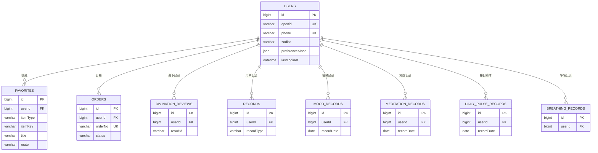

图表来源
- [user.entity.ts:14-74](file://services/api/src/database/entities/user.entity.ts#L14-L74)
- [favorite.entity.ts:15-48](file://services/api/src/database/entities/favorite.entity.ts#L15-L48)
- [order.entity.ts:13-52](file://services/api/src/database/entities/order.entity.ts#L13-L52)
- [divination-review.entity.ts:15-66](file://services/api/src/database/entities/divination-review.entity.ts#L15-L66)
- [user-record.entity.ts:13-49](file://services/api/src/database/entities/user-record.entity.ts#L13-L49)
- [mood-record.entity.ts:13-40](file://services/api/src/database/entities/mood-record.entity.ts#L13-L40)
- [meditation-record.entity.ts:13-73](file://services/api/src/database/entities/meditation-record.entity.ts#L13-L73)
- [daily-pulse-record.entity.ts:12-42](file://services/api/src/database/entities/daily-pulse-record.entity.ts#L12-L42)
- [breathing-record.entity.ts:11-41](file://services/api/src/database/entities/breathing-record.entity.ts#L11-L41)

### 数据字典（核心实体）

- 用户表（users）
  - 字段
    - id：自增主键
    - openid：微信 openid（唯一）
    - phone：手机号（唯一）
    - zodiac：星座
    - preferencesJson：偏好 JSON
    - lastLoginAt：最近登录时间
  - 索引
    - 唯一：openid、phone
    - 其他：zodiac

- 收藏表（favorites）
  - 字段
    - id：自增主键
    - userId：用户 ID
    - itemType：条目类型
    - itemKey：条目键
    - title：标题
    - route：路由
  - 索引
    - 唯一：用户+类型+条目键
    - 其他：用户+创建时间

- 订单表（orders）
  - 字段
    - id：自增主键
    - userId：用户 ID
    - orderNo：订单号（唯一）
    - status：状态
  - 索引
    - 唯一：orderNo
    - 其他：用户+状态

- 占卜记录表（divination_reviews）
  - 字段
    - id：自增主键
    - userId：用户 ID
    - resultId：结果 ID（唯一）
  - 索引
    - 唯一：用户+结果 ID
    - 其他：用户+更新时间

- 用户记录表（records）
  - 字段
    - id：自增主键
    - userId：用户 ID
    - recordType：记录类型
  - 索引
    - 其他：用户+记录类型；全局创建时间

- 情绪记录表（mood_records）
  - 字段
    - id：自增主键
    - userId：用户 ID
    - recordDate：记录日期（唯一）
  - 索引
    - 唯一：用户+记录日期
    - 其他：用户+更新时间

- 冥想记录表（meditation_records）
  - 字段
    - id：自增主键
    - userId：用户 ID
    - recordDate：记录日期
  - 索引
    - 其他：用户+记录日期；用户+更新时间

- 每日脉搏表（daily_pulse_records）
  - 字段
    - id：自增主键
    - userId：用户 ID
    - recordDate：记录日期（唯一）
  - 索引
    - 唯一：用户+记录日期

- 呼吸记录表（breathing_records）
  - 字段
    - id：自增主键
    - userId：用户 ID
  - 索引
    - 其他：用户

章节来源
- [user.entity.ts:14-74](file://services/api/src/database/entities/user.entity.ts#L14-L74)
- [favorite.entity.ts:15-48](file://services/api/src/database/entities/favorite.entity.ts#L15-L48)
- [order.entity.ts:13-52](file://services/api/src/database/entities/order.entity.ts#L13-L52)
- [divination-review.entity.ts:15-66](file://services/api/src/database/entities/divination-review.entity.ts#L15-L66)
- [user-record.entity.ts:13-49](file://services/api/src/database/entities/user-record.entity.ts#L13-L49)
- [mood-record.entity.ts:13-40](file://services/api/src/database/entities/mood-record.entity.ts#L13-L40)
- [meditation-record.entity.ts:13-73](file://services/api/src/database/entities/meditation-record.entity.ts#L13-L73)
- [daily-pulse-record.entity.ts:12-42](file://services/api/src/database/entities/daily-pulse-record.entity.ts#L12-L42)
- [breathing-record.entity.ts:11-41](file://services/api/src/database/entities/breathing-record.entity.ts#L11-L41)

### 迁移脚本示例（路径）
- 收藏表创建与索引
  - [1761320000000-AddFavorites.ts:6-96](file://services/api/src/database/migrations/1761320000000-AddFavorites.ts#L6-L96)
- 情绪与冥想记录表创建与索引
  - [1761323600000-AddMoodAndMeditationRecords.ts:8-100](file://services/api/src/database/migrations/1761323600000-AddMoodAndMeditationRecords.ts#L8-L100)
- 用户偏好 JSON 列新增
  - [1761327200000-AddUserPreferences.ts:4-17](file://services/api/src/database/migrations/1761327200000-AddUserPreferences.ts#L4-L17)
- 占卜记录表创建与索引
  - [1762500000000-AddDivinationReviews.ts:6-104](file://services/api/src/database/migrations/1762500000000-AddDivinationReviews.ts#L6-L104)
- 用户指标快照表创建与索引
  - [1762600000000-AddUserMetricSnapshots.ts:6-106](file://services/api/src/database/migrations/1762600000000-AddUserMetricSnapshots.ts#L6-L106)

章节来源
- [1761320000000-AddFavorites.ts:6-96](file://services/api/src/database/migrations/1761320000000-AddFavorites.ts#L6-L96)
- [1761323600000-AddMoodAndMeditationRecords.ts:8-100](file://services/api/src/database/migrations/1761323600000-AddMoodAndMeditationRecords.ts#L8-L100)
- [1761327200000-AddUserPreferences.ts:4-17](file://services/api/src/database/migrations/1761327200000-AddUserPreferences.ts#L4-L17)
- [1762500000000-AddDivinationReviews.ts:6-104](file://services/api/src/database/migrations/1762500000000-AddDivinationReviews.ts#L6-L104)
- [1762600000000-AddUserMetricSnapshots.ts:6-106](file://services/api/src/database/migrations/1762600000000-AddUserMetricSnapshots.ts#L6-L106)