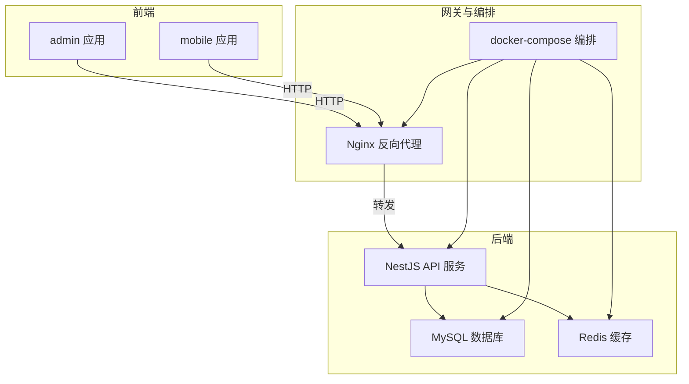
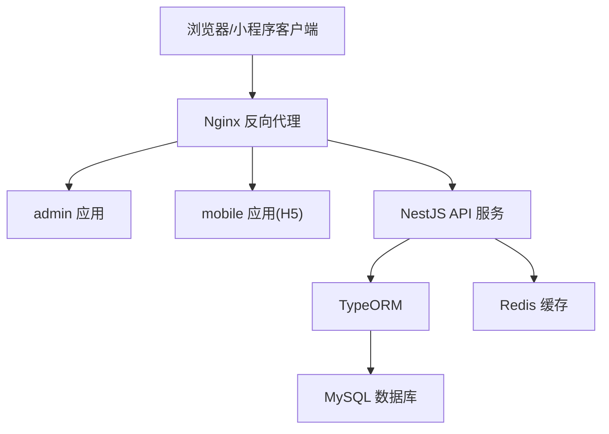
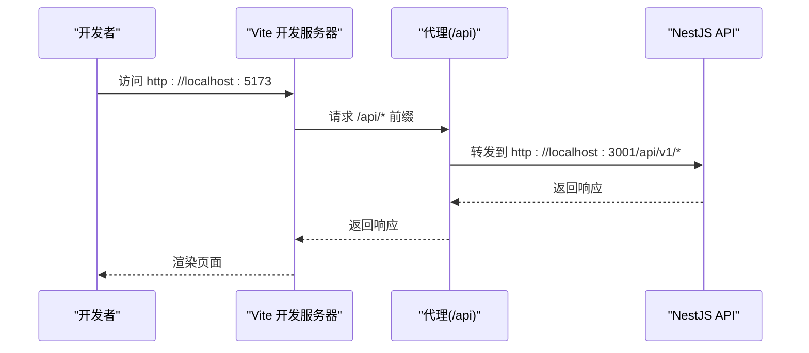
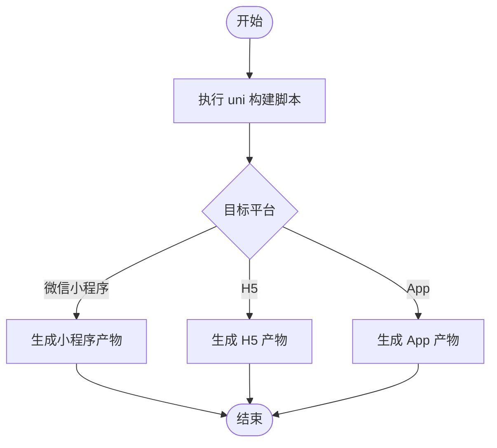
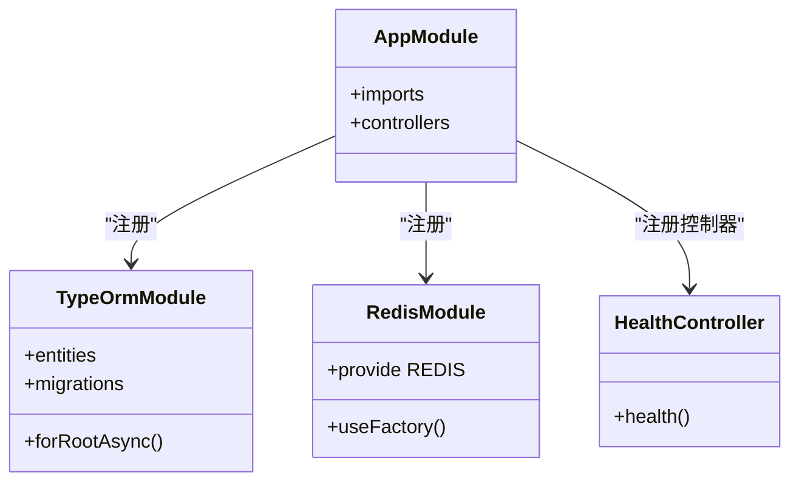
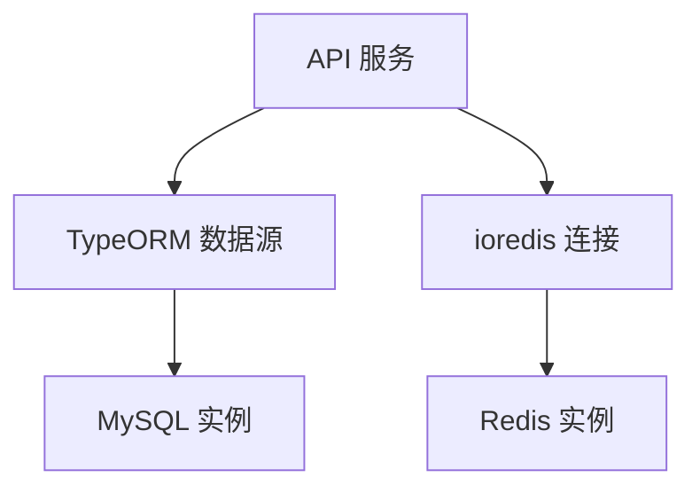
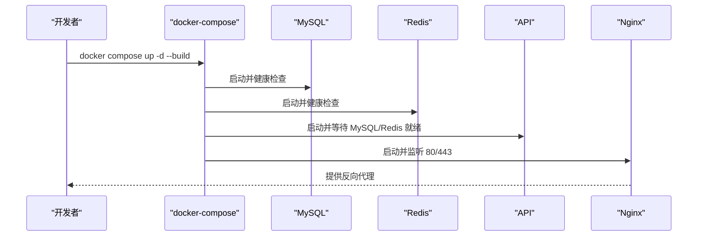
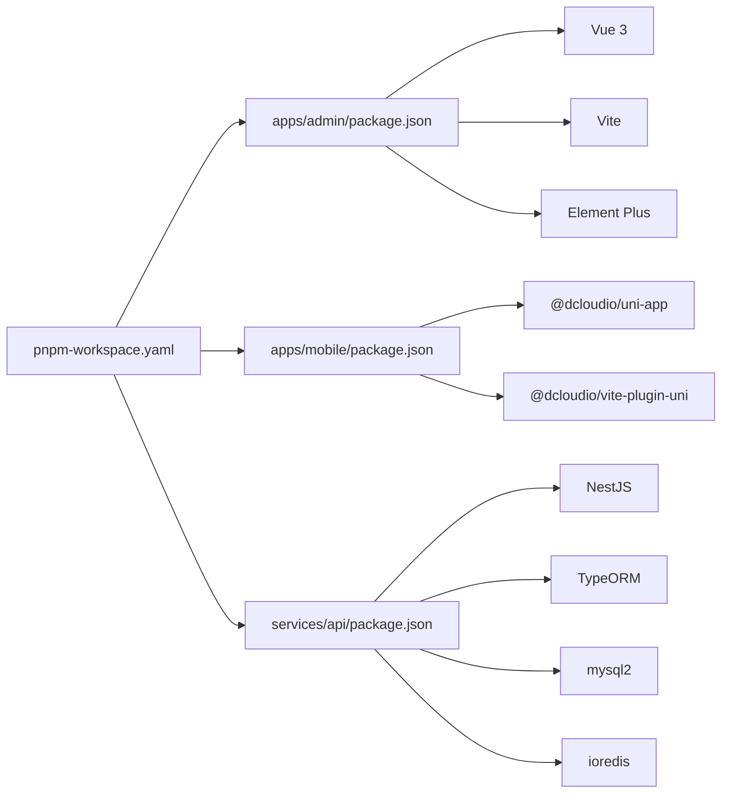

# 技术栈选型

<cite>
**本文引用的文件**
- [package.json](file://package.json)
- [pnpm-workspace.yaml](file://pnpm-workspace.yaml)
- [apps/admin/package.json](file://apps/admin/package.json)
- [apps/admin/vite.config.ts](file://apps/admin/vite.config.ts)
- [apps/admin/tsconfig.json](file://apps/admin/tsconfig.json)
- [apps/mobile/package.json](file://apps/mobile/package.json)
- [apps/mobile/vite.config.ts](file://apps/mobile/vite.config.ts)
- [apps/mobile/tsconfig.json](file://apps/mobile/tsconfig.json)
- [services/api/package.json](file://services/api/package.json)
- [services/api/src/app.module.ts](file://services/api/src/app.module.ts)
- [services/api/src/main.ts](file://services/api/src/main.ts)
- [services/api/src/database/data-source.ts](file://services/api/src/database/data-source.ts)
- [services/api/src/redis/redis.module.ts](file://services/api/src/redis/redis.module.ts)
- [services/api/nest-cli.json](file://services/api/nest-cli.json)
- [docker-compose.yml](file://docker-compose.yml)
</cite>

## 目录
1. [引言](#引言)
2. [项目结构](#项目结构)
3. [核心组件](#核心组件)
4. [架构总览](#架构总览)
5. [详细组件分析](#详细组件分析)
6. [依赖关系分析](#依赖关系分析)
7. [性能考量](#性能考量)
8. [故障排查指南](#故障排查指南)
9. [结论](#结论)
10. [附录：学习路径建议](#附录学习路径建议)

## 引言
本技术栈选型文档面向 Fortune Hub 项目的开发者与运维人员，系统阐述前端（Vue 3 + uni-app）、后端（NestJS）、数据库与缓存（MySQL + Redis）、容器化（Docker）及跨端构建的整体技术决策与实施细节。文档重点说明：
- 各技术组件的版本选择与兼容性考虑
- 对性能、可维护性与扩展性的贡献
- 部署与运行时的关键参数与健康检查策略
- 新人学习路径与进阶建议

## 项目结构
Fortune Hub 采用 monorepo 架构，通过 pnpm workspace 统一管理多包：
- 前端应用：admin 管理后台（Vite + Vue 3 + Element Plus），mobile 移动端（uni-app + Vite）
- 后端服务：NestJS 应用，TypeORM + MySQL 负责持久层，Redis 提供缓存与会话支持
- 运维与部署：docker-compose 编排 MySQL、Redis、Nginx、API、Admin、Mobile-H5 服务

图表来源
- [pnpm-workspace.yaml:1-4](file://pnpm-workspace.yaml#L1-L4)
- [docker-compose.yml:1-170](file://docker-compose.yml#L1-L170)

章节来源
- [pnpm-workspace.yaml:1-4](file://pnpm-workspace.yaml#L1-L4)
- [package.json:1-23](file://package.json#L1-L23)

## 核心组件
本节从“为什么选这个技术”“如何配置”“如何运行”三个维度，系统介绍各组件。

- TypeScript
  - 选型理由：强类型约束降低运行时错误，提升协作效率；在 Vue 3 与 NestJS 中均有良好生态与工具链支持。
  - 版本与兼容：前端使用 TypeScript ~4.9.x 或 ~6.0.x（按项目实际），后端使用 ~5.7.x；TypeScript 在各应用中均启用严格模式与类型检查。
  - 关键配置：各应用的 tsconfig.json 明确路径映射、类型声明与编译选项，确保一致的类型体验。

- Vue 3 + Vite（admin 管理后台）
  - 选型理由：组合式 API、更好的 Tree-shaking、更快的冷启动与热更新，适合中后台可视化与报表场景。
  - 生态：配合 Element Plus、Vue Router、Pinia、Vue ECharts 等，满足 admin 的交互与展示需求。
  - 开发体验：Vite 提供代理与本地开发服务器，支持跨域调试与 API 联调。

- uni-app（mobile 移动端）
  - 选型理由：一套代码多端运行（微信小程序、H5、App 等），覆盖移动端主战场；与 DCloud 生态深度集成。
  - 版本与兼容：使用 @dcloudio/uni-app@3.0.0-... 与对应平台适配包，确保与 Vite 插件与类型定义同步。
  - 多端构建：通过脚本统一管理各平台构建命令，便于 CI/CD 与本地联调。

- NestJS（企业级后端）
  - 选型理由：基于 TypeScript 的模块化架构、依赖注入、拦截器/过滤器/管道等企业级特性，便于大型项目演进。
  - ORM 与数据库：TypeORM + MySQL，自动加载实体与迁移机制，生产环境可选择迁移执行或同步策略。
  - 缓存与会话：ioredis + Redis 模块，提供连接池、重试与只读/连接错误处理策略。

- MySQL + Redis（数据存储）
  - MySQL：8.4 镜像，utf8mb4 字符集与排序规则，生产默认关闭同步，通过迁移驱动结构演进。
  - Redis：7-alpine 镜像，AOF 持久化，健康检查与只读/连接错误自动重连策略，保障高可用。

- Docker 容器化
  - 编排：docker-compose 管理 API、MySQL、Redis、Nginx、Admin、Mobile-H5 六个服务，统一网络与卷。
  - 健康检查：MySQL、Redis、API 均配置健康检查，确保服务就绪后再对外提供服务。
  - 环境变量：大量运行时参数通过环境变量注入，便于不同环境切换与安全配置。

章节来源
- [apps/admin/package.json:11-31](file://apps/admin/package.json#L11-L31)
- [apps/admin/vite.config.ts:1-58](file://apps/admin/vite.config.ts#L1-L58)
- [apps/admin/tsconfig.json:1-8](file://apps/admin/tsconfig.json#L1-L8)
- [apps/mobile/package.json:39-76](file://apps/mobile/package.json#L39-L76)
- [apps/mobile/vite.config.ts:1-8](file://apps/mobile/vite.config.ts#L1-L8)
- [apps/mobile/tsconfig.json:1-14](file://apps/mobile/tsconfig.json#L1-L14)
- [services/api/package.json:26-72](file://services/api/package.json#L26-L72)
- [services/api/src/app.module.ts:67-117](file://services/api/src/app.module.ts#L67-L117)
- [services/api/src/main.ts:8-62](file://services/api/src/main.ts#L8-L62)
- [services/api/src/database/data-source.ts:32-72](file://services/api/src/database/data-source.ts#L32-L72)
- [services/api/src/redis/redis.module.ts:7-31](file://services/api/src/redis/redis.module.ts#L7-L31)
- [docker-compose.yml:1-170](file://docker-compose.yml#L1-L170)

## 架构总览
下图展示了从浏览器到后端服务再到数据库与缓存的整体请求链路，以及容器编排的服务关系。

图表来源
- [docker-compose.yml:147-166](file://docker-compose.yml#L147-L166)
- [services/api/src/app.module.ts:67-117](file://services/api/src/app.module.ts#L67-L117)
- [services/api/src/main.ts:32-59](file://services/api/src/main.ts#L32-L59)

## 详细组件分析

### TypeScript 类型系统与工程化
- 类型安全：通过 tsconfig.json 的严格模式与路径别名，统一前端与后端的类型约束。
- 工具链：Vite 与 uni-vite 插件结合 TypeScript 编译器，提供快速的类型检查与增量编译。
- 前端示例：admin 使用 tsconfig.json 的 references 与 app/node 分离配置，mobile 通过 @dcloudio/types 注入平台类型。

章节来源
- [apps/admin/tsconfig.json:1-8](file://apps/admin/tsconfig.json#L1-L8)
- [apps/mobile/tsconfig.json:1-14](file://apps/mobile/tsconfig.json#L1-L14)

### Vue 3 + Vite（admin 管理后台）
- 组件生态：Element Plus、Vue Router、Pinia、Vue ECharts 等，支撑复杂后台页面与数据可视化。
- 开发体验：Vite 提供代理与本地服务器，支持 /api 前缀转发至后端，便于联调。
- 构建与预览：通过 npm scripts 统一 dev/build/preview 流程，便于 CI/CD。

图表来源
- [apps/admin/vite.config.ts:44-57](file://apps/admin/vite.config.ts#L44-L57)
- [services/api/src/main.ts:32-59](file://services/api/src/main.ts#L32-L59)

章节来源
- [apps/admin/package.json:11-31](file://apps/admin/package.json#L11-L31)
- [apps/admin/vite.config.ts:1-58](file://apps/admin/vite.config.ts#L1-L58)

### uni-app（mobile 移动端）
- 多端统一：通过 @dcloudio/uni-app 与 @dcloudio/vite-plugin-uni，一套代码适配微信小程序、H5、App 等。
- 平台适配：各平台构建脚本集中于 package.json scripts，便于本地调试与 CI 执行。
- 类型与编译：tsconfig.json 引入 @dcloudio/types，确保 TS 对 uni-app API 的类型感知。

图表来源
- [apps/mobile/package.json:4-37](file://apps/mobile/package.json#L4-L37)
- [apps/mobile/vite.config.ts:1-8](file://apps/mobile/vite.config.ts#L1-L8)

章节来源
- [apps/mobile/package.json:1-76](file://apps/mobile/package.json#L1-L76)
- [apps/mobile/vite.config.ts:1-8](file://apps/mobile/vite.config.ts#L1-L8)
- [apps/mobile/tsconfig.json:1-14](file://apps/mobile/tsconfig.json#L1-L14)

### NestJS 企业级后端
- 模块化与依赖注入：通过 app.module.ts 组织各业务模块（认证、内容、订单、通知等），并注入 TypeORM 与 Redis。
- 全局中间件：全局前缀、CORS、拦截器与校验管道，统一处理请求与响应格式。
- 数据源与迁移：data-source.ts 配置实体列表与迁移目录，生产环境可选择迁移执行或同步策略。

图表来源
- [services/api/src/app.module.ts:61-144](file://services/api/src/app.module.ts#L61-L144)
- [services/api/src/main.ts:8-62](file://services/api/src/main.ts#L8-L62)
- [services/api/src/database/data-source.ts:32-72](file://services/api/src/database/data-source.ts#L32-L72)
- [services/api/src/redis/redis.module.ts:7-31](file://services/api/src/redis/redis.module.ts#L7-L31)

章节来源
- [services/api/src/app.module.ts:1-145](file://services/api/src/app.module.ts#L1-L145)
- [services/api/src/main.ts:1-74](file://services/api/src/main.ts#L1-L74)
- [services/api/src/database/data-source.ts:1-73](file://services/api/src/database/data-source.ts#L1-L73)
- [services/api/src/redis/redis.module.ts:1-32](file://services/api/src/redis/redis.module.ts#L1-L32)
- [services/api/nest-cli.json:1-15](file://services/api/nest-cli.json#L1-L15)

### 数据库与缓存（MySQL + Redis）
- MySQL：8.4 镜像，utf8mb4 字符集与排序规则，健康检查基于 mysqladmin ping；生产默认不自动同步，通过迁移驱动结构演进。
- Redis：7-alpine 镜像，AOF 持久化，健康检查基于 redis-cli ping；连接策略包含延迟重试与错误恢复。

图表来源
- [docker-compose.yml:2-24](file://docker-compose.yml#L2-L24)
- [docker-compose.yml:25-42](file://docker-compose.yml#L25-L42)
- [services/api/src/database/data-source.ts:32-72](file://services/api/src/database/data-source.ts#L32-L72)
- [services/api/src/redis/redis.module.ts:13-25](file://services/api/src/redis/redis.module.ts#L13-L25)

章节来源
- [docker-compose.yml:1-170](file://docker-compose.yml#L1-L170)
- [services/api/src/database/data-source.ts:1-73](file://services/api/src/database/data-source.ts#L1-L73)
- [services/api/src/redis/redis.module.ts:1-32](file://services/api/src/redis/redis.module.ts#L1-L32)

### 容器化与部署（Docker）
- 服务编排：MySQL、Redis、Nginx、API、Admin、Mobile-H5 六个服务，统一网络与卷。
- 健康检查：MySQL、Redis、API 均配置健康检查，确保服务就绪后再对外提供服务。
- 环境变量：大量运行时参数通过环境变量注入，便于不同环境切换与安全配置。

图表来源
- [docker-compose.yml:43-119](file://docker-compose.yml#L43-L119)
- [docker-compose.yml:147-166](file://docker-compose.yml#L147-L166)

章节来源
- [docker-compose.yml:1-170](file://docker-compose.yml#L1-L170)

## 依赖关系分析
- monorepo 管理：pnpm-workspace.yaml 将 apps/* 与 services/* 纳入工作区，统一安装与脚本分发。
- 前端依赖：admin 与 mobile 均依赖 Vue 3、TypeScript、Vite/uni-vite 插件，admin 引入 Element Plus、Vue Router、Pinia 等，mobile 引入 @dcloudio/uni-app 与各平台适配包。
- 后端依赖：NestJS + TypeORM + MySQL2 + ioredis，配合 class-validator/class-transformer、Multer、Sharp 等生态组件。
- 运行时依赖：docker-compose 串联所有服务，Nginx 作为统一入口，API 提供统一前缀与 CORS 策略。

图表来源
- [pnpm-workspace.yaml:1-4](file://pnpm-workspace.yaml#L1-L4)
- [apps/admin/package.json:11-31](file://apps/admin/package.json#L11-L31)
- [apps/mobile/package.json:39-76](file://apps/mobile/package.json#L39-L76)
- [services/api/package.json:26-72](file://services/api/package.json#L26-L72)

章节来源
- [pnpm-workspace.yaml:1-4](file://pnpm-workspace.yaml#L1-L4)
- [apps/admin/package.json:1-32](file://apps/admin/package.json#L1-L32)
- [apps/mobile/package.json:1-76](file://apps/mobile/package.json#L1-L76)
- [services/api/package.json:1-91](file://services/api/package.json#L1-L91)

## 性能考量
- 前端性能
  - Vue 3 + Vite：组合式 API 与 Tree-shaking 减少包体；HMR 快速迭代；admin 的代理与移动端 H5 构建优化开发体验。
  - uni-app：多端复用减少重复开发成本，同时保持各平台原生体验。
- 后端性能
  - NestJS 模块化与依赖注入降低耦合，便于横向扩展；TypeORM 迁移驱动结构演进，避免生产环境同步带来的风险。
  - ioredis 提供连接池与重试策略，提高缓存命中率与稳定性。
- 存储与缓存
  - MySQL 8.4 与 utf8mb4 支持国际化字符；Redis 7-alpine 轻量且具备 AOF 持久化，适合高并发读写场景。
- 容器化
  - docker-compose 健康检查确保服务就绪；Nginx 统一入口与静态资源分发，降低后端压力。

## 故障排查指南
- CORS 问题
  - 确认 admin 的 Vite 代理与 API 的 CORS 配置一致；生产环境通过环境变量注入允许的来源列表。
- 数据库连接失败
  - 检查 docker-compose 中 MySQL 的环境变量与健康检查；确认 TypeORM 的主机、端口、账号与密码配置正确。
- Redis 连接异常
  - 观察 ioredis 的重连策略与错误日志，确认 Redis 主机、端口与健康检查状态。
- 健康检查失败
  - 使用 docker compose ps 查看服务状态；根据健康检查脚本定位具体问题（API 的 /api/v1/health、MySQL/Redis 的 CLI 命令）。
- 环境变量缺失
  - docker-compose 中大部分运行时参数需通过环境变量注入，如数据库凭据、支付与短信配置、微信小程序参数等。

章节来源
- [apps/admin/vite.config.ts:44-57](file://apps/admin/vite.config.ts#L44-L57)
- [services/api/src/main.ts:18-59](file://services/api/src/main.ts#L18-L59)
- [docker-compose.yml:49-119](file://docker-compose.yml#L49-L119)
- [services/api/src/database/data-source.ts:32-40](file://services/api/src/database/data-source.ts#L32-L40)
- [services/api/src/redis/redis.module.ts:13-25](file://services/api/src/redis/redis.module.ts#L13-L25)

## 结论
Fortune Hub 的技术栈围绕“TypeScript + Vue 3 + uni-app + NestJS + MySQL + Redis + Docker”展开，兼顾开发效率、运行稳定与扩展能力。通过 monorepo 与容器化编排，团队可以高效地进行多端协同开发与部署；TypeORM 与 Redis 的组合为业务提供了可靠的持久化与缓存能力；NestJS 的模块化与中间件体系保证了后端的可维护性与可测试性。

## 附录：学习路径建议
- TypeScript 基础
  - 目标：掌握类型系统、装饰器、泛型与模块化
  - 资源：官方文档、Vue 与 NestJS 示例项目
- Vue 3 与 Vite
  - 目标：组合式 API、响应式原理、路由与状态管理、Vite 插件体系
  - 实践：admin 应用的组件与路由结构
- uni-app 与多端开发
  - 目标：生命周期差异、平台 API、条件编译、构建与发布
  - 实践：各平台构建脚本与页面结构
- NestJS 与企业级开发
  - 目标：模块化、依赖注入、拦截器/过滤器/管道、TypeORM、Redis
  - 实践：认证、内容、订单、通知等模块
- 数据库与缓存
  - 目标：MySQL 迁移、索引设计、事务与锁；Redis 常用命令与连接策略
  - 实践：TypeORM 实体与迁移、Redis 模块配置
- 容器化与运维
  - 目标：Dockerfile、docker-compose 编排、健康检查、环境变量
  - 实践：本地开发与生产部署流程