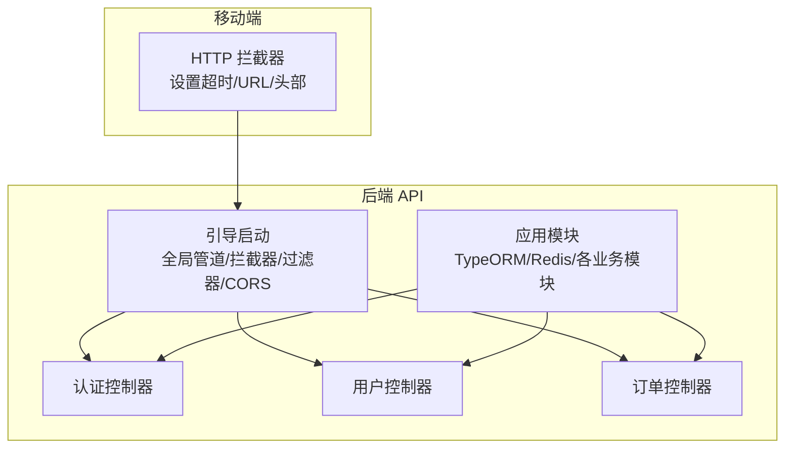
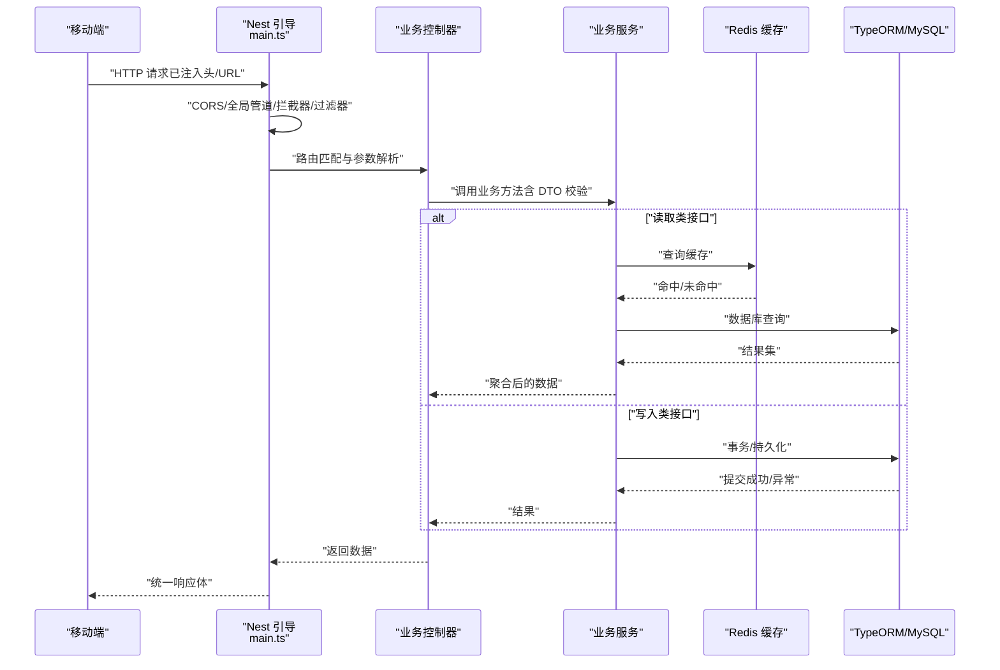
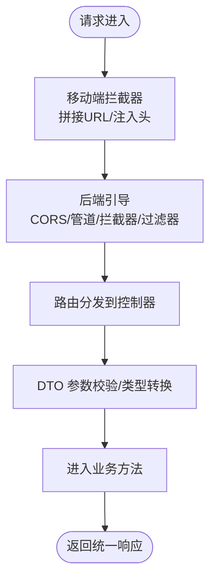
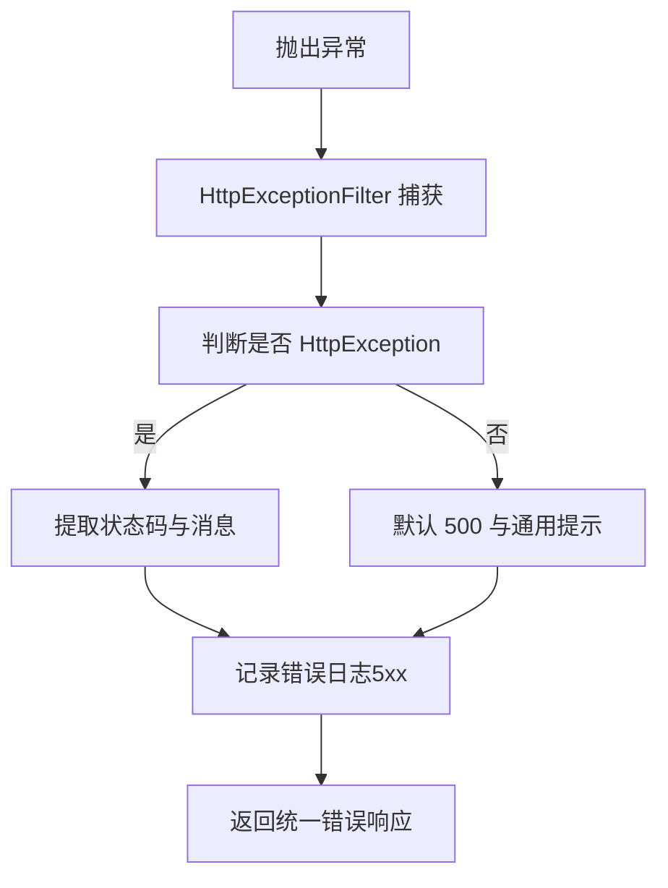
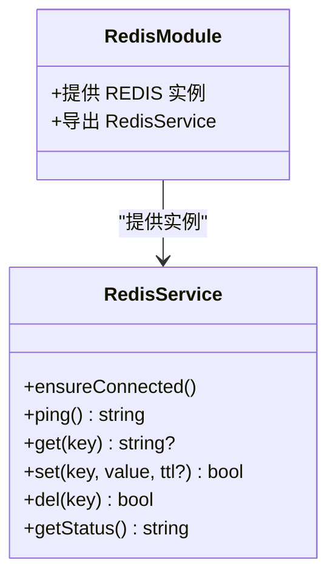
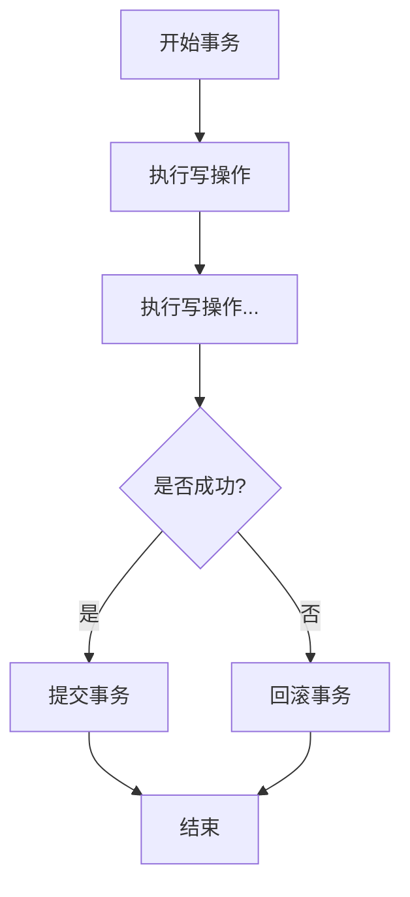
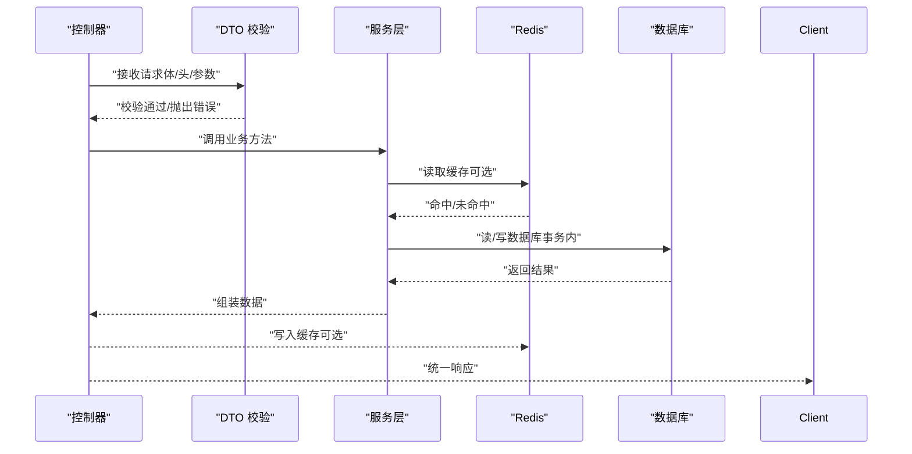
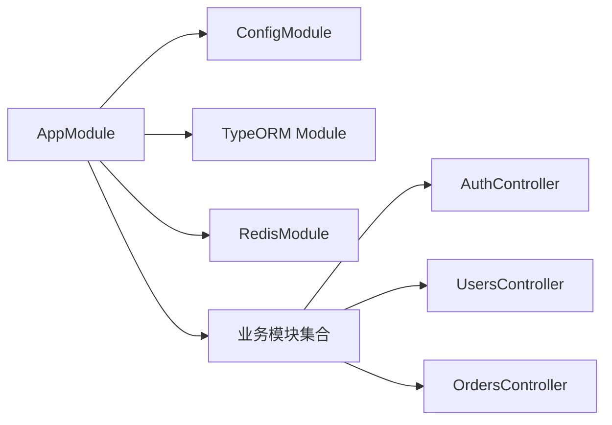

# 数据流设计

<cite>
**本文引用的文件**
- [services/api/src/main.ts](file://services/api/src/main.ts)
- [services/api/src/app.module.ts](file://services/api/src/app.module.ts)
- [services/api/src/common/interceptors/transform.interceptor.ts](file://services/api/src/common/interceptors/transform.interceptor.ts)
- [services/api/src/common/filters/http-exception.filter.ts](file://services/api/src/common/filters/http-exception.filter.ts)
- [apps/mobile/src/interceptors/http.ts](file://apps/mobile/src/interceptors/http.ts)
- [services/api/src/database/data-source.ts](file://services/api/src/database/data-source.ts)
- [services/api/src/redis/redis.module.ts](file://services/api/src/redis/redis.module.ts)
- [services/api/src/redis/redis.service.ts](file://services/api/src/redis/redis.service.ts)
- [services/api/src/auth/auth.controller.ts](file://services/api/src/auth/auth.controller.ts)
- [services/api/src/users/users.controller.ts](file://services/api/src/users/users.controller.ts)
- [services/api/src/orders/orders.controller.ts](file://services/api/src/orders/orders.controller.ts)
</cite>

## 目录
1. [引言](#引言)
2. [项目结构](#项目结构)
3. [核心组件](#核心组件)
4. [架构总览](#架构总览)
5. [详细组件分析](#详细组件分析)
6. [依赖关系分析](#依赖关系分析)
7. [性能考量](#性能考量)
8. [故障排查指南](#故障排查指南)
9. [结论](#结论)
10. [附录](#附录)

## 引言
本文件面向 Fortune Hub 的后端与移动端开发者，系统性梳理“从客户端请求到数据库存储”的完整数据流路径，重点覆盖以下方面：
- HTTP 请求的拦截与处理机制（全局过滤器、统一响应包装、参数校验）
- 数据验证与转换流程（DTO 校验、类型转换）
- 错误处理策略（异常捕获、统一错误响应）
- 缓存策略设计（Redis 使用场景与失效机制）
- 数据库事务与一致性（TypeORM 配置与迁移策略）
- 读写分离与扩展建议（当前未实现，提供设计思路）

## 项目结构
后端采用 NestJS 架构，通过模块化组织功能域；移动端基于 uni-app，通过拦截器统一注入头部与基础 URL。

图表来源
- [services/api/src/main.ts:1-74](file://services/api/src/main.ts#L1-L74)
- [services/api/src/app.module.ts:1-145](file://services/api/src/app.module.ts#L1-L145)
- [apps/mobile/src/interceptors/http.ts:1-49](file://apps/mobile/src/interceptors/http.ts#L1-L49)

章节来源
- [services/api/src/main.ts:1-74](file://services/api/src/main.ts#L1-L74)
- [services/api/src/app.module.ts:1-145](file://services/api/src/app.module.ts#L1-L145)
- [apps/mobile/src/interceptors/http.ts:1-49](file://apps/mobile/src/interceptors/http.ts#L1-L49)

## 核心组件
- 全局引导与中间件
  - 启动时设置全局前缀、CORS 策略、全局管道（ValidationPipe）、全局拦截器（TransformInterceptor）、全局异常过滤器（HttpExceptionFilter）。
- 统一响应包装
  - TransformInterceptor 将控制器返回值包装为统一结构，避免重复样板代码。
- 统一错误处理
  - HttpExceptionFilter 捕获异常并输出统一错误体，区分服务端错误与业务错误。
- 移动端请求拦截
  - 自动拼接基础 URL、注入超时、X-Client 头部、按需注入 Authorization 头。
- 数据库与缓存
  - TypeORM 连接 MySQL，自动加载实体与迁移；Redis 提供键值缓存能力，具备重连与健康检查。

章节来源
- [services/api/src/main.ts:1-74](file://services/api/src/main.ts#L1-L74)
- [services/api/src/common/interceptors/transform.interceptor.ts:1-59](file://services/api/src/common/interceptors/transform.interceptor.ts#L1-L59)
- [services/api/src/common/filters/http-exception.filter.ts:1-92](file://services/api/src/common/filters/http-exception.filter.ts#L1-L92)
- [apps/mobile/src/interceptors/http.ts:1-49](file://apps/mobile/src/interceptors/http.ts#L1-L49)
- [services/api/src/database/data-source.ts:1-73](file://services/api/src/database/data-source.ts#L1-L73)
- [services/api/src/redis/redis.module.ts:1-32](file://services/api/src/redis/redis.module.ts#L1-L32)
- [services/api/src/redis/redis.service.ts:1-125](file://services/api/src/redis/redis.service.ts#L1-L125)

## 架构总览
下图展示一次典型请求从移动端发起到数据库写入的关键节点与数据流向。

图表来源
- [services/api/src/main.ts:1-74](file://services/api/src/main.ts#L1-L74)
- [services/api/src/common/interceptors/transform.interceptor.ts:1-59](file://services/api/src/common/interceptors/transform.interceptor.ts#L1-L59)
- [services/api/src/common/filters/http-exception.filter.ts:1-92](file://services/api/src/common/filters/http-exception.filter.ts#L1-L92)
- [apps/mobile/src/interceptors/http.ts:1-49](file://apps/mobile/src/interceptors/http.ts#L1-L49)
- [services/api/src/database/data-source.ts:1-73](file://services/api/src/database/data-source.ts#L1-L73)
- [services/api/src/redis/redis.service.ts:1-125](file://services/api/src/redis/redis.service.ts#L1-L125)

## 详细组件分析

### HTTP 请求拦截与处理机制
- 移动端拦截器
  - 自动拼接基础 URL，支持相对路径与绝对路径；注入 X-Client 与可选 Authorization；上传文件走独立基础地址。
- 后端引导层
  - 设置全局前缀、CORS 白名单、生产环境宽松校验、全局管道启用类级别 DTO 校验与隐式类型转换。
  - 注册全局拦截器（统一响应包装）与全局异常过滤器（统一错误响应）。

图表来源
- [apps/mobile/src/interceptors/http.ts:1-49](file://apps/mobile/src/interceptors/http.ts#L1-L49)
- [services/api/src/main.ts:1-74](file://services/api/src/main.ts#L1-L74)
- [services/api/src/common/interceptors/transform.interceptor.ts:1-59](file://services/api/src/common/interceptors/transform.interceptor.ts#L1-L59)
- [services/api/src/common/filters/http-exception.filter.ts:1-92](file://services/api/src/common/filters/http-exception.filter.ts#L1-L92)

章节来源
- [apps/mobile/src/interceptors/http.ts:1-49](file://apps/mobile/src/interceptors/http.ts#L1-L49)
- [services/api/src/main.ts:1-74](file://services/api/src/main.ts#L1-L74)
- [services/api/src/common/interceptors/transform.interceptor.ts:1-59](file://services/api/src/common/interceptors/transform.interceptor.ts#L1-L59)
- [services/api/src/common/filters/http-exception.filter.ts:1-92](file://services/api/src/common/filters/http-exception.filter.ts#L1-L92)

### 数据验证与转换流程
- DTO 层：在控制器或服务层接收的请求体通过类验证器进行字段存在性、长度、格式等约束校验。
- 类型转换：ValidationPipe 在开启 transform 选项时，对字符串等输入执行隐式类型转换（如数字、布尔），减少手写 parse。
- 控制器方法签名：结合装饰器（@Body、@Headers、@Query、@Param）获取上下文数据，并交由服务层处理。

章节来源
- [services/api/src/main.ts:35-43](file://services/api/src/main.ts#L35-L43)
- [services/api/src/auth/auth.controller.ts:1-36](file://services/api/src/auth/auth.controller.ts#L1-L36)
- [services/api/src/users/users.controller.ts:1-204](file://services/api/src/users/users.controller.ts#L1-L204)
- [services/api/src/orders/orders.controller.ts:1-31](file://services/api/src/orders/orders.controller.ts#L1-L31)

### 错误处理策略
- 异常捕获：HttpExceptionFilter 捕获所有异常，区分 HttpException 与非 HttpException。
- 响应体：统一错误体包含 code、message、data（空）、timestamp；对数组消息提取首个可用文本。
- 日志记录：5xx 错误输出堆栈日志，便于定位问题。

图表来源
- [services/api/src/common/filters/http-exception.filter.ts:1-92](file://services/api/src/common/filters/http-exception.filter.ts#L1-L92)

章节来源
- [services/api/src/common/filters/http-exception.filter.ts:1-92](file://services/api/src/common/filters/http-exception.filter.ts#L1-L92)

### 缓存策略设计（Redis）
- 使用场景
  - 读多写少的热点数据（如配置、报告模板、用户偏好快照、公开内容列表）。
  - 降低数据库压力，提升响应速度。
- 失效机制
  - 写操作后主动删除相关缓存键，确保读写一致性。
  - 对于定时任务或后台刷新，可在服务层设置 TTL 并定期更新。
- 客户端与服务端
  - 服务端通过 RedisService 提供 get/set/del/ping 能力，内置连接状态管理与超时等待。
  - 建议在业务层封装缓存装饰器或中间层，集中处理命中/穿透/互斥锁等细节。

图表来源
- [services/api/src/redis/redis.module.ts:1-32](file://services/api/src/redis/redis.module.ts#L1-L32)
- [services/api/src/redis/redis.service.ts:1-125](file://services/api/src/redis/redis.service.ts#L1-L125)

章节来源
- [services/api/src/redis/redis.module.ts:1-32](file://services/api/src/redis/redis.module.ts#L1-L32)
- [services/api/src/redis/redis.service.ts:1-125](file://services/api/src/redis/redis.service.ts#L1-L125)

### 数据库事务与一致性
- 连接与实体
  - TypeORM 以模块化方式注册实体与迁移，支持自动加载实体与迁移脚本运行。
- 事务与并发
  - 对需要强一致性的写操作（如订单支付回调、积分变动），应在服务层使用事务包裹，确保原子性。
- 一致性保障
  - 读写分离可通过主从复制实现，读请求路由至只读副本，写请求路由至主库；当前仓库未见读写分离配置，建议后续引入连接池与路由中间件。

图表来源
- [services/api/src/app.module.ts:67-117](file://services/api/src/app.module.ts#L67-L117)
- [services/api/src/database/data-source.ts:1-73](file://services/api/src/database/data-source.ts#L1-L73)

章节来源
- [services/api/src/app.module.ts:67-117](file://services/api/src/app.module.ts#L67-L117)
- [services/api/src/database/data-source.ts:1-73](file://services/api/src/database/data-source.ts#L1-L73)

### 关键业务控制器的数据流示意
- 认证控制器
  - 微信登录、发送短信验证码、手机快捷登录，均通过 DTO 校验与服务层鉴权/短信服务完成。
- 用户控制器
  - 个人信息、偏好、记录（情绪、冥想、脉搏、呼吸）的增删改查，均依赖授权头解析用户身份。
- 订单控制器
  - 创建订单与支付回调，依赖授权头解析用户并调用订单服务。

图表来源
- [services/api/src/auth/auth.controller.ts:1-36](file://services/api/src/auth/auth.controller.ts#L1-L36)
- [services/api/src/users/users.controller.ts:1-204](file://services/api/src/users/users.controller.ts#L1-L204)
- [services/api/src/orders/orders.controller.ts:1-31](file://services/api/src/orders/orders.controller.ts#L1-L31)

章节来源
- [services/api/src/auth/auth.controller.ts:1-36](file://services/api/src/auth/auth.controller.ts#L1-L36)
- [services/api/src/users/users.controller.ts:1-204](file://services/api/src/users/users.controller.ts#L1-L204)
- [services/api/src/orders/orders.controller.ts:1-31](file://services/api/src/orders/orders.controller.ts#L1-L31)

## 依赖关系分析
- 应用模块装配
  - AppModule 作为根模块，导入 ConfigModule、TypeORM、RedisModule 以及各业务模块；同时注册健康检查控制器。
- 控制器与服务
  - 控制器仅负责参数解析与调用服务；服务层承担业务编排与数据访问。
- 外部依赖
  - MySQL（TypeORM）、Redis（ioredis）、CORS、全局管道/拦截器/过滤器。

图表来源
- [services/api/src/app.module.ts:1-145](file://services/api/src/app.module.ts#L1-L145)

章节来源
- [services/api/src/app.module.ts:1-145](file://services/api/src/app.module.ts#L1-L145)

## 性能考量
- 响应统一化：TransformInterceptor 减少重复封装，统一客户端解析成本。
- 参数校验前置：ValidationPipe 在进入业务逻辑前完成校验与类型转换，避免无效计算。
- 缓存命中：热点数据走 Redis，显著降低数据库负载；注意缓存键命名规范与过期策略。
- CORS 与超时：移动端拦截器设置合理超时，后端 CORS 白名单控制来源，降低跨域风险与无效请求。
- 数据库优化：建议为高频查询字段建立索引，拆分读写库，必要时引入只读副本。

## 故障排查指南
- 统一错误响应
  - 若出现统一错误体，优先查看服务端日志（5xx 错误会输出堆栈），定位具体异常位置。
- 参数校验失败
  - 检查 DTO 字段约束与前端传参格式，确认 ValidationPipe 是否生效。
- Redis 不可用
  - 使用 RedisService.ping 检查连接状态；关注连接超时与重试策略；必要时降级关闭缓存。
- CORS 拒绝
  - 核对 CORS_ORIGIN 配置与本地开发域名白名单；生产环境严格限制来源。
- 数据库异常
  - 查看 TypeORM 迁移是否成功执行；确认实体映射与字段类型一致。

章节来源
- [services/api/src/common/filters/http-exception.filter.ts:1-92](file://services/api/src/common/filters/http-exception.filter.ts#L1-L92)
- [services/api/src/redis/redis.service.ts:68-77](file://services/api/src/redis/redis.service.ts#L68-L77)
- [services/api/src/main.ts:44-59](file://services/api/src/main.ts#L44-L59)
- [services/api/src/app.module.ts:110-117](file://services/api/src/app.module.ts#L110-L117)

## 结论
本设计文档从请求拦截、参数校验、统一响应与异常处理，到缓存与数据库访问，给出了完整的数据流视图。当前实现强调“可维护性与一致性”，后续可在读写分离、缓存互斥锁、分布式事务等方面进一步增强。

## 附录
- 关键配置项
  - PORT、CORS_ORIGIN、NODE_ENV、MYSQL_*、REDIS_*、DB_RUN_MIGRATIONS、DB_SYNCHRONIZE
- 建议实践
  - 为每个业务模块定义清晰的 DTO 与错误码；为热点接口引入缓存与 TTL；为关键写操作使用事务；为只读查询考虑读写分离。