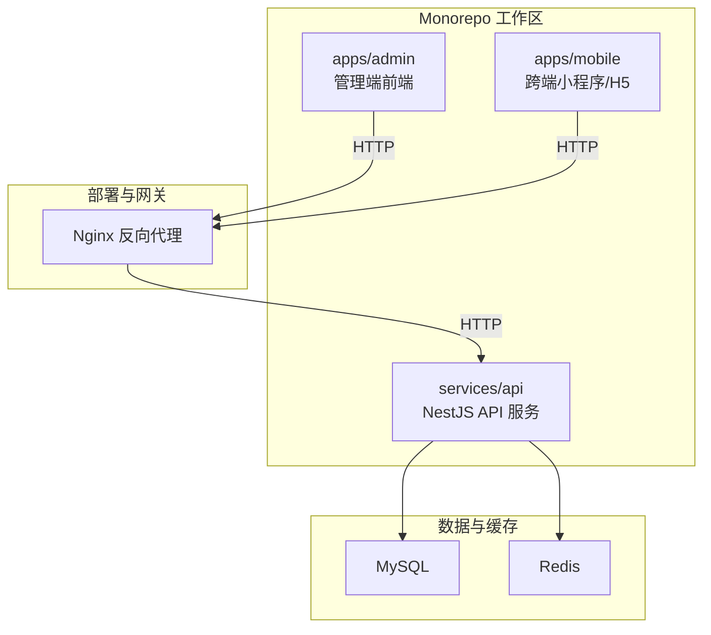
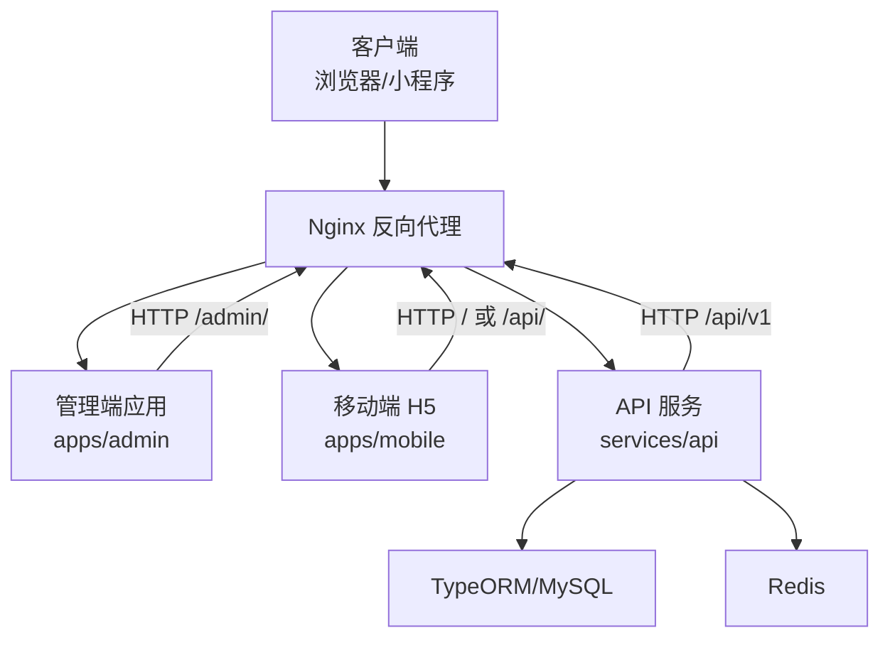
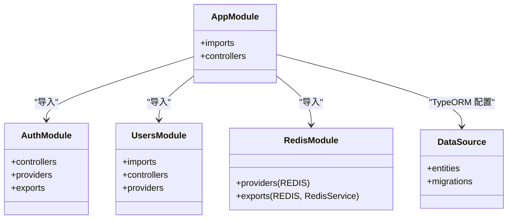
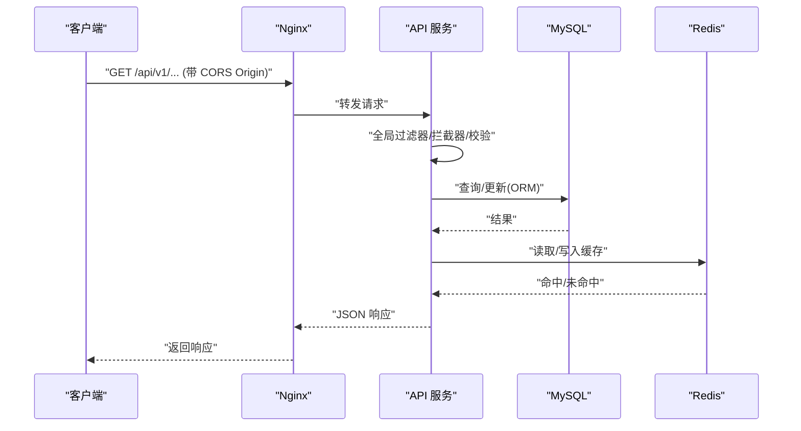
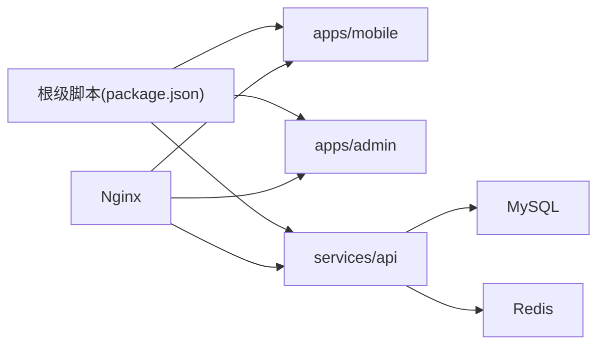

# 架构设计

<cite>
**本文引用的文件**
- [package.json](file://package.json)
- [pnpm-workspace.yaml](file://pnpm-workspace.yaml)
- [docker-compose.yml](file://docker-compose.yml)
- [services/api/src/main.ts](file://services/api/src/main.ts)
- [services/api/src/app.module.ts](file://services/api/src/app.module.ts)
- [services/api/src/database/data-source.ts](file://services/api/src/database/data-source.ts)
- [services/api/src/redis/redis.module.ts](file://services/api/src/redis/redis.module.ts)
- [services/api/src/auth/auth.module.ts](file://services/api/src/auth/auth.module.ts)
- [services/api/src/users/users.module.ts](file://services/api/src/users/users.module.ts)
- [apps/admin/src/main.ts](file://apps/admin/src/main.ts)
- [apps/admin/package.json](file://apps/admin/package.json)
- [apps/mobile/src/main.ts](file://apps/mobile/src/main.ts)
- [apps/mobile/package.json](file://apps/mobile/package.json)
- [deploy/nginx/conf.d/default.conf](file://deploy/nginx/conf.d/default.conf)
</cite>

## 目录
1. [引言](#引言)
2. [项目结构](#项目结构)
3. [核心组件](#核心组件)
4. [架构总览](#架构总览)
5. [详细组件分析](#详细组件分析)
6. [依赖分析](#依赖分析)
7. [性能考量](#性能考量)
8. [故障排查指南](#故障排查指南)
9. [结论](#结论)
10. [附录](#附录)

## 引言
本架构设计文档面向 Fortune Hub 项目，系统采用 Monorepo 组织方式，围绕“表现层（小程序端、管理端）、业务层（NestJS API 服务）、数据层（MySQL、Redis）”三层架构展开，辅以容器化与反向代理的部署方案。文档旨在帮助开发者快速理解系统整体设计思路、技术决策背景与关键流程，同时提供可视化图表辅助理解。

## 项目结构
项目采用 pnpm workspaces 的 Monorepo 结构，将前端应用（apps/admin、apps/mobile）与后端服务（services/api）统一管理，通过根级脚本进行统一开发与构建编排。

- 根级脚本与工作区定义
  - 根级 package.json 提供统一的开发、构建与健康检查脚本，覆盖小程序端、管理端、API 服务与整体打包。
  - pnpm-workspace.yaml 声明工作区范围为 apps/* 与 services/*，确保多包协同开发与依赖收敛。

- 应用与服务划分
  - apps/admin：基于 Vue 3 + Element Plus 的管理端前端，负责内容运营、用户管理、订单与报表等后台功能。
  - apps/mobile：基于 uni-app 的跨端小程序/H5 应用，支持微信小程序、H5 等多平台运行。
  - services/api：基于 NestJS 的后端 API 服务，提供认证、用户、占卜、运势、海报生成、支付等业务能力，并集成 MySQL 与 Redis。

- 部署与反向代理
  - docker-compose.yml 定义了 MySQL、Redis、API、管理端、移动端 H5、Nginx 共同构成的容器化环境。
  - Nginx 作为统一入口，按路径将请求转发至 API、管理端或移动端 H5，并提供静态资源与证书配置。

**图表来源**
- [docker-compose.yml:1-170](file://docker-compose.yml#L1-L170)
- [deploy/nginx/conf.d/default.conf:1-62](file://deploy/nginx/conf.d/default.conf#L1-L62)

**章节来源**
- [package.json:1-23](file://package.json#L1-L23)
- [pnpm-workspace.yaml:1-4](file://pnpm-workspace.yaml#L1-L4)

## 核心组件
- 表现层
  - 管理端（apps/admin）：Vue 3 + Pinia + Element Plus，路由与状态管理清晰，提供运营与管理功能。
  - 移动端（apps/mobile）：uni-app 跨端框架，支持多平台构建与运行，统一业务逻辑与页面结构。
- 业务层（services/api）
  - NestJS 应用：全局前缀 /api/v1，启用 CORS、全局过滤器与拦截器、参数校验管道；模块化拆分认证、用户、占卜、运势、海报等子域。
  - 数据访问：TypeORM + MySQL，自动加载实体与迁移；生产环境可选择同步或迁移策略。
  - 缓存：ioredis 连接池与重连策略，集中注入 REDIS 令牌，便于各模块使用。
- 数据层
  - MySQL：承载用户、记录、订单、配置、报表模板等核心数据。
  - Redis：会话、限流、临时缓存与任务队列等场景支撑。

**章节来源**
- [apps/admin/src/main.ts:1-15](file://apps/admin/src/main.ts#L1-L15)
- [apps/admin/package.json:1-32](file://apps/admin/package.json#L1-L32)
- [apps/mobile/src/main.ts:1-15](file://apps/mobile/src/main.ts#L1-L15)
- [apps/mobile/package.json:1-76](file://apps/mobile/package.json#L1-L76)
- [services/api/src/app.module.ts:1-145](file://services/api/src/app.module.ts#L1-L145)
- [services/api/src/main.ts:1-74](file://services/api/src/main.ts#L1-L74)
- [services/api/src/database/data-source.ts:1-73](file://services/api/src/database/data-source.ts#L1-L73)
- [services/api/src/redis/redis.module.ts:1-32](file://services/api/src/redis/redis.module.ts#L1-L32)

## 架构总览
系统采用前后端分离与容器化部署，Nginx 作为统一入口，按路径将请求路由到不同服务。API 服务通过模块化设计实现高内聚低耦合，数据库与缓存分别承担持久化与高性能读写需求。

**图表来源**
- [deploy/nginx/conf.d/default.conf:1-62](file://deploy/nginx/conf.d/default.conf#L1-L62)
- [docker-compose.yml:147-166](file://docker-compose.yml#L147-L166)
- [services/api/src/app.module.ts:60-141](file://services/api/src/app.module.ts#L60-L141)

## 详细组件分析

### API 服务（NestJS）
- 启动与中间件
  - 设置全局前缀 /api/v1，启用 CORS、全局异常过滤器、响应拦截器与参数校验管道，保证请求一致性与错误处理规范。
  - 生产环境对 CORS 源进行严格校验，开发环境允许本地回环地址。
- 模块化设计
  - 通过 AppModule 统一导入配置、TypeORM、Redis 与各业务模块（认证、用户、占卜、运势、海报等），体现关注点分离与可维护性。
- 数据与缓存
  - TypeORM 使用数据源配置连接 MySQL，实体列表集中管理，迁移策略由环境变量控制。
  - RedisModule 提供全局连接实例与服务封装，具备重试与错误恢复策略。

**图表来源**
- [services/api/src/app.module.ts:60-141](file://services/api/src/app.module.ts#L60-L141)
- [services/api/src/auth/auth.module.ts:1-16](file://services/api/src/auth/auth.module.ts#L1-L16)
- [services/api/src/users/users.module.ts:1-46](file://services/api/src/users/users.module.ts#L1-L46)
- [services/api/src/database/data-source.ts:32-72](file://services/api/src/database/data-source.ts#L32-L72)
- [services/api/src/redis/redis.module.ts:7-31](file://services/api/src/redis/redis.module.ts#L7-L31)

**章节来源**
- [services/api/src/main.ts:8-62](file://services/api/src/main.ts#L8-L62)
- [services/api/src/app.module.ts:60-141](file://services/api/src/app.module.ts#L60-L141)
- [services/api/src/database/data-source.ts:32-72](file://services/api/src/database/data-source.ts#L32-L72)
- [services/api/src/redis/redis.module.ts:7-31](file://services/api/src/redis/redis.module.ts#L7-L31)

### 管理端（apps/admin）
- 技术栈与启动
  - Vue 3 + Pinia + Element Plus，应用在 main.ts 中完成插件注册与挂载，路由与样式初始化。
- 构建与部署
  - 通过 Vite 构建，配合 Nginx 的 /admin 路径代理，实现静态资源托管与路由重写。

**章节来源**
- [apps/admin/src/main.ts:1-15](file://apps/admin/src/main.ts#L1-L15)
- [apps/admin/package.json:1-32](file://apps/admin/package.json#L1-L32)

### 移动端（apps/mobile）
- 技术栈与启动
  - uni-app 跨端框架，统一逻辑与页面，支持多平台构建；在 main.ts 中安装 HTTP 拦截器以统一处理请求。
- 构建与部署
  - 通过 uni 命令构建多端产物，配合 Nginx 的根路径代理，实现 H5 与小程序端访问。

**章节来源**
- [apps/mobile/src/main.ts:1-15](file://apps/mobile/src/main.ts#L1-L15)
- [apps/mobile/package.json:1-76](file://apps/mobile/package.json#L1-L76)

### 数据与缓存（MySQL 与 Redis）
- MySQL
  - 通过 TypeORM 数据源集中管理实体与迁移，生产环境可选择迁移或同步策略，避免直接同步带来的风险。
- Redis
  - 通过 RedisModule 注入全局连接，具备重试与错误恢复策略，适合高并发下的会话与缓存场景。

**章节来源**
- [services/api/src/database/data-source.ts:32-72](file://services/api/src/database/data-source.ts#L32-L72)
- [services/api/src/redis/redis.module.ts:10-29](file://services/api/src/redis/redis.module.ts#L10-L29)

### 通信机制与 API 设计原则
- 前后端分离
  - Nginx 作为统一入口，将 /api 路由到 API 服务，/admin 路由到管理端，根路径路由到移动端 H5。
- API 前缀与版本
  - API 服务设置全局前缀 /api/v1，便于未来版本演进与多版本共存。
- CORS 与安全
  - 生产环境严格校验 CORS 源，开发环境允许本地回环地址；支持凭证传输与常用方法/头。
- 跨端兼容
  - 移动端通过 uni-app 支持多端运行，管理端通过 Element Plus 适配桌面端管理体验。

**图表来源**
- [services/api/src/main.ts:32-59](file://services/api/src/main.ts#L32-L59)
- [services/api/src/app.module.ts:60-141](file://services/api/src/app.module.ts#L60-L141)
- [deploy/nginx/conf.d/default.conf:30-37](file://deploy/nginx/conf.d/default.conf#L30-L37)

**章节来源**
- [services/api/src/main.ts:32-59](file://services/api/src/main.ts#L32-L59)
- [deploy/nginx/conf.d/default.conf:30-37](file://deploy/nginx/conf.d/default.conf#L30-L37)

## 依赖分析
- Monorepo 与工作区
  - pnpm-workspace.yaml 明确 apps/* 与 services/* 为工作区范围，根级脚本统一调度各子包的开发与构建。
- 子包脚本与命令
  - 根级 package.json 提供 dev:mobile、dev:admin、dev:api、build:mobile、build:admin、build:api 等命令，便于一键式开发与构建。
- 服务间依赖
  - API 服务依赖 MySQL 与 Redis；Nginx 依赖 API、管理端与移动端 H5；容器编排通过 docker-compose.yml 统一管理。

**图表来源**
- [package.json:6-21](file://package.json#L6-L21)
- [pnpm-workspace.yaml:1-4](file://pnpm-workspace.yaml#L1-L4)
- [docker-compose.yml:43-166](file://docker-compose.yml#L43-L166)

**章节来源**
- [package.json:6-21](file://package.json#L6-L21)
- [pnpm-workspace.yaml:1-4](file://pnpm-workspace.yaml#L1-L4)
- [docker-compose.yml:43-166](file://docker-compose.yml#L43-L166)

## 性能考量
- API 层
  - 使用全局拦截器与过滤器统一处理响应与异常，减少重复代码；参数校验管道开启隐式转换提升健壮性。
  - Redis 连接具备重试与错误恢复策略，降低网络抖动影响。
- 数据层
  - TypeORM 迁移策略可控，生产环境建议使用迁移而非同步，避免误操作导致的数据不一致。
- 部署层
  - Nginx 作为反向代理，支持 HTTP/2 与 SSL，合理设置 body 大小与超时，保障高并发稳定性。

**章节来源**
- [services/api/src/main.ts:35-43](file://services/api/src/main.ts#L35-L43)
- [services/api/src/redis/redis.module.ts:14-25](file://services/api/src/redis/redis.module.ts#L14-L25)
- [services/api/src/database/data-source.ts:39-40](file://services/api/src/database/data-source.ts#L39-L40)
- [deploy/nginx/conf.d/default.conf:13-17](file://deploy/nginx/conf.d/default.conf#L13-L17)

## 故障排查指南
- CORS 错误
  - 确认生产环境 CORS_ORIGIN 是否包含当前域名；开发环境仅允许本地回环地址。
- API 无响应或 500
  - 检查 API 服务日志与健康检查端点；确认 MySQL 与 Redis 健康状态。
- Nginx 路由问题
  - 检查 /api、/admin 与根路径的代理配置是否正确；确认容器间网络与端口映射。
- 数据库迁移失败
  - 确认迁移开关与数据库连接信息；必要时手动执行迁移命令。

**章节来源**
- [services/api/src/main.ts:44-59](file://services/api/src/main.ts#L44-L59)
- [docker-compose.yml:18-23](file://docker-compose.yml#L18-L23)
- [docker-compose.yml:37-42](file://docker-compose.yml#L37-L42)
- [deploy/nginx/conf.d/default.conf:30-60](file://deploy/nginx/conf.d/default.conf#L30-L60)

## 结论
Fortune Hub 采用 Monorepo 组织与三层架构设计，结合 NestJS 的模块化能力与容器化部署，实现了前后端分离、高内聚低耦合与可扩展的系统形态。通过 Nginx 反向代理与统一 API 前缀，系统在跨端兼容与运维层面具备良好可维护性。后续可在保持现有模块边界的基础上，逐步引入微服务化与事件驱动架构，进一步提升弹性与可扩展性。

## 附录
- 关键文件与职责
  - package.json：统一脚本与工作区命令。
  - pnpm-workspace.yaml：Monorepo 工作区声明。
  - docker-compose.yml：容器化编排与环境变量。
  - services/api/src/main.ts：API 启动与中间件配置。
  - services/api/src/app.module.ts：模块聚合与依赖注入。
  - services/api/src/database/data-source.ts：数据库连接与实体管理。
  - services/api/src/redis/redis.module.ts：Redis 连接与服务封装。
  - deploy/nginx/conf.d/default.conf：Nginx 反向代理与路由规则。