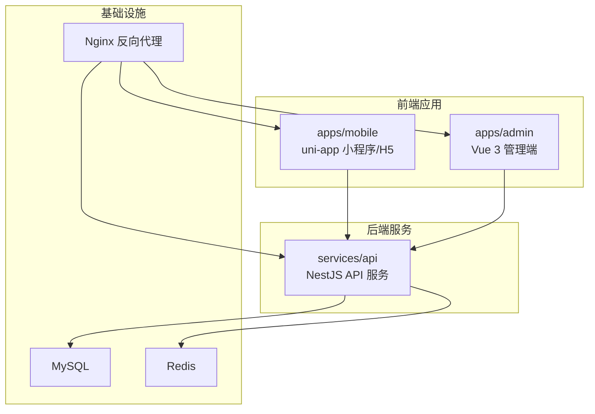
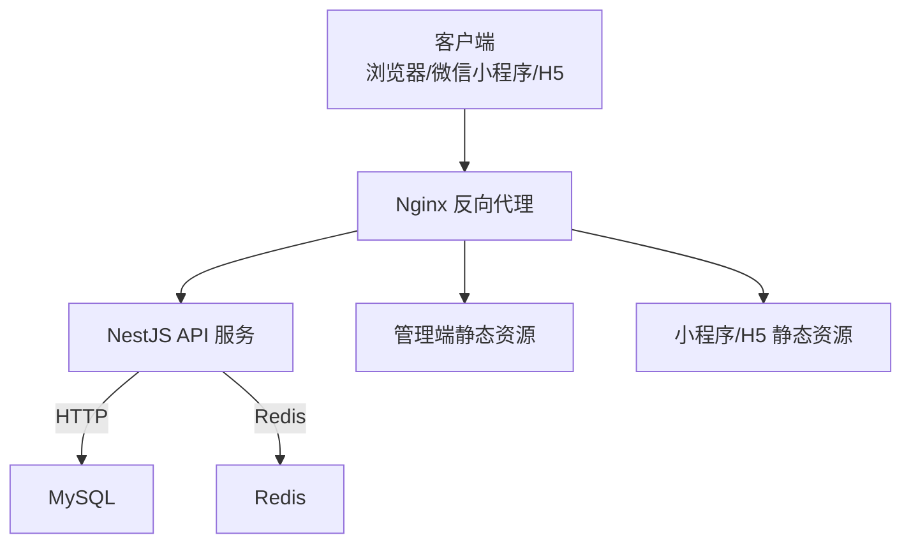
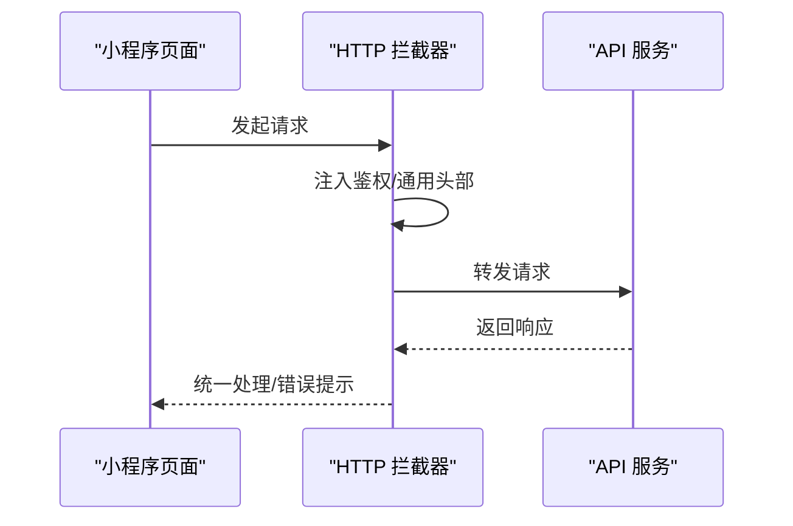
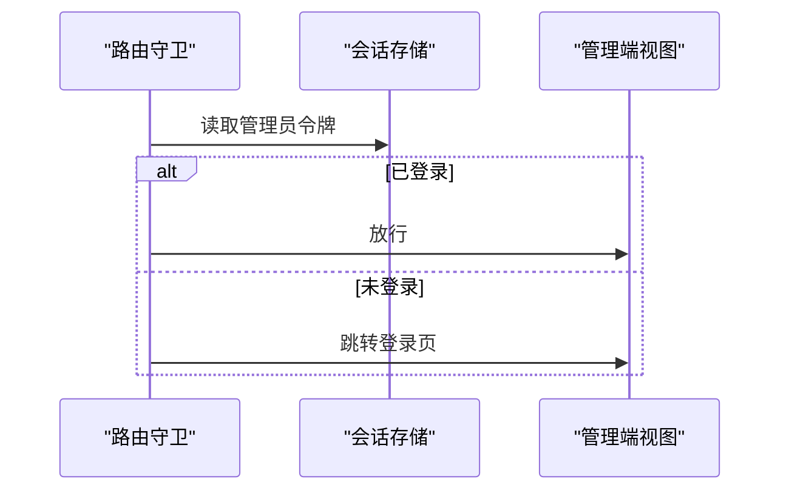
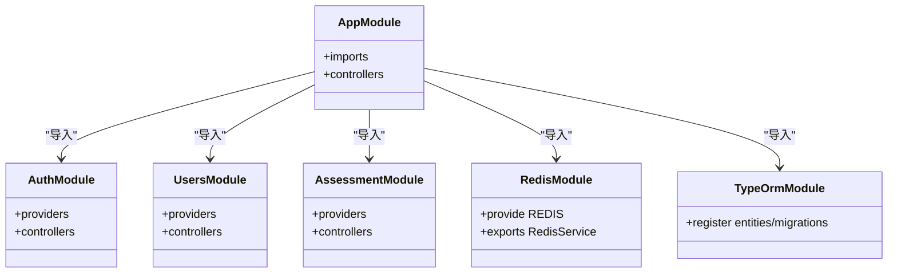
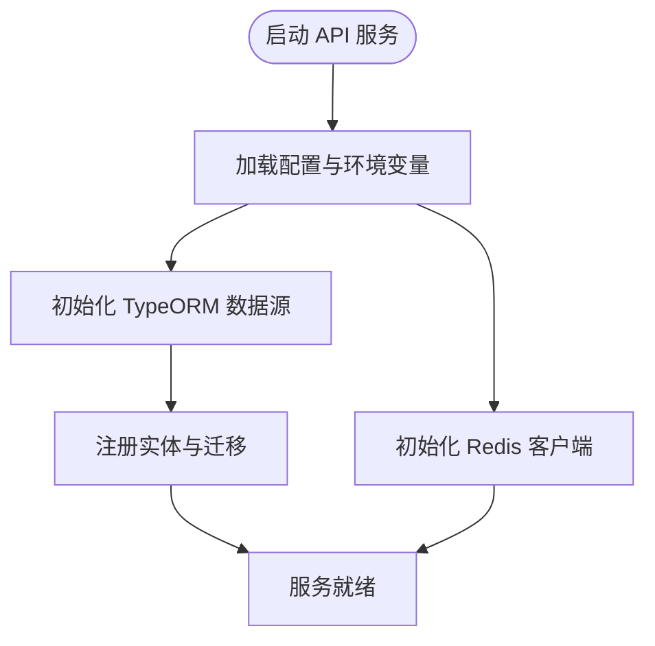
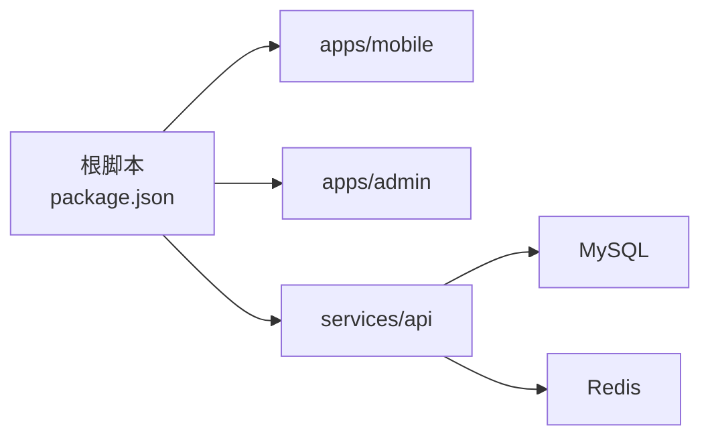

# 系统架构

<cite>
**本文引用的文件**
- [package.json](file://package.json)
- [pnpm-workspace.yaml](file://pnpm-workspace.yaml)
- [docker-compose.yml](file://docker-compose.yml)
- [services/api/src/main.ts](file://services/api/src/main.ts)
- [services/api/src/app.module.ts](file://services/api/src/app.module.ts)
- [services/api/src/database/data-source.ts](file://services/api/src/database/data-source.ts)
- [services/api/src/redis/redis.module.ts](file://services/api/src/redis/redis.module.ts)
- [services/api/src/auth/auth.module.ts](file://services/api/src/auth/auth.module.ts)
- [services/api/src/users/users.module.ts](file://services/api/src/users/users.module.ts)
- [services/api/src/assessment/assessment.module.ts](file://services/api/src/assessment/assessment.module.ts)
- [apps/admin/src/main.ts](file://apps/admin/src/main.ts)
- [apps/admin/src/router/index.ts](file://apps/admin/src/router/index.ts)
- [apps/admin/package.json](file://apps/admin/package.json)
- [apps/mobile/src/main.ts](file://apps/mobile/src/main.ts)
- [apps/mobile/src/pages.json](file://apps/mobile/src/pages.json)
- [apps/mobile/package.json](file://apps/mobile/package.json)
</cite>

## 目录
1. [引言](#引言)
2. [项目结构](#项目结构)
3. [核心组件](#核心组件)
4. [架构总览](#架构总览)
5. [详细组件分析](#详细组件分析)
6. [依赖分析](#依赖分析)
7. [性能考量](#性能考量)
8. [故障排查指南](#故障排查指南)
9. [结论](#结论)
10. [附录](#附录)

## 引言
本文件面向 Fortune Hub 的技术与产品团队，系统化阐述项目的分层架构、Monorepo 组织方式、前后端分离通信机制、API 设计原则、跨端兼容性策略，以及模块解耦与可扩展的微服务化思路。通过系统拓扑图与数据流向图，帮助开发者快速理解整体设计与关键交互路径。

## 项目结构
Fortune Hub 采用 Monorepo 架构，使用 pnpm workspace 进行统一管理，核心目录与职责如下：
- apps：前端应用集合
  - mobile：基于 uni-app 的多端小程序/H5 应用
  - admin：基于 Vue 3 + Vite 的管理后台
- services：后端服务集合
  - api：基于 NestJS 的 API 服务
- deploy：部署相关配置（Nginx）
- docs：业务与接口文档
- scripts：开发与运维脚本
- 根级配置：package.json、pnpm-workspace.yaml、docker-compose.yml

图表来源
- [docker-compose.yml:1-170](file://docker-compose.yml#L1-L170)
- [services/api/src/app.module.ts:61-145](file://services/api/src/app.module.ts#L61-L145)

章节来源
- [package.json:1-23](file://package.json#L1-L23)
- [pnpm-workspace.yaml:1-4](file://pnpm-workspace.yaml#L1-L4)
- [docker-compose.yml:1-170](file://docker-compose.yml#L1-L170)

## 核心组件
- 表现层
  - 小程序端（uni-app）：支持微信小程序、H5 多端运行，路由与页面在 pages.json 中集中定义，全局安装 HTTP 拦截器以统一处理请求与错误。
  - 管理端（Vue 3）：基于 Vue Router 的 SPA，提供登录守卫与路由权限控制，使用 Element Plus 与 Pinia。
- 业务层（NestJS API 服务）
  - 全局启用 CORS、校验管道、统一拦截器与异常过滤器；模块化拆分认证、用户、评估、占卜、生肖、幸运等子域功能。
  - 使用 TypeORM 连接 MySQL，集中注册实体与迁移；全局注入 ioredis 客户端，提供 Redis 服务。
- 数据层
  - MySQL：持久化用户、记录、订单、内容、配置等业务数据，支持迁移与同步策略由环境变量控制。
  - Redis：作为缓存与会话存储，具备重连与只读保护策略。

章节来源
- [apps/mobile/src/main.ts:1-15](file://apps/mobile/src/main.ts#L1-L15)
- [apps/mobile/src/pages.json:1-223](file://apps/mobile/src/pages.json#L1-L223)
- [apps/admin/src/main.ts:1-15](file://apps/admin/src/main.ts#L1-L15)
- [apps/admin/src/router/index.ts:1-62](file://apps/admin/src/router/index.ts#L1-L62)
- [services/api/src/main.ts:1-74](file://services/api/src/main.ts#L1-L74)
- [services/api/src/app.module.ts:61-145](file://services/api/src/app.module.ts#L61-L145)
- [services/api/src/database/data-source.ts:1-73](file://services/api/src/database/data-source.ts#L1-L73)
- [services/api/src/redis/redis.module.ts:1-32](file://services/api/src/redis/redis.module.ts#L1-L32)

## 架构总览
系统采用“前端多端 + 后端 API + 数据库 + 缓存”的分层设计，Nginx 作为统一入口与静态资源分发，实现跨端访问与静态资源优化。

图表来源
- [docker-compose.yml:147-166](file://docker-compose.yml#L147-L166)
- [services/api/src/main.ts:44-59](file://services/api/src/main.ts#L44-L59)

## 详细组件分析

### 前端：小程序端（uni-app）
- 路由与页面
  - 页面在 pages.json 中集中声明，包含导航栏样式、标题与下拉刷新等配置，覆盖首页、探索、占卜、八字、冥想、收藏、设置等场景。
- 请求拦截
  - 在应用启动时安装 HTTP 拦截器，统一处理请求头、鉴权与错误提示，确保与后端 API 的一致性。
- 跨端兼容
  - 通过 uni-app 的多端编译能力，支持微信小程序、H5、百度、字节、QQ 等平台，构建脚本按平台区分。

图表来源
- [apps/mobile/src/main.ts:4-7](file://apps/mobile/src/main.ts#L4-L7)
- [apps/mobile/src/pages.json:1-223](file://apps/mobile/src/pages.json#L1-L223)

章节来源
- [apps/mobile/src/main.ts:1-15](file://apps/mobile/src/main.ts#L1-L15)
- [apps/mobile/src/pages.json:1-223](file://apps/mobile/src/pages.json#L1-L223)
- [apps/mobile/package.json:1-76](file://apps/mobile/package.json#L1-L76)

### 前端：管理端（Vue 3 + Element Plus）
- 应用初始化
  - 创建 Vue 应用，挂载 Pinia 与路由，并引入 Element Plus。
- 路由与权限
  - 登录页与主布局嵌套，通过前置守卫校验管理员令牌，未登录跳转登录页，已登录禁止重复进入登录页。
- 与 API 的集成
  - 通过 Vite 环境变量注入 API 基础地址与文件服务地址，实现前后端分离部署下的灵活配置。

图表来源
- [apps/admin/src/router/index.ts:46-61](file://apps/admin/src/router/index.ts#L46-L61)
- [apps/admin/src/main.ts:1-15](file://apps/admin/src/main.ts#L1-L15)

章节来源
- [apps/admin/src/main.ts:1-15](file://apps/admin/src/main.ts#L1-L15)
- [apps/admin/src/router/index.ts:1-62](file://apps/admin/src/router/index.ts#L1-L62)
- [apps/admin/package.json:1-32](file://apps/admin/package.json#L1-L32)

### 后端：NestJS API 服务
- 启动与全局配置
  - 设置全局前缀、CORS 白名单、生产/本地开发判断、全局验证管道、统一拦截器与异常过滤器。
- 模块化架构
  - 以领域模块拆分：认证、用户、评估、占卜、生肖、幸运、订单、海报、通知、设置、运营等，每个模块独立注册控制器与服务。
- 数据与缓存
  - TypeORM 连接 MySQL，集中注册实体与迁移；全局注入 Redis 客户端，提供统一的缓存能力。
- 健康检查
  - 提供 /api/v1/health 健康端点，便于容器编排与监控。

图表来源
- [services/api/src/app.module.ts:61-145](file://services/api/src/app.module.ts#L61-L145)
- [services/api/src/auth/auth.module.ts:1-16](file://services/api/src/auth/auth.module.ts#L1-L16)
- [services/api/src/users/users.module.ts:1-46](file://services/api/src/users/users.module.ts#L1-L46)
- [services/api/src/assessment/assessment.module.ts:1-37](file://services/api/src/assessment/assessment.module.ts#L1-L37)
- [services/api/src/redis/redis.module.ts:1-32](file://services/api/src/redis/redis.module.ts#L1-L32)

章节来源
- [services/api/src/main.ts:1-74](file://services/api/src/main.ts#L1-L74)
- [services/api/src/app.module.ts:61-145](file://services/api/src/app.module.ts#L61-L145)
- [services/api/src/database/data-source.ts:1-73](file://services/api/src/database/data-source.ts#L1-L73)
- [services/api/src/redis/redis.module.ts:1-32](file://services/api/src/redis/redis.module.ts#L1-L32)

### 数据层：MySQL 与 Redis
- MySQL
  - 通过 TypeORM 初始化数据源，集中注册业务实体与迁移脚本，迁移执行策略由环境变量控制。
- Redis
  - 全局注入 ioredis 客户端，配置重试策略与连接错误处理，提供统一的缓存服务。

图表来源
- [services/api/src/app.module.ts:67-117](file://services/api/src/app.module.ts#L67-L117)
- [services/api/src/database/data-source.ts:32-72](file://services/api/src/database/data-source.ts#L32-L72)
- [services/api/src/redis/redis.module.ts:13-25](file://services/api/src/redis/redis.module.ts#L13-L25)

章节来源
- [services/api/src/database/data-source.ts:1-73](file://services/api/src/database/data-source.ts#L1-L73)
- [services/api/src/redis/redis.module.ts:1-32](file://services/api/src/redis/redis.module.ts#L1-L32)

## 依赖分析
- Monorepo 与工作区
  - pnpm workspace 将 apps 与 services 下的所有包纳入统一管理，根脚本通过 pnpm --filter 对各子项目进行开发、构建与测试。
- 前后端分离
  - 前端通过 Nginx 暴露的 /api/v1 前缀调用后端 API，CORS 配置允许本地与生产域名访问。
- 模块间耦合
  - NestJS 通过模块边界隔离业务域，模块间通过依赖注入与共享服务协作，避免直接循环依赖。

图表来源
- [package.json:6-21](file://package.json#L6-L21)
- [pnpm-workspace.yaml:1-4](file://pnpm-workspace.yaml#L1-L4)
- [docker-compose.yml:43-119](file://docker-compose.yml#L43-L119)

章节来源
- [package.json:1-23](file://package.json#L1-L23)
- [pnpm-workspace.yaml:1-4](file://pnpm-workspace.yaml#L1-L4)
- [services/api/src/main.ts:12-59](file://services/api/src/main.ts#L12-L59)

## 性能考量
- 前端
  - 使用 Vite 与按需路由，减少首屏体积；管理端引入 Element Plus 图表组件，注意懒加载与按需引入。
- 后端
  - Redis 作为缓存层降低数据库压力；TypeORM 迁移策略由环境变量控制，生产建议开启迁移但关闭同步。
- 网络与安全
  - Nginx 统一入口，结合 CORS 与 Cookie 凭据，保障跨域访问安全；健康检查与容器编排提升可用性。

## 故障排查指南
- CORS 错误
  - 检查 CROS_ORIGIN 配置是否包含当前开发或生产域名，确认本地开发时允许 localhost/127.0.0.1。
- 数据库连接失败
  - 核对 MYSQL_HOST/PORT/USER/PASSWORD 与 docker-compose 环境变量，确认容器健康状态。
- Redis 连接异常
  - 关注只读/连接类错误的自动重连策略，必要时调整重试次数与超时参数。
- 健康检查
  - 通过 /api/v1/health 端点与容器健康检查脚本定位服务不可用问题。

章节来源
- [services/api/src/main.ts:18-59](file://services/api/src/main.ts#L18-L59)
- [docker-compose.yml:18-23](file://docker-compose.yml#L18-L23)
- [services/api/src/redis/redis.module.ts:21-25](file://services/api/src/redis/redis.module.ts#L21-L25)

## 结论
Fortune Hub 通过 Monorepo 与 pnpm workspace 实现多端与多服务的统一管理，采用前后端分离与 Nginx 统一入口，结合 NestJS 的模块化设计与 MySQL/Redis 的数据层支撑，形成清晰的分层架构。该架构具备良好的可维护性、可扩展性与跨端兼容能力，为后续微服务化与业务演进提供了坚实基础。

## 附录
- 部署与运行
  - 使用 docker-compose 启动 MySQL、Redis、API、Nginx、管理端与移动端 H5 镜像，按需配置环境变量与端口映射。
- API 前缀与健康检查
  - 所有 API 前缀为 /api/v1，健康检查端点用于容器健康探测。

章节来源
- [docker-compose.yml:1-170](file://docker-compose.yml#L1-L170)
- [services/api/src/main.ts:32-61](file://services/api/src/main.ts#L32-L61)