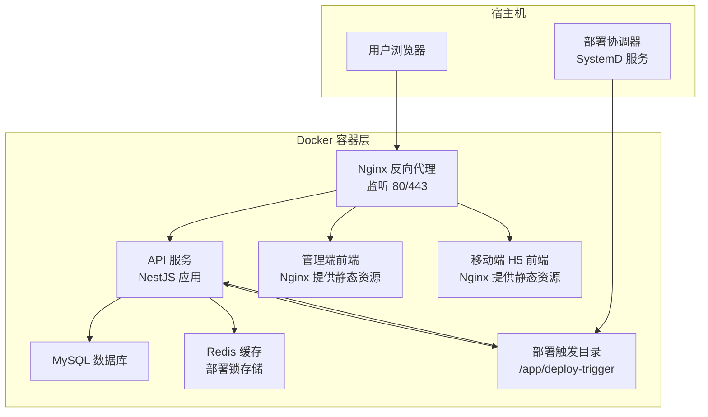
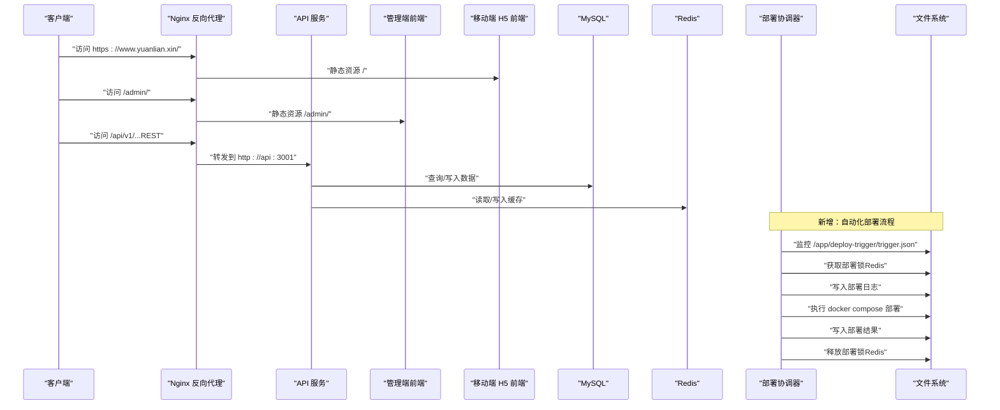
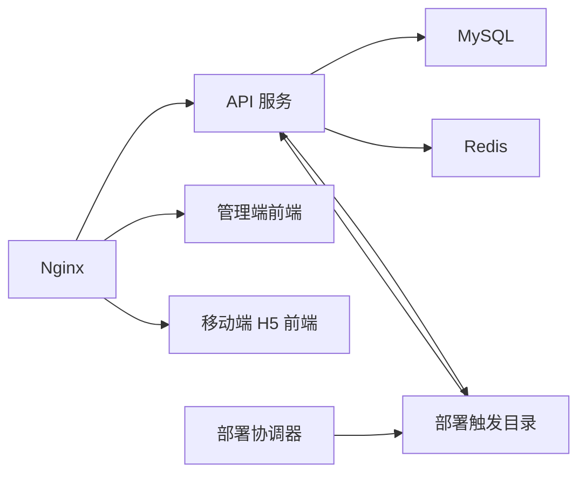

# 部署架构

<cite>
**本文引用的文件**
- [docker-compose.yml](file://docker-compose.yml)
- [default.conf](file://deploy/nginx/conf.d/default.conf)
- [https.conf.tpl](file://deploy/nginx/templates/https.conf.tpl)
- [http-only.conf.tpl](file://deploy/nginx/templates/http-only.conf.tpl)
- [deploy-aliyun.sh](file://scripts/deploy-aliyun.sh)
- [check-production-health.sh](file://scripts/check-production-health.sh)
- [Dockerfile（API）](file://services/api/Dockerfile)
- [Dockerfile（管理端）](file://apps/admin/Dockerfile)
- [Dockerfile（移动端 H5）](file://apps/mobile/Dockerfile)
- [nginx.conf（管理端）](file://apps/admin/nginx.conf)
- [nginx.conf（移动端 H5）](file://apps/mobile/nginx.conf)
- [app.module.ts](file://services/api/src/app.module.ts)
- [health.controller.ts](file://services/api/src/health/health.controller.ts)
- [production-config.validator.ts](file://services/api/src/common/production-config.validator.ts)
- [redis.service.ts](file://services/api/src/redis/redis.service.ts)
- [admin-ops-deploy.service.ts](file://services/api/src/admin-ops/admin-ops-deploy.service.ts)
- [admin-ops-deploy.controller.ts](file://services/api/src/admin-ops/admin-ops-deploy.controller.ts)
- [deploy.ts](file://apps/admin/src/api/deploy.ts)
- [DeployView.vue](file://apps/admin/src/views/DeployView.vue)
- [deploy-helper.sh](file://scripts/deploy-helper.sh)
- [deploy-watcher.service](file://scripts/deploy-watcher.service)
- [install-deploy-watcher.sh](file://scripts/install-deploy-watcher.sh)
- [package.json](file://package.json)
</cite>

## 目录
1. [简介](#简介)
2. [项目结构](#项目结构)
3. [核心组件](#核心组件)
4. [架构总览](#架构总览)
5. [详细组件分析](#详细组件分析)
6. [依赖关系分析](#依赖关系分析)
7. [性能与可靠性考量](#性能与可靠性考量)
8. [故障排除指南](#故障排除指南)
9. [结论](#结论)
10. [附录：部署清单与最佳实践](#附录部署清单与最佳实践)

## 简介
本文件面向 Fortune Hub 的生产级容器化部署，系统性阐述基于 Docker Compose 的整体架构与编排策略，涵盖以下要点：
- 服务编排与职责划分：API 服务、数据库、缓存、反向代理
- Nginx 反向代理的路由规则、HTTPS 证书管理与静态资源服务
- 生产环境部署流程、环境变量配置与健康检查机制
- **新增** 自动化部署系统：Redis 锁定机制、部署协调器、文件通信机制
- 监控与日志收集建议、负载均衡与高可用设计思路
- 部署最佳实践与常见问题排查

## 项目结构
Fortune Hub 采用多容器编排，包含 MySQL、Redis、Nginx、API 应用、管理端前端与移动端 H5 前端。Compose 文件定义了各服务的镜像来源、端口映射、卷挂载、环境变量与健康检查；Nginx 配置文件负责域名、证书、路由与静态资源分发。**新增**的自动化部署系统通过 Redis 锁定机制和文件通信机制实现跨容器的部署协调。

```mermaid
graph TB
subgraph "宿主机"
U["用户浏览器"]
DW["部署协调器<br/>SystemD 服务"]
end
subgraph "Docker 容器层"
NGINX["Nginx 反向代理<br/>监听 80/443"]
API["API 服务<br/>NestJS 应用"]
ADMIN["管理端前端<br/>Nginx 提供静态资源"]
MOBILE["移动端 H5 前端<br/>Nginx 提供静态资源"]
MYSQL["MySQL 数据库"]
REDIS["Redis 缓存<br/>部署锁存储"]
DT["部署触发目录<br/>/app/deploy-trigger"]
end
DW --> DT
DT --> API
U --> NGINX
NGINX --> API
NGINX --> ADMIN
NGINX --> MOBILE
API --> MYSQL
API --> REDIS
API --> DT
```

**图表来源**
- [docker-compose.yml:1-172](file://docker-compose.yml#L1-L172)
- [default.conf:1-62](file://deploy/nginx/conf.d/default.conf#L1-L62)
- [deploy-helper.sh:1-206](file://scripts/deploy-helper.sh#L1-L206)

**章节来源**
- [docker-compose.yml:1-172](file://docker-compose.yml#L1-L172)
- [default.conf:1-62](file://deploy/nginx/conf.d/default.conf#L1-L62)

## 核心组件
- 数据库（MySQL）
  - 版本与字符集设置，持久化卷，健康检查通过 mysqladmin ping 进行
- 缓存（Redis）
  - 启用 AOF 持久化，健康检查通过 redis-cli ping 进行，**新增**用于部署锁定机制
- API 服务（NestJS）
  - 多阶段构建，生产暴露 3001 端口，内置 /api/v1/health 健康检查
  - 通过 TypeORM 连接 MySQL，通过 RedisService 访问 Redis
  - **新增** AdminOpsDeployService 提供部署触发和状态查询功能
- 管理端前端（Admin SPA）
  - 使用 Nginx 提供静态资源，构建时注入 API 基础路径与文件服务基础路径
  - **新增** DeployView.vue 提供一键部署界面
- 移动端 H5 前端
  - 使用 Nginx 提供静态资源，构建时注入 API 基础路径与文件服务基础路径
- 反向代理（Nginx）
  - 统一入口，处理 HTTP→HTTPS 跳转、证书加载、静态资源与后端服务转发
  - 提供 /api/、/admin/、/file-api/、根路径等多路由
- **新增** 部署协调器（SystemD 服务）
  - deploy-watcher.service 监控部署触发目录
  - deploy-helper.sh 执行实际的部署流程
  - install-deploy-watcher.sh 安装和配置部署服务

**章节来源**
- [docker-compose.yml:2-172](file://docker-compose.yml#L2-L172)
- [Dockerfile（API）:1-30](file://services/api/Dockerfile#L1-L30)
- [Dockerfile（管理端）:1-22](file://apps/admin/Dockerfile#L1-L22)
- [Dockerfile（移动端 H5）:1-22](file://apps/mobile/Dockerfile#L1-L22)
- [nginx.conf（管理端）:1-12](file://apps/admin/nginx.conf#L1-L12)
- [nginx.conf（移动端 H5）:1-12](file://apps/mobile/nginx.conf#L1-L12)
- [admin-ops-deploy.service.ts:1-183](file://services/api/src/admin-ops/admin-ops-deploy.service.ts#L1-L183)
- [deploy-watcher.service:1-16](file://scripts/deploy-watcher.service#L1-L16)
- [deploy-helper.sh:1-206](file://scripts/deploy-helper.sh#L1-L206)

## 架构总览
下图展示请求在容器间的流转路径与各组件职责，包括新增的自动化部署系统：

```mermaid
sequenceDiagram
participant C as "客户端"
participant N as "Nginx 反向代理"
participant A as "API 服务"
participant M as "管理端前端"
participant H as "移动端 H5 前端"
participant DB as "MySQL"
participant R as "Redis"
participant DW as "部署协调器"
participant FS as "文件系统"
C->>N : "访问 https : //www.yuanlian.xin/"
N->>H : "静态资源 /"
C->>N : "访问 /admin/"
N->>M : "静态资源 /admin/"
C->>N : "访问 /api/v1/...REST"
N->>A : "转发到 http : //api : 3001"
A->>DB : "查询/写入数据"
A->>R : "读取/写入缓存"
Note over DW,FS : 新增：自动化部署流程
DW->>FS : "监控 /app/deploy-trigger/trigger.json"
DW->>FS : "获取部署锁Redis"
DW->>FS : "写入部署日志"
DW->>FS : "执行 docker compose 部署"
DW->>FS : "写入部署结果"
DW->>FS : "释放部署锁Redis"
```

**图表来源**
- [default.conf:1-62](file://deploy/nginx/conf.d/default.conf#L1-L62)
- [docker-compose.yml:147-166](file://docker-compose.yml#L147-L166)
- [admin-ops-deploy.service.ts:39-87](file://services/api/src/admin-ops/admin-ops-deploy.service.ts#L39-L87)
- [deploy-helper.sh:101-173](file://scripts/deploy-helper.sh#L101-L173)

## 详细组件分析

### Nginx 反向代理与路由策略
- 域名与跳转
  - 监听 80，将所有请求重定向至 https://$host$request_uri
  - 监听 443，启用 ssl，加载证书与私钥，开启 http2
- 路由规则
  - /api/ → 转发至 http://api:3001（API 服务）
  - /admin/ → 转发至 http://admin:80（管理端前端）
  - /file-api/ → 转发至 http://host.docker.internal:3000（文件服务）
  - 根路径 / → 转发至 http://mobile-h5:80（移动端 H5 前端）
- 请求头透传
  - 透传 Host、X-Real-IP、X-Forwarded-For、X-Forwarded-Proto 等，便于后端识别真实来源与协议
- 证书管理
  - 证书与私钥挂载自宿主机目录，模板支持根据环境变量渲染不同配置

**章节来源**
- [default.conf:1-62](file://deploy/nginx/conf.d/default.conf#L1-L62)
- [https.conf.tpl:1-62](file://deploy/nginx/templates/https.conf.tpl#L1-L62)
- [http-only.conf.tpl:1-50](file://deploy/nginx/templates/http-only.conf.tpl#L1-L50)

### API 服务（NestJS）
- 容器化
  - 多阶段构建，安装中文字体以支持海报渲染；生产暴露 3001 端口
- 数据库连接
  - 通过 TypeORM 连接 MySQL，实体与迁移路径由配置驱动
- 缓存访问
  - RedisService 封装连接状态管理与 ping/读写操作，健康检查会读取其返回状态
- **新增** 部署协调功能
  - AdminOpsDeployService 提供部署触发、状态查询和日志获取功能
  - 使用 Redis 锁定机制防止并发部署冲突
  - 通过文件系统进行跨容器通信（trigger.json、result.json、deploy.log）
- 健康检查
  - 内置 /api/v1/health，返回服务名、MySQL 初始化状态、Redis Ping 结果与时间戳
- 配置校验
  - 生产模式强制要求 HTTPS 的 PUBLIC_API_BASE_URL、FILE_SERVICE_BASE_URL、CORS_ORIGIN
  - 禁止使用弱口令与测试模式（如 DB_SYNCHRONIZE、SMS_PROVIDER、PAYMENT_MODE）

**章节来源**
- [Dockerfile（API）:1-30](file://services/api/Dockerfile#L1-L30)
- [app.module.ts:61-145](file://services/api/src/app.module.ts#L61-L145)
- [health.controller.ts:1-28](file://services/api/src/health/health.controller.ts#L1-L28)
- [production-config.validator.ts:25-104](file://services/api/src/common/production-config.validator.ts#L25-L104)
- [redis.service.ts:68-77](file://services/api/src/redis/redis.service.ts#L68-L77)
- [admin-ops-deploy.service.ts:1-183](file://services/api/src/admin-ops/admin-ops-deploy.service.ts#L1-L183)

### 管理端前端（Admin SPA）
- 容器化
  - 基于 Nginx 提供静态资源，构建时注入 VITE_API_BASE_URL、VITE_PUBLIC_BASE、VITE_FILE_SERVICE_BASE_URL
- **新增** 部署管理界面
  - DeployView.vue 提供一键部署功能
  - 实时显示部署状态、最近部署信息和部署日志
  - 支持部署冲突检测和冷却时间提示
- 路由
  - 通过 try_files $uri $uri/ /index.html 支持 SPA 路由

**章节来源**
- [Dockerfile（管理端）:1-22](file://apps/admin/Dockerfile#L1-L22)
- [nginx.conf（管理端）:1-12](file://apps/admin/nginx.conf#L1-L12)
- [DeployView.vue:1-363](file://apps/admin/src/views/DeployView.vue#L1-L363)
- [deploy.ts:1-54](file://apps/admin/src/api/deploy.ts#L1-L54)

### 移动端 H5 前端
- 容器化
  - 基于 Nginx 提供静态资源，构建时注入 VITE_API_BASE_URL、VITE_FILE_SERVICE_BASE_URL、VITE_PAYMENT_MODE
- 路由
  - 通过 try_files $uri $uri/ /index.html 支持 SPA 路由

**章节来源**
- [Dockerfile（移动端 H5）:1-22](file://apps/mobile/Dockerfile#L1-L22)
- [nginx.conf（移动端 H5）:1-12](file://apps/mobile/nginx.conf#L1-L12)

### 数据库与缓存
- MySQL
  - 字符集与排序规则设置，持久化卷，健康检查使用 mysqladmin ping
- Redis
  - AOF 持久化，健康检查使用 redis-cli ping
  - **新增** 作为部署锁定机制的核心组件

**章节来源**
- [docker-compose.yml:2-42](file://docker-compose.yml#L2-L42)

### 自动化部署系统
**新增** Fortune Hub 现已具备完整的自动化部署系统，包括以下核心组件：

#### Redis 锁定机制
- 锁键：`deploy:lock`
- TTL：10 分钟
- 冷却时间：5 分钟
- 并发控制：防止多个部署同时进行
- 超时保护：最大轮询时间 10 分钟

#### 部署协调器（SystemD 服务）
- deploy-watcher.service：SystemD 服务配置
- deploy-helper.sh：实际部署执行脚本
  - 监控 `/app/deploy-trigger/` 目录中的 `trigger.json` 文件
  - 使用文件锁防止并发部署
  - 执行完整的部署流程：git pull → docker compose build → docker compose up -d
  - 健康检查：等待 API 服务健康
  - 生成 `result.json` 和 `deploy.log`
- install-deploy-watcher.sh：部署协调器安装脚本

#### 文件通信机制
- 触发文件：`/app/deploy-trigger/trigger.json`
- 结果文件：`/app/deploy-trigger/result.json`
- 日志文件：`/app/deploy-trigger/deploy.log`
- 锁文件：`/app/deploy-trigger/.lock`

#### API 部署接口
- `/admin/ops/deploy/status`：获取部署状态
- `/admin/ops/deploy/trigger`：触发部署（POST）
- `/admin/ops/deploy/logs`：获取部署日志

**章节来源**
- [admin-ops-deploy.service.ts:1-183](file://services/api/src/admin-ops/admin-ops-deploy.service.ts#L1-L183)
- [admin-ops-deploy.controller.ts:1-64](file://services/api/src/admin-ops/admin-ops-deploy.controller.ts#L1-L64)
- [deploy-helper.sh:1-206](file://scripts/deploy-helper.sh#L1-L206)
- [deploy-watcher.service:1-16](file://scripts/deploy-watcher.service#L1-L16)
- [install-deploy-watcher.sh:1-78](file://scripts/install-deploy-watcher.sh#L1-L78)

### Compose 服务编排与依赖
- 服务依赖
  - api 依赖 mysql 与 redis 健康后才启动
  - nginx 依赖 api 健康，且依赖 admin、mobile-h5 启动
  - **新增** api 服务挂载部署触发目录：`./deploy-trigger:/app/deploy-trigger`
- 环境变量
  - API 服务大量配置项用于数据库、缓存、微信、短信、海报渲染等能力开关与参数
  - Nginx 通过挂载证书与模板渲染实现 HTTPS/HTTP 两种模式

**章节来源**
- [docker-compose.yml:43-166](file://docker-compose.yml#L43-L166)

## 依赖关系分析
- 组件耦合
  - API 服务强依赖 MySQL 与 Redis；Nginx 强依赖 API、管理端与移动端服务
  - **新增** 部署协调器通过文件系统与 API 服务解耦
- 外部依赖
  - 证书文件（fullchain.pem、privkey.pem）由部署脚本准备并挂载
  - **新增** 部署触发目录需要正确的权限配置
- 可能的循环依赖
  - 当前编排无循环依赖；Nginx 作为统一入口，避免了前端对后端的直接耦合
  - **新增** 自动化部署系统通过 Redis 和文件系统实现松耦合

```mermaid
graph LR
NGINX["Nginx"] --> API["API 服务"]
NGINX --> ADMIN["管理端前端"]
NGINX --> MOBILE["移动端 H5 前端"]
API --> MYSQL["MySQL"]
API --> REDIS["Redis"]
API --> DT["部署触发目录"]
DW["部署协调器"] --> DT
DT --> API
```

**图表来源**
- [docker-compose.yml:1-172](file://docker-compose.yml#L1-L172)

**章节来源**
- [docker-compose.yml:1-172](file://docker-compose.yml#L1-L172)

## 性能与可靠性考量
- 连接池与超时
  - 建议在 API 层面配置数据库连接池与 Redis 连接超时，避免并发高峰下的连接抖动
- 缓存策略
  - 对热点接口与静态资源进行合理缓存，结合 CDN 与 Nginx 缓存头优化
- 健康检查与重启
  - Compose 已内置健康检查；建议在编排层设置 restart 策略，并结合外部监控告警
- **新增** 部署系统的可靠性
  - Redis 锁定机制确保部署的原子性
  - 文件系统通信提供持久化的部署状态跟踪
  - SystemD 服务自动重启部署协调器
- 日志与追踪
  - 建议将 API、Nginx、数据库日志输出到集中式日志系统（如 ELK/Fluentd），并为关键链路打上 Trace ID
  - **新增** 部署日志集中管理，便于问题排查

## 故障排除指南
- 健康检查失败
  - 使用生产健康检查脚本验证 API、文件服务、移动端与管理端是否可达且返回预期内容
  - 关注 /api/v1/health 返回的 MySQL 与 Redis 状态
- 证书问题
  - 确认证书与私钥已正确挂载至 /etc/nginx/ssl，并由模板渲染生效
- 端口冲突
  - 检查 NGINX_HTTP(S)_PORT 与本地占用情况；确认容器端口映射正确
- 配置错误
  - 生产配置校验会拒绝弱口令、非 HTTPS 基础地址与测试模式；请修正环境变量后再启动
- **新增** 部署系统故障
  - 检查 Redis 服务是否正常，确认部署锁键可用
  - 验证部署触发目录权限：`/app/deploy-trigger` 应该可读写
  - 查看 SystemD 服务状态：`systemctl status deploy-watcher.service`
  - 检查部署日志：`journalctl -u deploy-watcher.service -f`

**章节来源**
- [check-production-health.sh:1-86](file://scripts/check-production-health.sh#L1-L86)
- [health.controller.ts:1-28](file://services/api/src/health/health.controller.ts#L1-L28)
- [production-config.validator.ts:25-104](file://services/api/src/common/production-config.validator.ts#L25-L104)
- [install-deploy-watcher.sh:61-74](file://scripts/install-deploy-watcher.sh#L61-L74)

## 结论
该部署架构以 Docker Compose 实现多服务编排，Nginx 作为统一入口承担路由与证书管理职责，API 服务通过 TypeORM 与 Redis 提供核心能力，前端以静态资源形式交付。**新增的自动化部署系统**通过 Redis 锁定机制、部署协调器和文件通信机制实现了可靠的跨容器部署协调，确保部署过程的原子性和可追踪性。通过严格的生产配置校验、健康检查与部署脚本，可保障上线质量与运行稳定性。建议在生产环境中进一步完善监控、日志与备份策略，确保高可用与可恢复性。

## 附录：部署清单与最佳实践

### 部署流程（阿里云示例）
- 准备环境变量文件（如 .env.aliyun），包含数据库、管理员、微信、短信、支付等关键配置
- **新增** 安装部署协调器：
  - 执行 `install-deploy-watcher.sh` 安装 SystemD 服务
  - 确认服务状态：`systemctl status deploy-watcher.service`
- 执行部署脚本的不同动作：
  - 渲染 Nginx 配置（根据 ENABLE_HTTPS 选择 HTTP/HTTPS 模板）
  - 拉取代码并构建镜像
  - 启动/重启/停止/查看状态/查看日志

**章节来源**
- [deploy-aliyun.sh:1-199](file://scripts/deploy-aliyun.sh#L1-L199)
- [install-deploy-watcher.sh:1-78](file://scripts/install-deploy-watcher.sh#L1-L78)

### 环境变量清单（关键项）
- 数据库
  - MYSQL_ROOT_PASSWORD、MYSQL_DATABASE、MYSQL_USER、MYSQL_PASSWORD、MYSQL_PORT、MYSQL_HOST
- API 服务
  - NODE_ENV、PORT、DB_SYNCHRONIZE、DB_RUN_MIGRATIONS、REDIS_HOST、REDIS_PORT、ADMIN_*、FILE_SERVICE_BASE_URL、PUBLIC_API_BASE_URL、CORS_ORIGIN、WECHAT_*、SMS_*、ALIBABA_CLOUD_*、ZHIPU_*、POSTER_*、BIGMODEL_API_KEY 等
- Nginx
  - NGINX_BIND_HOST、NGINX_HTTP_PORT、NGINX_HTTPS_PORT、APP_DOMAIN、ENABLE_HTTPS、SSL_CERT_SOURCE、SSL_KEY_SOURCE
- **新增** 部署系统
  - 部署触发目录权限配置
  - Redis 部署锁配置

**章节来源**
- [docker-compose.yml:54-98](file://docker-compose.yml#L54-L98)
- [deploy-aliyun.sh:26-47](file://scripts/deploy-aliyun.sh#L26-L47)

### 健康检查与运维命令
- 生产健康检查脚本
  - 验证 /api/v1/health、/file-api/api/health、移动端首页与管理端首页
- Compose 常用命令
  - docker compose --env-file ... up -d --build
  - docker compose ps/logs/status/restart/down
- **新增** 部署系统运维命令
  - 查看部署协调器状态：`systemctl status deploy-watcher.service`
  - 查看部署日志：`journalctl -u deploy-watcher.service -f`
  - 检查部署触发目录：`ls -la /app/deploy-trigger/`

**章节来源**
- [check-production-health.sh:74-83](file://scripts/check-production-health.sh#L74-L83)
- [package.json:18-21](file://package.json#L18-L21)
- [install-deploy-watcher.sh:69-74](file://scripts/install-deploy-watcher.sh#L69-L74)

### 最佳实践
- 生产禁用同步建表（DB_SYNCHRONIZE），统一使用迁移脚本
- 禁用测试模式（SMS_PROVIDER、PAYMENT_MODE、WECHAT_LOGIN_ALLOW_MOCK）
- 使用强口令与安全的 pepper 值
- HTTPS 必须启用，证书由可信 CA 签发
- 前端构建参数与后端 API 基础路径保持一致
- 为 Nginx 与 API 设置合理的超时与限流策略
- **新增** 部署系统最佳实践
  - 确保 Redis 服务稳定运行
  - 配置适当的部署冷却时间
  - 监控部署触发目录的磁盘空间
  - 定期清理旧的部署日志文件

**章节来源**
- [production-config.validator.ts:44-101](file://services/api/src/common/production-config.validator.ts#L44-L101)
- [deploy-aliyun.sh:49-61](file://scripts/deploy-aliyun.sh#L49-L61)
- [admin-ops-deploy.service.ts:11-15](file://services/api/src/admin-ops/admin-ops-deploy.service.ts#L11-L15)