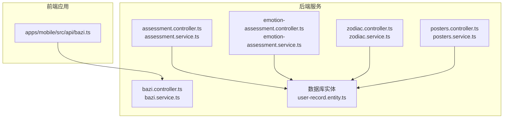
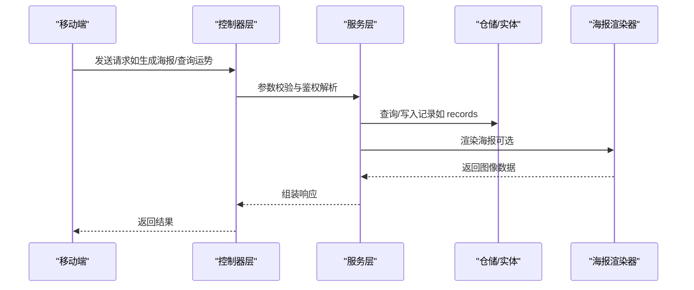
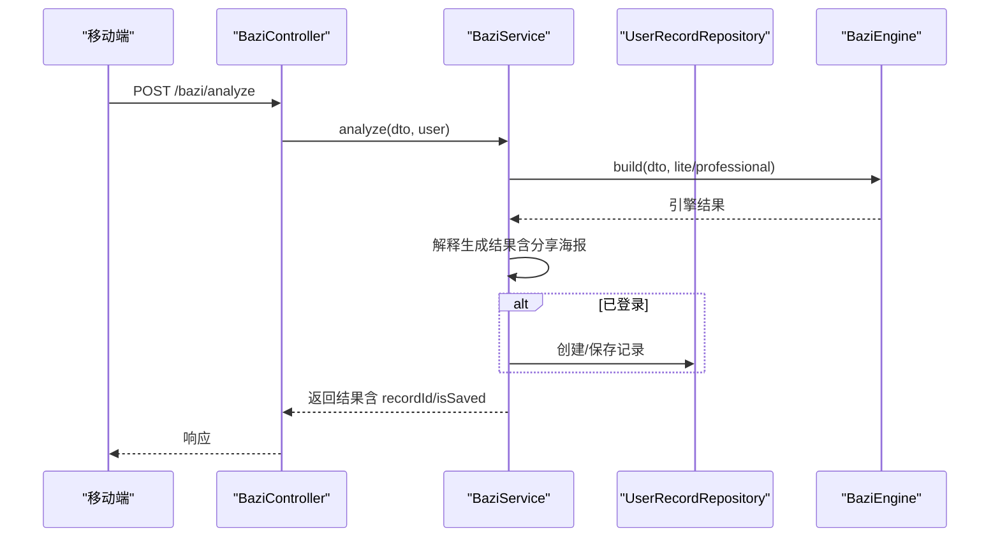
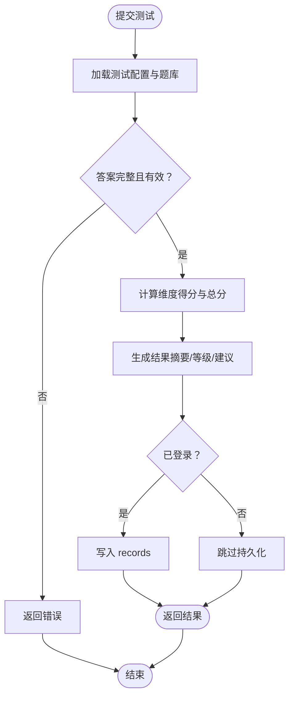
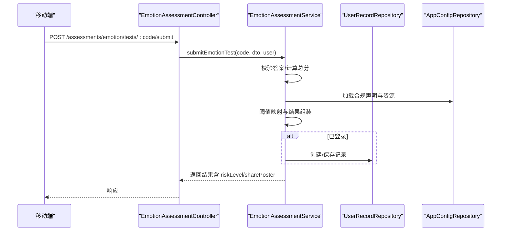
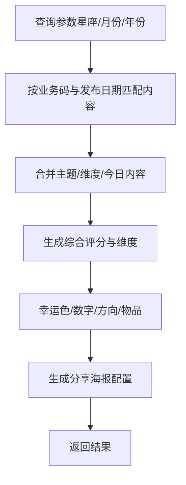
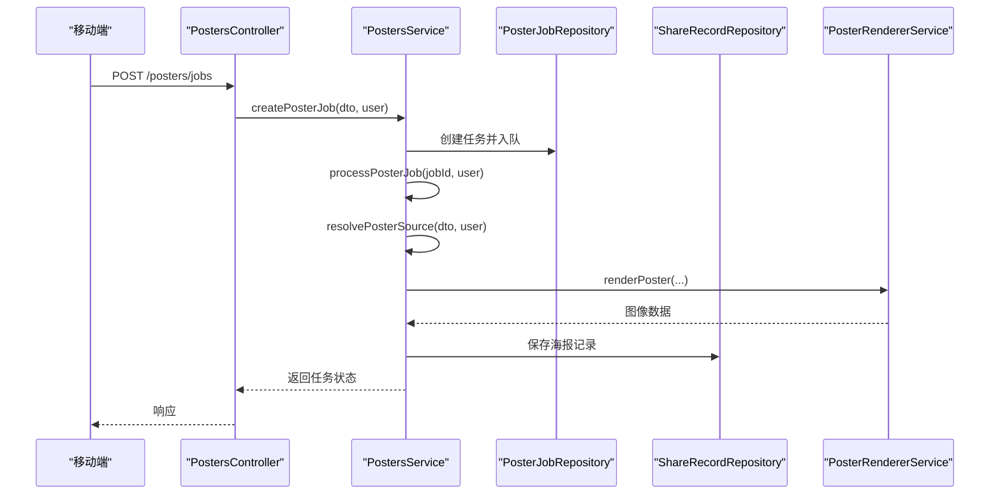
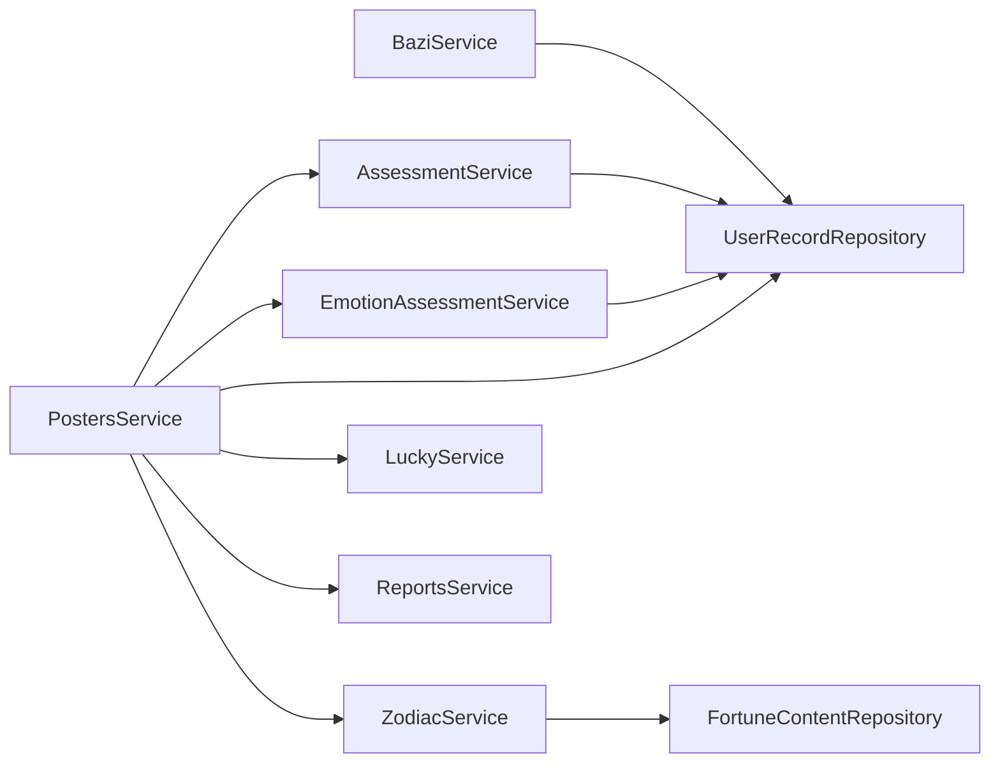

# 核心功能模块

<cite>
**本文引用的文件**
- [bazi.controller.ts](file://services/api/src/bazi/bazi.controller.ts)
- [bazi.service.ts](file://services/api/src/bazi/bazi.service.ts)
- [assessment.controller.ts](file://services/api/src/assessment/assessment.controller.ts)
- [assessment.service.ts](file://services/api/src/assessment/assessment.service.ts)
- [emotion-assessment.controller.ts](file://services/api/src/assessment/emotion-assessment.controller.ts)
- [emotion-assessment.service.ts](file://services/api/src/assessment/emotion-assessment.service.ts)
- [zodiac.controller.ts](file://services/api/src/zodiac/zodiac.controller.ts)
- [zodiac.service.ts](file://services/api/src/zodiac/zodiac.service.ts)
- [divination.controller.ts](file://services/api/src/divination/divination.controller.ts)
- [posters.controller.ts](file://services/api/src/posters/posters.controller.ts)
- [posters.service.ts](file://services/api/src/posters/posters.service.ts)
- [user-record.entity.ts](file://services/api/src/database/entities/user-record.entity.ts)
- [bazi.ts](file://apps/mobile/src/api/bazi.ts)
</cite>

## 目录
1. [简介](#简介)
2. [项目结构](#项目结构)
3. [核心组件](#核心组件)
4. [架构总览](#架构总览)
5. [详细组件分析](#详细组件分析)
6. [依赖分析](#依赖分析)
7. [性能考量](#性能考量)
8. [故障排查指南](#故障排查指南)
9. [结论](#结论)
10. [附录](#附录)

## 简介
本文件面向 Fortune Hub 的核心业务模块，系统性梳理并解析以下功能模块的设计理念与实现细节：
- 星座运势（Zodiac）：提供每日、每周、每月、每年、相容性与知识等多维运势能力
- 八字命理（BaZi）：提供轻解读与专业版命盘分析、历史记录与专业详情重建
- 性格测评（Assessment）：提供日常节奏感与表达风格等性格测评，含结果与分享海报
- 情绪自检（Emotion Assessment）：提供低落感与紧张感两类自检，含风险等级与支持提示
- 海报生成（Posters）：统一的海报生成与任务队列服务，支持多种来源与模板渲染

文档将从系统架构、组件关系、数据流、处理逻辑、集成点、错误处理与性能特征等方面进行深入剖析，并给出扩展建议与最佳实践，帮助开发者快速理解与维护这些核心业务逻辑。

## 项目结构
后端采用 NestJS 架构，按功能域划分模块，核心模块包括：
- bazi：八字命理分析与历史管理
- assessment：性格测评（personality）
- assessment/emotion：情绪自检（emotion）
- zodiac：星座运势
- divination：占卜相关内容（此处作为对照，不作为本次重点）
- posters：海报生成与任务队列

前端移动应用通过统一的 API 层对接上述服务，例如移动端的八字接口封装位于 apps/mobile/src/api/bazi.ts。

**图表来源**
- [bazi.controller.ts:1-54](file://services/api/src/bazi/bazi.controller.ts#L1-L54)
- [bazi.service.ts:1-436](file://services/api/src/bazi/bazi.service.ts#L1-L436)
- [assessment.controller.ts:1-39](file://services/api/src/assessment/assessment.controller.ts#L1-L39)
- [assessment.service.ts:1-806](file://services/api/src/assessment/assessment.service.ts#L1-L806)
- [emotion-assessment.controller.ts:1-39](file://services/api/src/assessment/emotion-assessment.controller.ts#L1-L39)
- [emotion-assessment.service.ts:1-778](file://services/api/src/assessment/emotion-assessment.service.ts#L1-L778)
- [zodiac.controller.ts:1-47](file://services/api/src/zodiac/zodiac.controller.ts#L1-L47)
- [zodiac.service.ts:1-979](file://services/api/src/zodiac/zodiac.service.ts#L1-L979)
- [posters.controller.ts:1-68](file://services/api/src/posters/posters.controller.ts#L1-L68)
- [posters.service.ts:1-800](file://services/api/src/posters/posters.service.ts#L1-L800)
- [user-record.entity.ts:1-50](file://services/api/src/database/entities/user-record.entity.ts#L1-L50)
- [bazi.ts:1-43](file://apps/mobile/src/api/bazi.ts#L1-L43)

**章节来源**
- [bazi.controller.ts:1-54](file://services/api/src/bazi/bazi.controller.ts#L1-L54)
- [assessment.controller.ts:1-39](file://services/api/src/assessment/assessment.controller.ts#L1-L39)
- [emotion-assessment.controller.ts:1-39](file://services/api/src/assessment/emotion-assessment.controller.ts#L1-L39)
- [zodiac.controller.ts:1-47](file://services/api/src/zodiac/zodiac.controller.ts#L1-L47)
- [posters.controller.ts:1-68](file://services/api/src/posters/posters.controller.ts#L1-L68)
- [user-record.entity.ts:1-50](file://services/api/src/database/entities/user-record.entity.ts#L1-L50)
- [bazi.ts:1-43](file://apps/mobile/src/api/bazi.ts#L1-L43)

## 核心组件
本节概览各模块职责与交互关系：
- 八字命理（Bazi）
  - 控制器负责鉴权解析与路由转发
  - 服务负责引擎构建、结果解释、历史与专业详情重建
- 性格测评（Assessment）
  - 提供测试配置与题库的动态加载与持久化
  - 计算维度得分、等级与结果摘要，生成分享海报配置
- 情绪自检（Emotion Assessment）
  - 自检计分与阈值映射，输出风险等级与支持提示
  - 动态加载测试配置与题库，支持合规声明与资源列表
- 星座运势（Zodiac）
  - 提供当日/日/周/月/年/相容性/知识等多维运势
  - 内容按业务码与发布日期匹配，支持主题与分享海报
- 海报生成（Posters）
  - 统一海报生成入口，支持同步生成与异步任务
  - 解析不同来源（报告、今日指数、星座、幸运签等），调用渲染器生成图片并持久化

**章节来源**
- [bazi.service.ts:1-436](file://services/api/src/bazi/bazi.service.ts#L1-L436)
- [assessment.service.ts:1-806](file://services/api/src/assessment/assessment.service.ts#L1-L806)
- [emotion-assessment.service.ts:1-778](file://services/api/src/assessment/emotion-assessment.service.ts#L1-L778)
- [zodiac.service.ts:1-979](file://services/api/src/zodiac/zodiac.service.ts#L1-L979)
- [posters.service.ts:1-800](file://services/api/src/posters/posters.service.ts#L1-L800)

## 架构总览
后端以控制器-服务-仓储三层结构组织，数据通过 TypeORM 实体持久化，部分模块还依赖内容中心与外部渲染服务。移动端通过统一 API 调用后端模块。

**图表来源**
- [posters.controller.ts:1-68](file://services/api/src/posters/posters.controller.ts#L1-L68)
- [posters.service.ts:1-800](file://services/api/src/posters/posters.service.ts#L1-L800)
- [user-record.entity.ts:1-50](file://services/api/src/database/entities/user-record.entity.ts#L1-L50)

## 详细组件分析

### 八字命理（Bazi）模块
- 设计理念
  - 支持“轻解读”与“专业版”两种模式，前者用于体验，后者启用真太阳时与校准
  - 结果包含命盘、五行、日主分析、有利方向/颜色、日常关注点与分享海报配置
  - 历史记录统一存储于 records 表，便于回溯与专业详情重建
- 关键流程
  - 分析流程：控制器接收 DTO → 解析用户 → 服务构建引擎结果 → 解释生成结果 → 可选持久化记录
  - 历史与专业详情：按用户维度查询 records → 专业详情缺失时可基于输入重建
- 数据模型
  - 用户记录实体包含 recordType、sourceCode、resultTitle、score、resultLevel、resultData 等字段
- API 接口
  - POST /bazi/analyze：轻解读分析
  - POST /bazi/professional/analyze：专业版分析
  - GET /bazi/history：查询历史
  - GET /bazi/professional/records/:recordId/detail：获取专业详情
  - GET /bazi/birth-places：出生地检索

**图表来源**
- [bazi.controller.ts:1-54](file://services/api/src/bazi/bazi.controller.ts#L1-L54)
- [bazi.service.ts:1-436](file://services/api/src/bazi/bazi.service.ts#L1-L436)
- [user-record.entity.ts:1-50](file://services/api/src/database/entities/user-record.entity.ts#L1-L50)

**章节来源**
- [bazi.controller.ts:1-54](file://services/api/src/bazi/bazi.controller.ts#L1-L54)
- [bazi.service.ts:1-436](file://services/api/src/bazi/bazi.service.ts#L1-L436)
- [user-record.entity.ts:1-50](file://services/api/src/database/entities/user-record.entity.ts#L1-L50)
- [bazi.ts:1-43](file://apps/mobile/src/api/bazi.ts#L1-L43)

### 性格测评（Assessment）模块
- 设计理念
  - 测试配置与题库通过种子数据与数据库配置动态合并，支持维度标签、画像与分享海报模板
  - 计算维度得分、总分与等级，生成结果摘要与建议
- 关键流程
  - 获取测试：加载配置与题库 → 序列化测试摘要
  - 提交测试：校验答案完整性 → 计算维度得分与等级 → 生成结果与分享海报 → 可选持久化记录
  - 历史查询：按用户与类型查询最近记录
- 数据模型
  - records 表存储测试结果与评分、等级等元数据
- API 接口
  - GET /assessments/personality/tests：获取测试列表
  - GET /assessments/personality/tests/:code：获取测试详情
  - POST /assessments/personality/tests/:code/submit：提交测试
  - GET /assessments/personality/history：查询历史

**图表来源**
- [assessment.controller.ts:1-39](file://services/api/src/assessment/assessment.controller.ts#L1-L39)
- [assessment.service.ts:1-806](file://services/api/src/assessment/assessment.service.ts#L1-L806)
- [user-record.entity.ts:1-50](file://services/api/src/database/entities/user-record.entity.ts#L1-L50)

**章节来源**
- [assessment.controller.ts:1-39](file://services/api/src/assessment/assessment.controller.ts#L1-L39)
- [assessment.service.ts:1-806](file://services/api/src/assessment/assessment.service.ts#L1-L806)
- [user-record.entity.ts:1-50](file://services/api/src/database/entities/user-record.entity.ts#L1-L50)

### 情绪自检（Emotion Assessment）模块
- 设计理念
  - 两类自检（低落感/紧张感）基于阈值映射生成风险等级与建议
  - 支持合规声明与资源列表动态加载，确保提示符合规范
- 关键流程
  - 获取测试：加载配置与题库 → 序列化测试摘要
  - 提交测试：校验答案 → 计算总分 → 映射阈值 → 生成结果与分享海报 → 可选持久化记录
  - 历史查询：按用户与类型查询最近记录
- 数据模型
  - records 表存储自检结果与风险等级、完成时间等
- API 接口
  - GET /assessments/emotion/tests：获取测试列表
  - GET /assessments/emotion/tests/:code：获取测试详情
  - POST /assessments/emotion/tests/:code/submit：提交测试
  - GET /assessments/emotion/history：查询历史

**图表来源**
- [emotion-assessment.controller.ts:1-39](file://services/api/src/assessment/emotion-assessment.controller.ts#L1-L39)
- [emotion-assessment.service.ts:1-778](file://services/api/src/assessment/emotion-assessment.service.ts#L1-L778)
- [user-record.entity.ts:1-50](file://services/api/src/database/entities/user-record.entity.ts#L1-L50)

**章节来源**
- [emotion-assessment.controller.ts:1-39](file://services/api/src/assessment/emotion-assessment.controller.ts#L1-L39)
- [emotion-assessment.service.ts:1-778](file://services/api/src/assessment/emotion-assessment.service.ts#L1-L778)
- [user-record.entity.ts:1-50](file://services/api/src/database/entities/user-record.entity.ts#L1-L50)

### 星座运势（Zodiac）模块
- 设计理念
  - 提供当日/日/周/月/年/相容性/知识等多维运势，内容按业务码与发布日期匹配
  - 支持主题与分享海报配置，结合元素/模式/关键词等生成个性化内容
- 关键流程
  - 当日运势：合并多源内容 → 生成综合评分与维度 → 构建分享海报
  - 周/月/年：按元素/模态/关键词生成节奏与关注点
  - 相容性：计算分数与等级，输出化学反应与建议
- API 接口
  - GET /zodiac/today：当日运势
  - GET /zodiac/daily：日度运势
  - GET /zodiac/weekly：周运势
  - GET /zodiac/monthly：月运势
  - GET /zodiac/yearly：年运势
  - GET /zodiac/compatibility：相容性
  - GET /zodiac/knowledge：知识

**图表来源**
- [zodiac.controller.ts:1-47](file://services/api/src/zodiac/zodiac.controller.ts#L1-L47)
- [zodiac.service.ts:1-979](file://services/api/src/zodiac/zodiac.service.ts#L1-L979)

**章节来源**
- [zodiac.controller.ts:1-47](file://services/api/src/zodiac/zodiac.controller.ts#L1-L47)
- [zodiac.service.ts:1-979](file://services/api/src/zodiac/zodiac.service.ts#L1-L979)

### 海报生成（Posters）模块
- 设计理念
  - 统一海报生成入口，支持同步生成与异步任务队列
  - 解析多种来源（报告、今日指数、星座、幸运签等），调用渲染器生成图片并持久化
- 关键流程
  - 同步生成：解析来源 → 渲染 → 持久化 → 返回结果
  - 异步任务：创建任务 → 后台处理 → 更新状态与结果
- API 接口
  - POST /posters/generate：同步生成
  - POST /posters/jobs：创建任务
  - GET /posters/jobs/:jobId：查询任务
  - GET /posters/mini-program-code：获取小程序码
  - GET /posters/:posterId：获取海报

**图表来源**
- [posters.controller.ts:1-68](file://services/api/src/posters/posters.controller.ts#L1-L68)
- [posters.service.ts:1-800](file://services/api/src/posters/posters.service.ts#L1-L800)

**章节来源**
- [posters.controller.ts:1-68](file://services/api/src/posters/posters.controller.ts#L1-L68)
- [posters.service.ts:1-800](file://services/api/src/posters/posters.service.ts#L1-L800)

## 依赖分析
- 模块内聚与耦合
  - 各模块控制器与服务职责清晰，控制器仅负责鉴权与路由转发，服务负责业务逻辑与数据处理
  - 服务间通过共享的渲染器与内容仓库进行协作，避免重复逻辑
- 外部依赖
  - TypeORM 实体与仓储用于数据持久化
  - 海报渲染器负责图像生成与模板适配
  - 内容中心（fortune-content）用于多维运势与分享海报配置
- 潜在循环依赖
  - 模块间无直接循环依赖，海报服务依赖多个领域服务（报告、幸运、星座）以解析来源，属于合理的横向依赖

**图表来源**
- [bazi.service.ts:1-436](file://services/api/src/bazi/bazi.service.ts#L1-L436)
- [assessment.service.ts:1-806](file://services/api/src/assessment/assessment.service.ts#L1-L806)
- [emotion-assessment.service.ts:1-778](file://services/api/src/assessment/emotion-assessment.service.ts#L1-L778)
- [zodiac.service.ts:1-979](file://services/api/src/zodiac/zodiac.service.ts#L1-L979)
- [posters.service.ts:1-800](file://services/api/src/posters/posters.service.ts#L1-L800)

**章节来源**
- [posters.service.ts:1-800](file://services/api/src/posters/posters.service.ts#L1-L800)

## 性能考量
- 数据库索引
  - records 表对 userId+recordType、createdAt 建有索引，有利于历史查询与分页
- 缓存策略
  - 海报服务对微信小程序码与访问令牌采用内存缓存，减少重复请求
- 异步任务
  - 海报生成支持异步任务队列，避免阻塞请求，提升吞吐
- 渲染与存储
  - 渲染器与文件服务解耦，便于扩展与替换渲染后端

[本节为通用指导，无需特定文件来源]

## 故障排查指南
- 常见错误与定位
  - 未登录或鉴权失败：检查 Authorization 头与用户解析逻辑
  - 记录不存在或无权访问：检查用户 ID 与记录归属
  - 参数不完整：检查 DTO 校验与必填字段
  - 小程序码不可用：检查来源解析与缓存状态
- 日志与可观测性
  - 异步任务失败时记录错误消息与完成时间，便于追踪
  - 海报生成异常时返回标准化错误，前端据此提示用户

**章节来源**
- [posters.controller.ts:1-68](file://services/api/src/posters/posters.controller.ts#L1-L68)
- [posters.service.ts:1-800](file://services/api/src/posters/posters.service.ts#L1-L800)

## 结论
Fortune Hub 的核心功能模块以清晰的控制器-服务-仓储分层实现，围绕用户记录统一存储与多维内容中心，提供了从八字命理、性格测评、情绪自检到星座运势与海报生成的完整闭环。模块间通过共享渲染器与内容仓库协作，具备良好的扩展性与可维护性。建议在后续迭代中进一步完善内容模板的可视化编辑与灰度发布机制，持续优化渲染性能与任务队列的可观测性。

[本节为总结，无需特定文件来源]

## 附录
- 使用场景示例
  - 八字命理：用户填写出生信息 → 选择轻解读或专业版 → 查看历史与专业详情 → 分享海报
  - 性格测评：进入测试 → 完成题目 → 查看结果与建议 → 生成分享海报
  - 情绪自检：完成自检 → 查看风险等级与支持提示 → 生成分享海报
  - 星座运势：查看当日/周/月/年运势 → 生成分享海报
  - 海报生成：选择来源（报告/今日指数/星座/幸运签） → 同步或异步生成 → 下载或分享

[本节为概念性内容，无需特定文件来源]