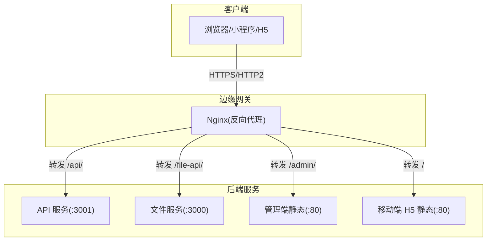
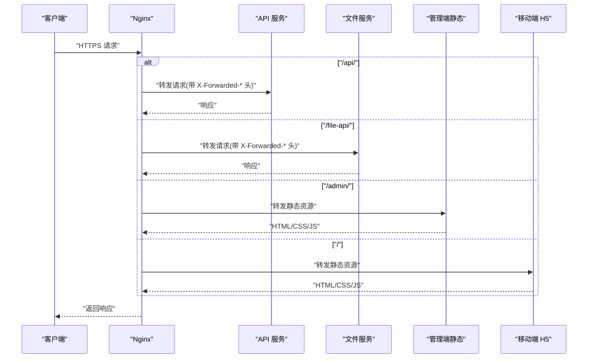
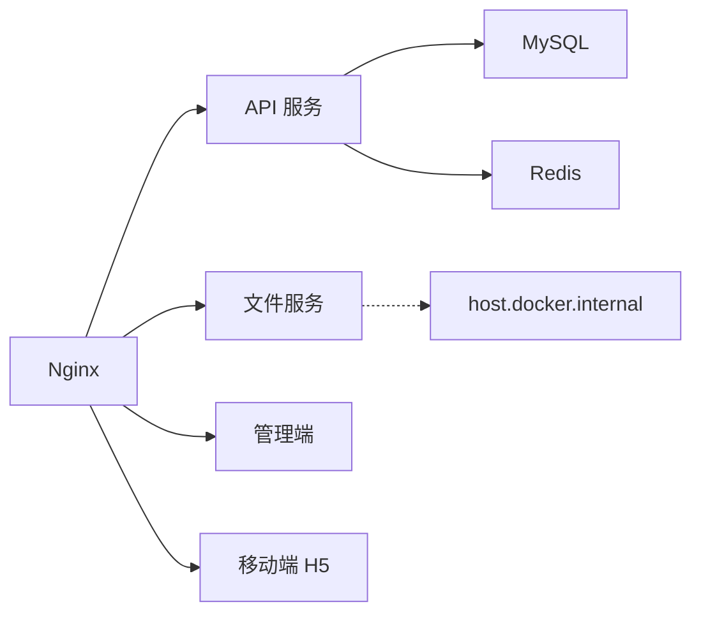

# Nginx 反向代理配置

<cite>
**本文引用的文件**
- [apps/admin/nginx.conf](file://apps/admin/nginx.conf)
- [apps/mobile/nginx.conf](file://apps/mobile/nginx.conf)
- [deploy/nginx/conf.d/default.conf](file://deploy/nginx/conf.d/default.conf)
- [deploy/nginx/templates/http-only.conf.tpl](file://deploy/nginx/templates/http-only.conf.tpl)
- [deploy/nginx/templates/https.conf.tpl](file://deploy/nginx/templates/https.conf.tpl)
- [scripts/check-production-health.sh](file://scripts/check-production-health.sh)
- [scripts/deploy-aliyun.sh](file://scripts/deploy-aliyun.sh)
- [docker-compose.yml](file://docker-compose.yml)
- [services/api/src/main.ts](file://services/api/src/main.ts)
- [apps/admin/Dockerfile](file://apps/admin/Dockerfile)
- [apps/mobile/Dockerfile](file://apps/mobile/Dockerfile)
- [services/api/Dockerfile](file://services/api/Dockerfile)
</cite>

## 目录
1. [简介](#简介)
2. [项目结构](#项目结构)
3. [核心组件](#核心组件)
4. [架构总览](#架构总览)
5. [详细组件分析](#详细组件分析)
6. [依赖关系分析](#依赖关系分析)
7. [性能考虑](#性能考虑)
8. [故障排查指南](#故障排查指南)
9. [结论](#结论)
10. [附录](#附录)

## 简介
本指南围绕 Nginx 反向代理在本项目的部署与配置展开，覆盖以下主题：
- 反向代理策略：API 请求转发、静态资源服务、跨域处理
- HTTPS 证书与 SSL/TLS 加密、HTTP/2 支持
- 负载均衡与健康检查集成
- 缓存策略与静态资源优化
- 多环境模板：开发、测试、生产差异化配置
- 性能优化与安全最佳实践
- 健康检查与故障排查流程

## 项目结构
本项目采用多容器编排，前端应用（移动端 H5、管理端）与后端 API 通过 Nginx 统一对外提供服务。Nginx 作为入口网关，负责：
- 将 /api/ 路由转发至 API 服务
- 将 /file-api/ 路由转发至文件服务（本地开发时指向 host.docker.internal）
- 将 /admin/ 路由转发至管理端静态站点
- 将根路径 / 转发至移动端 H5 静态站点
- 提供 HTTPS 与 HTTP/2，并配置证书与会话缓存

图表来源
- [deploy/nginx/conf.d/default.conf:1-62](file://deploy/nginx/conf.d/default.conf#L1-L62)
- [docker-compose.yml:147-166](file://docker-compose.yml#L147-L166)

章节来源
- [docker-compose.yml:147-166](file://docker-compose.yml#L147-L166)
- [deploy/nginx/conf.d/default.conf:1-62](file://deploy/nginx/conf.d/default.conf#L1-L62)

## 核心组件
- Nginx 入口配置：统一监听 80/443，重定向 HTTP 至 HTTPS，启用 HTTP/2，配置 SSL 证书与会话缓存
- API 路由转发：/api/ 路由转发到 API 服务，保留 Host、X-Real-IP、X-Forwarded-* 等头部
- 文件服务路由：/file-api/ 路由转发到文件服务，开发环境指向 host.docker.internal
- 管理端与移动端静态资源：/admin/ 与根路径 / 分别转发到对应静态站点
- 健康检查：提供生产环境健康检查脚本，验证各子系统可达性与 TLS 校验

章节来源
- [deploy/nginx/conf.d/default.conf:1-62](file://deploy/nginx/conf.d/default.conf#L1-L62)
- [scripts/check-production-health.sh:1-86](file://scripts/check-production-health.sh#L1-L86)

## 架构总览
下图展示从客户端到后端服务的请求路径与转发规则。

图表来源
- [deploy/nginx/conf.d/default.conf:19-60](file://deploy/nginx/conf.d/default.conf#L19-L60)
- [docker-compose.yml:147-166](file://docker-compose.yml#L147-L166)

## 详细组件分析

### Nginx 入口与 HTTPS/HTTP2
- 监听 80/443，80 端口将所有请求 301 重定向至 https://$host$request_uri
- 启用 ssl_protocols TLSv1.2/TLSv1.3，配置 ssl_session_cache 与 ssl_session_timeout
- 设置 client_max_body_size 以支持较大上传
- 启用 http2（listen 443 ssl http2）

章节来源
- [deploy/nginx/conf.d/default.conf:1-17](file://deploy/nginx/conf.d/default.conf#L1-L17)
- [deploy/nginx/templates/https.conf.tpl:1-17](file://deploy/nginx/templates/https.conf.tpl#L1-L17)

### API 请求转发（/api/）
- 使用 proxy_http_version 1.1 与标准代理头（Host、X-Real-IP、X-Forwarded-*）
- 代理目标为 api:3001，便于容器网络内部访问
- 通过全局前缀 /api/v1 由后端统一处理

章节来源
- [deploy/nginx/conf.d/default.conf:30-37](file://deploy/nginx/conf.d/default.conf#L30-L37)
- [services/api/src/main.ts:32-32](file://services/api/src/main.ts#L32-L32)

### 文件服务转发（/file-api/）
- 重写路径以去除 /file-api 前缀
- 代理目标在开发环境为 host.docker.internal:3000，在生产环境可替换为实际文件服务地址
- 设置 X-Forwarded-Prefix 以便后端识别原始前缀

章节来源
- [deploy/nginx/conf.d/default.conf:19-28](file://deploy/nginx/conf.d/default.conf#L19-L28)
- [deploy/nginx/templates/http-only.conf.tpl:7-16](file://deploy/nginx/templates/http-only.conf.tpl#L7-L16)
- [deploy/nginx/templates/https.conf.tpl:19-28](file://deploy/nginx/templates/https.conf.tpl#L19-L28)

### 管理端静态资源（/admin/）
- 重写 /admin 到 /admin/ 并去除前缀
- 代理到 admin:80，适配管理端容器的静态服务

章节来源
- [deploy/nginx/conf.d/default.conf:39-51](file://deploy/nginx/conf.d/default.conf#L39-L51)
- [apps/admin/Dockerfile:19-22](file://apps/admin/Dockerfile#L19-L22)

### 移动端 H5 静态资源（/）
- 代理到 mobile-h5:80，适配移动端 H5 容器的静态服务
- 前端构建产物由各自 Dockerfile 拷贝至 /usr/share/nginx/html

章节来源
- [deploy/nginx/conf.d/default.conf:53-60](file://deploy/nginx/conf.d/default.conf#L53-L60)
- [apps/mobile/Dockerfile:19-22](file://apps/mobile/Dockerfile#L19-L22)

### 跨域处理（CORS）
- API 服务在运行时根据环境变量动态配置 CORS，允许指定来源、凭证、方法与头部
- 生产环境要求 CORS 来源必须为 https 协议且非本地回环
- Nginx 不直接处理 CORS，由后端服务统一控制

章节来源
- [services/api/src/main.ts:12-59](file://services/api/src/main.ts#L12-L59)
- [services/api/src/common/production-config.validator.ts:167-201](file://services/api/src/common/production-config.validator.ts#L167-L201)

### 静态资源服务
- 管理端与移动端均使用 Nginx 提供静态资源服务，root 指向 /usr/share/nginx/html，index 为 index.html
- 通过 try_files $uri $uri/ /index.html 支持 SPA 路由

章节来源
- [apps/admin/nginx.conf:1-11](file://apps/admin/nginx.conf#L1-L11)
- [apps/mobile/nginx.conf:1-11](file://apps/mobile/nginx.conf#L1-L11)

### HTTPS 证书与 SSL/TLS
- 证书与私钥路径在配置中固定为 /etc/nginx/ssl/fullchain.pem 与 /etc/nginx/ssl/privkey.pem
- 证书挂载由 docker-compose 映射到 Nginx 容器
- 支持 TLSv1.2 与 TLSv1.3，启用 http2

章节来源
- [deploy/nginx/conf.d/default.conf:11-15](file://deploy/nginx/conf.d/default.conf#L11-L15)
- [docker-compose.yml:162-163](file://docker-compose.yml#L162-L163)

### 模板化配置与多环境
- 提供 http-only.conf.tpl 与 https.conf.tpl 两套模板，通过脚本渲染生成最终配置
- 支持通过环境变量切换是否启用 HTTPS，自动替换 server_name
- 阿里云部署脚本负责拉取代码、复制证书、渲染模板并启动容器

章节来源
- [deploy/nginx/templates/http-only.conf.tpl:1-49](file://deploy/nginx/templates/http-only.conf.tpl#L1-L49)
- [deploy/nginx/templates/https.conf.tpl:1-61](file://deploy/nginx/templates/https.conf.tpl#L1-L61)
- [scripts/deploy-aliyun.sh:88-98](file://scripts/deploy-aliyun.sh#L88-L98)

## 依赖关系分析
- Nginx 依赖于 API、管理端、移动端 H5 三个服务的可用性
- API 服务依赖 MySQL 与 Redis 的健康状态
- 文件服务在开发环境通过 extra_hosts 指向 host.docker.internal
- 健康检查脚本对 /api/v1/health、/file-api/api/health、/、/admin/ 进行探测

图表来源
- [docker-compose.yml:43-119](file://docker-compose.yml#L43-L119)
- [docker-compose.yml:147-166](file://docker-compose.yml#L147-L166)

章节来源
- [docker-compose.yml:43-119](file://docker-compose.yml#L43-L119)
- [docker-compose.yml:147-166](file://docker-compose.yml#L147-L166)

## 性能考虑
- 启用 HTTP/2：提升连接复用与多路复用性能
- 启用 ssl_session_cache 与 ssl_session_timeout：减少握手开销
- 使用 proxy_http_version 1.1 与 keepalive：降低上游连接压力
- 合理设置 client_max_body_size：避免过大上传导致内存压力
- 静态资源由 Nginx 直接提供，减少上游服务压力

章节来源
- [deploy/nginx/conf.d/default.conf:8-17](file://deploy/nginx/conf.d/default.conf#L8-L17)
- [deploy/nginx/templates/https.conf.tpl:8-17](file://deploy/nginx/templates/https.conf.tpl#L8-L17)

## 故障排查指南
- 健康检查脚本
  - 功能：对 API、文件服务、移动端 H5、管理端进行健康探测，校验 HTTP 状态码与 TLS 校验结果
  - 参数：可通过环境变量定制域名、超时、各子系统探测 URL
  - 使用：在 CI 或运维环境中执行脚本，快速定位服务异常

- 常见问题定位
  - 404/SPA 路由：确认 Nginx try_files 配置与前端路由模式一致
  - CORS 失败：检查 API 服务 CORS 配置与来源白名单，生产环境必须为 https
  - 证书错误：确认证书与私钥路径正确、权限可读、域名匹配
  - 上游不可达：检查容器网络、extra_hosts、服务健康状态

章节来源
- [scripts/check-production-health.sh:1-86](file://scripts/check-production-health.sh#L1-L86)
- [services/api/src/main.ts:12-59](file://services/api/src/main.ts#L12-L59)

## 结论
本项目的 Nginx 配置以“统一入口、清晰路由、强健安全”为核心原则，结合模板化配置与自动化部署脚本，实现了开发、测试、生产的平滑切换。配合健康检查与 CORS 策略，既保证了易用性，也兼顾了安全性与可维护性。

## 附录

### 环境变量与模板渲染
- 模板文件：http-only.conf.tpl 与 https.conf.tpl
- 渲染逻辑：将 __SERVER_NAME__ 替换为实际域名
- HTTPS 开关：通过 ENABLE_HTTPS 控制使用 http-only 或 https 模板

章节来源
- [deploy/nginx/templates/http-only.conf.tpl:1-49](file://deploy/nginx/templates/http-only.conf.tpl#L1-L49)
- [deploy/nginx/templates/https.conf.tpl:1-61](file://deploy/nginx/templates/https.conf.tpl#L1-L61)
- [scripts/deploy-aliyun.sh:88-98](file://scripts/deploy-aliyun.sh#L88-L98)

### 开发、测试、生产差异化配置要点
- 开发环境
  - 使用 http-only 模板或本地自签证书
  - 文件服务指向 host.docker.internal:3000
  - CORS 允许本地开发来源
- 测试环境
  - 使用自签或测试 CA 证书
  - 严格限制 CORS 来源
- 生产环境
  - 使用权威 CA 证书
  - 启用 HTTPS 模板，关闭明文 HTTP
  - 强制 https CORS 来源校验

章节来源
- [deploy/nginx/templates/https.conf.tpl:1-61](file://deploy/nginx/templates/https.conf.tpl#L1-L61)
- [services/api/src/main.ts:12-59](file://services/api/src/main.ts#L12-L59)