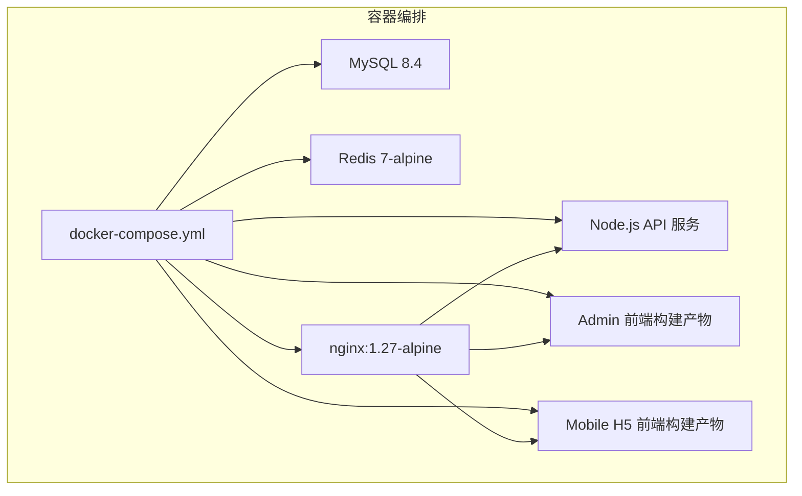
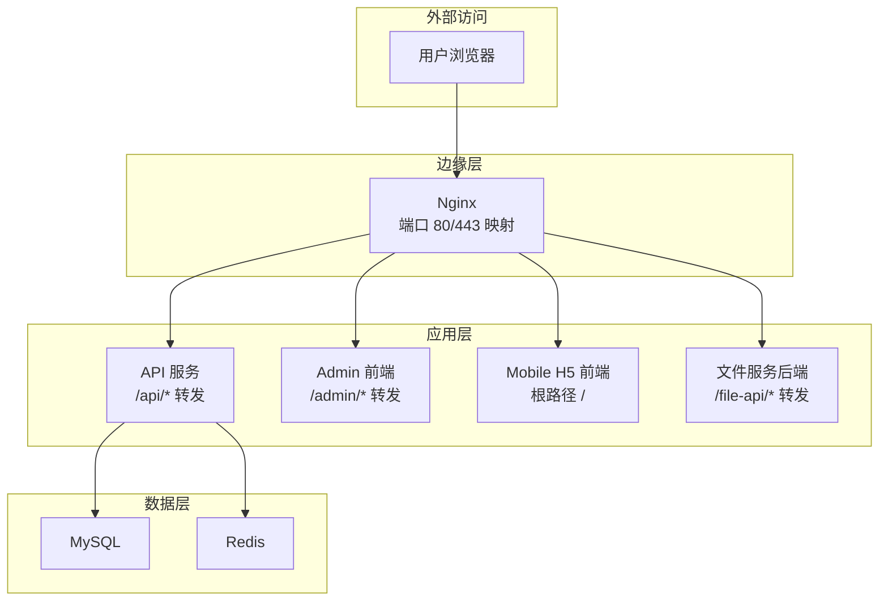
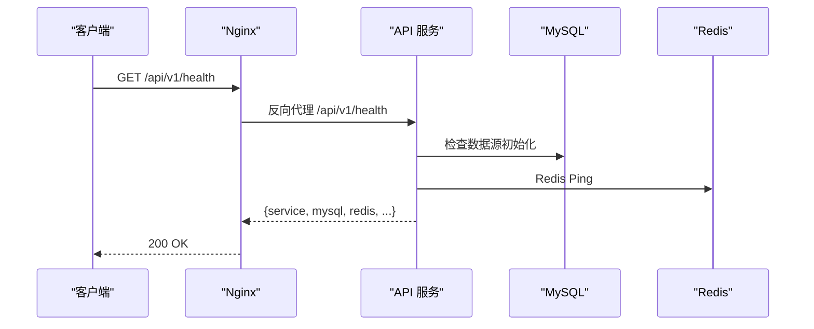
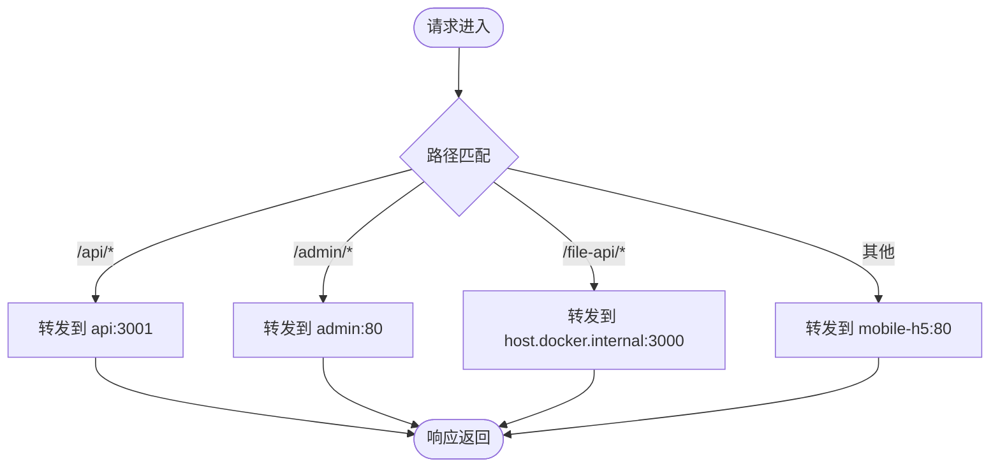
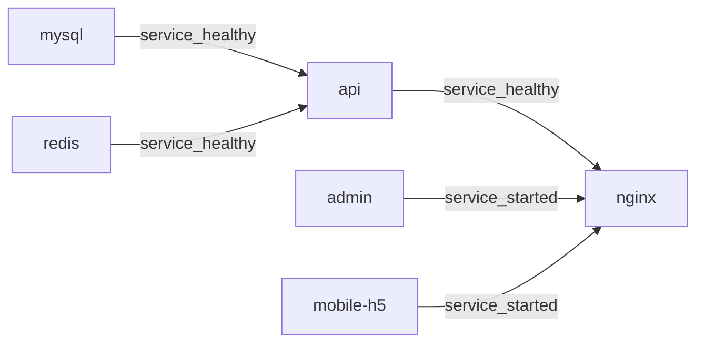

# 容器化部署

<cite>
**本文引用的文件**
- [docker-compose.yml](file://docker-compose.yml)
- [services/api/Dockerfile](file://services/api/Dockerfile)
- [apps/admin/Dockerfile](file://apps/admin/Dockerfile)
- [apps/mobile/Dockerfile](file://apps/mobile/Dockerfile)
- [deploy/nginx/conf.d/default.conf](file://deploy/nginx/conf.d/default.conf)
- [scripts/check-production-health.sh](file://scripts/check-production-health.sh)
- [scripts/deploy-aliyun.sh](file://scripts/deploy-aliyun.sh)
- [services/api/src/health/health.controller.ts](file://services/api/src/health/health.controller.ts)
- [services/api/src/common/production-config.validator.ts](file://services/api/src/common/production-config.validator.ts)
- [package.json](file://package.json)
</cite>

## 目录
1. [简介](#简介)
2. [项目结构](#项目结构)
3. [核心组件](#核心组件)
4. [架构总览](#架构总览)
5. [详细组件分析](#详细组件分析)
6. [依赖关系分析](#依赖关系分析)
7. [性能与可靠性考量](#性能与可靠性考量)
8. [故障排查指南](#故障排查指南)
9. [结论](#结论)
10. [附录：部署命令与环境变量](#附录：部署命令与环境变量)

## 简介
本指南面向 Fortune Hub 的容器化部署，基于 Docker Compose 实现服务编排，覆盖 MySQL、Redis、Nginx、API 服务、管理端（Admin）与移动端 H5（Mobile H5）六大组件。内容涵盖：
- 启动顺序与健康检查
- 环境变量与端口映射
- 容器间网络与数据卷
- 健康检查与生产校验
- 开发与生产差异化策略
- 常见问题与排障建议

## 项目结构
Fortune Hub 采用多服务单仓结构，容器化相关配置集中在根目录的 Compose 文件与各应用的 Dockerfile 中，Nginx 配置位于 deploy/nginx 下。

图表来源
- [docker-compose.yml:1-170](file://docker-compose.yml#L1-L170)

章节来源
- [docker-compose.yml:1-170](file://docker-compose.yml#L1-L170)

## 核心组件
- MySQL：持久化存储，字符集与排序规则配置，健康检查通过 mysqladmin ping 进行。
- Redis：键值缓存，开启 AOF 持久化，健康检查通过 redis-cli ping。
- API 服务：基于 NestJS 的后端服务，暴露健康接口，具备数据库与 Redis 健康状态返回。
- Admin：Vue 管理端前端，构建后由 Nginx 提供静态资源。
- Mobile H5：Vue 移动端 H5，构建后由 Nginx 提供静态资源。
- Nginx：反向代理与静态资源分发，统一入口，处理 HTTPS 重定向与路径转发。

章节来源
- [docker-compose.yml:1-170](file://docker-compose.yml#L1-L170)
- [services/api/src/health/health.controller.ts:1-28](file://services/api/src/health/health.controller.ts#L1-L28)

## 架构总览
下图展示容器间依赖与流量走向，体现 Compose 的启动顺序与 Nginx 的路由策略。

图表来源
- [deploy/nginx/conf.d/default.conf:1-62](file://deploy/nginx/conf.d/default.conf#L1-L62)
- [docker-compose.yml:147-166](file://docker-compose.yml#L147-L166)
- [docker-compose.yml:43-119](file://docker-compose.yml#L43-L119)

## 详细组件分析

### MySQL 组件
- 镜像与版本：mysql:8.4
- 关键配置
  - 字符集与排序规则：utf8mb4 与 utf8mb4_unicode_ci
  - 环境变量：根密码、数据库名、普通用户与密码
  - 端口映射：可绑定到本地 IP，默认 3306
  - 数据卷：/var/lib/mysql
  - 健康检查：通过 mysqladmin ping
- 启动顺序：API 服务依赖其健康状态
- 建议
  - 生产环境务必设置强密码，避免默认值
  - 使用独立备份策略与只读副本（如需）

章节来源
- [docker-compose.yml:2-24](file://docker-compose.yml#L2-L24)

### Redis 组件
- 镜像与版本：redis:7-alpine
- 关键配置
  - 命令：启用 AOF 持久化
  - 端口映射：可绑定到本地 IP，默认 6379
  - 数据卷：/data
  - 健康检查：redis-cli ping
- 启动顺序：API 服务依赖其健康状态
- 建议
  - 生产环境建议开启 RDB 或混合持久化
  - 配置内存上限与淘汰策略

章节来源
- [docker-compose.yml:25-42](file://docker-compose.yml#L25-L42)

### API 服务组件
- 构建方式：多阶段构建，先安装依赖与构建，再运行时仅拷贝必要文件
- 关键配置
  - 环境变量：NODE_ENV、PORT、数据库连接参数、Redis 连接参数、CORS、微信、短信、支付等
  - 健康检查：调用 /api/v1/health，期望响应包含服务标识
  - 网络：通过 extra_hosts 访问 host.docker.internal
- 启动顺序：依赖 MySQL 与 Redis 健康；Nginx 依赖其健康
- 健康检查实现：返回 MySQL 初始化状态与 Redis Ping 结果

图表来源
- [services/api/src/health/health.controller.ts:6-27](file://services/api/src/health/health.controller.ts#L6-L27)
- [deploy/nginx/conf.d/default.conf:30-37](file://deploy/nginx/conf.d/default.conf#L30-L37)
- [docker-compose.yml:110-119](file://docker-compose.yml#L110-L119)

章节来源
- [services/api/Dockerfile:1-30](file://services/api/Dockerfile#L1-L30)
- [docker-compose.yml:43-119](file://docker-compose.yml#L43-L119)
- [services/api/src/health/health.controller.ts:1-28](file://services/api/src/health/health.controller.ts#L1-L28)

### Admin 前端组件
- 构建方式：多阶段构建，使用 Vite 打包，Nginx 提供静态资源
- 关键配置
  - 构建参数：VITE_API_BASE_URL、VITE_PUBLIC_BASE、VITE_FILE_SERVICE_BASE_URL
  - 运行：Nginx 默认监听 80
- 访问路径：/admin/

章节来源
- [apps/admin/Dockerfile:1-22](file://apps/admin/Dockerfile#L1-L22)
- [docker-compose.yml:121-133](file://docker-compose.yml#L121-L133)

### Mobile H5 前端组件
- 构建方式：多阶段构建，H5 平台打包，Nginx 提供静态资源
- 关键配置
  - 构建参数：VITE_API_BASE_URL、VITE_FILE_SERVICE_BASE_URL、VITE_PAYMENT_MODE
  - 运行：Nginx 默认监听 80
- 访问路径：根路径 /

章节来源
- [apps/mobile/Dockerfile:1-22](file://apps/mobile/Dockerfile#L1-L22)
- [docker-compose.yml:134-145](file://docker-compose.yml#L134-L145)

### Nginx 组件
- 镜像与版本：nginx:1.27-alpine
- 关键配置
  - 端口映射：HTTP 8080 → 80，HTTPS 8443 → 443（可按需调整）
  - 卷挂载：conf.d/default.conf、deploy/nginx/ssl
  - 依赖：在 API 健康后启动；Admin/Mobile 在 Started 后启动
  - 路由规则：
    - /api/ → 转发至 api:3001
    - /admin/ → 转发至 admin:80
    - /file-api/ → 转发至 host.docker.internal:3000（文件服务）
    - 根路径 / → 转发至 mobile-h5:80
- 建议
  - 生产环境建议启用 HTTPS 并配置证书
  - 如需内网访问，可将绑定地址改为 0.0.0.0

图表来源
- [deploy/nginx/conf.d/default.conf:19-61](file://deploy/nginx/conf.d/default.conf#L19-L61)
- [docker-compose.yml:147-166](file://docker-compose.yml#L147-L166)

章节来源
- [deploy/nginx/conf.d/default.conf:1-62](file://deploy/nginx/conf.d/default.conf#L1-L62)
- [docker-compose.yml:147-166](file://docker-compose.yml#L147-L166)

## 依赖关系分析
- 启动顺序
  - MySQL 与 Redis 先于 API 启动且必须健康
  - Nginx 在 API 健康后启动，同时等待 Admin/Mobile 构建产物可用
- 网络通信
  - API 通过服务名访问 MySQL/Redis
  - Nginx 通过服务名访问 API/Admin/Mobile
  - Admin/Mobile 通过 /api/v1 访问 API
- 数据卷
  - MySQL 与 Redis 分别挂载持久化卷，避免重启丢失数据

图表来源
- [docker-compose.yml:49-53](file://docker-compose.yml#L49-L53)
- [docker-compose.yml:151-157](file://docker-compose.yml#L151-L157)

章节来源
- [docker-compose.yml:49-53](file://docker-compose.yml#L49-L53)
- [docker-compose.yml:151-157](file://docker-compose.yml#L151-L157)

## 性能与可靠性考量
- 健康检查
  - MySQL/Redis：定期 ping，失败重试，确保依赖可用
  - API：自检接口返回数据库与缓存状态，便于快速定位
- 资源与镜像
  - 使用 alpine 版本以减小镜像体积
  - Node 22 基础镜像，字体支持用于海报渲染
- 网络与安全
  - Nginx 处理 TLS 与 HTTPS 重定向
  - CORS 与 HTTPS 基础地址需在生产环境严格配置
- 生产校验
  - API 启动时对关键配置进行生产校验，禁止弱口令与测试模式

章节来源
- [docker-compose.yml:18-23](file://docker-compose.yml#L18-L23)
- [docker-compose.yml:37-42](file://docker-compose.yml#L37-L42)
- [docker-compose.yml:110-119](file://docker-compose.yml#L110-L119)
- [services/api/src/common/production-config.validator.ts:25-104](file://services/api/src/common/production-config.validator.ts#L25-L104)

## 故障排查指南
- 健康检查脚本
  - 提供生产环境健康探测，验证 API、文件服务、移动端与管理端可达性与状态码
- 常见问题
  - API 无法访问：检查 Nginx 路由与 API 健康检查；确认 /api/v1/health 返回
  - 数据库连接失败：核对环境变量中的主机、端口、用户名与密码
  - Redis 连接失败：确认 Redis 健康检查与网络连通
  - 管理端或移动端白屏：确认 Admin/Mobile 构建产物存在，Nginx 转发路径正确
  - HTTPS 证书：确认证书与私钥挂载路径与权限
- 排障步骤建议
  - 查看容器日志：docker compose logs -f --tail=200
  - 使用健康脚本一键探测：npm run health:prod
  - 临时关闭健康检查验证服务可用性（不推荐长期使用）

章节来源
- [scripts/check-production-health.sh:1-86](file://scripts/check-production-health.sh#L1-L86)
- [scripts/deploy-aliyun.sh:131-134](file://scripts/deploy-aliyun.sh#L131-L134)

## 结论
本方案通过 Compose 将 Fortune Hub 的核心能力容器化，借助 Nginx 统一入口与路由，配合 MySQL/Redis 的健康检查与持久化卷，形成可扩展、可观测的部署基线。生产环境建议严格配置 HTTPS、强口令与安全的 CORS 来源，并通过健康脚本与生产校验保障上线质量。

## 附录：部署命令与环境变量

### 部署命令
- 本地开发/调试
  - 启动：npm run docker:up
  - 停止：npm run docker:down
- 生产部署（阿里云脚本）
  - 渲染 Nginx 配置：bash scripts/deploy-aliyun.sh render-nginx
  - 拉取代码并部署：bash scripts/deploy-aliyun.sh pull-and-deploy
  - 查看状态：bash scripts/deploy-aliyun.sh status
  - 查看日志：bash scripts/deploy-aliyun.sh logs
  - 重启：bash scripts/deploy-aliyun.sh restart
  - 停止：bash scripts/deploy-aliyun.sh down

章节来源
- [package.json:18-20](file://package.json#L18-L20)
- [scripts/deploy-aliyun.sh:136-150](file://scripts/deploy-aliyun.sh#L136-L150)

### 环境变量清单（按模块）
- MySQL
  - MYSQL_ROOT_PASSWORD：必填，根密码
  - MYSQL_DATABASE：可选，默认 fortune_hub
  - MYSQL_USER：可选，默认 fortune
  - MYSQL_PASSWORD：必填，普通用户密码
  - MYSQL_BIND_HOST：可选，默认 127.0.0.1
  - MYSQL_PORT：可选，默认 3306
- Redis
  - REDIS_BIND_HOST：可选，默认 127.0.0.1
  - REDIS_PORT：可选，默认 6379
- API 服务
  - NODE_ENV：production
  - PORT：可选，默认 3001
  - DB_SYNCHRONIZE：可选，默认 false（生产禁止 true）
  - DB_RUN_MIGRATIONS：可选，默认 true
  - MYSQL_HOST/MYSQL_PORT/MYSQL_DATABASE/MYSQL_USER/MYSQL_PASSWORD：与 MySQL 对应
  - REDIS_HOST/REDIS_PORT：与 Redis 对应
  - ADMIN_USERNAME/ADMIN_PASSWORD/ADMIN_DISPLAY_NAME：管理端登录凭据
  - FILE_SERVICE_BASE_URL/PUBLIC_API_BASE_URL/CORS_ORIGIN：文件服务与跨域
  - 支付与微信相关：WECHAT_*、PAYMENT_MODE、PAYMENT_MOCK_ENABLED
  - 短信相关：SMS_PROVIDER、SMS_MOCK_ENABLED、SMS_MOCK_CODE、SMS_CODE_PEPPER、ALIBABA_CLOUD_*、ALIYUN_*、ALIYUN_SMS_* 等
  - 海报与大模型：ZHIPU_*、BIGMODEL_API_KEY、海报尺寸等
- Admin 前端
  - VITE_PUBLIC_BASE：/admin/
  - VITE_API_BASE_URL：/api/v1
  - VITE_FILE_SERVICE_BASE_URL：可选
- Mobile H5 前端
  - VITE_API_BASE_URL：/api/v1
  - VITE_FILE_SERVICE_BASE_URL：可选
  - VITE_PAYMENT_MODE：可选
- Nginx
  - NGINX_BIND_HOST：可选，默认 0.0.0.0
  - NGINX_HTTP_PORT/NGINX_HTTPS_PORT：可选，默认 8080/8443
  - 证书：fullchain.pem、privkey.pem（挂载路径固定）

章节来源
- [docker-compose.yml:9-166](file://docker-compose.yml#L9-L166)

### 开发与生产差异化策略
- 开发环境
  - 绑定本地回环地址，便于本机调试
  - 可使用弱密码与 mock 功能辅助联调
  - 禁用生产校验或允许弱口令（仅本地）
- 生产环境
  - 强制 HTTPS 与安全的 CORS 来源
  - 禁止 DB_SYNCHRONIZE=true，使用迁移脚本
  - 禁止 mock 支付与短信，配置真实密钥
  - 使用阿里云脚本自动渲染 Nginx 配置与证书

章节来源
- [scripts/deploy-aliyun.sh:49-61](file://scripts/deploy-aliyun.sh#L49-L61)
- [services/api/src/common/production-config.validator.ts:25-104](file://services/api/src/common/production-config.validator.ts#L25-L104)