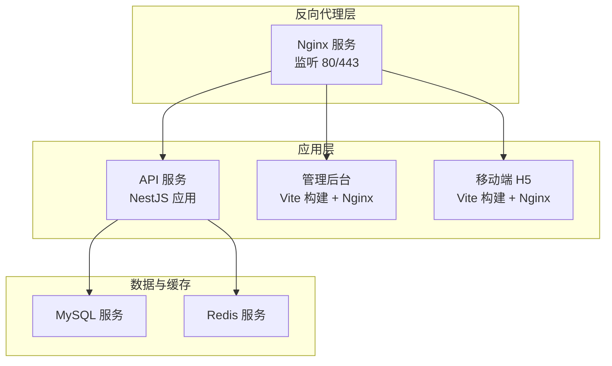
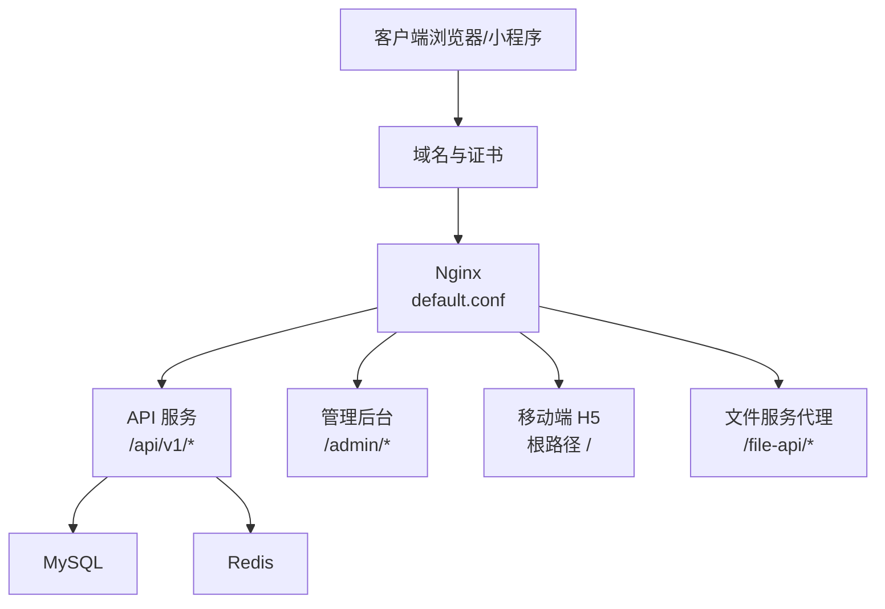
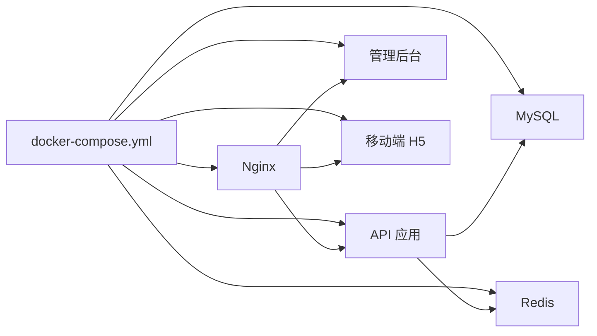

# 生产环境部署

<cite>
**本文引用的文件**
- [scripts/deploy-aliyun.sh](file://scripts/deploy-aliyun.sh)
- [scripts/check-production-health.sh](file://scripts/check-production-health.sh)
- [docker-compose.yml](file://docker-compose.yml)
- [services/api/src/app.module.ts](file://services/api/src/app.module.ts)
- [services/api/src/main.ts](file://services/api/src/main.ts)
- [services/api/src/health/health.controller.ts](file://services/api/src/health/health.controller.ts)
- [services/api/src/common/production-config.validator.ts](file://services/api/src/common/production-config.validator.ts)
- [services/api/src/database/data-source.ts](file://services/api/src/database/data-source.ts)
- [services/api/src/database/migrations/1761262800000-ContentOpsFoundation.ts](file://services/api/src/database/migrations/1761262800000-ContentOpsFoundation.ts)
- [services/api/Dockerfile](file://services/api/Dockerfile)
- [apps/admin/Dockerfile](file://apps/admin/Dockerfile)
- [apps/mobile/Dockerfile](file://apps/mobile/Dockerfile)
- [deploy/nginx/templates/https.conf.tpl](file://deploy/nginx/templates/https.conf.tpl)
- [deploy/nginx/templates/http-only.conf.tpl](file://deploy/nginx/templates/http-only.conf.tpl)
</cite>

## 目录
1. [简介](#简介)
2. [项目结构](#项目结构)
3. [核心组件](#核心组件)
4. [架构总览](#架构总览)
5. [详细组件分析](#详细组件分析)
6. [依赖关系分析](#依赖关系分析)
7. [性能与可用性考量](#性能与可用性考量)
8. [故障排查指南](#故障排查指南)
9. [结论](#结论)
10. [附录](#附录)

## 简介
本指南面向 Fortune Hub 的生产环境部署，覆盖服务器准备、环境变量配置、数据库初始化、文件服务集成、自动化部署脚本使用、健康检查脚本监控、安全配置、部署后验证、回滚策略与运维流程。目标是帮助运维与开发团队以最小风险完成上线与持续运营。

## 项目结构
项目采用多模块工作区，包含后端 API（NestJS）、移动端 H5、管理后台、Nginx 反向代理与数据库/缓存等基础设施，通过 docker-compose 统一编排。

图表来源
- [docker-compose.yml:1-170](file://docker-compose.yml#L1-L170)

章节来源
- [docker-compose.yml:1-170](file://docker-compose.yml#L1-L170)

## 核心组件
- 反向代理与入口：Nginx 负责域名分发、TLS 终止、静态资源与 API 代理。
- API 服务：提供健康检查、业务接口、数据库与 Redis 连接、CORS 与校验管道。
- 数据库与缓存：MySQL 8.4 + Redis 7，均配置健康检查。
- 文件服务：通过 Nginx 将 /file-api 请求转发至文件服务端口，实现静态资源与上传文件的统一入口。
- 自动化部署：基于 Bash 脚本与 docker-compose 的一键部署、渲染 Nginx 配置、查看状态与日志。
- 健康检查：内置健康端点与独立探针脚本，覆盖 API、文件服务、移动端与管理端。

章节来源
- [docker-compose.yml:1-170](file://docker-compose.yml#L1-L170)
- [services/api/src/health/health.controller.ts:1-28](file://services/api/src/health/health.controller.ts#L1-L28)
- [scripts/check-production-health.sh:1-86](file://scripts/check-production-health.sh#L1-L86)

## 架构总览
生产环境采用“Nginx 入口 + 多容器服务”的架构。Nginx 根据路径将请求路由到 API、管理后台或移动端；API 服务负责业务逻辑，并与 MySQL 和 Redis 交互；文件服务通过 Nginx 的 /file-api 路由进行代理。

图表来源
- [docker-compose.yml:147-166](file://docker-compose.yml#L147-L166)
- [deploy/nginx/templates/https.conf.tpl:1-62](file://deploy/nginx/templates/https.conf.tpl#L1-L62)
- [deploy/nginx/templates/http-only.conf.tpl:1-50](file://deploy/nginx/templates/http-only.conf.tpl#L1-L50)

## 详细组件分析

### 自动化部署脚本（阿里云）
该脚本提供一键部署能力，支持拉取代码、渲染 Nginx 配置、准备证书、启动/重启/停止容器与查看状态/日志。

- 功能要点
  - 加载环境变量文件（默认 .env.aliyun），并进行生产安全校验（禁止使用弱密码、禁止 mock 配置）。
  - 渲染 Nginx 配置（HTTP 或 HTTPS 模板），支持从本地拷贝证书到容器内。
  - 使用 docker-compose 基于环境文件启动/重启/停止服务。
  - 提供 status/logs/restart/down 等子命令辅助运维。

- 关键参数与环境变量
  - ENV_FILE：环境文件路径，默认 .env.aliyun。
  - APP_DOMAIN：站点域名。
  - ENABLE_HTTPS：是否启用 HTTPS。
  - SSL_CERT_SOURCE/SSL_KEY_SOURCE：证书与私钥来源路径。
  - DEPLOY_BRANCH：部署分支。
  - DB_SYNCHRONIZE：生产禁止开启。
  - MYSQL_ROOT_PASSWORD/MYSQL_PASSWORD/ADMIN_USERNAME/ADMIN_PASSWORD：强口令要求。
  - SMS_PROVIDER/SMS_MOCK_ENABLED/PAYMENT_MODE：生产禁止 mock。

- 子命令
  - deploy：加载环境 → 校验 → 准备证书 → 渲染 Nginx → 启动。
  - pull-and-deploy：先拉取代码再执行 deploy。
  - render-nginx：仅渲染 Nginx 配置。
  - status/logs/restart/down：查询状态、查看日志、重启、停止。

章节来源
- [scripts/deploy-aliyun.sh:1-199](file://scripts/deploy-aliyun.sh#L1-L199)

### 健康检查脚本
独立的健康检查脚本对 API、文件服务、移动端 H5 与管理后台进行探测，包含 HTTP 状态码、TLS 校验与响应体关键字校验。

- 探测项
  - API 健康端点：/api/v1/health，期望返回包含特定标识的 200 响应。
  - 文件服务健康端点：/file-api/api/health，期望 200。
  - 移动端 H5 与管理后台首页：/ 与 /admin/，期望 200。
- 关键参数
  - APP_DOMAIN、PUBLIC_ORIGIN、API_HEALTH_URL、FILE_HEALTH_URL、MOBILE_URL、ADMIN_URL、CURL_TIMEOUT。
- 输出
  - 成功时打印各项指标（HTTP 状态、SSL 校验结果、总耗时）；失败时输出错误并退出非零。

章节来源
- [scripts/check-production-health.sh:1-86](file://scripts/check-production-health.sh#L1-L86)

### API 服务与生产配置校验
- 生产配置校验器在应用启动时强制执行，确保生产环境不使用弱口令、禁用 DB 同步、禁用 mock 支付与短信等。
- CORS 与全局中间件：设置全局前缀、异常过滤器、拦截器与校验管道；CORS 在生产环境下严格限制来源。
- 健康控制器：返回 MySQL 初始化状态、Redis Ping 结果、文件服务基础地址与时间戳。

章节来源
- [services/api/src/common/production-config.validator.ts:1-216](file://services/api/src/common/production-config.validator.ts#L1-L216)
- [services/api/src/app.module.ts:56-117](file://services/api/src/app.module.ts#L56-L117)
- [services/api/src/main.ts:8-62](file://services/api/src/main.ts#L8-L62)
- [services/api/src/health/health.controller.ts:1-28](file://services/api/src/health/health.controller.ts#L1-L28)

### 数据库初始化与迁移
- 数据源配置：关闭同步，启用迁移运行；迁移目录指向 dist/database/migrations。
- 迁移示例：内容运营基础迁移，包含 lucky_items、configs、report_templates 表及若干索引与生命周期字段。
- 建议
  - 生产环境必须通过迁移变更结构，不得使用 DB_SYNCHRONIZE=true。
  - 部署前确认迁移已执行且成功。

章节来源
- [services/api/src/database/data-source.ts:32-72](file://services/api/src/database/data-source.ts#L32-L72)
- [services/api/src/database/migrations/1761262800000-ContentOpsFoundation.ts:1-320](file://services/api/src/database/migrations/1761262800000-ContentOpsFoundation.ts#L1-L320)
- [docker-compose.yml:57-58](file://docker-compose.yml#L57-L58)

### 文件服务集成
- Nginx 模板将 /file-api 前缀请求转发至文件服务端口（host.docker.internal:3000），并设置必要的头部。
- API 层通过工具函数处理文件服务 URL 与代理路径，保证对外暴露的文件链接一致。

章节来源
- [deploy/nginx/templates/https.conf.tpl:19-28](file://deploy/nginx/templates/https.conf.tpl#L19-L28)
- [deploy/nginx/templates/http-only.conf.tpl:7-16](file://deploy/nginx/templates/http-only.conf.tpl#L7-L16)
- [services/api/src/posters/posters.service.ts:12-16](file://services/api/src/posters/posters.service.ts#L12-L16)

### 容器镜像与构建
- API 服务：基于 Alpine 的 Node 22，安装中文字体，构建后以生产模式运行。
- 管理后台与移动端：基于 Alpine 的 Node 22 构建前端产物，使用 Nginx 提供静态服务。

章节来源
- [services/api/Dockerfile:1-30](file://services/api/Dockerfile#L1-L30)
- [apps/admin/Dockerfile:1-22](file://apps/admin/Dockerfile#L1-L22)
- [apps/mobile/Dockerfile:1-22](file://apps/mobile/Dockerfile#L1-L22)

## 依赖关系分析

图表来源
- [docker-compose.yml:1-170](file://docker-compose.yml#L1-L170)

章节来源
- [docker-compose.yml:1-170](file://docker-compose.yml#L1-L170)

## 性能与可用性考量
- 健康检查
  - MySQL/Redis：健康检查间隔与超时已配置，建议结合外部探针与告警联动。
  - API：健康端点返回数据库与缓存状态，便于快速定位问题。
- Nginx
  - 启用 HTTP/2、合理设置 client_max_body_size，避免大文件上传失败。
  - HTTPS 模板中配置了会话缓存与协议版本，建议结合证书链完整性与 OCSP Stapling。
- CORS 与安全头
  - 生产环境严格限制 CORS 来源，避免跨域风险。
- 日志与可观测性
  - 建议启用 Nginx 访问日志与 API 错误日志聚合，结合容器日志收集与告警。

[本节为通用指导，无需列出具体文件来源]

## 故障排查指南

### 健康检查失败
- 使用独立探针脚本快速定位：检查 API、文件服务、移动端与管理端的 HTTP 状态、TLS 校验与响应体。
- 若探针失败，优先检查 Nginx 是否正确渲染（域名、证书、模板选择）与容器是否健康。

章节来源
- [scripts/check-production-health.sh:1-86](file://scripts/check-production-health.sh#L1-L86)

### 生产配置校验失败
- 校验器会拒绝弱口令、DB 同步开启、mock 支付/短信等配置。请修正 .env.aliyun 并重新部署。

章节来源
- [services/api/src/common/production-config.validator.ts:25-104](file://services/api/src/common/production-config.validator.ts#L25-L104)

### 数据库连接问题
- 确认 MySQL/Redis 健康检查通过；检查 API 的数据库连接参数与网络连通性。
- 如需结构变更，使用迁移而非 DB_SYNCHRONIZE。

章节来源
- [docker-compose.yml:18-42](file://docker-compose.yml#L18-L42)
- [services/api/src/database/data-source.ts:32-72](file://services/api/src/database/data-source.ts#L32-L72)

### Nginx 配置问题
- 确认 APP_DOMAIN 已正确渲染到 default.conf；若启用 HTTPS，需提供证书与私钥。
- 检查 /file-api 代理路径与文件服务端口映射。

章节来源
- [scripts/deploy-aliyun.sh:68-98](file://scripts/deploy-aliyun.sh#L68-L98)
- [deploy/nginx/templates/https.conf.tpl:1-62](file://deploy/nginx/templates/https.conf.tpl#L1-L62)
- [deploy/nginx/templates/http-only.conf.tpl:1-50](file://deploy/nginx/templates/http-only.conf.tpl#L1-L50)

### 容器状态与日志
- 使用 status 查看各服务状态；使用 logs 实时追踪错误。
- 使用 restart 快速重启单个服务；down 用于停机维护。

章节来源
- [scripts/deploy-aliyun.sh:152-196](file://scripts/deploy-aliyun.sh#L152-L196)

## 结论
通过本指南，您可以在生产环境中以自动化脚本与容器编排的方式完成部署与运维。务必遵循生产安全配置、禁用 mock、使用迁移与健康检查机制，确保系统稳定与安全。

[本节为总结性内容，无需列出具体文件来源]

## 附录

### 部署流程清单（生产）
- 服务器准备
  - 安装 Docker 与 docker-compose，开放必要端口（80/443/3306/6379 等）。
  - 准备域名解析与证书（如需 HTTPS）。
- 环境变量配置
  - 准备 .env.aliyun，填写强口令与业务密钥，禁用 mock。
- 数据库初始化
  - 确保 MySQL/Redis 健康；执行迁移，不使用 DB_SYNCHRONIZE。
- 文件服务集成
  - 配置 Nginx /file-api 代理，确保文件服务可达。
- 自动化部署
  - 执行部署脚本，渲染 Nginx 配置并启动容器。
- 健康检查
  - 使用探针脚本验证 API、文件服务、移动端与管理端。
- 回滚策略
  - 保留上一版本镜像与配置；回滚时切换到上一版本并回滚迁移。
- 维护流程
  - 定期巡检健康检查、日志与告警；按需扩容与更新证书。

章节来源
- [scripts/deploy-aliyun.sh:152-196](file://scripts/deploy-aliyun.sh#L152-L196)
- [scripts/check-production-health.sh:74-83](file://scripts/check-production-health.sh#L74-L83)
- [services/api/src/common/production-config.validator.ts:46-101](file://services/api/src/common/production-config.validator.ts#L46-L101)