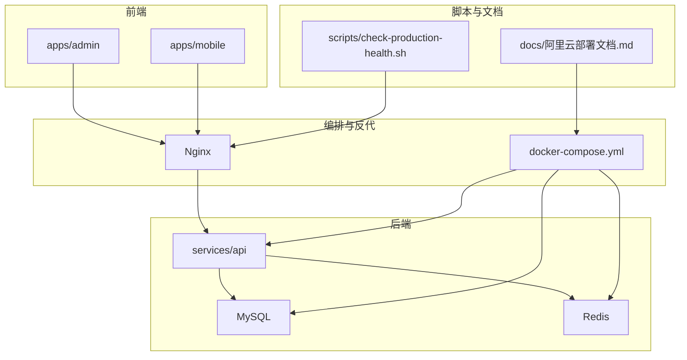
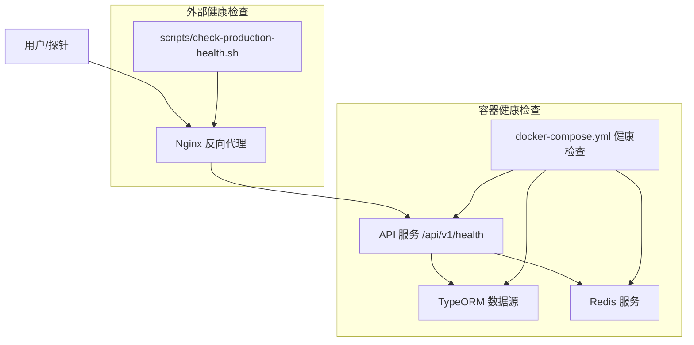
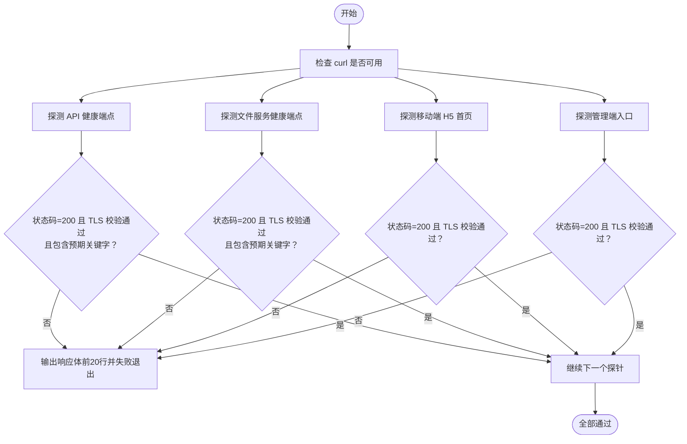
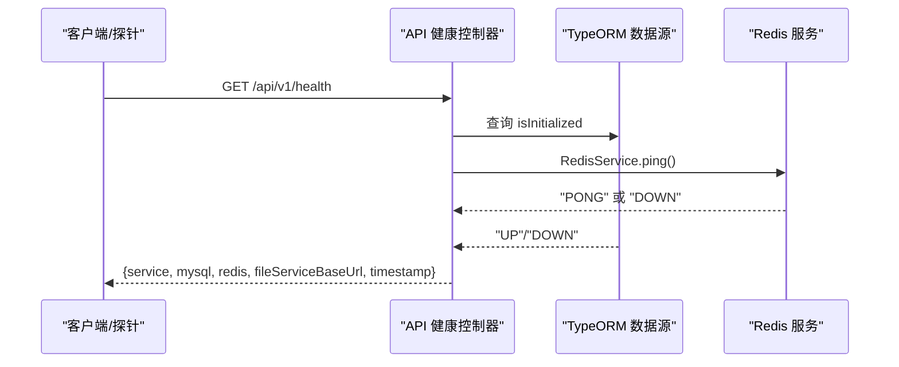
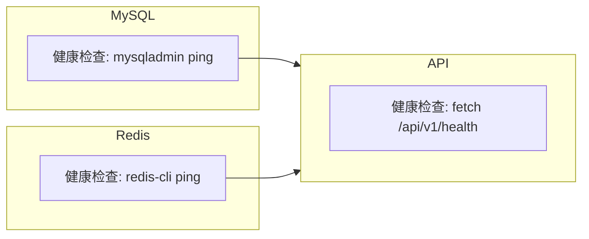
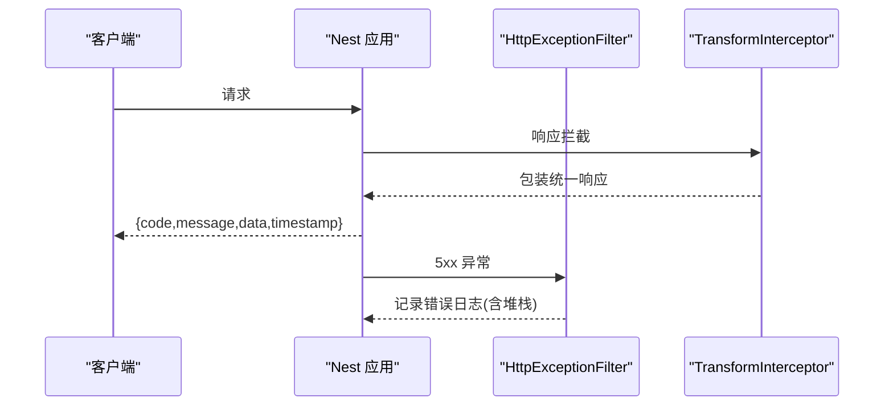
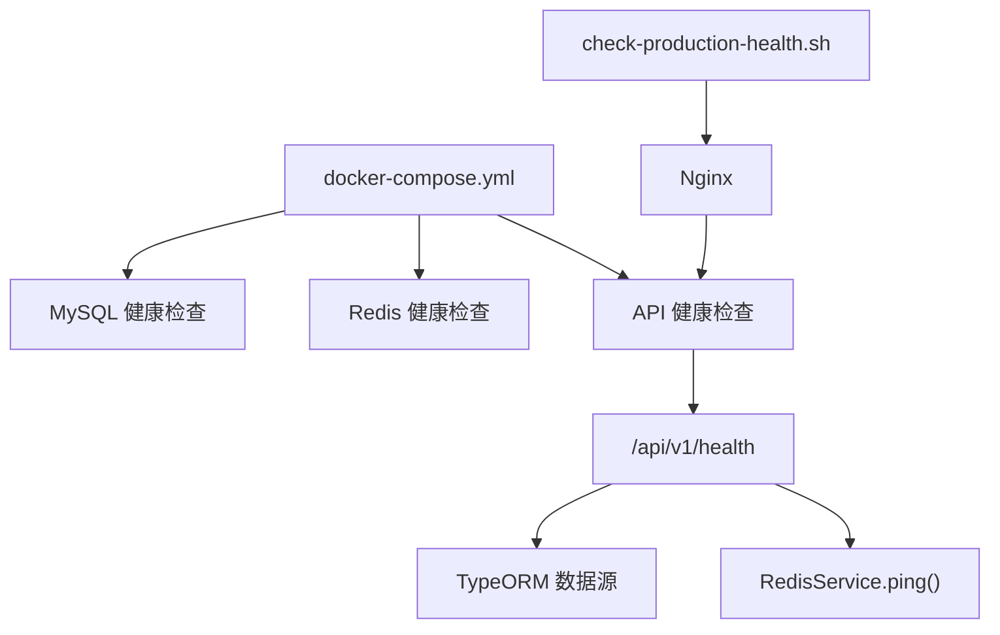

# 监控告警

<cite>
**本文引用的文件**
- [scripts/check-production-health.sh](file://scripts/check-production-health.sh)
- [services/api/src/health/health.controller.ts](file://services/api/src/health/health.controller.ts)
- [docker-compose.yml](file://docker-compose.yml)
- [services/api/src/redis/redis.service.ts](file://services/api/src/redis/redis.service.ts)
- [services/api/src/database/data-source.ts](file://services/api/src/database/data-source.ts)
- [services/api/src/main.ts](file://services/api/src/main.ts)
- [services/api/src/common/filters/http-exception.filter.ts](file://services/api/src/common/filters/http-exception.filter.ts)
- [services/api/src/common/interceptors/transform.interceptor.ts](file://services/api/src/common/interceptors/transform.interceptor.ts)
- [docs/阿里云部署文档.md](file://docs/阿里云部署文档.md)
- [README.md](file://README.md)
- [package.json](file://package.json)
</cite>

## 目录
1. [简介](#简介)
2. [项目结构](#项目结构)
3. [核心组件](#核心组件)
4. [架构总览](#架构总览)
5. [组件详解](#组件详解)
6. [依赖关系分析](#依赖关系分析)
7. [性能考量](#性能考量)
8. [故障排查指南](#故障排查指南)
9. [结论](#结论)
10. [附录](#附录)

## 简介
本指南面向 Fortune Hub 的监控与告警落地，基于仓库现有健康检查脚本、容器健康检查配置、API 健康端点与数据库/缓存连接状态，系统性阐述服务可用性检测、数据库连接检查、API 响应验证、容器健康检查、监控指标采集、告警规则与通知、日志与错误追踪、性能瓶颈识别与解决思路，以及监控仪表板与工具集成建议。目标是帮助运维与开发团队快速建立一套可观察、可预警、可回溯的生产级监控体系。

## 项目结构
Fortune Hub 采用多包（monorepo）结构，前端应用（admin、mobile）与后端 API 服务（NestJS + TypeORM + MySQL + Redis）位于 apps 与 services 目录；部署与反向代理通过 docker-compose 编排；健康检查脚本位于 scripts 目录；阿里云部署文档位于 docs 目录。

图表来源
- [docker-compose.yml:1-170](file://docker-compose.yml#L1-L170)
- [README.md:18-37](file://README.md#L18-L37)

章节来源
- [README.md:18-37](file://README.md#L18-L37)
- [docker-compose.yml:1-170](file://docker-compose.yml#L1-L170)

## 核心组件
- 健康检查脚本：对 API、文件服务、移动端 H5、管理端进行 HTTPS 健康探测，校验状态码、TLS 校验与响应体关键字。
- API 健康端点：返回服务名、数据库初始化状态、Redis Ping 结果、文件服务基地址与时间戳。
- 容器健康检查：MySQL、Redis、API 服务均配置了健康检查，确保依赖可用后再启动上游服务。
- 日志与错误过滤：统一异常过滤器与响应拦截器，便于集中记录与可观测。
- 部署与编排：docker-compose 编排 + Nginx 反向代理，提供 HTTPS 入口与路由转发。

章节来源
- [scripts/check-production-health.sh:1-86](file://scripts/check-production-health.sh#L1-86)
- [services/api/src/health/health.controller.ts:1-28](file://services/api/src/health/health.controller.ts#L1-L28)
- [docker-compose.yml:18-23](file://docker-compose.yml#L18-L23)
- [docker-compose.yml:37-42](file://docker-compose.yml#L37-L42)
- [docker-compose.yml:110-119](file://docker-compose.yml#L110-L119)
- [services/api/src/common/filters/http-exception.filter.ts:1-92](file://services/api/src/common/filters/http-exception.filter.ts#L1-L92)
- [services/api/src/common/interceptors/transform.interceptor.ts:1-59](file://services/api/src/common/interceptors/transform.interceptor.ts#L1-L59)

## 架构总览
下图展示生产环境的健康检查与可观测路径：外部通过 Nginx 接入，Nginx 将 /api/ 转发至 API 服务；健康检查脚本与容器健康检查分别从“外部”和“容器内部”验证服务可用性；API 健康端点汇总数据库与缓存状态。

图表来源
- [docker-compose.yml:147-166](file://docker-compose.yml#L147-L166)
- [docker-compose.yml:43-119](file://docker-compose.yml#L43-L119)
- [services/api/src/health/health.controller.ts:14-26](file://services/api/src/health/health.controller.ts#L14-L26)
- [scripts/check-production-health.sh:74-83](file://scripts/check-production-health.sh#L74-L83)

## 组件详解

### 健康检查脚本工作原理
- 功能概述：对 API、文件服务、移动端 H5、管理端进行 HTTPS 探测，校验 HTTP 状态码、TLS 校验结果与可选响应体关键字。
- 关键参数：支持通过环境变量覆盖域名、健康检查 URL、超时时间等。
- 处理流程：
  - 校验 curl 可用；
  - 逐个探针调用，记录耗时与 SSL 校验结果；
  - 若状态码不符或 TLS 校验失败，输出前若干行响应体并退出；
  - 成功则输出“ok”状态与耗时。
- 适用场景：生产环境一键健康巡检、CI/CD 健康门禁、部署后快速验证。

图表来源
- [scripts/check-production-health.sh:26-72](file://scripts/check-production-health.sh#L26-L72)

章节来源
- [scripts/check-production-health.sh:1-86](file://scripts/check-production-health.sh#L1-L86)
- [package.json:18-18](file://package.json#L18-L18)

### API 健康端点与数据库/缓存检查
- 端点：GET /api/v1/health
- 返回内容：服务名、数据库初始化状态、Redis Ping 结果、文件服务基地址、时间戳。
- 数据库检查：通过 TypeORM 数据源的初始化状态判断 MySQL 连接可用性。
- Redis 检查：通过 RedisService.ping 包装连接与超时处理，异常时返回 DOWN。
- CORS 与全局管道：API 启动时设置全局前缀、CORS、拦截器与异常过滤器，便于统一可观测。

图表来源
- [services/api/src/health/health.controller.ts:14-26](file://services/api/src/health/health.controller.ts#L14-L26)
- [services/api/src/database/data-source.ts:32-40](file://services/api/src/database/data-source.ts#L32-L40)
- [services/api/src/redis/redis.service.ts:68-77](file://services/api/src/redis/redis.service.ts#L68-L77)

章节来源
- [services/api/src/health/health.controller.ts:1-28](file://services/api/src/health/health.controller.ts#L1-L28)
- [services/api/src/database/data-source.ts:1-73](file://services/api/src/database/data-source.ts#L1-L73)
- [services/api/src/redis/redis.service.ts:1-125](file://services/api/src/redis/redis.service.ts#L1-L125)
- [services/api/src/main.ts:18-59](file://services/api/src/main.ts#L18-L59)

### 容器健康检查配置
- MySQL 健康检查：使用 mysqladmin ping，间隔 10s，超时 5s，重试 10 次，启动延时 30s。
- Redis 健康检查：使用 redis-cli ping，间隔 10s，超时 5s，重试 10 次。
- API 健康检查：容器内通过 Node.js 发起 HTTP 请求访问 /api/v1/health，间隔 15s，超时 5s，重试 10 次，启动延时 20s。
- 依赖启动顺序：API 服务依赖 MySQL 与 Redis 健康后才启动，保证上游可用性。

图表来源
- [docker-compose.yml:18-23](file://docker-compose.yml#L18-L23)
- [docker-compose.yml:37-42](file://docker-compose.yml#L37-L42)
- [docker-compose.yml:110-119](file://docker-compose.yml#L110-L119)

章节来源
- [docker-compose.yml:18-23](file://docker-compose.yml#L18-L23)
- [docker-compose.yml:37-42](file://docker-compose.yml#L37-L42)
- [docker-compose.yml:110-119](file://docker-compose.yml#L110-L119)

### 监控指标采集建议
以下指标建议结合现有健康端点与容器运行状态进行采集与可视化（概念性说明，非特定文件映射）：
- 基础资源：CPU 使用率、内存占用、磁盘空间、网络流量（可通过系统监控工具采集）。
- 应用层：API 响应时间、错误率、吞吐量；数据库连接池状态、慢查询；Redis 命中率、延迟。
- 业务层：关键接口成功率、耗时分位；用户活跃度、订单转化等。
- 健康状态：容器健康检查状态、服务存活、依赖可用性。

[本节为通用实践建议，不直接分析具体文件，故无章节来源]

### 告警规则与通知
- 阈值配置：容器健康检查失败、API 健康端点返回 DOWN、HTTP 5xx 错误率超过阈值、响应时间 P95 超过阈值、数据库/Redis 连接异常。
- 告警级别：严重（服务不可用）、警告（可用但异常）、提示（边缘阈值）。
- 通知渠道：邮件、IM、电话、Webhook（对接企业内部告警平台）。
- 触发条件：连续失败次数、时间窗口内失败比例、恢复通知。

[本节为通用实践建议，不直接分析具体文件，故无章节来源]

### 日志监控与错误追踪
- 统一日志：统一异常过滤器在 5xx 错误时记录堆栈；响应拦截器统一包装返回体，便于日志结构化。
- 日志采集：建议使用集中式日志系统（如 ELK/EFK、Loki+Promtail），采集容器 stdout/stderr。
- 错误追踪：结合唯一请求 ID 串联链路日志，定位异常来源；对敏感字段脱敏。
- 告警联动：日志中出现高频错误或异常堆栈时触发告警。

图表来源
- [services/api/src/common/filters/http-exception.filter.ts:22-40](file://services/api/src/common/filters/http-exception.filter.ts#L22-L40)
- [services/api/src/common/interceptors/transform.interceptor.ts:21-46](file://services/api/src/common/interceptors/transform.interceptor.ts#L21-L46)

章节来源
- [services/api/src/common/filters/http-exception.filter.ts:1-92](file://services/api/src/common/filters/http-exception.filter.ts#L1-L92)
- [services/api/src/common/interceptors/transform.interceptor.ts:1-59](file://services/api/src/common/interceptors/transform.interceptor.ts#L1-L59)

### 性能瓶颈识别与解决
- 响应时间：结合 API 健康端点与业务接口耗时，定位慢查询与 Redis 命中率低问题。
- 数据库：关注慢查询日志、连接池饱和、锁等待；必要时增加索引、优化 SQL、拆分读写。
- 缓存：评估热点键、过期策略、内存压力；引入多级缓存与降级策略。
- 网络与反代：检查 Nginx 转发延迟、TLS 握手耗时、上游连接数上限。
- 解决步骤：采样分析 → 定位根因 → 修复/扩容 → 回归验证。

[本节为通用实践建议，不直接分析具体文件，故无章节来源]

### 监控仪表板与工具集成
- 仪表板：以容器健康、API 健康端点、数据库/缓存状态、关键业务指标为核心。
- 工具：Prometheus + Grafana（或 Loki/Promtail + Grafana）、APM（如 OpenTelemetry）、日志平台、告警平台。
- 集成点：容器健康检查状态、API 健康端点、数据库/Redis 指标、Nginx 指标、业务埋点。

[本节为通用实践建议，不直接分析具体文件，故无章节来源]

## 依赖关系分析
- API 服务依赖 MySQL 与 Redis，容器编排中通过健康检查确保依赖可用后再启动。
- 健康检查脚本与容器健康检查互补：前者从外部验证 HTTPS 与响应体，后者从容器内部验证服务进程与依赖。
- Nginx 作为统一入口，负责 HTTPS 与路由转发，API 健康端点为其下游依赖之一。

图表来源
- [docker-compose.yml:18-23](file://docker-compose.yml#L18-L23)
- [docker-compose.yml:37-42](file://docker-compose.yml#L37-L42)
- [docker-compose.yml:110-119](file://docker-compose.yml#L110-L119)
- [services/api/src/health/health.controller.ts:14-26](file://services/api/src/health/health.controller.ts#L14-L26)
- [services/api/src/redis/redis.service.ts:68-77](file://services/api/src/redis/redis.service.ts#L68-L77)
- [services/api/src/database/data-source.ts:32-40](file://services/api/src/database/data-source.ts#L32-L40)
- [scripts/check-production-health.sh:74-83](file://scripts/check-production-health.sh#L74-L83)

章节来源
- [docker-compose.yml:1-170](file://docker-compose.yml#L1-L170)
- [services/api/src/health/health.controller.ts:1-28](file://services/api/src/health/health.controller.ts#L1-L28)
- [services/api/src/redis/redis.service.ts:1-125](file://services/api/src/redis/redis.service.ts#L1-L125)
- [services/api/src/database/data-source.ts:1-73](file://services/api/src/database/data-source.ts#L1-L73)
- [scripts/check-production-health.sh:1-86](file://scripts/check-production-health.sh#L1-L86)

## 性能考量
- 健康检查频率与超时：容器健康检查间隔与超时需平衡探测成本与及时性；外部健康检查脚本超时可按网络状况调整。
- API 健康端点开销：仅返回轻量状态，避免复杂计算；Redis/数据库检查应短路失败。
- Nginx 转发：合理配置连接数、缓冲区与 TLS 参数，避免成为瓶颈。
- 日志与告警：避免高频日志风暴，采用采样与分级记录。

[本节为通用实践建议，不直接分析具体文件，故无章节来源]

## 故障排查指南
- 容器健康检查失败
  - 检查 MySQL/Redis 健康检查命令与凭据；确认容器网络连通。
  - 查看 API 依赖健康状态（MySQL/Redis），定位上游问题。
- API 健康端点异常
  - 检查数据库连接参数与迁移是否成功；确认 Redis 可达。
  - 查看统一异常过滤器日志，定位 5xx 错误与堆栈。
- 外部健康检查失败
  - 校验域名解析、证书有效性与 Nginx 路由；确认探针可达。
  - 使用脚本覆盖 APP_DOMAIN、API_HEALTH_URL 等变量进行定向测试。
- 部署与编排
  - 参考阿里云部署文档中的健康检查与运维命令，核对环境变量与证书配置。

章节来源
- [docker-compose.yml:18-23](file://docker-compose.yml#L18-L23)
- [docker-compose.yml:37-42](file://docker-compose.yml#L37-L42)
- [docker-compose.yml:110-119](file://docker-compose.yml#L110-L119)
- [services/api/src/health/health.controller.ts:14-26](file://services/api/src/health/health.controller.ts#L14-L26)
- [services/api/src/common/filters/http-exception.filter.ts:32-37](file://services/api/src/common/filters/http-exception.filter.ts#L32-L37)
- [docs/阿里云部署文档.md:296-322](file://docs/阿里云部署文档.md#L296-L322)

## 结论
Fortune Hub 已具备完善的健康检查与可观测基础：容器健康检查保障依赖可用、API 健康端点反馈数据库与缓存状态、外部健康检查脚本覆盖 HTTPS 与响应体验证、统一异常与响应拦截器便于日志与告警联动。在此基础上，建议补充系统与业务指标采集、明确告警阈值与通知策略、完善日志与链路追踪、并持续优化性能与容量规划，形成闭环的监控告警体系。

## 附录
- 常用运维命令与健康检查参考
  - 容器状态与日志：参见阿里云部署文档中的运维命令。
  - 生产健康检查脚本：通过根目录脚本触发，支持覆盖域名与健康 URL。
  - API 健康端点：/api/v1/health，返回数据库与 Redis 状态。

章节来源
- [docs/阿里云部署文档.md:264-289](file://docs/阿里云部署文档.md#L264-L289)
- [docs/阿里云部署文档.md:306-322](file://docs/阿里云部署文档.md#L306-L322)
- [package.json:18-18](file://package.json#L18-L18)
- [README.md:103-104](file://README.md#L103-L104)