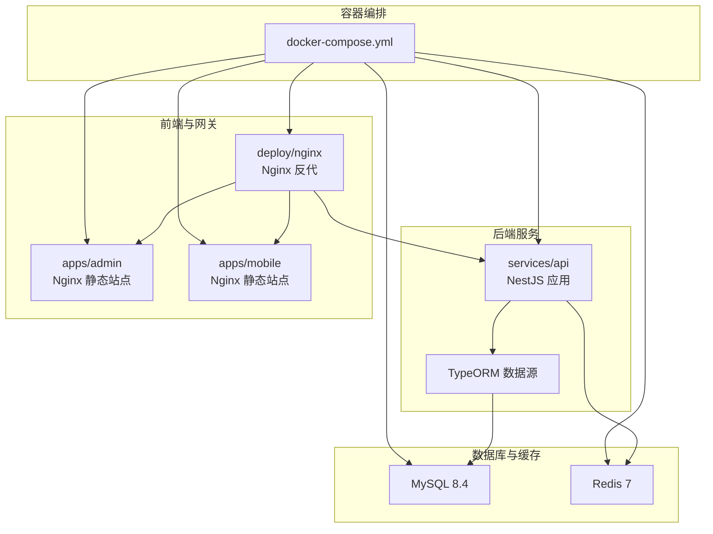
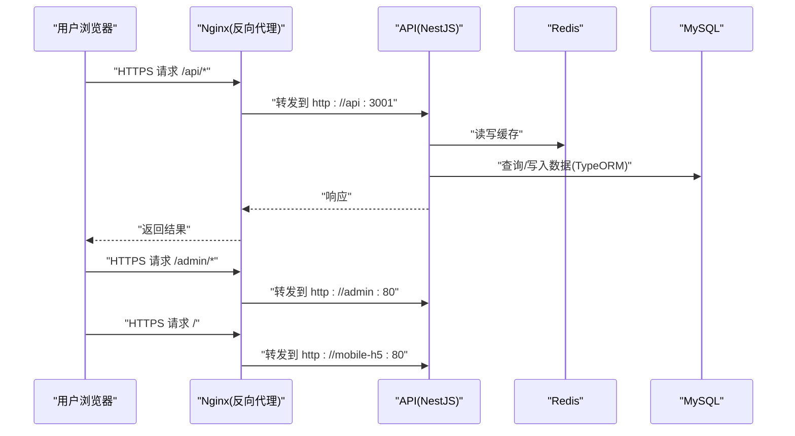
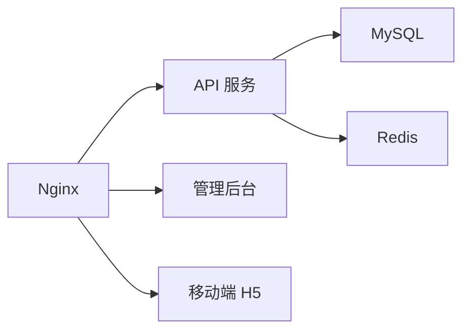

# 部署运维

<cite>
**本文引用的文件**
- [docker-compose.yml](file://docker-compose.yml)
- [scripts/deploy-aliyun.sh](file://scripts/deploy-aliyun.sh)
- [scripts/check-production-health.sh](file://scripts/check-production-health.sh)
- [deploy/nginx/conf.d/default.conf](file://deploy/nginx/conf.d/default.conf)
- [deploy/nginx/templates/https.conf.tpl](file://deploy/nginx/templates/https.conf.tpl)
- [deploy/nginx/templates/http-only.conf.tpl](file://deploy/nginx/templates/http-only.conf.tpl)
- [services/api/src/main.ts](file://services/api/src/main.ts)
- [services/api/src/app.module.ts](file://services/api/src/app.module.ts)
- [services/api/src/health/health.controller.ts](file://services/api/src/health/health.controller.ts)
- [services/api/src/common/production-config.validator.ts](file://services/api/src/common/production-config.validator.ts)
- [services/api/src/database/data-source.ts](file://services/api/src/database/data-source.ts)
- [services/api/Dockerfile](file://services/api/Dockerfile)
- [apps/admin/Dockerfile](file://apps/admin/Dockerfile)
- [apps/mobile/Dockerfile](file://apps/mobile/Dockerfile)
- [package.json](file://package.json)
</cite>

## 目录
1. [简介](#简介)
2. [项目结构](#项目结构)
3. [核心组件](#核心组件)
4. [架构总览](#架构总览)
5. [详细组件分析](#详细组件分析)
6. [依赖关系分析](#依赖关系分析)
7. [性能考虑](#性能考虑)
8. [故障排查指南](#故障排查指南)
9. [结论](#结论)
10. [附录](#附录)

## 简介
本指南面向运维工程师，系统化介绍 Fortune Hub 在生产环境中的部署与运维实践，覆盖以下主题：
- 基于 Docker Compose 的容器编排：MySQL、Redis、Nginx、API 服务的启动顺序与网络配置
- Nginx 反向代理策略、HTTPS 证书管理与静态资源服务
- 生产环境部署流程：环境变量、数据库初始化、文件服务集成
- 健康检查脚本使用、监控指标采集与告警设置建议
- 故障排查、性能调优与备份恢复策略

## 项目结构
Fortune Hub 采用多模块工作区（monorepo）组织方式，包含后端 API 服务、移动端 H5、管理后台前端与 Nginx 配置模板。生产部署通过 docker-compose 统一编排，配合一键部署脚本实现自动化。

图表来源
- [docker-compose.yml:1-170](file://docker-compose.yml#L1-L170)
- [services/api/src/app.module.ts:67-117](file://services/api/src/app.module.ts#L67-L117)
- [services/api/src/database/data-source.ts:32-72](file://services/api/src/database/data-source.ts#L32-L72)
- [apps/admin/Dockerfile:1-22](file://apps/admin/Dockerfile#L1-L22)
- [apps/mobile/Dockerfile:1-22](file://apps/mobile/Dockerfile#L1-L22)
- [deploy/nginx/conf.d/default.conf:1-62](file://deploy/nginx/conf.d/default.conf#L1-L62)

章节来源
- [docker-compose.yml:1-170](file://docker-compose.yml#L1-L170)
- [package.json:6-21](file://package.json#L6-L21)

## 核心组件
- MySQL：持久化存储，提供健康检查与数据卷挂载，确保重启后数据不丢失
- Redis：会话、缓存与任务队列等，开启 AOF 持久化，提供健康检查
- API 服务：基于 NestJS，支持动态配置校验、CORS、全局拦截器与过滤器、TypeORM 连接与迁移
- Nginx：统一入口，反向代理 API、管理后台与移动端 H5；支持 HTTP→HTTPS 跳转与 HTTPS 证书挂载
- 前端镜像：基于 Nginx 提供静态资源服务，分别由 apps/admin 与 apps/mobile 构建

章节来源
- [docker-compose.yml:2-169](file://docker-compose.yml#L2-L169)
- [services/api/src/app.module.ts:61-144](file://services/api/src/app.module.ts#L61-L144)
- [services/api/src/main.ts:8-62](file://services/api/src/main.ts#L8-L62)
- [apps/admin/Dockerfile:1-22](file://apps/admin/Dockerfile#L1-L22)
- [apps/mobile/Dockerfile:1-22](file://apps/mobile/Dockerfile#L1-L22)
- [deploy/nginx/conf.d/default.conf:1-62](file://deploy/nginx/conf.d/default.conf#L1-L62)

## 架构总览
下图展示生产环境请求流与组件交互：

图表来源
- [docker-compose.yml:147-166](file://docker-compose.yml#L147-L166)
- [deploy/nginx/conf.d/default.conf:19-60](file://deploy/nginx/conf.d/default.conf#L19-L60)
- [services/api/src/app.module.ts:67-117](file://services/api/src/app.module.ts#L67-L117)

## 详细组件分析

### 容器编排与启动顺序
- 依赖关系
  - API 服务依赖 MySQL 与 Redis 健康状态
  - Nginx 依赖 API 健康，且依赖 admin 与 mobile-h5 启动
- 网络与端口
  - MySQL/Redis/Nginx/API 暴露端口映射由环境变量控制
  - Nginx 挂载证书目录，支持 HTTPS
- 健康检查
  - MySQL/Redis/Nginx/API 分别内置健康检查，便于编排器自动重启与状态判断

章节来源
- [docker-compose.yml:43-166](file://docker-compose.yml#L43-L166)

### Nginx 反向代理与 HTTPS 策略
- HTTP→HTTPS 跳转：监听 80 端口，将所有请求重定向至 https
- HTTPS 证书：从宿主机挂载证书与私钥路径，支持 TLSv1.2/1.3 与会话缓存
- 路由规则
  - /api/ → 反代至 API 服务
  - /admin/ → 反代至管理后台
  - / → 反代至移动端 H5
  - /file-api/ → 反代至文件服务（host.docker.internal:3000）
- 头部透传：Host、X-Real-IP、X-Forwarded-For、X-Forwarded-Proto、X-Forwarded-Prefix

章节来源
- [deploy/nginx/conf.d/default.conf:1-62](file://deploy/nginx/conf.d/default.conf#L1-L62)
- [deploy/nginx/templates/https.conf.tpl:1-62](file://deploy/nginx/templates/https.conf.tpl#L1-L62)
- [deploy/nginx/templates/http-only.conf.tpl:1-50](file://deploy/nginx/templates/http-only.conf.tpl#L1-L50)

### API 服务配置与安全
- 全局前缀：/api/v1
- CORS：允许来源由环境变量配置，生产环境必须为 HTTPS
- 全局拦截器/过滤器：统一封装响应与异常处理
- 数据库连接：TypeORM 异步工厂读取环境变量，支持迁移与同步开关
- 配置校验：生产环境强制要求强口令、禁用 mock、HTTPS 地址等

章节来源
- [services/api/src/main.ts:8-62](file://services/api/src/main.ts#L8-L62)
- [services/api/src/app.module.ts:67-117](file://services/api/src/app.module.ts#L67-L117)
- [services/api/src/common/production-config.validator.ts:25-104](file://services/api/src/common/production-config.validator.ts#L25-L104)

### 健康检查与运行时保障
- API 健康端点：返回服务名、MySQL 初始化状态、Redis Ping 结果与时间戳
- 生产健康脚本：对 /api/v1/health、/file-api/api/health、移动端与管理后台首页进行探测，校验 HTTP 状态、TLS 验证与响应内容

章节来源
- [services/api/src/health/health.controller.ts:6-27](file://services/api/src/health/health.controller.ts#L6-L27)
- [scripts/check-production-health.sh:74-83](file://scripts/check-production-health.sh#L74-L83)

### 部署脚本与流程
- 一键部署脚本：加载环境文件、校验生产配置、准备证书、渲染 Nginx 配置、拉取代码、启动容器
- 支持动作：deploy、pull-and-deploy、render-nginx、status、logs、restart、down
- 生产校验：禁止 DB_SYNCHRONIZE=true、禁止 mock 类配置、要求强口令与 HTTPS 地址

章节来源
- [scripts/deploy-aliyun.sh:26-108](file://scripts/deploy-aliyun.sh#L26-L108)
- [scripts/deploy-aliyun.sh:152-196](file://scripts/deploy-aliyun.sh#L152-L196)

### 容器构建与镜像
- API 服务：多阶段构建，安装 pnpm、构建产物、最终运行在 node:22-alpine，暴露 3001 端口
- 管理后台与移动端：多阶段构建前端产物，使用 nginx:1.27-alpine 提供静态服务

章节来源
- [services/api/Dockerfile:1-30](file://services/api/Dockerfile#L1-L30)
- [apps/admin/Dockerfile:1-22](file://apps/admin/Dockerfile#L1-L22)
- [apps/mobile/Dockerfile:1-22](file://apps/mobile/Dockerfile#L1-L22)

## 依赖关系分析
- 组件耦合
  - API 服务依赖 MySQL 与 Redis；Nginx 依赖 API 与前端服务
  - 前端镜像仅提供静态资源，不直接访问数据库
- 外部依赖
  - Nginx 证书挂载、文件服务反代、微信/短信/支付等外部能力通过环境变量注入
- 循环依赖
  - 无直接循环依赖，服务间通过反向代理与共享网络通信

图表来源
- [docker-compose.yml:43-166](file://docker-compose.yml#L43-L166)
- [services/api/src/app.module.ts:67-117](file://services/api/src/app.module.ts#L67-L117)

## 性能考虑
- 数据库
  - 使用迁移而非同步，避免生产环境结构变更风险；合理设置索引与查询优化
- 缓存
  - Redis 开启 AOF 并进行定期持久化，结合合理的键空间过期策略
- 反向代理
  - 启用 HTTP/2、限制上传大小、合理设置超时与连接池
- 镜像与构建
  - 多阶段构建减少镜像体积；使用国内镜像源提升安装速度
- 监控与日志
  - 结合容器日志与应用指标，设置阈值告警与自动扩缩容策略

[本节为通用指导，无需具体文件引用]

## 故障排查指南
- 健康检查失败
  - 使用生产健康脚本快速定位 API、文件服务、移动端与管理后台可用性
  - 关注 TLS 验证结果与 HTTP 状态码
- API 无法连接数据库
  - 检查数据库迁移是否执行、连接参数与网络连通性
  - 确认生产配置校验未触发（如弱口令、mock 配置）
- Nginx 证书问题
  - 确认证书与私钥文件存在且权限正确
  - 检查模板渲染后的配置是否生效
- 容器启动顺序
  - 确保 API 服务健康后再对外提供服务
  - 检查 depends_on 与健康检查间隔设置

章节来源
- [scripts/check-production-health.sh:26-83](file://scripts/check-production-health.sh#L26-L83)
- [services/api/src/common/production-config.validator.ts:25-104](file://services/api/src/common/production-config.validator.ts#L25-L104)
- [docker-compose.yml:49-53](file://docker-compose.yml#L49-L53)
- [deploy/nginx/conf.d/default.conf:11-15](file://deploy/nginx/conf.d/default.conf#L11-L15)

## 结论
通过 docker-compose 统一编排与一键部署脚本，Fortune Hub 实现了生产环境的标准化与自动化。配合严格的生产配置校验、完善的健康检查与 Nginx 反向代理策略，可有效提升系统的稳定性与可维护性。建议在上线前完成环境变量审计、证书准备与数据库迁移演练，并建立持续监控与告警机制以保障线上稳定运行。

[本节为总结，无需具体文件引用]

## 附录

### A. 生产环境部署清单
- 准备环境文件与密钥
  - 环境文件：包含数据库、管理员、微信、短信、支付等敏感信息
  - 证书：fullchain.pem 与 privkey.pem 放置于 deploy/nginx/ssl
- 执行部署
  - 使用一键脚本渲染 Nginx 配置并启动容器
  - 如需先更新代码再部署，使用 pull-and-deploy 动作
- 验证健康
  - 运行生产健康脚本，确认各子系统可用

章节来源
- [scripts/deploy-aliyun.sh:26-108](file://scripts/deploy-aliyun.sh#L26-L108)
- [scripts/deploy-aliyun.sh:152-196](file://scripts/deploy-aliyun.sh#L152-L196)
- [scripts/check-production-health.sh:74-83](file://scripts/check-production-health.sh#L74-L83)

### B. 健康检查与监控建议
- 健康检查
  - 使用内置 /api/v1/health 与生产健康脚本
- 监控指标
  - 容器 CPU/内存/磁盘 IO
  - API 响应时间与错误率、数据库连接数与慢查询
  - Nginx 请求量、状态码分布、上游健康状态
- 告警策略
  - 健康检查失败、CPU/内存使用率超阈值、数据库连接异常、Nginx 5xx 比例上升

[本节为通用指导，无需具体文件引用]

### C. 备份与恢复策略
- 数据库备份
  - 定期导出 MySQL 数据，保留多版本快照，测试恢复流程
- 缓存数据
  - 对重要缓存进行周期性持久化或记录关键键值
- 配置与证书
  - 将环境文件与证书纳入版本控制或安全存储，严格权限管理
- 回滚方案
  - 保留上一版本镜像与配置，快速回滚至稳定版本

[本节为通用指导，无需具体文件引用]