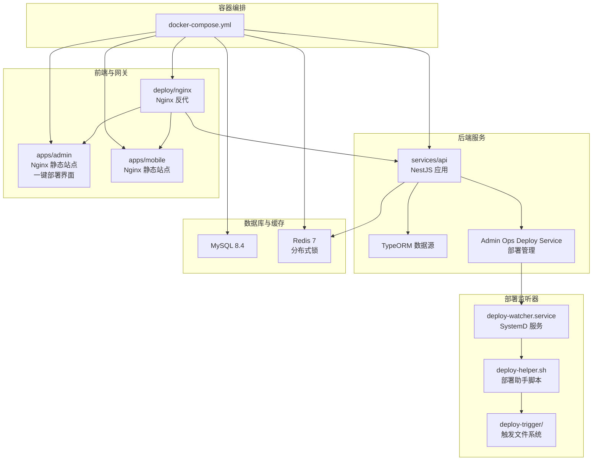
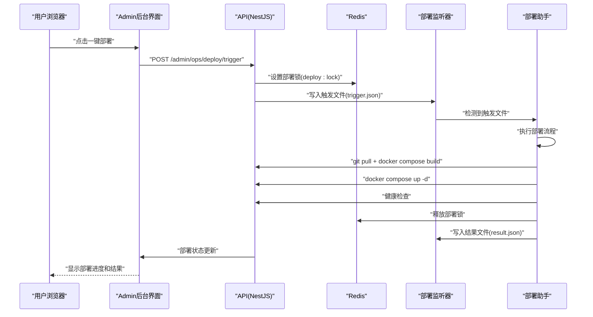
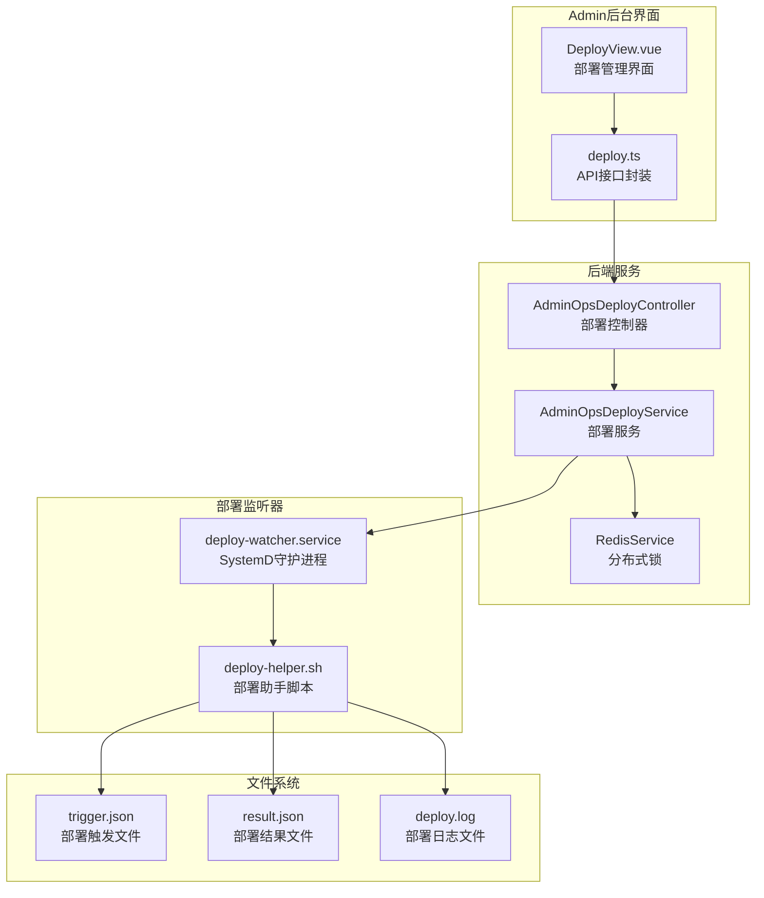
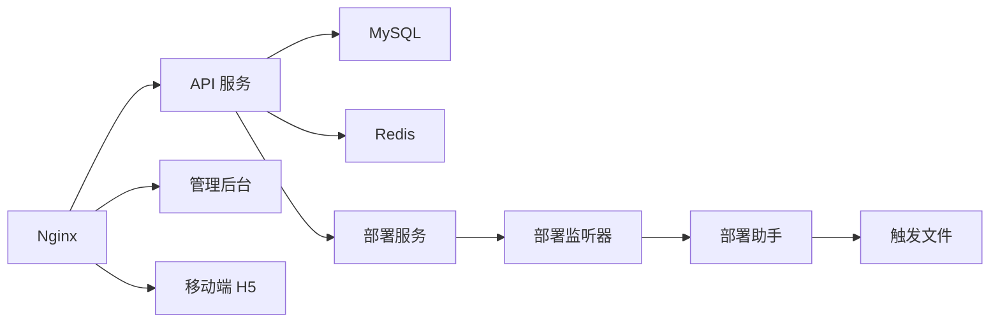

# 部署运维

<cite>
**本文引用的文件**
- [docker-compose.yml](file://docker-compose.yml)
- [scripts/deploy-aliyun.sh](file://scripts/deploy-aliyun.sh)
- [scripts/check-production-health.sh](file://scripts/check-production-health.sh)
- [scripts/deploy-watcher.service](file://scripts/deploy-watcher.service)
- [scripts/install-deploy-watcher.sh](file://scripts/install-deploy-watcher.sh)
- [scripts/deploy-helper.sh](file://scripts/deploy-helper.sh)
- [apps/admin/src/views/DeployView.vue](file://apps/admin/src/views/DeployView.vue)
- [apps/admin/src/api/deploy.ts](file://apps/admin/src/api/deploy.ts)
- [services/api/src/admin-ops/admin-ops-deploy.controller.ts](file://services/api/src/admin-ops/admin-ops-deploy.controller.ts)
- [services/api/src/admin-ops/admin-ops-deploy.service.ts](file://services/api/src/admin-ops/admin-ops-deploy.service.ts)
- [services/api/src/redis/redis.service.ts](file://services/api/src/redis/redis.service.ts)
- [deploy/nginx/conf.d/default.conf](file://deploy/nginx/conf.d/default.conf)
- [deploy/nginx/templates/https.conf.tpl](file://deploy/nginx/templates/https.conf.tpl)
- [deploy/nginx/templates/http-only.conf.tpl](file://deploy/nginx/templates/http-only.conf.tpl)
- [services/api/src/main.ts](file://services/api/src/main.ts)
- [services/api/src/app.module.ts](file://services/api/src/app.module.ts)
- [services/api/src/health/health.controller.ts](file://services/api/src/health/health.controller.ts)
- [services/api/src/common/production-config.validator.ts](file://services/api/src/common/production-config.validator.ts)
- [services/api/src/database/data-source.ts](file://services/api/src/database/data-source.ts)
- [services/api/Dockerfile](file://services/api/Dockerfile)
- [apps/admin/Dockerfile](file://apps/admin/Dockerfile)
- [apps/mobile/Dockerfile](file://apps/mobile/Dockerfile)
- [package.json](file://package.json)
</cite>

## 更新摘要
**所做更改**
- 新增Admin后台一键部署系统章节，涵盖完整的部署流程
- 添加部署监听器服务的实现细节和工作机制
- 详细说明Redis分布式锁机制在部署系统中的应用
- 补充部署状态管理、冷却机制和健康检查集成
- 更新部署架构图以反映新的Admin后台部署功能
- 增加部署日志管理和实时监控功能

## 目录
1. [简介](#简介)
2. [项目结构](#项目结构)
3. [核心组件](#核心组件)
4. [架构总览](#架构总览)
5. [详细组件分析](#详细组件分析)
6. [Admin后台一键部署系统](#admin后台一键部署系统)
7. [依赖关系分析](#依赖关系分析)
8. [性能考虑](#性能考虑)
9. [故障排查指南](#故障排查指南)
10. [结论](#结论)
11. [附录](#附录)

## 简介
本指南面向运维工程师，系统化介绍 Fortune Hub 在生产环境中的部署与运维实践，覆盖以下主题：
- 基于 Docker Compose 的容器编排：MySQL、Redis、Nginx、API 服务的启动顺序与网络配置
- Nginx 反向代理策略、HTTPS 证书管理与静态资源服务
- 生产环境部署流程：环境变量、数据库初始化、文件服务集成
- **新增**：Admin后台一键部署系统，包括部署监听器服务、Redis分布式锁机制、健康检查集成
- 健康检查脚本使用、监控指标采集与告警设置建议
- 故障排查、性能调优与备份恢复策略

## 项目结构
Fortune Hub 采用多模块工作区（monorepo）组织方式，包含后端 API 服务、移动端 H5、管理后台前端与 Nginx 配置模板。生产部署通过 docker-compose 统一编排，配合一键部署脚本实现自动化。

```mermaid
graph TB
subgraph "容器编排"
DC["docker-compose.yml"]
end
subgraph "后端服务"
API["services/api<br/>NestJS 应用"]
DS["TypeORM 数据源"]
DEPLOY["Admin Ops Deploy Service<br/>部署管理"]
end
subgraph "数据库与缓存"
MYSQL["MySQL 8.4"]
REDIS["Redis 7<br/>分布式锁"]
end
subgraph "前端与网关"
ADMIN["apps/admin<br/>Nginx 静态站点<br/>一键部署界面"]
MOBILE["apps/mobile<br/>Nginx 静态站点"]
NGINX["deploy/nginx<br/>Nginx 反代"]
end
subgraph "部署监听器"
WATCHER["deploy-watcher.service<br/>SystemD 服务"]
HELPER["deploy-helper.sh<br/>部署助手脚本"]
TRIGGER["deploy-trigger/<br/>触发文件系统"]
end
DC --> MYSQL
DC --> REDIS
DC --> API
DC --> ADMIN
DC --> MOBILE
DC --> NGINX
API --> DS
API --> REDIS
API --> DEPLOY
DEPLOY --> WATCHER
WATCHER --> HELPER
HELPER --> TRIGGER
NGINX --> API
NGINX --> ADMIN
NGINX --> MOBILE
```

**图表来源**
- [docker-compose.yml:1-172](file://docker-compose.yml#L1-L172)
- [services/api/src/admin-ops/admin-ops-deploy.service.ts:1-184](file://services/api/src/admin-ops/admin-ops-deploy.service.ts#L1-L184)
- [scripts/deploy-watcher.service:1-16](file://scripts/deploy-watcher.service#L1-L16)
- [scripts/deploy-helper.sh:1-206](file://scripts/deploy-helper.sh#L1-L206)

**章节来源**
- [docker-compose.yml:1-172](file://docker-compose.yml#L1-L172)
- [package.json:6-21](file://package.json#L6-L21)

## 核心组件
- MySQL：持久化存储，提供健康检查与数据卷挂载，确保重启后数据不丢失
- Redis：会话、缓存与任务队列等，开启 AOF 持久化，提供健康检查，支持分布式锁
- API 服务：基于 NestJS，支持动态配置校验、CORS、全局拦截器与过滤器、TypeORM 连接与迁移
- **新增**：Admin Ops Deploy Service：提供一键部署功能，基于Redis分布式锁确保部署原子性
- Nginx：统一入口，反向代理 API、管理后台与移动端 H5；支持 HTTP→HTTPS 跳转与 HTTPS 证书挂载
- **新增**：部署监听器服务：SystemD守护进程，监控部署触发文件并执行自动化部署
- 前端镜像：基于 Nginx 提供静态资源服务，分别由 apps/admin 与 apps/mobile 构建

**章节来源**
- [docker-compose.yml:2-172](file://docker-compose.yml#L2-L172)
- [services/api/src/app.module.ts:61-144](file://services/api/src/app.module.ts#L61-L144)
- [services/api/src/main.ts:8-62](file://services/api/src/main.ts#L8-L62)
- [services/api/src/admin-ops/admin-ops-deploy.service.ts:1-184](file://services/api/src/admin-ops/admin-ops-deploy.service.ts#L1-L184)
- [scripts/deploy-watcher.service:1-16](file://scripts/deploy-watcher.service#L1-L16)
- [apps/admin/Dockerfile:1-22](file://apps/admin/Dockerfile#L1-L22)
- [apps/mobile/Dockerfile:1-22](file://apps/mobile/Dockerfile#L1-L22)
- [deploy/nginx/conf.d/default.conf:1-62](file://deploy/nginx/conf.d/default.conf#L1-L62)

## 架构总览
下图展示生产环境请求流与组件交互，包括新增的Admin后台部署系统：

```mermaid
sequenceDiagram
participant U as "用户浏览器"
participant A as "Admin后台界面"
participant API as "API(NestJS)"
participant R as "Redis"
participant W as "部署监听器"
participant H as "部署助手"
U->>A : "点击一键部署"
A->>API : "POST /admin/ops/deploy/trigger"
API->>R : "设置部署锁(deploy : lock)"
API->>W : "写入触发文件(trigger.json)"
W->>H : "检测到触发文件"
H->>H : "执行部署流程"
H->>API : "git pull + docker compose build"
H->>API : "docker compose up -d"
H->>API : "健康检查"
H->>R : "释放部署锁"
H->>W : "写入结果文件(result.json)"
API->>A : "部署状态更新"
A-->>U : "显示部署进度和结果"
```

**图表来源**
- [services/api/src/admin-ops/admin-ops-deploy.controller.ts:18-47](file://services/api/src/admin-ops/admin-ops-deploy.controller.ts#L18-L47)
- [services/api/src/admin-ops/admin-ops-deploy.service.ts:39-87](file://services/api/src/admin-ops/admin-ops-deploy.service.ts#L39-L87)
- [scripts/deploy-helper.sh:101-173](file://scripts/deploy-helper.sh#L101-L173)
- [scripts/deploy-watcher.service:6-12](file://scripts/deploy-watcher.service#L6-L12)

## 详细组件分析

### 容器编排与启动顺序
- 依赖关系
  - API 服务依赖 MySQL 与 Redis 健康状态
  - Nginx 依赖 API 健康，且依赖 admin 与 mobile-h5 启动
  - **新增**：API 服务挂载部署触发目录 `/app/deploy-trigger` 用于Admin部署系统
- 网络与端口
  - MySQL/Redis/Nginx/API 暴露端口映射由环境变量控制
  - Nginx 挂载证书目录，支持 HTTPS
- 健康检查
  - MySQL/Redis/Nginx/API 分别内置健康检查，便于编排器自动重启与状态判断

**章节来源**
- [docker-compose.yml:43-172](file://docker-compose.yml#L43-L172)

### Nginx 反向代理与 HTTPS 策略
- HTTP→HTTPS 跳转：监听 80 端口，将所有请求重定向至 https
- HTTPS 证书：从宿主机挂载证书与私钥路径，支持 TLSv1.2/1.3 与会话缓存
- 路由规则
  - /api/ → 反代至 API 服务
  - /admin/ → 反代至管理后台
  - / → 反代至移动端 H5
  - /file-api/ → 反代至文件服务（host.docker.internal:3000）
- 头部透传：Host、X-Real-IP、X-Forwarded-For、X-Forwarded-Proto、X-Forwarded-Prefix

**章节来源**
- [deploy/nginx/conf.d/default.conf:1-62](file://deploy/nginx/conf.d/default.conf#L1-L62)
- [deploy/nginx/templates/https.conf.tpl:1-62](file://deploy/nginx/templates/https.conf.tpl#L1-L62)
- [deploy/nginx/templates/http-only.conf.tpl:1-50](file://deploy/nginx/templates/http-only.conf.tpl#L1-L50)

### API 服务配置与安全
- 全局前缀：/api/v1
- CORS：允许来源由环境变量配置，生产环境必须为 HTTPS
- 全局拦截器/过滤器：统一封装响应与异常处理
- 数据库连接：TypeORM 异步工厂读取环境变量，支持迁移与同步开关
- 配置校验：生产环境强制要求强口令、禁用 mock、HTTPS 地址等

**章节来源**
- [services/api/src/main.ts:8-62](file://services/api/src/main.ts#L8-L62)
- [services/api/src/app.module.ts:67-117](file://services/api/src/app.module.ts#L67-L117)
- [services/api/src/common/production-config.validator.ts:25-104](file://services/api/src/common/production-config.validator.ts#L25-L104)

### 健康检查与运行时保障
- API 健康端点：返回服务名、MySQL 初始化状态、Redis Ping 结果与时间戳
- 生产健康脚本：对 /api/v1/health、/file-api/api/health、移动端与管理后台首页进行探测，校验 HTTP 状态、TLS 验证与响应内容

**章节来源**
- [services/api/src/health/health.controller.ts:6-27](file://services/api/src/health/health.controller.ts#L6-L27)
- [scripts/check-production-health.sh:74-83](file://scripts/check-production-health.sh#L74-L83)

### 部署脚本与流程
- 一键部署脚本：加载环境文件、校验生产配置、准备证书、渲染 Nginx 配置、拉取代码、启动容器
- 支持动作：deploy、pull-and-deploy、render-nginx、status、logs、restart、down
- 生产校验：禁止 DB_SYNCHRONIZE=true、禁止 mock 类配置、要求强口令与 HTTPS 地址

**章节来源**
- [scripts/deploy-aliyun.sh:26-108](file://scripts/deploy-aliyun.sh#L26-L108)
- [scripts/deploy-aliyun.sh:152-196](file://scripts/deploy-aliyun.sh#L152-L196)

### 容器构建与镜像
- API 服务：多阶段构建，安装 pnpm、构建产物、最终运行在 node:22-alpine，暴露 3001 端口
- 管理后台与移动端：多阶段构建前端产物，使用 nginx:1.27-alpine 提供静态服务

**章节来源**
- [services/api/Dockerfile:1-30](file://services/api/Dockerfile#L1-L30)
- [apps/admin/Dockerfile:1-22](file://apps/admin/Dockerfile#L1-L22)
- [apps/mobile/Dockerfile:1-22](file://apps/mobile/Dockerfile#L1-L22)

## Admin后台一键部署系统

### 系统架构概述
Admin后台一键部署系统是一个完整的自动化部署解决方案，包含前端界面、后端API、Redis分布式锁和部署监听器服务。该系统提供了安全、可靠的一键部署能力，支持并发控制、冷却机制和实时监控。

```mermaid
graph TB
subgraph "Admin后台界面"
DEPLOYVIEW["DeployView.vue<br/>部署管理界面"]
API["deploy.ts<br/>API接口封装"]
end
subgraph "后端服务"
CONTROLLER["AdminOpsDeployController<br/>部署控制器"]
SERVICE["AdminOpsDeployService<br/>部署服务"]
REDIS["RedisService<br/>分布式锁"]
end
subgraph "部署监听器"
WATCHER["deploy-watcher.service<br/>SystemD守护进程"]
HELPER["deploy-helper.sh<br/>部署助手脚本"]
end
subgraph "文件系统"
TRIGGER["trigger.json<br/>部署触发文件"]
RESULT["result.json<br/>部署结果文件"]
LOG["deploy.log<br/>部署日志文件"]
end
DEPLOYVIEW --> API
API --> CONTROLLER
CONTROLLER --> SERVICE
SERVICE --> REDIS
SERVICE --> WATCHER
WATCHER --> HELPER
HELPER --> TRIGGER
HELPER --> RESULT
HELPER --> LOG
```

**图表来源**
- [apps/admin/src/views/DeployView.vue:1-363](file://apps/admin/src/views/DeployView.vue#L1-L363)
- [apps/admin/src/api/deploy.ts:1-54](file://apps/admin/src/api/deploy.ts#L1-L54)
- [services/api/src/admin-ops/admin-ops-deploy.controller.ts:1-64](file://services/api/src/admin-ops/admin-ops-deploy.controller.ts#L1-L64)
- [services/api/src/admin-ops/admin-ops-deploy.service.ts:1-184](file://services/api/src/admin-ops/admin-ops-deploy.service.ts#L1-L184)
- [scripts/deploy-watcher.service:1-16](file://scripts/deploy-watcher.service#L1-L16)
- [scripts/deploy-helper.sh:1-206](file://scripts/deploy-helper.sh#L1-L206)

### Redis分布式锁机制
部署系统使用Redis实现分布式锁，确保同一时间只有一个部署任务在执行：

- **锁键名**：`deploy:lock`
- **TTL设置**：10分钟（600秒），防止死锁
- **锁值内容**：包含触发者用户名和触发时间
- **获取锁**：部署前检查锁是否存在，存在则拒绝新部署
- **释放锁**：部署完成后主动释放，或通过TTL自动过期
- **冷却机制**：部署完成后5分钟内禁止重复部署

**章节来源**
- [services/api/src/admin-ops/admin-ops-deploy.service.ts:11-12](file://services/api/src/admin-ops/admin-ops-deploy.service.ts#L11-L12)
- [services/api/src/admin-ops/admin-ops-deploy.service.ts:40-60](file://services/api/src/admin-ops/admin-ops-deploy.service.ts#L40-L60)
- [services/api/src/redis/redis.service.ts:89-104](file://services/api/src/redis/redis.service.ts#L89-L104)

### 部署监听器服务
部署监听器是一个SystemD守护进程，负责监控部署触发文件并执行自动化部署：

- **服务名称**：`deploy-watcher.service`
- **工作目录**：`/opt/fortune-hub`
- **执行脚本**：`deploy-helper.sh`
- **监听目录**：`/opt/fortune-hub/deploy-trigger`
- **轮询间隔**：2秒
- **文件锁**：使用文件级互斥锁防止并发执行

**章节来源**
- [scripts/deploy-watcher.service:1-16](file://scripts/deploy-watcher.service#L1-L16)
- [scripts/install-deploy-watcher.sh:1-78](file://scripts/install-deploy-watcher.sh#L1-L78)
- [scripts/deploy-helper.sh:35-47](file://scripts/deploy-helper.sh#L35-L47)

### 部署助手脚本
部署助手脚本执行完整的部署流程，包括代码更新、构建和健康检查：

- **Git操作**：拉取最新代码，切换到指定分支
- **构建流程**：构建API、Admin和Mobile镜像
- **启动服务**：使用docker compose启动所有服务
- **健康检查**：等待API服务健康检查通过
- **结果记录**：生成部署结果文件，包含状态、时间和日志

**章节来源**
- [scripts/deploy-helper.sh:101-173](file://scripts/deploy-helper.sh#L101-L173)
- [scripts/deploy-helper.sh:69-97](file://scripts/deploy-helper.sh#L69-L97)

### 部署状态管理
系统提供完整的部署状态跟踪和管理：

- **实时状态**：前端每3秒轮询部署状态
- **冷却计时**：部署完成后5分钟内禁止重复部署
- **部署历史**：保存最近一次部署的详细信息
- **日志监控**：实时显示部署日志，支持滚动到底部

**章节来源**
- [apps/admin/src/views/DeployView.vue:114-166](file://apps/admin/src/views/DeployView.vue#L114-L166)
- [services/api/src/admin-ops/admin-ops-deploy.service.ts:89-105](file://services/api/src/admin-ops/admin-ops-deploy.service.ts#L89-L105)

## 依赖关系分析
- 组件耦合
  - API 服务依赖 MySQL 与 Redis；Nginx 依赖 API 与前端服务
  - **新增**：Admin后台部署系统通过Redis分布式锁实现解耦
  - 前端镜像仅提供静态资源，不直接访问数据库
- 外部依赖
  - Nginx 证书挂载、文件服务反代、微信/短信/支付等外部能力通过环境变量注入
  - **新增**：部署监听器依赖SystemD服务管理器
- 循环依赖
  - 无直接循环依赖，服务间通过反向代理与共享网络通信

```mermaid
graph LR
NGINX["Nginx"] --> API["API 服务"]
NGINX --> ADMIN["管理后台"]
NGINX --> MOBILE["移动端 H5"]
API --> MYSQL["MySQL"]
API --> REDIS["Redis"]
API --> DEPLOY["部署服务"]
DEPLOY --> WATCHER["部署监听器"]
WATCHER --> HELPER["部署助手"]
HELPER --> TRIGGER["触发文件"]
```

**图表来源**
- [docker-compose.yml:43-172](file://docker-compose.yml#L43-L172)
- [services/api/src/app.module.ts:67-117](file://services/api/src/app.module.ts#L67-L117)
- [services/api/src/admin-ops/admin-ops-deploy.service.ts:1-184](file://services/api/src/admin-ops/admin-ops-deploy.service.ts#L1-L184)

## 性能考虑
- 数据库
  - 使用迁移而非同步，避免生产环境结构变更风险；合理设置索引与查询优化
- 缓存
  - Redis 开启 AOF 并进行定期持久化，结合合理的键空间过期策略
  - **新增**：Redis分布式锁使用TTL防止死锁，合理设置锁超时时间
- 反向代理
  - 启用 HTTP/2、限制上传大小、合理设置超时与连接池
- 镜像与构建
  - 多阶段构建减少镜像体积；使用国内镜像源提升安装速度
- **新增**：部署系统性能优化
  - 部署监听器使用文件锁而非进程锁，提高可靠性
  - 部署冷却机制防止频繁部署造成系统压力
  - 日志文件限制大小，避免磁盘空间占用过多

## 故障排查指南
- 健康检查失败
  - 使用生产健康脚本快速定位 API、文件服务、移动端与管理后台可用性
  - 关注 TLS 验证结果与 HTTP 状态码
- API 无法连接数据库
  - 检查数据库迁移是否执行、连接参数与网络连通性
  - 确认生产配置校验未触发（如弱口令、mock 配置）
- Nginx 证书问题
  - 确认证书与私钥文件存在且权限正确
  - 检查模板渲染后的配置是否生效
- 容器启动顺序
  - 确保 API 服务健康后再对外提供服务
  - 检查 depends_on 与健康检查间隔设置
- **新增**：部署系统故障排查
  - 检查Redis连接状态和分布式锁获取情况
  - 验证SystemD服务状态和部署监听器日志
  - 确认部署触发目录权限和文件锁机制正常工作
  - 检查部署助手脚本的执行权限和依赖命令

**章节来源**
- [scripts/check-production-health.sh:26-83](file://scripts/check-production-health.sh#L26-L83)
- [services/api/src/common/production-config.validator.ts:25-104](file://services/api/src/common/production-config.validator.ts#L25-L104)
- [docker-compose.yml:49-53](file://docker-compose.yml#L49-L53)
- [deploy/nginx/conf.d/default.conf:11-15](file://deploy/nginx/conf.d/default.conf#L11-L15)
- [services/api/src/admin-ops/admin-ops-deploy.service.ts:40-60](file://services/api/src/admin-ops/admin-ops-deploy.service.ts#L40-L60)
- [scripts/deploy-watcher.service:6-12](file://scripts/deploy-watcher.service#L6-L12)

## 结论
通过 docker-compose 统一编排与一键部署脚本，Fortune Hub 实现了生产环境的标准化与自动化。**新增的Admin后台一键部署系统进一步提升了部署效率和安全性**，通过Redis分布式锁确保部署原子性，通过SystemD守护进程实现可靠的自动化部署。配合严格的生产配置校验、完善的健康检查与 Nginx 反向代理策略，可有效提升系统的稳定性与可维护性。建议在上线前完成环境变量审计、证书准备、数据库迁移演练，**以及部署监听器服务的安装和配置**，并建立持续监控与告警机制以保障线上稳定运行。

## 附录

### A. 生产环境部署清单
- 准备环境文件与密钥
  - 环境文件：包含数据库、管理员、微信、短信、支付等敏感信息
  - 证书：fullchain.pem 与 privkey.pem 放置于 deploy/nginx/ssl
- **新增**：部署监听器安装
  - 执行 `install-deploy-watcher.sh` 脚本安装SystemD服务
  - 确认服务状态：`systemctl status deploy-watcher.service`
- 执行部署
  - 使用一键脚本渲染 Nginx 配置并启动容器
  - 如需先更新代码再部署，使用 pull-and-deploy 动作
- 验证健康
  - 运行生产健康脚本，确认各子系统可用

**章节来源**
- [scripts/deploy-aliyun.sh:26-108](file://scripts/deploy-aliyun.sh#L26-L108)
- [scripts/deploy-aliyun.sh:152-196](file://scripts/deploy-aliyun.sh#L152-L196)
- [scripts/check-production-health.sh:74-83](file://scripts/check-production-health.sh#L74-L83)
- [scripts/install-deploy-watcher.sh:23-78](file://scripts/install-deploy-watcher.sh#L23-L78)

### B. 健康检查与监控建议
- 健康检查
  - 使用内置 /api/v1/health 与生产健康脚本
  - **新增**：部署系统健康检查，验证Redis连接和部署监听器状态
- 监控指标
  - 容器 CPU/内存/磁盘 IO
  - API 响应时间与错误率、数据库连接数与慢查询
  - Nginx 请求量、状态码分布、上游健康状态
  - **新增**：部署系统指标，包括部署成功率、平均部署时间、冷却时间
- 告警策略
  - 健康检查失败、CPU/内存使用率超阈值、数据库连接异常、Nginx 5xx 比例上升
  - **新增**：部署失败告警、部署超时告警、Redis连接异常告警

### C. 备份与恢复策略
- 数据库备份
  - 定期导出 MySQL 数据，保留多版本快照，测试恢复流程
- 缓存数据
  - 对重要缓存进行周期性持久化或记录关键键值
- 配置与证书
  - 将环境文件与证书纳入版本控制或安全存储，严格权限管理
- **新增**：部署系统备份
  - 备份部署触发目录中的配置文件
  - 记录部署历史和日志文件
- 回滚方案
  - 保留上一版本镜像与配置，快速回滚至稳定版本
  - **新增**：支持通过Admin后台查看和管理部署历史

### D. Admin后台部署系统使用指南
- **界面导航**：登录Admin后台 → 运维管理 → 部署管理
- **部署流程**：
  1. 点击"一键部署"按钮
  2. 确认部署提示框
  3. 查看部署状态指示器（绿色表示空闲，黄色脉冲表示部署中）
  4. 实时查看部署日志
  5. 查看最近部署结果
- **状态监控**：
  - 自动轮询部署状态（每3秒）
  - 显示部署冷却剩余时间
  - 支持手动刷新日志
- **故障处理**：
  - 部署冲突：等待当前部署完成后重试
  - 部署冷却：等待5分钟后重试
  - 系统异常：检查部署监听器服务状态

**章节来源**
- [apps/admin/src/views/DeployView.vue:168-197](file://apps/admin/src/views/DeployView.vue#L168-L197)
- [services/api/src/admin-ops/admin-ops-deploy.controller.ts:18-47](file://services/api/src/admin-ops/admin-ops-deploy.controller.ts#L18-L47)
- [services/api/src/admin-ops/admin-ops-deploy.service.ts:46-50](file://services/api/src/admin-ops/admin-ops-deploy.service.ts#L46-L50)