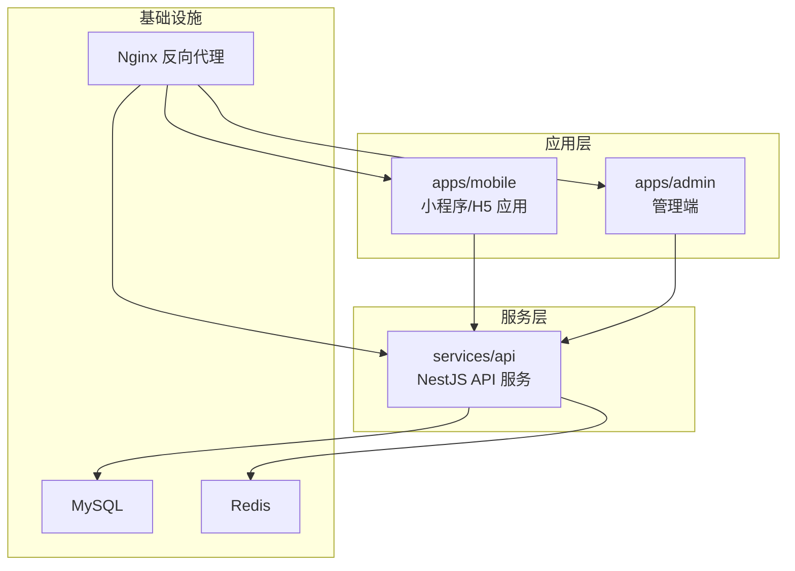
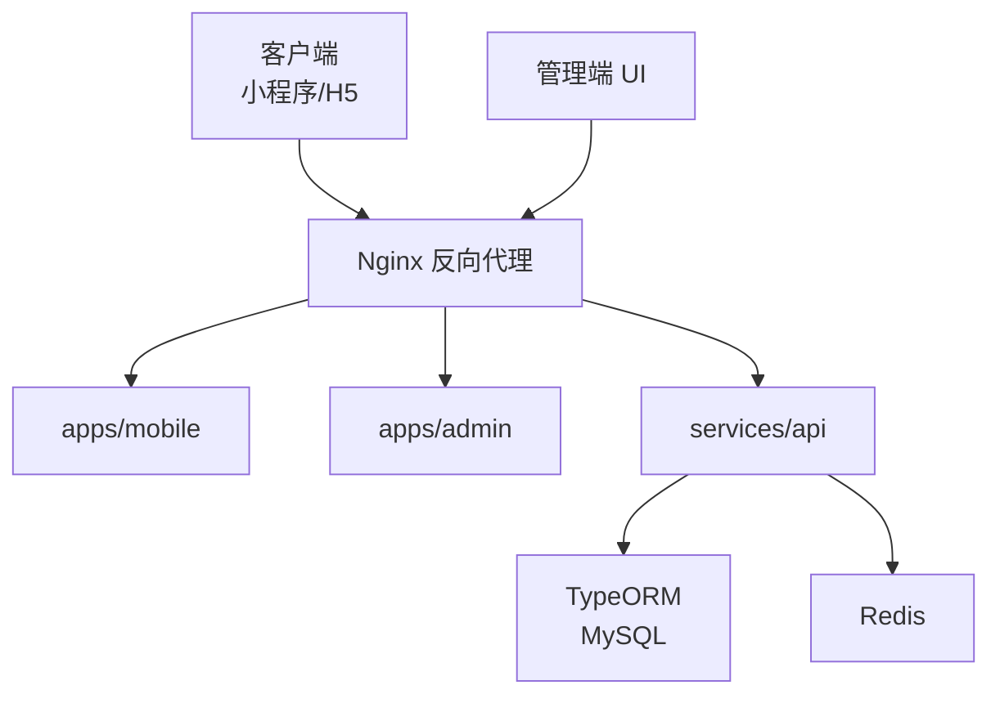
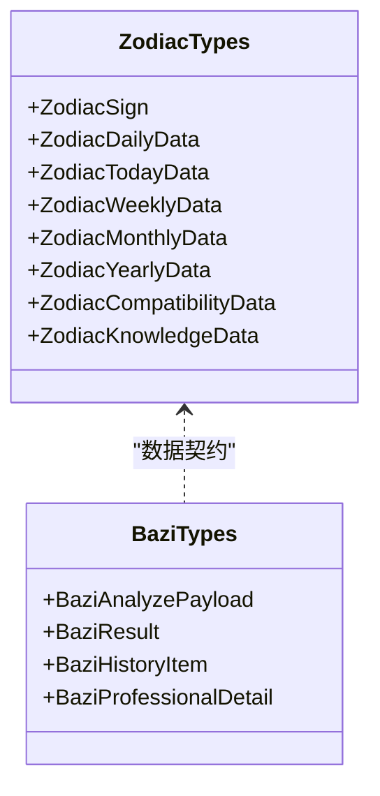
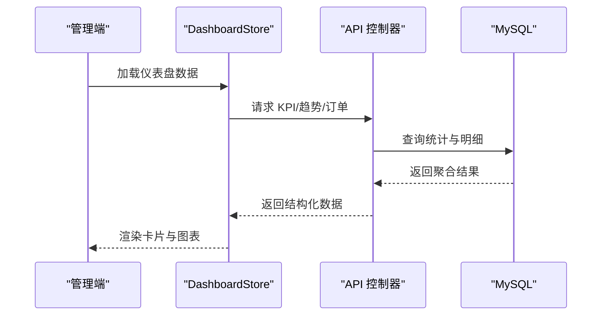
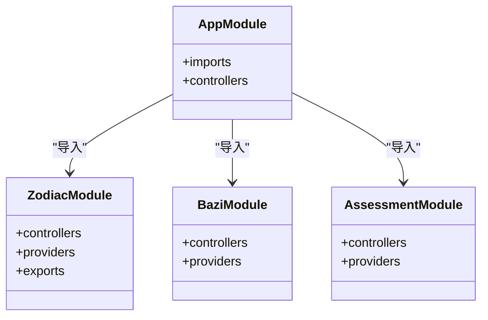
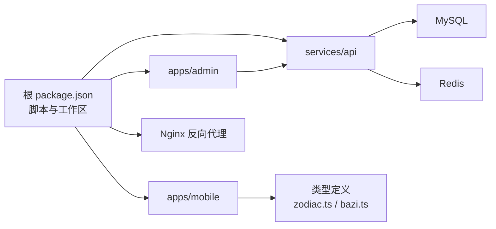

# 项目概述

<cite>
**本文引用的文件**
- [README.md](file://README.md)
- [package.json](file://package.json)
- [pnpm-workspace.yaml](file://pnpm-workspace.yaml)
- [apps/mobile/src/App.vue](file://apps/mobile/src/App.vue)
- [apps/admin/src/App.vue](file://apps/admin/src/App.vue)
- [services/api/src/main.ts](file://services/api/src/main.ts)
- [services/api/src/app.module.ts](file://services/api/src/app.module.ts)
- [apps/admin/src/views/DashboardView.vue](file://apps/admin/src/views/DashboardView.vue)
- [apps/mobile/src/pages/explore/index.vue](file://apps/mobile/src/pages/explore/index.vue)
- [apps/mobile/src/pages/zodiac/index.vue](file://apps/mobile/src/pages/zodiac/index.vue)
- [apps/mobile/src/pages/bazi/index.vue](file://apps/mobile/src/pages/bazi/index.vue)
- [services/api/src/zodiac/zodiac.module.ts](file://services/api/src/zodiac/zodiac.module.ts)
- [services/api/src/bazi/bazi.module.ts](file://services/api/src/bazi/bazi.module.ts)
- [services/api/src/assessment/assessment.module.ts](file://services/api/src/assessment/assessment.module.ts)
- [apps/mobile/src/types/zodiac.ts](file://apps/mobile/src/types/zodiac.ts)
- [apps/mobile/src/types/bazi.ts](file://apps/mobile/src/types/bazi.ts)
</cite>

## 目录
1. [引言](#引言)
2. [项目结构](#项目结构)
3. [核心组件](#核心组件)
4. [架构总览](#架构总览)
5. [详细组件分析](#详细组件分析)
6. [依赖分析](#依赖分析)
7. [性能考量](#性能考量)
8. [故障排查指南](#故障排查指南)
9. [结论](#结论)
10. [附录](#附录)

## 引言
Fortune Hub 是一个围绕微信小程序内容化测评产品搭建的 monorepo 项目，旨在通过统一的工程化基座，提供“首页聚合、用户体系、星座模块、八字模块、性格测评、情绪自检”等首版原型能力，并配套管理端与 NestJS API 服务，形成三端一体的联调演示闭环。项目以“内容化测评 + 个性化洞察”为核心目标，结合微信生态与现代前端技术栈，构建可扩展、可维护、可运营的产品原型。

## 项目结构
项目采用 monorepo 架构，使用 pnpm workspace 管理多包依赖，主要由以下部分组成：
- apps/mobile：基于 uni-app 的微信小程序/H5 应用，承载首页、探索、星座、八字、测评、情绪自检等功能页面与主题系统。
- apps/admin：基于 Vue 3 + Vite + Element Plus 的管理端，提供仪表盘与可视化概览。
- services/api：基于 NestJS + TypeORM + MySQL + Redis 的后端 API 服务，提供用户、内容、测评、运营等模块化控制器与服务。
- deploy/nginx：Nginx 反向代理配置，统一对外路由与 HTTPS。
- docs：开发文档、排期表、接口文档、数据库设计文档等。

图表来源
- [pnpm-workspace.yaml:1-4](file://pnpm-workspace.yaml#L1-L4)
- [services/api/src/app.module.ts:61-141](file://services/api/src/app.module.ts#L61-L141)
- [services/api/src/main.ts:8-61](file://services/api/src/main.ts#L8-L61)

章节来源
- [README.md:18-37](file://README.md#L18-L37)
- [pnpm-workspace.yaml:1-4](file://pnpm-workspace.yaml#L1-L4)

## 核心组件
- 小程序端（apps/mobile）
  - 首页与探索：提供内容聚合、发现与收藏能力，支持搜索、筛选与排序。
  - 星座模块：支持今日/周/月/年维度的运势展示与行动建议。
  - 八字模块：支持出生信息录入、轻/专业两种分析模式、历史记录与海报分享。
  - 性格测评与情绪自检：题库与答题流、结果报告与历史记录。
  - 主题系统与样式：统一的主题令牌与全局样式，适配 H5 与小程序。
- 管理端（apps/admin）
  - 控制台仪表盘：用户增长、订单趋势、营收概览与最近订单等可视化卡片。
- API 服务（services/api）
  - 模块化设计：用户、认证、首页、星座、八字、测评、内容、订单、通知、幸运等模块。
  - 数据持久化：TypeORM + MySQL，Redis 缓存与配置校验。
  - CORS 与全局中间件：统一的跨域策略、请求过滤器与响应拦截器。

章节来源
- [README.md:39-56](file://README.md#L39-L56)
- [apps/mobile/src/App.vue:17-299](file://apps/mobile/src/App.vue#L17-L299)
- [apps/admin/src/views/DashboardView.vue:1-302](file://apps/admin/src/views/DashboardView.vue#L1-L302)
- [services/api/src/app.module.ts:61-141](file://services/api/src/app.module.ts#L61-L141)

## 架构总览
项目采用“小程序端 + 管理端 + NestJS API 服务”的三层协同架构。小程序与管理端通过统一的 API 前缀访问后端服务，API 层通过模块化组织业务域，TypeORM 负责实体映射与迁移，Redis 提供缓存与会话支持。Nginx 作为反向代理，将移动端 H5、管理端与 API 分别路由至对应容器或静态资源。

图表来源
- [services/api/src/main.ts:32-59](file://services/api/src/main.ts#L32-L59)
- [services/api/src/app.module.ts:67-117](file://services/api/src/app.module.ts#L67-L117)

章节来源
- [README.md:12-16](file://README.md#L12-L16)
- [services/api/src/main.ts:8-61](file://services/api/src/main.ts#L8-L61)

## 详细组件分析

### 小程序端组件分析
- 页面与导航
  - 首页与探索页：提供搜索、筛选、排序与收藏能力，支持根据登录态动态更新 UI 与行为。
  - 星座模块：支持多维度（日/周/月/年）展示与可视化卡片，包含行动签与幸运元素。
  - 八字模块：支持出生信息输入、专业/轻量两种分析模式、历史记录与海报分享。
- 主题与样式
  - 使用主题令牌与全局样式，适配 H5 与小程序平台差异，提供统一视觉语言。
- 类型与数据契约
  - 星座与八字的数据类型定义清晰，涵盖查询参数、返回结构与海报模板字段。

图表来源
- [apps/mobile/src/types/zodiac.ts:1-221](file://apps/mobile/src/types/zodiac.ts#L1-L221)
- [apps/mobile/src/types/bazi.ts:1-250](file://apps/mobile/src/types/bazi.ts#L1-L250)

章节来源
- [apps/mobile/src/pages/explore/index.vue:1-800](file://apps/mobile/src/pages/explore/index.vue#L1-L800)
- [apps/mobile/src/pages/zodiac/index.vue:1-800](file://apps/mobile/src/pages/zodiac/index.vue#L1-L800)
- [apps/mobile/src/pages/bazi/index.vue:1-800](file://apps/mobile/src/pages/bazi/index.vue#L1-L800)
- [apps/mobile/src/App.vue:17-299](file://apps/mobile/src/App.vue#L17-L299)
- [apps/mobile/src/types/zodiac.ts:1-221](file://apps/mobile/src/types/zodiac.ts#L1-L221)
- [apps/mobile/src/types/bazi.ts:1-250](file://apps/mobile/src/types/bazi.ts#L1-L250)

### 管理端组件分析
- 仪表盘视图
  - 提供用户总数、订单总数、总营收、待处理反馈等 KPI 卡片。
  - 使用 ECharts 渲染近七日用户增长与订单趋势折线/柱状图。
  - 支持最近订单表格与数据刷新。

图表来源
- [apps/admin/src/views/DashboardView.vue:144-153](file://apps/admin/src/views/DashboardView.vue#L144-L153)
- [services/api/src/app.module.ts:121-123](file://services/api/src/app.module.ts#L121-L123)

章节来源
- [apps/admin/src/views/DashboardView.vue:1-302](file://apps/admin/src/views/DashboardView.vue#L1-L302)

### API 服务组件分析
- 模块化组织
  - 用户、认证、首页、星座、八字、测评、内容、订单、通知、幸运等模块分别定义控制器与服务。
  - TypeORM 注册实体并启用迁移与同步开关，便于开发与生产环境切换。
- CORS 与全局中间件
  - 设置全局前缀、CORS 白名单、验证管道与全局异常过滤器、响应拦截器。

图表来源
- [services/api/src/app.module.ts:61-141](file://services/api/src/app.module.ts#L61-L141)
- [services/api/src/zodiac/zodiac.module.ts:1-14](file://services/api/src/zodiac/zodiac.module.ts#L1-L14)
- [services/api/src/bazi/bazi.module.ts:1-15](file://services/api/src/bazi/bazi.module.ts#L1-L15)
- [services/api/src/assessment/assessment.module.ts:1-37](file://services/api/src/assessment/assessment.module.ts#L1-L37)

章节来源
- [services/api/src/app.module.ts:61-141](file://services/api/src/app.module.ts#L61-L141)
- [services/api/src/main.ts:8-61](file://services/api/src/main.ts#L8-L61)

## 依赖分析
- 包管理与工作区
  - 使用 pnpm 与 workspace 管理多包依赖，根脚本统一调度各应用与服务的开发/构建/测试。
- 技术栈与耦合
  - 小程序端：uni-app + Vue 3 + TypeScript + Pinia + SCSS，强调跨端一致性与主题系统。
  - 管理端：Vue 3 + Vite + Element Plus，强调可视化与交互效率。
  - API 服务：NestJS + TypeORM + MySQL + Redis，强调模块化与可扩展性。
- 外部依赖与集成点
  - Nginx 作为统一入口，负责路由与 TLS 终止。
  - 文件服务通过环境变量注入，支持本地与 Docker 环境。

图表来源
- [package.json:6-21](file://package.json#L6-L21)
- [pnpm-workspace.yaml:1-4](file://pnpm-workspace.yaml#L1-L4)
- [apps/mobile/src/types/zodiac.ts:1-221](file://apps/mobile/src/types/zodiac.ts#L1-L221)
- [apps/mobile/src/types/bazi.ts:1-250](file://apps/mobile/src/types/bazi.ts#L1-L250)

章节来源
- [package.json:6-21](file://package.json#L6-L21)
- [pnpm-workspace.yaml:1-4](file://pnpm-workspace.yaml#L1-L4)

## 性能考量
- 前端性能
  - 使用虚拟滚动与懒渲染优化长列表与复杂卡片布局。
  - 图表组件按需引入与自动尺寸适配，降低首屏压力。
- 后端性能
  - Redis 缓存热点数据与会话，TypeORM 合理使用索引与查询优化。
  - 模块化拆分减少耦合，便于按需启停与水平扩展。
- 运维性能
  - Nginx 反向代理统一入口，支持静态资源缓存与压缩。
  - Docker Compose 快速编排，便于本地联调与预生产验证。

## 故障排查指南
- CORS 与跨域
  - 检查 API 中 CORS 配置是否包含本地开发地址，确保生产环境仅允许受信域名。
- 数据库与迁移
  - 确认 TypeORM 连接参数与迁移开关，必要时开启同步进行快速调试。
- 管理端数据加载
  - 若仪表盘为空，检查 API 响应与数据库统计逻辑，确认定时任务或手动触发是否正常。
- 小程序端网络请求
  - 校验请求头与鉴权状态，确认收藏/搜索/分析接口返回码与错误提示。

章节来源
- [services/api/src/main.ts:12-59](file://services/api/src/main.ts#L12-L59)
- [services/api/src/app.module.ts:67-117](file://services/api/src/app.module.ts#L67-L117)
- [apps/admin/src/views/DashboardView.vue:147-153](file://apps/admin/src/views/DashboardView.vue#L147-L153)

## 结论
Fortune Hub 以 monorepo 为基座，将小程序端、管理端与 NestJS API 服务有机整合，形成从内容聚合到个性化测评再到运营可视化的闭环原型。项目在技术选型上兼顾易用性与可扩展性，既适合初学者快速理解产品形态与工程结构，也为有经验的开发者提供了模块化、可演进的架构范式。首版原型覆盖了核心功能范围，为后续商业化与内容配置化打下坚实基础。

## 附录
- 快速启动与联调
  - 安装依赖、准备环境变量、分别启动 API、管理端与小程序端。
  - 本地联调地址与默认部署路径见根 README。
- 文档与排期
  - 仓库内含开发文档、排期表、接口文档与数据库设计文档，建议优先阅读以推进开发。

章节来源
- [README.md:66-137](file://README.md#L66-L137)